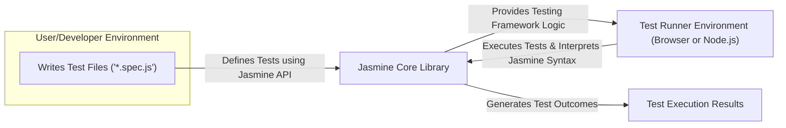
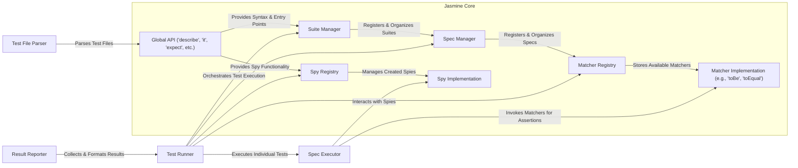

## Project Design Document: Jasmine JavaScript Testing Framework (Improved)

**1. Introduction**

This document provides an enhanced architectural design of the Jasmine JavaScript testing framework, building upon the previous version with greater detail and clarity. It meticulously outlines the core components, their interactions, and the overall system architecture, specifically tailored for subsequent threat modeling activities. This detailed design facilitates a comprehensive understanding of potential security vulnerabilities within the framework and its usage patterns.

**2. Goals and Objectives**

*   Provide a more granular and detailed architectural description of the Jasmine testing framework.
*   Clearly define the responsibilities and interactions of each key component with enhanced explanations.
*   Illustrate the data flow and interactions between components with improved clarity and precision.
*   Serve as a robust and comprehensive foundation for identifying potential security threats and vulnerabilities during threat modeling sessions.
*   Act as a definitive reference for developers, security analysts, and anyone seeking a deep understanding of Jasmine's internal workings.

**3. System Overview**

Jasmine is a behavior-driven development (BDD) framework specifically designed for testing JavaScript code. Its strength lies in providing a clean, readable, and expressive syntax for writing tests that focus on describing the expected behavior of the code under scrutiny. The core functionality centers around the definition of test suites and specifications (specs), which contain assertions that validate the code's behavior against predefined expectations.

**4. High-Level Architecture**

*   **User/Developer Environment:**  This is where developers author JavaScript files adhering to Jasmine's syntax, containing test suites and specifications that define the desired behavior of the code being tested. These files typically have a `.spec.js` extension.
*   **Jasmine Core Library:** This represents the central JavaScript library that provides the fundamental syntax and functionality for defining and executing tests. Key elements include global functions like `describe`, `it`, and `expect`, along with the underlying logic for managing suites, specs, and matchers.
*   **Test Runner Environment (Browser or Node.js):** This is the environment where the Jasmine tests are actually executed. It can be a web browser, where the test files and Jasmine library are loaded, or a Node.js environment, utilizing a specific Jasmine runner package. The runner interprets the Jasmine syntax and orchestrates the test execution.
*   **Test Execution Results:** This represents the output generated by the test runner, providing a detailed report on the success or failure of each individual test specification. This output typically includes information about failed assertions and any exceptions encountered during execution.

**5. Detailed Component Architecture**

*   **Jasmine Core:**
    *   **Global API (`describe`, `it`, `expect`, etc.):** This is the publicly accessible set of global functions that developers utilize to structure their tests. `describe` defines test suites, `it` defines individual specifications (tests), and `expect` is used to make assertions about the code's behavior. Other functions like `beforeEach`, `afterEach`, `beforeAll`, and `afterAll` provide hooks for setup and teardown.
    *   **Suite Manager:** This component is responsible for managing the collection of defined test suites. It keeps track of the registered suites and their hierarchical structure.
    *   **Spec Manager:** This component manages the collection of defined specifications (individual tests) within each test suite. It organizes the specs and their associated metadata.
    *   **Matcher Registry:** This component acts as a central repository for all available matchers (e.g., `toBe`, `toEqual`, `toHaveBeenCalled`). It allows the framework to look up and utilize the appropriate matcher for a given assertion.
    *   **Matcher Implementation (e.g., `toBe`, `toEqual`):** These are the concrete implementations of the matchers. Each matcher contains the logic to perform a specific type of comparison or assertion.
    *   **Spy Registry:** This component manages the creation and tracking of spies (mock functions). Spies allow developers to verify how functions are called during the execution of the code under test.
    *   **Spy Implementation:** This component provides the underlying mechanism for creating and managing spies, including tracking calls, arguments, and return values.
*   **Test File Parser:** This component is responsible for reading and interpreting the JavaScript files containing the Jasmine test definitions. It parses the code and extracts the suite and spec definitions, registering them with the appropriate managers.
*   **Test Runner:**
    *   This is the central orchestrator of the test execution process. It loads the test files, interacts with the Suite and Spec Managers to determine which tests to run, and manages the overall execution flow.
*   **Spec Executor:** This component is responsible for executing the individual `it` blocks within a specification. It sets up the execution context, runs the test code, and handles the execution of `beforeEach`, `afterEach`, `beforeAll`, and `afterAll` hooks.
*   **Matcher Invoker (Implicit within Spec Executor):** While not a distinct component, the functionality of invoking the appropriate matcher based on the `expect` call resides within the Spec Executor. It uses the Matcher Registry to find the correct implementation.
*   **Spy Interceptor (Implicit within Spec Executor):** Similarly, the logic for intercepting calls to spied-on functions and recording their details is handled within the Spec Executor when a spy is encountered.
*   **Result Reporter:** This component collects the results of each executed specification, including the outcome of assertions (success or failure) and any errors or exceptions that occurred. It then formats these results into a report that is presented to the user.

**6. Data Flow**

The typical data flow during a Jasmine test execution can be broken down as follows:

*   The **Test Runner** is initiated, and it begins by loading the specified JavaScript test files.
*   The **Test File Parser** processes these files, interpreting the Jasmine syntax and extracting the definitions of test suites and specifications.
*   The parsed suite and spec definitions are registered with the **Suite Manager** and **Spec Manager**, respectively, via interactions with the **Global API**.
*   The **Test Runner** consults the **Suite Manager** and **Spec Manager** to determine the order and structure of the tests to be executed.
*   For each test suite, the **Test Runner** triggers the execution of `beforeAll` hooks.
*   For each specification within a suite:
    *   The **Test Runner** invokes the **Spec Executor**.
    *   The **Spec Executor** executes the `beforeEach` hooks to set up the test environment.
    *   The code within the `it` block is executed by the **Spec Executor**.
    *   When an `expect` call is encountered, the **Spec Executor** (implicitly) uses the **Matcher Registry** to locate the appropriate **Matcher Implementation**.
    *   The **Matcher Implementation** performs the assertion, and the result is passed back to the **Spec Executor**.
    *   If spies are involved, the **Spy Implementation** (managed by the **Spy Registry**) intercepts function calls, and the **Spec Executor** can verify these interactions.
    *   The **Spec Executor** executes the `afterEach` hooks to clean up the test environment.
*   After all specifications in a suite are executed, the **Test Runner** triggers the execution of `afterAll` hooks.
*   The **Result Reporter** gathers the results of each assertion and any errors encountered during the execution of each specification.
*   Finally, the **Result Reporter** formats and outputs the test results, indicating the success or failure of each test.

**7. Security Considerations (Detailed for Threat Modeling)**

Building upon the preliminary considerations, here's a more detailed breakdown of potential security concerns relevant for threat modeling:

*   **Execution Environment Vulnerabilities:**
    *   **Browser-Specific Exploits:** If running tests in a browser, vulnerabilities in the browser itself (e.g., JavaScript engine flaws, DOM manipulation issues) could be exploited by malicious test code.
    *   **Node.js Vulnerabilities:** When running tests in Node.js, vulnerabilities in the Node.js runtime or its core modules could be targeted.
    *   **Operating System Vulnerabilities:** Underlying OS vulnerabilities on the machine running the tests could be exploited if test code interacts with the system in unexpected ways.
*   **Malicious Test Code:**
    *   **Information Disclosure:** Test code could intentionally or unintentionally access and expose sensitive information (e.g., API keys, database credentials) if the test environment is not properly isolated.
    *   **Resource Exhaustion:** Malicious tests could be designed to consume excessive CPU, memory, or disk space, leading to denial of service in the test environment.
    *   **Side Effects on External Systems:** Poorly written tests might inadvertently interact with external systems (databases, APIs) in destructive ways if proper mocking and isolation are not implemented.
    *   **Code Injection:** While less likely in core Jasmine, custom matchers or poorly implemented spy logic could potentially introduce vulnerabilities allowing for the execution of arbitrary code.
*   **Dependency Vulnerabilities:**
    *   **Transitive Dependencies:** Jasmine relies on its own dependencies, and vulnerabilities in these transitive dependencies could be exploited if not regularly updated and patched.
    *   **Compromised Packages:** The risk of using compromised or backdoored npm packages (or similar package managers) exists if dependencies are not carefully vetted.
*   **Test Result Exposure:**
    *   **Sensitive Data in Results:** Test results might inadvertently contain sensitive data from the system under test, which could be exposed if the results are not properly secured.
    *   **Information Leakage:** Detailed error messages or stack traces in test results could reveal implementation details that attackers could use to identify vulnerabilities.
*   **Test Environment Security:**
    *   **Lack of Isolation:** If the test environment is not properly isolated from the development or production environment, malicious tests could potentially impact these environments.
    *   **Insufficient Permissions:** Running tests with overly permissive accounts could allow malicious tests to perform actions they shouldn't.
*   **Vulnerabilities in Custom Matchers/Spies:**
    *   **Logic Errors:** Custom matchers or spies with flawed logic could lead to incorrect test results or introduce security vulnerabilities.
    *   **Code Injection:** As mentioned earlier, poorly written custom matchers or spies could be susceptible to code injection attacks.

**8. Deployment**

Jasmine tests are commonly deployed and executed in the following scenarios:

*   **Local Development Environment:** Developers run tests locally during development to verify their code changes. This typically involves using a browser's developer tools or a Node.js test runner on their local machine.
*   **Continuous Integration (CI) Pipelines:** Jasmine tests are often integrated into CI pipelines (e.g., Jenkins, GitHub Actions, GitLab CI) to automatically run tests whenever code changes are pushed. This ensures that code changes do not introduce regressions.
*   **Browser-Based Test Runners:** Tools like Karma or Jest (which can also run Jasmine tests) provide a convenient way to execute tests in one or more browsers, often as part of the development or CI process.
*   **Node.js Test Runners:** Packages like `jasmine-node` or integration with other Node.js testing frameworks (like Mocha or Jest) allow for running Jasmine tests in a Node.js environment, suitable for testing backend JavaScript code.

**9. Future Considerations**

*   **Enhanced Plugin Security:** If a more extensive plugin architecture is considered, robust security measures would be necessary, including plugin sandboxing, code signing, and strict permission models.
*   **Improved Test Environment Isolation:** Exploring more advanced techniques for sandboxing test execution environments (e.g., using containers or virtual machines) could further mitigate the risks of malicious test code.
*   **Static Analysis of Test Code:** Implementing static analysis tools to scan test code for potential security vulnerabilities or bad practices could help proactively identify and prevent issues.
*   **Regular Security Audits and Penetration Testing:** Periodic security audits of the Jasmine codebase and penetration testing of common usage scenarios are crucial for identifying and addressing potential vulnerabilities.
*   **Security Best Practices Documentation:** Providing clear guidelines and best practices for writing secure Jasmine tests would help developers avoid common pitfalls.

This improved design document provides a more detailed and nuanced understanding of the Jasmine testing framework's architecture, specifically focusing on aspects relevant to security. This enhanced documentation will be invaluable for conducting thorough threat modeling and identifying potential vulnerabilities within the framework and its usage.