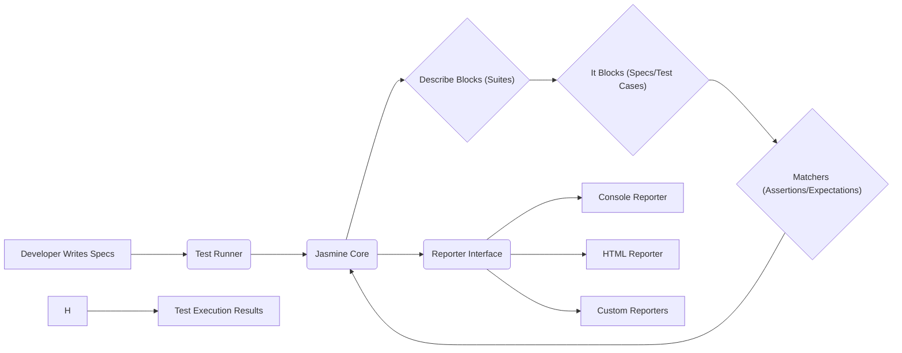
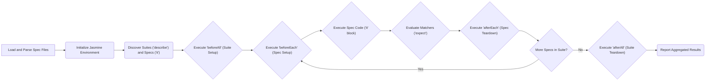

# Project Design Document: Jasmine JavaScript Testing Framework

**Version:** 1.1
**Date:** October 26, 2023
**Author:** AI Software Architect

## 1. Introduction

This document provides an enhanced and detailed design overview of the Jasmine JavaScript testing framework. It elaborates on the key components, their interactions, data flow, and infrastructure considerations. This document is intended to serve as a robust foundation for future threat modeling exercises and to provide a comprehensive understanding of the system's architecture, enabling more informed security analysis.

## 2. Goals and Objectives

*   Provide a clear, concise, and more detailed description of the Jasmine framework's architecture.
*   Elaborate on the responsibilities and internal workings of the core components.
*   Offer a more granular illustration of the flow of execution within the framework, highlighting key decision points.
*   Provide a more comprehensive outline of the infrastructure and dependencies relevant to various Jasmine deployment scenarios.
*   Serve as an improved basis for identifying potential security vulnerabilities during threat modeling, with more specific examples.

## 3. System Overview

Jasmine is a widely adopted behavior-driven development (BDD) framework specifically designed for testing JavaScript code. It distinguishes itself through its clean, readable, and expressive syntax for writing test specifications. Jasmine offers a rich and extensible set of matchers for asserting expected outcomes, facilitating the creation of robust and maintainable test suites. The fundamental objective of Jasmine is to provide a straightforward yet powerful mechanism to ensure the quality, reliability, and correctness of JavaScript applications across diverse environments.

### 3.1. Key Actors

*   **Developers:**  Write, execute, and maintain Jasmine test specifications (specs) to rigorously verify the behavior and functionality of their JavaScript code.
*   **Test Runner:**  The engine that orchestrates the execution of the defined test suites and specifications. This can be a web browser, a Node.js environment, or other JavaScript execution environments, depending on the target of the tests.
*   **Reporters:**  Components responsible for consuming the raw results of test executions and transforming them into human-readable formats. Examples include console output, detailed HTML reports, or integrations with CI/CD systems.
*   **Continuous Integration/Continuous Deployment (CI/CD) Systems:**  Automate the execution of Jasmine tests as an integral part of the software delivery pipeline, ensuring code quality and preventing regressions with each build and deployment.

### 3.2. High-Level Architecture

*   **Developer Writes Specs:** Developers author test specifications (specs) using Jasmine's declarative syntax, focusing on describing the expected behavior of the code under test.
*   **Test Runner:** The test runner application or environment loads and initiates the execution of the Jasmine framework and the defined specs.
*   **Jasmine Core:**  The central processing unit of the framework. It interprets the spec definitions, manages the execution lifecycle of suites and specs, and provides the assertion mechanisms.
*   **Describe Blocks (Suites):**  Used to logically group related specifications, forming coherent test suites that represent specific features or units of functionality.
*   **It Blocks (Specs/Test Cases):**  Represent individual test cases within a suite, each defining a specific behavior to be verified through assertions.
*   **Matchers (Assertions/Expectations):**  The assertion library provided by Jasmine, used within `it` blocks to compare the actual outcome of the code under test with the expected outcome.
*   **Reporter Interface:** A well-defined interface within Jasmine that allows different reporter implementations to consume and process test execution events.
*   **Console Reporter:** A built-in reporter that outputs test results directly to the console.
*   **HTML Reporter:** A built-in reporter that generates interactive HTML reports summarizing the test execution.
*   **Custom Reporters:** Developers can create custom reporters to integrate Jasmine with other tools or to tailor the reporting format.
*   **Test Execution Results:** The final output, detailing the success or failure of each specification, along with any error messages or stack traces.

## 4. Component Deep Dive

### 4.1. Jasmine Core

*   **Responsibilities:**
    *   **API Provision:** Exposes the core API for defining test suites (`describe`), individual specifications (`it`), and setup/teardown hooks (`beforeEach`, `afterEach`, `beforeAll`, `afterAll`).
    *   **Execution Management:**  Orchestrates the execution flow of test suites and specifications, respecting the defined order and lifecycle hooks.
    *   **Assertion Framework:** Provides the `expect` function, which serves as the entry point for creating assertions using Jasmine's matchers.
    *   **Matcher Library:** Includes a rich set of built-in matchers (e.g., `toBe`, `toEqual`, `toHaveBeenCalled`, `toBeTruthy`, `toBeFalsy`, `toThrowError`), allowing for diverse and expressive assertions.
    *   **Lifecycle Management:** Manages the execution of `beforeEach`, `afterEach`, `beforeAll`, and `afterAll` hooks to set up preconditions and clean up after each specification or suite.
    *   **Asynchronous Testing Support:** Facilitates testing of asynchronous code using `done` callbacks for older versions or `async/await` for more modern approaches, ensuring proper handling of asynchronous operations within tests.
    *   **Exception Handling:**  Manages exceptions thrown during test execution, preventing them from halting the entire test run and providing information for debugging.

### 4.2. Test Runner

*   **Responsibilities:**
    *   **Spec Loading:**  Locates and loads JavaScript files containing the Jasmine framework and the user-defined test specifications based on configuration.
    *   **Environment Instantiation:** Creates and initializes the Jasmine environment, making the core API available for test execution.
    *   **Execution Orchestration:**  Initiates the execution of the loaded test suites and specifications, handing control over to the Jasmine core.
    *   **Filtering and Selection:** Provides mechanisms to selectively run specific test suites or specifications, often through command-line arguments or configuration options.
    *   **Platform Abstraction:**  Adapts to different JavaScript execution environments (browsers, Node.js, headless browsers) by providing environment-specific implementations or configurations.
    *   **Configuration Management:**  Handles the loading and application of configuration settings, such as spec file paths, helper files, and reporter configurations.

### 4.3. Reporter

*   **Responsibilities:**
    *   **Event Listening:** Subscribes to and listens for events emitted by the Jasmine core during the test execution lifecycle (e.g., suiteStarted, specStarted, specDone, suiteDone, jasmineDone).
    *   **Result Aggregation:** Collects and aggregates the results of individual test executions, including the number of passes, failures, pending specs, and the execution time for each.
    *   **Result Formatting:** Transforms the collected test results into a human-readable format, which can vary depending on the specific reporter implementation.
    *   **Output Generation:**  Outputs the formatted test results to various destinations, such as the console, HTML files, log files, or integrates with CI/CD reporting systems.
    *   **Customization:** Allows developers to create custom reporters to tailor the reporting format, integrate with specific tools, or implement custom logic for handling test results.

### 4.4. Matchers

*   **Responsibilities:**
    *   **Assertion Logic:** Implement the core logic for comparing actual values with expected values in assertions.
    *   **Fluent API:** Provide a readable and expressive API for making assertions using the `expect` function (e.g., `expect(actual).toBe(expected)`).
    *   **Informative Error Messages:** Generate clear and helpful error messages when an expectation is not met, providing context and aiding in debugging.
    *   **Extensibility:**  Allow developers to define custom matchers to encapsulate specific assertion logic that might be reused across multiple tests or is specific to the application being tested.

### 4.5. Configuration

*   **Responsibilities:**
    *   **Parameterization:** Allows customization of Jasmine's behavior and execution environment without modifying the core framework code.
    *   **Spec Location Definition:** Specifies the paths or patterns used to locate the JavaScript files containing the test specifications.
    *   **Helper File Inclusion:** Enables the inclusion of helper files that contain setup and teardown logic, custom matchers, or utility functions to be used in tests.
    *   **Test Order Control:** Provides options to control the order in which test suites and specifications are executed, including randomization for identifying order-dependent issues.
    *   **Asynchronous Timeout Setting:**  Allows configuration of the default timeout duration for asynchronous specifications, preventing tests from hanging indefinitely.
    *   **Reporter Selection and Configuration:** Enables the selection of specific reporters to be used during test execution and allows for configuration of reporter-specific options.

## 5. Data Flow

The execution flow of a Jasmine test involves a structured sequence of operations:

1. **Loading and Parsing Specs:** The test runner begins by loading the specified JavaScript files containing both the Jasmine framework and the developer-written test specifications. Jasmine then parses these files to identify and structure the test suites and individual specifications.
2. **Jasmine Environment Initialization:** The Jasmine environment is initialized, making the core API functions (`describe`, `it`, `expect`, etc.) available for use during the test execution process.
3. **Discovery of Suites and Specs:** Jasmine traverses the parsed code to discover all defined `describe` blocks (representing test suites) and `it` blocks (representing individual specifications or test cases) within those suites.
4. **`beforeAll` Execution:** Before any specifications within a suite are executed, the `beforeAll` blocks (if defined) are executed. These blocks are used for setup tasks that should only occur once per suite.
5. **Individual Spec Execution Loop:** For each `it` block (specification) within a suite:
    *   **`beforeEach` Execution:** The `beforeEach` blocks (if defined) are executed. These blocks are used for setup tasks that should occur before each individual specification.
    *   **Spec Code Execution:** The code within the `it` block is executed. This is where the actual code under test is invoked and its behavior is observed.
    *   **Matcher Evaluation:**  Assertions are made within the `it` block using the `expect` function and various matchers. Jasmine evaluates these matchers to determine if the expected conditions are met.
    *   **`afterEach` Execution:** After the specification code and assertions have been executed, the `afterEach` blocks (if defined) are executed. These blocks are used for cleanup tasks that should occur after each individual specification.
6. **`afterAll` Execution:** Once all specifications within a suite have been executed, the `afterAll` blocks (if defined) are executed. These blocks are used for cleanup tasks that should only occur once per suite.
7. **Reporting of Results:** Throughout the execution process, the designated reporter listens for events emitted by the Jasmine core. Once all tests have completed, the reporter formats and outputs the aggregated test results, indicating the success or failure of each specification.

## 6. Infrastructure

While Jasmine is primarily a client-side JavaScript library, the infrastructure required for running Jasmine tests varies depending on the context:

*   **Web Browser Environment:**  For testing front-end JavaScript code, Jasmine tests are often executed directly within a web browser.
    *   **Dependencies:** A modern web browser capable of executing JavaScript. Test runners like Karma or specific browser developer tools are often used to facilitate this.
*   **Node.js Environment:**  Jasmine can be used with Node.js to test back-end JavaScript code, command-line tools, or full-stack applications.
    *   **Dependencies:** Node.js runtime environment. Packages like `jasmine` (installed via npm) provide the necessary runner and core files.
*   **Headless Browser Environments:** For automated testing in CI/CD pipelines, headless browsers like Puppeteer or Playwright are commonly used to simulate a browser environment without a graphical user interface.
    *   **Dependencies:** Node.js runtime, and the specific headless browser library (e.g., `puppeteer`, `playwright`).
*   **CI/CD Pipeline Infrastructure:**  Continuous Integration and Continuous Deployment systems (e.g., Jenkins, GitHub Actions, GitLab CI) provide the infrastructure for automating the execution of Jasmine tests as part of the build and deployment process.
    *   **Dependencies:**  Typically involve a virtual machine or container environment with Node.js or a browser environment configured, along with the necessary CI/CD tool configurations.

## 7. Security Considerations (Detailed for Threat Modeling)

This section expands on the initial security considerations, providing more specific examples of potential threats and mitigation strategies relevant to the Jasmine framework and its usage.

*   **Compromised Test Integrity:** If the test code itself is compromised (e.g., through unauthorized access to the repository or malicious contributions), attackers could alter tests to always pass, masking vulnerabilities in the actual application.
    *   **Threats:** False sense of security, undetected vulnerabilities leading to exploitation in production.
    *   **Mitigations:** Strict access controls to test code repositories, mandatory code review processes for all test changes, use of branch protection rules, and potentially signing or verifying test code integrity.
*   **Malicious Test Code Execution:**  While less common, tests could theoretically contain malicious code that attempts to exploit vulnerabilities in the system under test during the testing process itself, or even in the testing environment.
    *   **Threats:** Data exfiltration, denial of service against testing infrastructure, unintended side effects on dependent systems.
    *   **Mitigations:** Running tests in isolated or sandboxed environments, limiting the permissions and capabilities of the test execution environment, careful review of test code for potentially harmful actions (e.g., file system access, network requests to external untrusted sources).
*   **Vulnerabilities in Custom Reporters:** If custom reporters are used, especially those that process or display test results in web-based interfaces, they could be susceptible to vulnerabilities like Cross-Site Scripting (XSS) if they don't properly sanitize output.
    *   **Threats:** Disclosure of sensitive information contained in test results, manipulation of the reporting interface, potential compromise of systems accessing the reports.
    *   **Mitigations:** Thorough security review of custom reporter code, implementing proper input sanitization and output encoding techniques, adhering to secure coding practices.
*   **Information Disclosure through Test Results:** Test results, especially detailed reports, might inadvertently reveal sensitive information about the system under test (e.g., API keys, internal paths, error messages containing sensitive data).
    *   **Threats:** Exposure of confidential information that could be used for further attacks.
    *   **Mitigations:** Secure storage and handling of test reports, access controls to test results, careful review of reporter output to avoid exposing sensitive data, redacting sensitive information from test data and expected results.
*   **Dependency Chain Vulnerabilities:** While Jasmine has minimal direct dependencies, the code being tested will likely have its own dependencies. Vulnerabilities in those dependencies could be indirectly exposed or triggered during testing.
    *   **Threats:** Exploitation of vulnerabilities in the application's dependencies.
    *   **Mitigations:** Regular dependency scanning and updates for the application under test, using tools that identify known vulnerabilities in dependencies, and potentially isolating the test environment from production dependencies.

## 8. Future Considerations

*   **Enhanced Integration Capabilities:** Explore deeper and more seamless integration with other development and testing tools, such as code coverage tools (e.g., Istanbul/NYC), static analysis tools (e.g., ESLint), and visual regression testing frameworks.
*   **Improved Asynchronous Testing Patterns:**  Continue to refine and improve support for testing complex asynchronous code patterns, potentially incorporating more advanced techniques like test schedulers or virtual time.
*   **More Granular Error Reporting and Diagnostics:**  Enhance error reporting capabilities to provide more detailed and actionable error messages, including contextual information and potential root causes for failing tests.
*   **Standardized Plugin Architecture:** Consider developing a more formalized plugin architecture to facilitate the creation and sharing of extensions for Jasmine, such as custom reporters, matchers, or test runners.

This improved document provides a more detailed and nuanced design overview of the Jasmine JavaScript testing framework, offering a stronger foundation for comprehensive threat modeling and a deeper understanding of its architecture and potential security considerations.
