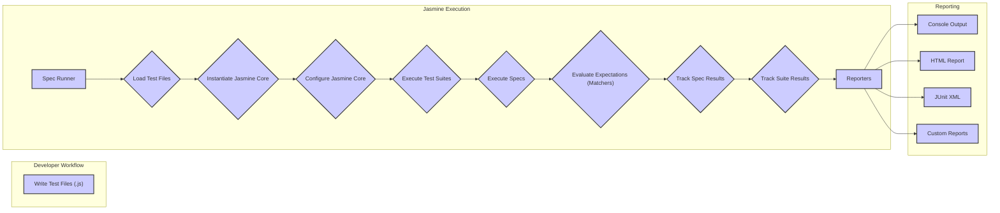

## Project Design Document: Jasmine JavaScript Testing Framework (Improved)

**1. Introduction**

This document provides an enhanced design overview of the Jasmine JavaScript testing framework, building upon the previous version. It aims to offer a more granular understanding of the system's architecture, components, data flow, and key interactions, specifically tailored for effective threat modeling. This document will serve as a robust foundation for identifying potential security vulnerabilities and threats.

**2. Goals and Objectives**

*   Deliver a refined and more detailed architectural description of the Jasmine framework.
*   Provide in-depth explanations of each core component's responsibilities and functionalities.
*   Elaborate on the sequence of operations during test execution with greater precision.
*   Thoroughly describe data interactions, including the types of data exchanged and their purpose.
*   Establish a comprehensive and actionable basis for identifying and analyzing potential security vulnerabilities and threats.

**3. System Architecture**

Jasmine is a behavior-driven development (BDD) framework for testing JavaScript code. Its core functionality centers around defining and executing test specifications (specs) organized within suites.

**3.1. Components**

*   **`Jasmine Core`**: The central engine of the framework, responsible for:
    *   **Test Language Definition:** Providing the vocabulary for writing tests (e.g., `describe`, `it`, `expect`, `beforeEach`, `afterEach`, `beforeAll`, `afterAll`).
    *   **Suite and Spec Management:**  Maintaining the structure of test suites and individual specifications, including their hierarchical relationships.
    *   **Test Execution Orchestration:**  Controlling the order of execution for suites, specs, and fixture functions.
    *   **Assertion Evaluation:**  Evaluating expectations defined using matchers and determining pass/fail status.
    *   **Result Aggregation:**  Collecting and managing the results of individual specs and overall test runs.
    *   **Custom Matcher Interface:**  Providing an API for developers to define their own assertion logic.
    *   **Asynchronous Test Handling:**  Supporting the testing of asynchronous code using callbacks, promises, or async/await.
*   **`Spec Runner`**: The environment-specific launcher for Jasmine tests, responsible for:
    *   **Test File Discovery and Loading:** Locating and loading JavaScript files containing test definitions. The mechanism varies depending on the environment (e.g., `` could execute arbitrary JavaScript when the HTML report is viewed in a browser.
    *   **Mitigation:** Ensuring proper input sanitization and output encoding within the HTML reporter.
*   **Man-in-the-Middle (MITM) Attacks during Dependency Retrieval:**
    *   **Threat:** If Jasmine or its dependencies are downloaded over insecure HTTP connections, attackers could intercept the traffic and inject malicious code.
    *   **Mitigation:** Using HTTPS for all dependency downloads and utilizing package integrity checks (e.g., using lock files and verifying checksums).
*   **Code Injection via Custom Matchers or Reporters:**
    *   **Threat:** Poorly written custom matchers or reporters could introduce vulnerabilities if they execute arbitrary code based on untrusted input.
    *   **Mitigation:** Thoroughly reviewing and testing custom matchers and reporters, ensuring they handle input safely and avoid dynamic code execution.
*   **Security of the Test Environment:**
    *   **Threat:** The environment in which tests are executed might have its own security vulnerabilities that could be exploited during test runs.
    *   **Examples:** Running tests with elevated privileges, exposing sensitive services on the test network, or using insecure configurations.
    *   **Mitigation:** Hardening the test environment, following security best practices for the operating system and any other software involved, and running tests with the least necessary privileges.

**5. Deployment**

Jasmine is typically integrated into the development workflow of JavaScript projects.

*   **Browser Environment:**
    *   Jasmine library files (typically `jasmine.js`, `jasmine-html.js`, and `boot.js` or similar) are included in the HTML file that serves as the test runner.
    *   Test files containing the `describe()` and `it()` blocks are also included using `<script>` tags.
    *   The HTML Spec Runner (`jasmine-html.js`) is responsible for executing the tests and displaying the results in the browser.
*   **Node.js Environment:**
    *   Jasmine is installed as a development dependency using npm or yarn (`npm install --save-dev jasmine` or `yarn add -D jasmine`).
    *   The `jasmine-npm` package provides a command-line interface for running tests (`npx jasmine` or `yarn jasmine`).
    *   Test files are typically organized in a `spec` directory (configurable).
    *   Reporters can be configured in the `jasmine.json` configuration file.
*   **CI/CD Pipelines:**
    *   Jasmine tests are frequently executed as part of continuous integration and continuous delivery pipelines.
    *   The Node.js Spec Runner is commonly used in CI/CD environments.
    *   Reporters like the `JUnit XML Reporter` are used to generate reports that can be consumed by CI/CD tools (e.g., Jenkins, GitLab CI, GitHub Actions).
    *   Test execution is often triggered by commands within the CI/CD pipeline scripts.

**6. Future Considerations**

*   **Enhanced Security Auditing Tools:** Explore integrating or developing tools that can automatically scan test code for potential security vulnerabilities or bad practices.
*   **Improved Sandboxing Capabilities:** Investigate options for more robustly sandboxing test execution to limit the potential impact of malicious test code. This could involve using virtual machines or containerization technologies.
*   **Stricter Content Security Policy (CSP) for HTML Reporter:** Implement a strict CSP for the HTML reporter to mitigate potential XSS vulnerabilities by restricting the sources from which scripts can be loaded and executed.
*   **Secure Defaults and Configuration Options:** Provide secure default configurations and clear guidance on how to configure Jasmine securely in different environments. This could include recommendations for disabling features that might introduce security risks if not used carefully.
*   **Formal Security Review Process:** Establish a formal process for reviewing code changes to Jasmine itself and any official plugins or reporters to identify and address potential security vulnerabilities proactively.

This improved design document provides a more detailed and comprehensive understanding of the Jasmine JavaScript testing framework, specifically tailored for effective threat modeling. By elaborating on the components, data flow, and security considerations, it offers a stronger foundation for identifying and mitigating potential risks.