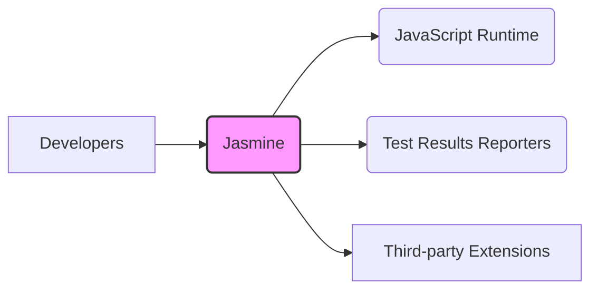
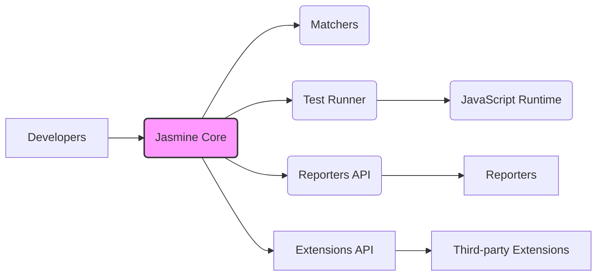
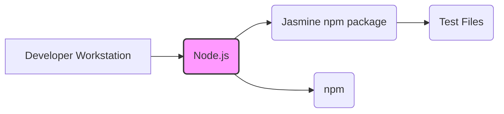
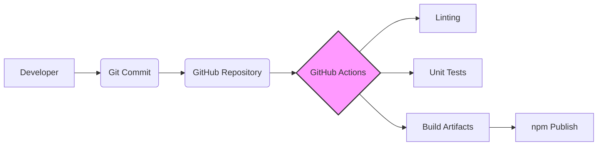

Okay, let's create a design document for the Jasmine JavaScript testing framework, focusing on aspects relevant for threat modeling.

# BUSINESS POSTURE

Jasmine is a behavior-driven development (BDD) testing framework for JavaScript. It aims to provide a clean, readable syntax for writing tests that are easy to understand and maintain.  It's widely used in the JavaScript ecosystem, from small projects to large-scale applications.  The primary business goal is to enable developers to write effective tests, thereby improving software quality and reducing bugs.  It's an open-source project, so community contributions and reputation are crucial.

Business Priorities:

*   Maintainability and Readability:  The framework must remain easy to use and understand, even as it evolves.
*   Extensibility:  Allow users to extend the framework with custom matchers, reporters, and other plugins.
*   Compatibility:  Support a wide range of JavaScript environments (browsers, Node.js, etc.).
*   Community Engagement:  Foster a healthy and active community of users and contributors.
*   Reputation: Maintain a positive reputation as a reliable and robust testing framework.

Business Risks:

*   Malicious Code Injection:  If the framework itself were compromised (e.g., through a supply chain attack), malicious code could be injected into projects using Jasmine, potentially affecting a large number of applications.
*   Insecure Extensions:  Third-party extensions (matchers, reporters) could introduce vulnerabilities if they are not properly vetted or if Jasmine doesn't provide sufficient sandboxing mechanisms.
*   Denial of Service (DoS): While less likely for a testing framework, vulnerabilities in the framework's core or its dependencies could potentially be exploited to cause a denial of service during test execution, disrupting development workflows.
*   Data Leakage: If test results or reports are handled insecurely, sensitive information (e.g., API keys, credentials) used in tests could be exposed.
*   Incorrect Test Results: Bugs in the framework itself could lead to incorrect test results (false positives or false negatives), undermining the reliability of the testing process.

# SECURITY POSTURE

Existing Security Controls:

*   security control: Code Reviews: The project uses GitHub's pull request system, which inherently includes code review before merging changes. (Described in contribution guidelines on GitHub).
*   security control: Automated Testing: Jasmine has an extensive suite of its own tests to ensure the framework's functionality and prevent regressions. (Visible in the repository's test suite).
*   security control: Dependency Management: The project uses package managers (like npm) to manage dependencies, allowing for updates and security patches. (Visible in `package.json` and `package-lock.json`).
*   security control: Linting: Linters are used to enforce code style and identify potential errors. (Configuration files like `.eslintrc.js` are present).
*   security control: Continuous Integration (CI): GitHub Actions are used to automate testing and linting on every push and pull request. (Defined in `.github/workflows` directory).

Accepted Risks:

*   accepted risk: Reliance on Third-Party Extensions: The ecosystem of third-party extensions is not directly controlled by the Jasmine project, and their security relies on the individual maintainers.
*   accepted risk: Limited Sandboxing: While Jasmine runs tests in a controlled environment, complete sandboxing of test code from the framework itself might not be fully achievable, especially in Node.js environments.

Recommended Security Controls:

*   security control: Supply Chain Security: Implement measures to verify the integrity of dependencies, such as using tools like `npm audit` or Dependabot to automatically check for known vulnerabilities.
*   security control: Security Policy: Create a `SECURITY.md` file in the repository to provide clear instructions for reporting security vulnerabilities.
*   security control: Regular Security Audits: Conduct periodic security audits of the codebase and its dependencies, potentially using automated tools or engaging external security researchers.
*   security control: Content Security Policy (CSP): If Jasmine's reporters generate HTML output, consider implementing CSP headers to mitigate XSS vulnerabilities.

Security Requirements:

*   Authentication: Not directly applicable to the core framework, as it doesn't handle user authentication. However, any web-based reporters or integrations should follow standard authentication best practices.
*   Authorization: Not directly applicable to the core framework.  If Jasmine were integrated into a larger system with authorization requirements, those requirements would need to be handled separately.
*   Input Validation: The framework should validate inputs to its core functions (e.g., `describe`, `it`, `expect`) to prevent unexpected behavior or potential vulnerabilities. This is particularly important for any functions that accept user-provided strings or configurations.
*   Cryptography: Not directly used in the core framework. If any extensions or integrations require cryptography, they should use well-established libraries and follow cryptographic best practices.

# DESIGN

## C4 CONTEXT

C4 Context Element List:

*   Element:
    *   Name: Developers
    *   Type: Person
    *   Description: Software developers who write and execute tests using Jasmine.
    *   Responsibilities: Writing test specifications, running tests, analyzing results.
    *   Security controls: N/A (External to the system)

*   Element:
    *   Name: Jasmine
    *   Type: Software System
    *   Description: The core Jasmine testing framework.
    *   Responsibilities: Providing the API for defining tests, executing tests, reporting results.
    *   Security controls: Code Reviews, Automated Testing, Dependency Management, Linting, Continuous Integration (CI).

*   Element:
    *   Name: JavaScript Runtime
    *   Type: External System
    *   Description: The environment where the tests are executed (e.g., a browser, Node.js).
    *   Responsibilities: Executing JavaScript code.
    *   Security controls: Relies on the security of the runtime environment itself.

*   Element:
    *   Name: Test Results Reporters
    *   Type: External System/Component
    *   Description: Components that format and display test results (e.g., console reporter, HTML reporter).
    *   Responsibilities: Presenting test results in a human-readable format.
    *   Security controls: Should handle test results securely, avoiding potential data leakage or XSS vulnerabilities (especially for HTML reporters).

*   Element:
    *   Name: Third-party Extensions
    *   Type: External System/Component
    *   Description: User-created extensions that add functionality to Jasmine (e.g., custom matchers, reporters).
    *   Responsibilities: Varies depending on the extension.
    *   Security controls: Relies on the security practices of the extension developers.

## C4 CONTAINER

C4 Container Element List:

*   Element:
    *   Name: Developers
    *   Type: Person
    *   Description: Software developers who write and execute tests using Jasmine.
    *   Responsibilities: Writing test specifications, running tests, analyzing results.
    *   Security controls: N/A (External to the system)

*   Element:
    *   Name: Jasmine Core
    *   Type: Container
    *   Description: The main entry point for the Jasmine framework.
    *   Responsibilities: Providing the API for defining tests (`describe`, `it`, `beforeEach`, etc.), managing test execution flow.
    *   Security controls: Input validation, code reviews.

*   Element:
    *   Name: Matchers
    *   Type: Container
    *   Description: The library of assertion functions (`expect`, `toBe`, `toEqual`, etc.).
    *   Responsibilities: Providing functions for making assertions about the behavior of the code under test.
    *   Security controls: Input validation, code reviews.

*   Element:
    *   Name: Test Runner
    *   Type: Container
    *   Description: The component that executes the tests and manages their lifecycle.
    *   Responsibilities: Running tests in the specified order, handling asynchronous operations, reporting results.
    *   Security controls: Code reviews, internal error handling.

*   Element:
    *   Name: Reporters API
    *   Type: Container
    *   Description: The API for creating custom reporters.
    *   Responsibilities: Providing a standardized way for reporters to receive test results.
    *   Security controls: Input validation, code reviews.

*   Element:
    *   Name: Reporters
    *   Type: Container
    *   Description: Components that format and display test results.
    *   Responsibilities: Presenting test results in various formats (console, HTML, etc.).
    *   Security controls: Output encoding (to prevent XSS), secure handling of sensitive data.

*   Element:
    *   Name: JavaScript Runtime
    *   Type: External System
    *   Description: The environment where the tests are executed (e.g., a browser, Node.js).
    *   Responsibilities: Executing JavaScript code.
    *   Security controls: Relies on the security of the runtime environment itself.

*   Element:
    *   Name: Extensions API
    *   Type: Container
    *   Description: The API for creating custom extensions (matchers, reporters, etc.).
    *   Responsibilities: Providing a standardized way for users to extend Jasmine's functionality.
    *   Security controls: Input validation, code reviews.

*   Element:
    *   Name: Third-party Extensions
    *   Type: External System/Component
    *   Description: User-created extensions that add functionality to Jasmine.
    *   Responsibilities: Varies depending on the extension.
    *   Security controls: Relies on the security practices of the extension developers.

## DEPLOYMENT

Possible Deployment Solutions:

1.  Browser-based testing: Jasmine can be included directly in an HTML page using `<script>` tags, and tests are executed within the browser.
2.  Node.js-based testing: Jasmine can be installed as an npm package and used with Node.js to run tests in a server-side environment.
3.  Headless browser testing: Jasmine can be used with headless browsers like PhantomJS or Puppeteer to run tests in a browser environment without a visible UI.

Chosen Deployment Solution (Node.js):

Deployment Element List:

*   Element:
    *   Name: Developer Workstation
    *   Type: Infrastructure Node
    *   Description: The developer's local machine.
    *   Responsibilities: Writing code, running tests, managing dependencies.
    *   Security controls: Standard workstation security measures (antivirus, firewall, etc.).

*   Element:
    *   Name: Node.js
    *   Type: Infrastructure Node
    *   Description: The Node.js runtime environment.
    *   Responsibilities: Executing JavaScript code, managing packages.
    *   Security controls: Regular updates to Node.js to patch vulnerabilities.

*   Element:
    *   Name: Jasmine npm package
    *   Type: Software Component
    *   Description: The Jasmine framework installed via npm.
    *   Responsibilities: Providing the testing framework.
    *   Security controls: Dependency management, regular updates via npm.

*   Element:
    *   Name: Test Files
    *   Type: Software Component
    *   Description: The JavaScript files containing the test specifications.
    *   Responsibilities: Defining the tests to be executed.
    *   Security controls: Code reviews, secure coding practices.

*   Element:
    *   Name: npm
    *   Type: Infrastructure Node
    *   Description: Node Package Manager
    *   Responsibilities: Managing project dependencies.
    *   Security controls: Using `npm audit` to check for vulnerabilities in dependencies.

## BUILD

Build Process Description:

1.  Developer: A developer makes changes to the Jasmine codebase and commits them to a local Git repository.
2.  Git Commit: The changes are committed and pushed to the remote GitHub repository.
3.  GitHub Repository: The central repository for the Jasmine project.
4.  GitHub Actions:  GitHub Actions is used as the CI/CD system.  Workflows are triggered on push and pull request events.
5.  Linting:  Linters (e.g., ESLint) are run to check for code style and potential errors.
6.  Unit Tests:  Jasmine's own test suite is executed to ensure the framework's functionality.
7.  Build Artifacts: If all checks pass, build artifacts (e.g., packaged code) are created.
8.  npm Publish: The artifacts are published to the npm registry, making the new version of Jasmine available for installation.

Security Controls in Build Process:

*   Code Reviews:  All changes are reviewed through pull requests before being merged.
*   Automated Testing:  The test suite is run automatically on every push and pull request.
*   Linting:  Linters are used to enforce code style and identify potential errors.
*   Continuous Integration:  GitHub Actions ensures that all checks are run consistently and automatically.
*   Dependency Management: npm is used to manage dependencies, and `npm audit` can be used to check for vulnerabilities.

# RISK ASSESSMENT

Critical Business Processes:

*   Software Development: Jasmine is a critical tool for ensuring the quality of JavaScript software.  Compromises to Jasmine could impact the development process of numerous projects.
*   Community Trust: Maintaining the trust of the open-source community is essential for the continued success of the project.

Data to Protect:

*   Source Code (Sensitivity: Medium): The Jasmine source code itself is publicly available, but unauthorized modifications could have significant consequences.
*   Test Results (Sensitivity: Variable): Test results may contain sensitive information depending on the nature of the tests being run.  This could include API keys, credentials, or other confidential data.
*   Contributor Information (Sensitivity: Low): Information about contributors (e.g., email addresses) is generally public, but should still be handled responsibly.

# QUESTIONS & ASSUMPTIONS

Questions:

*   Are there any specific security certifications or compliance requirements that Jasmine needs to meet?
*   What is the process for handling security vulnerabilities reported by external researchers?
*   Are there any plans to introduce more advanced sandboxing mechanisms for test execution?
*   What level of support is provided for older versions of Jasmine, and for how long?

Assumptions:

*   BUSINESS POSTURE: The primary goal is to provide a reliable and easy-to-use testing framework. The project prioritizes community contributions and open-source principles.
*   SECURITY POSTURE: The project relies on standard security practices like code reviews, automated testing, and dependency management. There is an accepted risk associated with third-party extensions.
*   DESIGN: The design is modular and extensible, allowing for customization and integration with other tools. The primary deployment model is through npm for Node.js environments. The build process is automated using GitHub Actions.