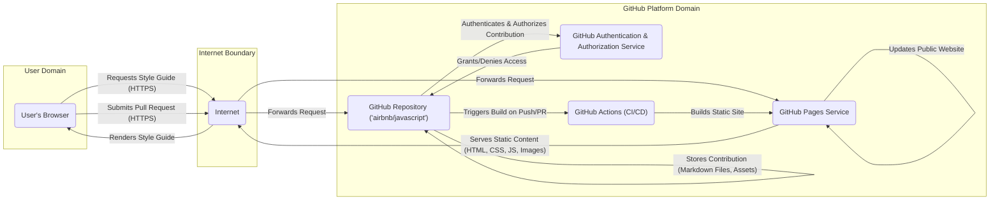

# Project Design Document: Airbnb JavaScript Style Guide

**Project Name:** Airbnb JavaScript Style Guide

**Project Repository:** [https://github.com/airbnb/javascript](https://github.com/airbnb/javascript)

**Document Version:** 2.0

**Date:** October 26, 2023

**Author:** Gemini (AI Language Model)

## 1. Introduction

This document provides an enhanced design overview of the Airbnb JavaScript Style Guide project, which resides as a public repository on GitHub. Its primary function is to serve as a definitive guide for JavaScript coding conventions. This document details the project's architecture, key components, and the flow of data, specifically tailored to facilitate a comprehensive threat modeling exercise. While fundamentally a documentation project, its presence on a collaborative platform like GitHub necessitates careful consideration of potential security implications.

## 2. Goals and Non-Goals

### 2.1. Goals

*   To establish and maintain a widely respected and adopted JavaScript style guide.
*   To articulate clear, actionable, and easily understandable recommendations for writing consistent and maintainable JavaScript code across projects.
*   To foster community engagement and facilitate contributions from developers worldwide, ensuring the style guide remains relevant and up-to-date.
*   To provide readily accessible documentation for developers seeking guidance on JavaScript best practices.
*   To ensure the style guide evolves in response to changes in the JavaScript language and prevailing development methodologies.

### 2.2. Non-Goals

*   The development or maintenance of a standalone JavaScript linter or code formatter application (although the style guide is designed to be compatible with such tools).
*   The creation of a dynamic web application featuring user accounts, databases, or complex server-side logic. The project's web presence is primarily static.
*   The inclusion of interactive code examples or a live code execution environment directly within the style guide's web presentation.
*   The provision of personalized or customizable style guide configurations tailored to individual project needs within this specific repository.

## 3. System Architecture

The Airbnb JavaScript Style Guide project is architected as a static website hosted via GitHub Pages. The content originates from Markdown files within the project's GitHub repository. Contributions are managed through the standard GitHub pull request workflow, involving forking, making changes, and submitting proposals for integration.

## 4. Data Flow

The primary data flows involve users accessing the published style guide and contributors submitting modifications or additions to the content.

### 4.1. Accessing the Style Guide

1. A user initiates a request to view the Airbnb JavaScript Style Guide using a web browser.
2. The browser sends an HTTPS request across the internet to the GitHub Pages service hosting the style guide.
3. GitHub Pages retrieves the pre-built static content (HTML, CSS, JavaScript files, images) generated from the repository's Markdown source.
4. GitHub Pages transmits the static content back to the user's browser via HTTPS.
5. The user's browser interprets and renders the style guide for display.

### 4.2. Contributing to the Style Guide

1. A potential contributor forks the `airbnb/javascript` repository on GitHub, creating a personal copy.
2. The contributor makes necessary changes or additions to the Markdown files or other assets within their forked repository.
3. The contributor submits a pull request from their fork to the upstream `airbnb/javascript` repository, proposing their changes.
4. GitHub's authentication and authorization service verifies the contributor's identity and permissions.
5. Maintainers of the `airbnb/javascript` repository review the submitted pull request, examining the proposed changes.
6. Upon successful review and approval, the pull request is merged into the main branch of the `airbnb/javascript` repository.
7. GitHub Actions, the project's CI/CD pipeline, is triggered by the merge.
8. GitHub Actions builds the static website from the updated content.
9. GitHub Pages automatically updates the live website with the newly built content.

## 5. Components

### 5.1. GitHub Repository (`airbnb/javascript`)

*   **Description:** The core repository on GitHub that serves as the central storage and collaboration point for the style guide's source files.
*   **Functionality:**
    *   Acts as the version-controlled source of truth for the style guide content.
    *   Manages contributions from the community through the pull request mechanism.
    *   Triggers the automated build and deployment process via GitHub Actions.
    *   Maintains a complete history of changes and contributions.
*   **Technology:** Git version control, GitHub platform features.

### 5.2. GitHub Pages Service

*   **Description:** A static website hosting service provided by GitHub, directly serving content from the project's repository.
*   **Functionality:**
    *   Hosts the publicly accessible, live version of the Airbnb JavaScript Style Guide.
    *   Serves static HTML, CSS, JavaScript files, and associated images and assets.
    *   Automatically updates the hosted website whenever changes are pushed to the designated branch of the repository.
*   **Technology:** GitHub Pages infrastructure.

### 5.3. Markdown Files

*   **Description:** The primary file format used to author the content of the style guide.
*   **Functionality:**
    *   Defines the structure, content, and formatting of the various sections within the style guide.
    *   Enables easy editing, version control, and collaboration on the documentation.
*   **Technology:** Markdown syntax.

### 5.4. Configuration Files (e.g., `.github/workflows/`)

*   **Description:** Files within the repository that define the project's automated workflows and configurations, particularly for CI/CD.
*   **Functionality:**
    *   Automate tasks such as building the static website, running linters or other checks (if configured), and deploying to GitHub Pages.
*   **Technology:** YAML (for GitHub Actions workflow definitions).

### 5.5. Images and Static Assets

*   **Description:** Supporting files such as logos, diagrams, and other non-textual elements included in the style guide.
*   **Functionality:**
    *   Enhance the visual presentation and clarity of the style guide's content.
*   **Technology:** Various image formats (e.g., PNG, SVG, JPEG).

## 6. Security Considerations

While the project is primarily a static website, several security aspects are relevant for threat modeling:

*   **Content Tampering/Defacement:** Unauthorized modification of the style guide content, potentially injecting malicious information or defacing the website. This could occur through compromised contributor accounts or vulnerabilities in GitHub's platform.
*   **Availability Disruption:** Actions that could render the style guide unavailable to users, such as denial-of-service attacks targeting GitHub Pages (though less likely for static content) or accidental misconfigurations.
*   **Compromised Contributor Accounts:** If contributor accounts are compromised, attackers could introduce malicious changes that appear legitimate.
*   **Supply Chain Attacks (Indirect):** While the project itself doesn't have runtime dependencies, vulnerabilities in the tools used to build the site (e.g., static site generators, if any) could be exploited.
*   **Information Disclosure (Accidental):** Unintentional exposure of sensitive information within the repository's configuration files or commit history.
*   **Social Engineering Attacks:** Attackers could attempt to manipulate maintainers into merging malicious pull requests.
*   **Phishing Attacks Targeting Contributors:**  Attackers could target contributors to gain access to their GitHub accounts and then introduce malicious changes.

## 7. Deployment

The deployment of the Airbnb JavaScript Style Guide is fully automated through GitHub Pages and GitHub Actions. When changes are merged into the main branch of the repository, GitHub Actions is triggered. This workflow typically involves:

1. Building the static website using a static site generator (if applicable, though not explicitly stated in the repository).
2. Deploying the generated static files to the GitHub Pages service.

This process ensures that the live website is automatically updated with the latest approved changes from the repository. No manual deployment steps are generally required.

## 8. Future Considerations

*   Potential integration with automated linting and formatting tools to provide users with concrete examples of the style guide in action.
*   Expansion of the style guide to cover more specialized JavaScript topics or address the nuances of specific frameworks and libraries.
*   Development of community features within the repository, such as dedicated discussion forums or more structured issue templates for style guide proposals.
*   Formalizing a process for versioning the style guide itself to track significant changes and updates.

This revised document provides a more detailed and structured understanding of the Airbnb JavaScript Style Guide project's design, offering a solid foundation for conducting a thorough and effective threat modeling exercise.