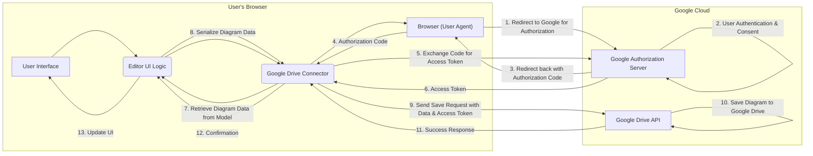
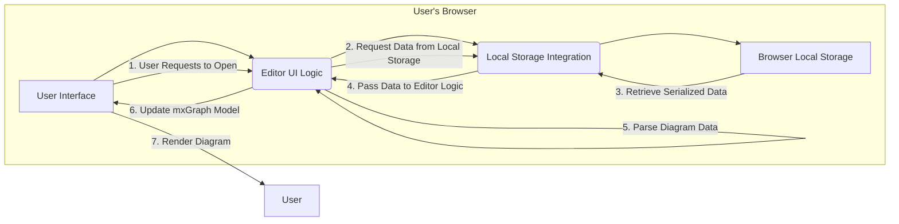

# Project Design Document: draw.io (Diagram Editor) - Improved

**Version:** 1.1
**Date:** October 26, 2023
**Author:** AI Software Architect

## 1. Introduction

This document provides an enhanced architectural design of the draw.io project, a free and open-source online diagram editor available at [https://github.com/jgraph/drawio](https://github.com/jgraph/drawio). This iteration builds upon the previous version, offering more granular details about the system's components, data flows, and interactions. This detailed design serves as a crucial foundation for comprehensive threat modeling activities.

## 2. Goals and Objectives

The primary goals of draw.io are to:

* Provide an intuitive and powerful user interface for creating and editing a wide variety of diagrams, including flowcharts, UML diagrams, network diagrams, mind maps, and more.
* Offer a truly platform-independent solution, seamlessly accessible through modern web browsers and as a standalone desktop application across different operating systems.
* Support a diverse range of storage options for diagrams, encompassing local file systems, browser-based storage, and seamless integration with popular cloud storage services and collaboration platforms.
* Facilitate real-time or asynchronous collaboration on diagrams, enabling teams to work together effectively.
* Offer a highly customizable and extensible platform, allowing users and developers to tailor the editor to specific needs through plugins and configurations.

## 3. Architectural Overview

draw.io's architecture is predominantly client-side, leveraging the capabilities of modern web browsers to execute the core diagramming logic. The application heavily relies on JavaScript, HTML, and CSS, rendering the user interface and handling diagram manipulations directly within the user's browser. While certain functionalities may involve optional server-side components, the fundamental diagramming engine operates on the client.

The architecture can be conceptually divided into the following distinct layers:

* **Presentation Layer:**  The visual interface presented to the user within the browser or desktop application, responsible for rendering the diagram canvas, UI controls, and handling user interactions.
* **Core Diagramming Engine:** The heart of the application, implemented in JavaScript, responsible for managing diagram elements, their properties, relationships, and the visual rendering of the diagram.
* **Storage Abstraction Layer:**  A crucial layer that provides a consistent interface for interacting with various storage mechanisms, abstracting away the specific implementation details of each storage provider.
* **Integration and Extension Layer:** Components that enable draw.io to connect with external services, platforms, and allow for extending its functionality through plugins and customizations.

## 4. Detailed Design

### 4.1. Components

* **User Interface (UI):**
    * **Diagram Canvas (`<canvas>` element):** The central interactive area where users visually construct and manipulate diagram elements. Rendering is primarily handled by the mxGraph library.
    * **Shape Library (Sidebar):** A categorized collection of pre-defined shapes, symbols, and stencils, organized for easy browsing and drag-and-drop functionality.
    * **Formatting Panel (Right Sidebar):**  Provides controls for modifying the visual attributes of selected diagram elements, such as color, line style, font, and size.
    * **Toolbar (Top):** Offers quick access to frequently used actions, including saving, exporting, undo/redo, zoom controls, and layout options.
    * **Menu Bar (Top):** Presents a comprehensive set of actions and settings, organized into logical categories like File, Edit, View, Insert, Format, Arrange, Extras, and Help.
    * **Outline/Layers Panel (Bottom Left):** Enables users to navigate and manage complex diagrams by providing a hierarchical view of the diagram's structure and allowing the organization of elements into layers.
    * **Properties Panel (Right Sidebar, Contextual):** Dynamically displays and allows modification of the specific properties of the currently selected diagram element(s).
    * **Search Panel:** Allows users to search for specific shapes within the shape library or text within the diagram.

* **Core Diagramming Engine (JavaScript - Primarily mxGraph Library):**
    * **mxGraph Library:** The foundational graph drawing library that provides the core functionalities for diagram creation, editing, and rendering. Key aspects include:
        * **Graph Model (`mxGraphModel`):**  Represents the underlying data structure of the diagram, including vertices (nodes), edges (connections), and their associated properties.
        * **View (`mxGraphView`):** Responsible for rendering the `mxGraphModel` onto the diagram canvas, handling visual updates and transformations.
        * **Controller (`mxGraph` class):** Manages user interactions (mouse clicks, drags, etc.) and translates them into modifications of the `mxGraphModel`.
        * **Layout Algorithms (`mxGraphLayout` implementations):** Provides various algorithms for automatically arranging diagram elements (e.g., hierarchical layout, organic layout).
        * **Stylesheet (`mxStylesheet`):** Defines the default visual appearance of diagram elements and allows for customization.
        * **Cell and Edge Classes (`mxCell`, `mxEdge`):** Represent individual nodes and connections within the diagram, storing their data and visual properties.
    * **Editor UI Logic (Custom JavaScript):**  The JavaScript code that integrates the mxGraph library with the user interface components, handling user input events, managing the application state, and orchestrating interactions between different parts of the application.
    * **Format Handlers (JavaScript):**  Modules responsible for serializing and deserializing the diagram data into various file formats (e.g., XML - `.drawio`, `.xml`, JSON - `.json`, compressed XML - `.mxfile`).

* **Storage Abstraction Layer:**
    * **Local Storage Integration (Browser API):** Utilizes the browser's `localStorage` API to store diagram data directly within the user's browser. Limitations in size and persistence may apply.
    * **Browser IndexedDB Integration (Browser API):** Leverages the browser's `IndexedDB` API for more structured and persistent storage within the browser, allowing for larger diagram files.
    * **Cloud Storage Connectors (JavaScript Modules):**  Specific modules that implement the necessary logic to interact with various cloud storage services through their respective APIs. Examples include:
        * **Google Drive Connector:** Uses the Google Drive API for authentication (OAuth 2.0), file listing, reading, and writing.
        * **OneDrive Connector:** Utilizes the Microsoft Graph API for similar functionalities with OneDrive.
        * **Dropbox Connector:** Integrates with the Dropbox API for file management.
        * **GitHub Connector:** Allows storing diagrams within GitHub repositories.
        * **Other Cloud Storage Connectors:** Support for services like GitLab, Confluence, etc.
    * **Server-Side Proxy (Optional Component):** In certain deployment scenarios or for specific storage integrations, a server-side component might act as a proxy to handle authentication, authorization, or data transfer with cloud storage providers. This can enhance security or address browser-based limitations.

* **Integration and Extension Layer:**
    * **Embed Functionality (JavaScript API, `<iframe>`):** Enables embedding draw.io diagrams into other web pages or applications using `<iframe>` elements or JavaScript APIs for more interactive integrations.
    * **Export Functionality (Client-Side and Optional Server-Side):** Allows exporting diagrams in various raster and vector formats (PNG, JPG, SVG, PDF, etc.). Client-side rendering is often used, but server-side components might be involved for more complex or high-fidelity exports.
    * **Import Functionality (Client-Side):** Enables importing diagrams from various file formats, parsing the data and converting it into the internal `mxGraphModel`.
    * **Collaboration Features (Optional Server-Side):**  If real-time collaborative editing is enabled, server-side components are necessary for synchronizing changes between multiple users. This often involves technologies like WebSockets for bidirectional communication.
    * **Plugin Architecture (JavaScript):**  Provides a mechanism for extending the functionality of draw.io through custom JavaScript plugins, allowing developers to add new features, shapes, integrations, or modify existing behavior.
    * **Theming and Customization (CSS, JavaScript):**  Allows customization of the visual appearance of the editor through CSS stylesheets and JavaScript configurations.

### 4.2. Data Flow

The following outlines the typical data flow for key operations within draw.io:

* **Creating and Editing a Diagram:**
    * User interacts with the UI (e.g., drags a shape from the library, draws a connection).
    * UI events are captured by the browser and handled by the Editor UI Logic (JavaScript).
    * The Editor UI Logic interacts with the `mxGraph` instance to update the `mxGraphModel`.
    * The `mxGraphView` renders the changes on the diagram canvas.

* **Saving a Diagram to Google Drive:**
    * User initiates the "Save As" action and selects Google Drive.
    * The Google Drive Connector initiates the OAuth 2.0 authorization flow, redirecting the user to Google for authentication and consent.
    * Upon successful authentication, Google redirects the user back to draw.io with an authorization token.
    * The Google Drive Connector uses the token to authenticate API requests to Google Drive.
    * The Editor UI Logic retrieves the current diagram data from the `mxGraphModel`.
    * The data is serialized into a specific format (e.g., XML).
    * The Google Drive Connector sends a request to the Google Drive API to create or update the diagram file, including the serialized data and the authentication token.
    * Google Drive saves the file and returns a success response.
    * The Google Drive Connector informs the Editor UI Logic about the successful save, and the UI is updated.

* **Loading a Diagram from Local Storage:**
    * User initiates the "Open" action and selects local storage.
    * The Local Storage Integration module uses the browser's `localStorage` API to retrieve the stored diagram data.
    * The retrieved data (typically in a serialized format like XML) is passed to the appropriate Format Handler.
    * The Format Handler parses the data and reconstructs the `mxGraphModel`.
    * The `mxGraphView` renders the diagram based on the loaded `mxGraphModel`.

* **Exporting a Diagram as SVG:**
    * User initiates the "Export" action and selects SVG format.
    * The client-side rendering capabilities of the `mxGraphView` are used to generate the SVG representation of the diagram.
    * The browser prompts the user to download the generated SVG file. In some cases, a server-side component might be used for more complex SVG generation or processing.

### 4.3. Key Technologies Used

* **Frontend:**
    * HTML5
    * CSS3
    * JavaScript (ES6+)
    * mxGraph (core diagramming library)
    * Various JavaScript libraries for UI components, utility functions, and API interactions.
* **Backend (Optional, for specific features):**
    * Java (for the draw.io server application and potentially some export functionalities)
    * Potentially other languages depending on specific integrations or deployment scenarios.
* **Storage:**
    * Browser Local Storage API
    * Browser IndexedDB API
    * Cloud Storage APIs (Google Drive API, Microsoft Graph API, Dropbox API, GitHub API, etc.)

## 5. Deployment Options

draw.io offers flexible deployment options:

* **Client-Side Web Application (Official Website):** Users can access the full functionality of draw.io directly through their web browser by visiting the official website ([https://app.diagrams.net/](https://app.diagrams.net/)). This requires no installation.
* **Desktop Application (Electron-based):**  draw.io is also available as a standalone desktop application for Windows, macOS, and Linux. This application embeds a web browser (Chromium via Electron) to run the client-side code offline.
* **Embedded within other applications:** draw.io can be seamlessly embedded into other web applications or platforms using `<iframe>` elements or JavaScript APIs, allowing for integrated diagramming capabilities.
* **Self-Hosted Server:** Organizations can deploy the draw.io server-side components (if needed for specific features or integrations) on their own infrastructure, providing greater control and potentially enhanced security within their network. This allows for a private instance of draw.io.

## 6. Security Considerations (Detailed)

This section expands upon the initial security considerations, providing more specific examples of potential threats:

* **Client-Side Vulnerabilities:**
    * **Cross-Site Scripting (XSS):**  If user-provided data (e.g., labels, custom shapes) is not properly sanitized before being rendered, malicious scripts could be injected and executed in other users' browsers.
    * **DOM-based XSS:** Vulnerabilities in the client-side JavaScript code could allow attackers to manipulate the DOM to inject malicious scripts.
    * **Dependency Vulnerabilities:**  Outdated or vulnerable third-party JavaScript libraries (including mxGraph itself) could introduce security flaws that attackers could exploit. Regular updates and security audits of dependencies are crucial.
* **Data Storage Security:**
    * **Local Storage/IndexedDB:** While convenient, data stored in local storage or IndexedDB is susceptible to access by other scripts running on the same domain. This could be exploited by malicious browser extensions or compromised websites.
    * **Cloud Storage Integration Vulnerabilities:**  Flaws in the implementation of the cloud storage connectors (e.g., improper handling of authentication tokens, insecure API calls) could lead to unauthorized access or modification of diagram data stored in the cloud.
    * **Man-in-the-Middle Attacks:** If communication with cloud storage providers is not properly secured (e.g., using HTTPS), attackers could intercept and potentially modify diagram data during transit.
* **Authentication and Authorization:**
    * **Insecure OAuth Implementation:**  Vulnerabilities in the OAuth 2.0 implementation for cloud storage integrations (e.g., improper token handling, redirect URI manipulation) could allow attackers to gain unauthorized access to user accounts and their diagrams.
    * **Lack of Server-Side Validation (if applicable):** If server-side components are involved, insufficient validation of user input or requests could lead to security breaches.
* **Cross-Site Request Forgery (CSRF):**  If server-side components handle sensitive actions without proper CSRF protection, attackers could potentially trick authenticated users into performing unintended actions.
* **Export Functionality Risks:**
    * **Server-Side Export Vulnerabilities:** If server-side components are used for exporting, vulnerabilities in the export process (e.g., image processing libraries) could be exploited.
    * **Information Disclosure:** Exporting diagrams to certain formats might inadvertently include sensitive metadata or information.
* **Collaboration Feature Risks (if enabled):**
    * **Unauthorized Access:**  Insufficient access controls or vulnerabilities in the real-time collaboration mechanism could allow unauthorized users to view or modify diagrams.
    * **Data Integrity Issues:**  Bugs in the synchronization logic could lead to data corruption or inconsistencies in collaborative diagrams.

## 7. Data Flow Diagram (Example: Saving to Google Drive - Detailed)

## 8. Data Flow Diagram (Example: Loading from Local Storage - Detailed)

This improved document provides a more in-depth understanding of the draw.io architecture, including finer details about its components, data flows, and security considerations. This enhanced level of detail will be invaluable for conducting a more thorough and effective threat modeling exercise.