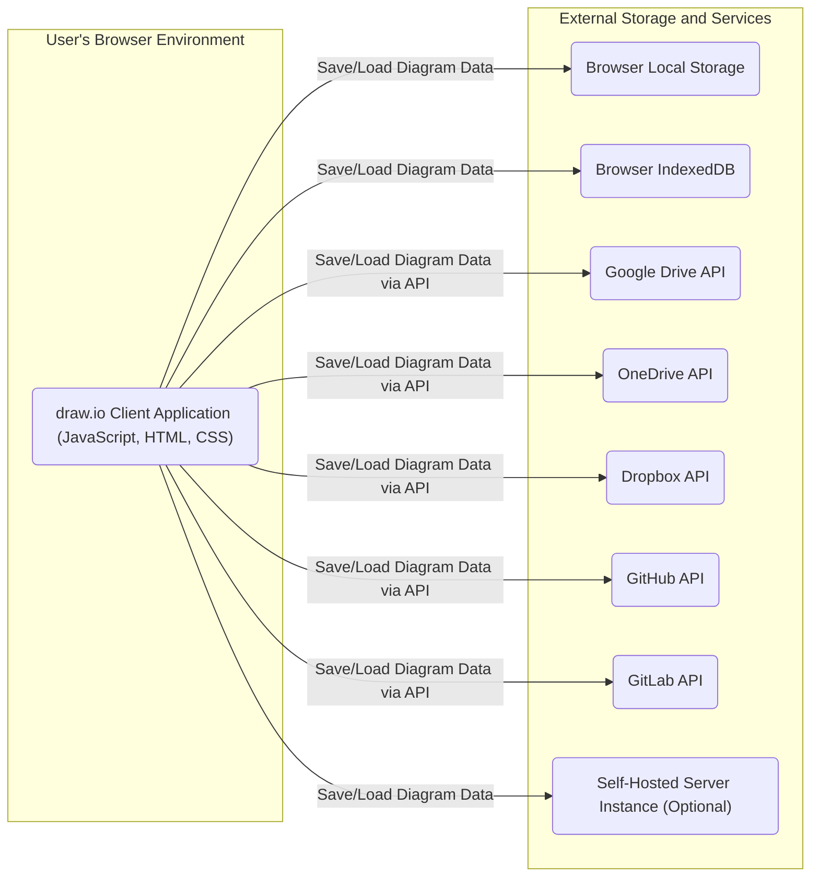
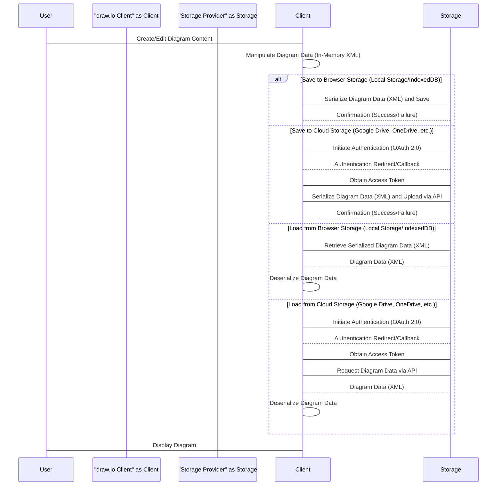

## Project Design Document: draw.io (Improved)

**1. Introduction**

This document provides a detailed architectural design of the draw.io application, a free online diagram editor. The primary purpose of this document is to serve as a robust foundation for subsequent threat modeling activities. It meticulously outlines the key components, data flows, and technologies integral to the operation of draw.io. This document specifically focuses on the publicly accessible, web-based version of draw.io hosted at app.diagrams.net (formerly draw.io).

**2. Goals**

* Clearly and comprehensively define the architecture of the draw.io application.
* Identify and describe the function of key components and their interactions in detail.
* Thoroughly describe the data flow within the application, including data transformations.
* Outline the specific technologies utilized in the development and deployment of draw.io.
* Provide a comprehensive and detailed overview specifically tailored for subsequent threat modeling exercises.

**3. Scope**

This document encompasses the following aspects of draw.io:

* The client-side web application executing within a user's web browser environment.
* The backend infrastructure supporting the application, including storage integrations and optional server-side components.
* The intricate interactions between the client and backend services.
* Common deployment scenarios and the various storage options available to users.

This document explicitly excludes:

* Fine-grained details of individual features within the diagram editor.
* The specifics of the source code implementation.
* Internal development processes and workflows.
* Specific configurations and customizations of self-hosted instances.

**4. System Overview**

draw.io is fundamentally a client-side application that operates directly within a user's web browser. It leverages a combination of JavaScript, HTML, and CSS to deliver a rich and interactive diagramming experience. Data persistence is achieved through a variety of storage options, including the browser's local storage, cloud storage providers (Google Drive, OneDrive, Dropbox, GitHub, GitLab), and optionally, a self-hosted server instance.

**5. Component Details**

* **draw.io Client Application (JavaScript, HTML, CSS):**
    * **Functionality:** This is the core of the application, responsible for rendering the user interface, processing user interactions (drawing, editing, manipulating diagram elements), and managing the diagram data model in the browser's memory.
    * **Key Modules:**
        * **Editor Core:** Manages the central drawing canvas, the available shape libraries, the logic for editing diagram elements, and the undo/redo functionality.
            * **Security Considerations:** Potential for DOM-based XSS if diagram data is not properly sanitized before rendering.
        * **Toolbar & Sidebar Components:** Provides the user interface elements for interacting with the editor, such as selecting tools, configuring element properties, and managing diagram settings.
            * **Security Considerations:** Risk of UI redressing or clickjacking if not properly protected.
        * **File Handling Module:** Responsible for loading, saving, exporting diagrams in various formats (e.g., XML, PNG, SVG, JPEG), and managing file metadata.
            * **Security Considerations:** Vulnerabilities related to parsing potentially malicious file formats, leading to XSS or other client-side attacks.
        * **Integration Modules:** Handles communication and authentication with external storage providers using their respective APIs.
            * **Security Considerations:** Misconfiguration of API keys or OAuth credentials, insecure handling of access tokens.
        * **Rendering Engine:**  Renders the visual representation of the diagram on the canvas, likely using SVG or HTML5 Canvas elements.
            * **Security Considerations:** Potential for rendering vulnerabilities if processing untrusted SVG content.
    * **Interactions:** Interacts directly with the user's browser environment, utilizing browser APIs for storage, network requests, and rendering. Communicates with external storage providers via their APIs.

* **Browser Local Storage:**
    * **Functionality:** Provides a straightforward mechanism for storing diagram data directly within the user's browser. Data is typically stored as key-value pairs.
    * **Limitations:** Limited storage capacity, data is scoped to the specific browser and domain, and can be cleared by the user.
    * **Security Considerations:** Data is not encrypted by default and is susceptible to access by other scripts running on the same domain (if not careful with scoping).

* **Browser IndexedDB:**
    * **Functionality:** A more structured, client-side, NoSQL-style storage system within the browser. Allows for storing larger amounts of structured data.
    * **Advantages:** Larger storage capacity compared to local storage, supports indexing for efficient data retrieval.
    * **Security Considerations:** Subject to browser security policies. Data is not encrypted by default.

* **Cloud Storage APIs (Google Drive, OneDrive, Dropbox, GitHub, GitLab):**
    * **Functionality:** Enables users to seamlessly save and load diagrams directly from their existing cloud storage accounts.
    * **Authentication:** Employs OAuth 2.0 for secure user authorization and access delegation.
        * **Security Considerations:**  Proper implementation of the OAuth 2.0 flow is critical to prevent authorization code interception or token theft. The application relies on the security of the third-party provider's OAuth implementation.
    * **Data Storage:** Diagram data is stored within the user's designated storage space within their respective cloud storage account.
    * **Security Considerations:** Relies heavily on the security infrastructure and practices of the respective cloud storage providers.

* **Self-Hosted Server Instance (Optional):**
    * **Functionality:** Provides the option for users or organizations to deploy a backend server for draw.io, granting more control over data storage, user authentication, and potentially enabling server-side features.
    * **Implementation:** Can be implemented using various technologies (e.g., Java, Node.js, Python) depending on the specific self-hosted solution chosen.
    * **Security Considerations:** The security of the self-hosted instance is the direct responsibility of the deploying entity. This includes securing the operating system, web server, application code, and any associated databases.

**6. Data Flow**

The primary data flow within draw.io revolves around the creation, modification, and persistent storage of diagram data. The data format is typically an XML-based structure representing the diagram's elements, properties, and layout.

**7. Security Considerations (Detailed)**

This section provides a more in-depth analysis of potential security considerations, categorized for clarity.

* **Client-Side Security:**
    * **Cross-Site Scripting (XSS):**
        * **Threat:** Malicious scripts injected into diagram data could be executed in the context of other users viewing the diagram.
        * **Mitigation:**  Strict input sanitization and output encoding of user-provided data, especially when rendering diagram elements or labels. Implementation of a strong Content Security Policy (CSP).
    * **Content Security Policy (CSP):**
        * **Importance:** A properly configured CSP is crucial for mitigating XSS attacks by controlling the sources from which the browser is allowed to load resources.
        * **Considerations:**  Ensure the CSP is restrictive enough to prevent the loading of malicious scripts but permissive enough to allow the application to function correctly.
    * **Dependency Vulnerabilities:**
        * **Threat:** Using outdated or vulnerable third-party JavaScript libraries can introduce security risks.
        * **Mitigation:** Regularly update dependencies and perform security audits of third-party libraries. Utilize tools for identifying known vulnerabilities in dependencies.
    * **Client-Side Data Tampering:**
        * **Threat:** Malicious actors could potentially modify the client-side code or local storage data.
        * **Mitigation:** While complete prevention is difficult on the client-side, implement integrity checks and avoid storing sensitive information solely on the client.
    * **Clickjacking:**
        * **Threat:** Attackers could embed the draw.io interface within a malicious website, tricking users into performing unintended actions.
        * **Mitigation:** Implement frame busting techniques or use the `X-Frame-Options` header.

* **Authentication and Authorization:**
    * **OAuth 2.0 Implementation:**
        * **Threat:**  Improper implementation of the OAuth 2.0 flow can lead to authorization code interception, access token theft, or confused deputy attacks.
        * **Mitigation:**  Adhere to best practices for OAuth 2.0, including using HTTPS for all communication, securely storing client secrets (if applicable), and validating redirect URIs.
    * **Self-Hosted Authentication:**
        * **Considerations:**  The security of authentication mechanisms for self-hosted instances (e.g., username/password, SSO) is the responsibility of the deployer. Strong password policies, multi-factor authentication, and secure session management are crucial.

* **Data Storage Security:**
    * **Data at Rest (Browser Storage):**
        * **Threat:** Data stored in browser local storage or IndexedDB is generally not encrypted by default and could be accessible to other scripts or if the user's device is compromised.
        * **Mitigation:** Consider encrypting sensitive data before storing it in browser storage.
    * **Data at Rest (Cloud Storage):**
        * **Reliance:** Security relies on the security measures implemented by the respective cloud storage providers.
        * **Considerations:** Users should be aware of the security practices of their chosen cloud storage provider.
    * **Data in Transit:**
        * **Importance:** All communication between the client and storage providers (including API calls) must be over HTTPS to protect data in transit from eavesdropping and manipulation.
        * **Mitigation:** Enforce HTTPS for all network requests.

* **Third-Party Integrations:**
    * **API Security:**
        * **Reliance:** The security of the integration relies on the security of the APIs provided by the cloud storage providers.
        * **Considerations:** Stay informed about security advisories and best practices for interacting with these APIs.
    * **Permissions Granted:**
        * **User Awareness:** Ensure users understand the permissions they are granting to draw.io when connecting to their cloud storage accounts.
        * **Principle of Least Privilege:** Request only the necessary permissions.

* **Self-Hosted Instances:**
    * **Deployment Security:**
        * **Responsibility:** Security is the sole responsibility of the entity deploying and managing the self-hosted server.
        * **Considerations:** Implement robust security measures at all levels, including network security, operating system hardening, web server configuration, and application security. Regularly apply security patches and updates.

**8. Technologies Used**

* **Client-Side:**
    * **JavaScript (ES6+):** The primary programming language for the application's logic and interactivity.
    * **HTML5:** Provides the structure and content of the user interface.
    * **CSS3:** Used for styling and visual presentation of the application.
    * **SVG (Scalable Vector Graphics):** Likely used for rendering vector-based diagram elements.
    * **HTML5 Canvas:** May be used for rendering more complex or performance-sensitive parts of the diagram.
    * **Various JavaScript Libraries and Frameworks:** Including libraries for UI components, network communication (e.g., `fetch` or `axios`), and potentially graph manipulation or layout algorithms. Specific libraries would need to be identified through further analysis.
* **Backend (Optional Self-Hosted):**
    * **Varies depending on the chosen self-hosted solution:** Common choices include Java (with frameworks like Spring), Node.js (with Express.js), Python (with Django or Flask), etc.
* **Storage Integrations:**
    * **Google Drive API:** For integration with Google Drive.
    * **Microsoft Graph API (OneDrive):** For integration with OneDrive.
    * **Dropbox API:** For integration with Dropbox.
    * **GitHub API:** For integration with GitHub repositories.
    * **GitLab API:** For integration with GitLab repositories.

**9. Deployment Model**

* **Web Application (app.diagrams.net):** Primarily deployed as a client-side web application hosted on a web server (likely using a CDN for static assets). Users access it directly through their web browsers.
    * **Security Considerations:** Focus on client-side security measures, secure delivery of static assets (HTTPS), and protection against common web application vulnerabilities.
* **Desktop Application:** Available as a desktop application built using frameworks like Electron, which essentially packages the web application within a Chromium browser instance.
    * **Security Considerations:**  While leveraging the security of the underlying Chromium engine, consider potential vulnerabilities in the Electron framework itself and ensure secure packaging and distribution.
* **Self-Hosted:** Can be deployed on private infrastructure, providing greater control over data and security. Deployment can range from simple setups using Docker to more complex enterprise deployments.
    * **Security Considerations:** Requires a comprehensive security strategy covering all aspects of the infrastructure, application, and data.

**10. Future Considerations (Security Implications)**

* **Enhanced Real-time Collaboration Features:** If real-time collaborative editing is implemented, significant security considerations arise around data synchronization, access control, and preventing malicious interference from other collaborators. Secure WebSockets or similar technologies would be necessary.
* **Server-Side Rendering (SSR):** Implementing SSR could introduce new attack surfaces on the server-side, requiring careful attention to server-side security practices and input validation.
* **Plugin/Extension System:** Allowing third-party plugins or extensions to interact with the core application introduces significant security risks. A robust security model with sandboxing and strict permission controls would be essential to prevent malicious extensions from compromising the application or user data.
* **AI-Powered Features:** Integration of AI features might involve sending diagram data to external AI services, raising concerns about data privacy and security during transmission and processing.

This improved document provides a more detailed and nuanced understanding of the draw.io architecture, specifically tailored for the purpose of threat modeling. The enhanced descriptions of components, data flows, and security considerations offer a stronger foundation for identifying potential vulnerabilities and designing effective security controls.