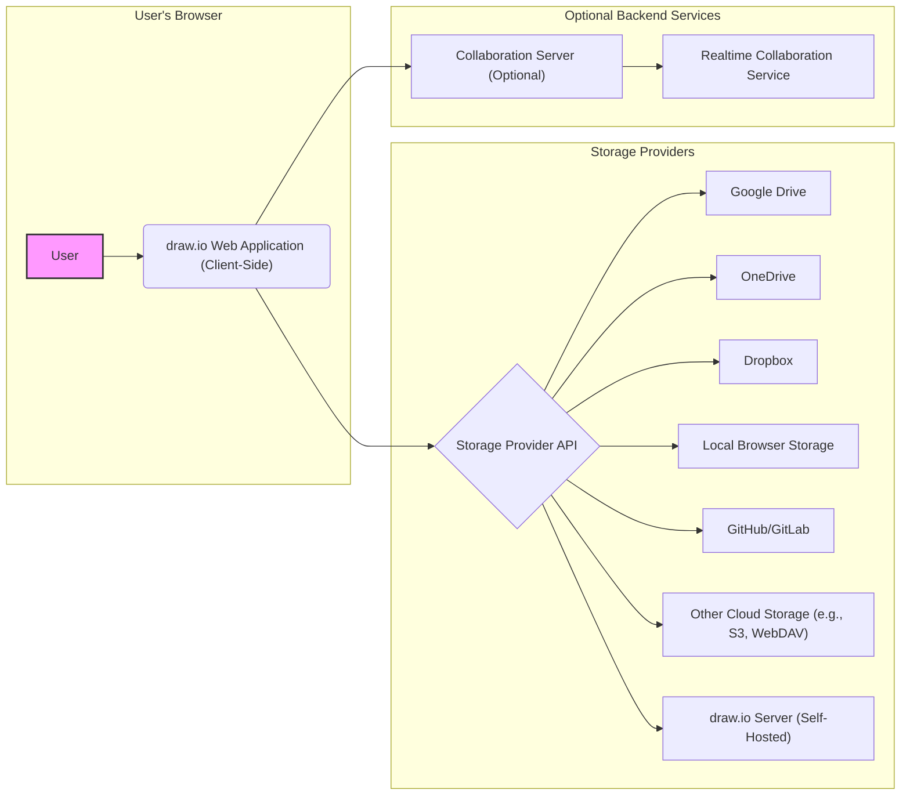

## Project Design Document: draw.io (diagrams.net) - Improved

**Version:** 1.1
**Date:** October 26, 2023
**Author:** AI Software Architect

### 1. Project Overview

This document provides an enhanced architectural design overview of the draw.io (now known as diagrams.net) project, a free, open-source online diagramming application. This improved document builds upon the previous version, offering more detail and clarity, and continues to serve as a foundation for future threat modeling activities. It details the key components, functionalities, data flows, and deployment models of the application with greater precision.

### 2. Goals

* Provide a more detailed and refined architectural overview of the draw.io application.
* Clearly define the responsibilities and interactions of key components.
* Offer a more granular description of the data flow within the application, including specific data elements.
* Elaborate on the different deployment models supported by draw.io with more context.
* Serve as a robust and comprehensive basis for identifying potential security threats and vulnerabilities during subsequent threat modeling exercises.

### 3. Target Audience

* Security Engineers and Architects
* Development Team Members
* DevOps Engineers
* Anyone involved in the security assessment, development, or deployment of the draw.io project.

### 4. Scope

This document focuses on the architectural design of the draw.io application, encompassing its core functionalities, components, and deployment options. It provides a deeper dive into the client-side application, server-side components (where applicable), and data storage mechanisms. While it still avoids delving into the specifics of individual code modules, it offers more detail on the functionalities within each component and the nuances of interactions with external services.

### 5. High-Level Architecture

The draw.io application primarily operates as a sophisticated client-side application executed within a web browser. While self-hosting is an option, the core diagramming logic and user interface reside in the front-end. Interactions with backend services are primarily focused on storage, collaboration, and potentially, custom integrations.



**Components:**

* **User:** The individual interacting with the draw.io application through a compatible web browser.
* **draw.io Web Application (Client-Side):** The central component, implemented primarily using JavaScript, HTML, and CSS. This component is responsible for:
    * Interactive diagram creation, editing, and manipulation.
    * Rendering the visual representation of diagrams on the user's screen.
    * Managing the user interface elements and handling user interactions.
    * Orchestrating communication with various storage providers for saving and loading diagrams.
    * Facilitating real-time collaborative editing sessions (if enabled).
* **Storage Provider API:** The standardized interface through which the draw.io client communicates with diverse storage services. This abstraction layer allows draw.io to support multiple storage options.
* **Storage Providers:** External services utilized for the persistent storage of diagram files. These include:
    * Google Drive: Google's cloud storage service.
    * OneDrive: Microsoft's cloud storage service.
    * Dropbox: A popular file hosting service.
    * Local Browser Storage: Utilizing the browser's built-in storage mechanisms (IndexedDB or LocalStorage) for local saving.
    * GitHub/GitLab: Leveraging version control platforms for storing diagrams as files within repositories.
    * Other Cloud Storage (e.g., AWS S3, WebDAV): Supporting a range of other cloud storage solutions through their respective APIs.
    * draw.io Server (Self-Hosted): A dedicated server instance running the draw.io backend, providing a private storage option.
* **Collaboration Server (Optional):** A backend service that enables multiple users to concurrently edit the same diagram in real-time. This is typically a separate service or component.
* **Realtime Collaboration Service:** The specific technology or platform employed for enabling real-time collaboration features, handling message broadcasting and state synchronization.
* **draw.io Server (Self-Hosted):** An optional backend component that can be deployed to host a complete, self-contained instance of draw.io. This may include its own storage mechanisms and user management.

### 6. Detailed Component Breakdown

#### 6.1. draw.io Web Application (Client-Side)

* **User Interface (UI):**
    * Interactive Canvas: The primary area where users visually construct and modify diagrams.
    * Shape Palettes: Collections of pre-defined shapes and symbols categorized for various diagram types.
    * Connection Tools: Functionality for creating and managing connections between diagram elements.
    * Menu and Toolbar System: Providing access to application features like saving, exporting, formatting, and arrangement.
    * Configuration Dialogs and Modals: Interfaces for customizing diagram properties, application settings, and user preferences.
    * Undo/Redo Functionality: Allowing users to revert or reapply changes made to the diagram.
* **Core Diagramming Engine:**
    * Graph Model: The underlying data structure representing the diagram's elements and their relationships.
    * Layout Algorithms: Automated methods for arranging diagram elements for better readability.
    * Rendering Engine: Responsible for drawing the diagram on the canvas using technologies like SVG or Canvas.
    * Import/Export Functionality: Support for various diagram file formats (e.g., XML, SVG, PNG, JPEG, PDF, VSDX).
    * Template Management: Features for creating, saving, and loading diagram templates.
* **Storage Integration Module:**
    * Authentication Handlers: Logic for authenticating users with different storage providers using protocols like OAuth 2.0.
    * API Client Libraries: Implementations for interacting with the specific APIs of each supported storage provider.
    * File Management Operations: Functions for saving, loading, deleting, and listing diagram files within the connected storage.
    * Conflict Resolution Mechanisms: Strategies for handling potential conflicts when multiple users modify the same diagram.
* **Collaboration Module:**
    * Real-time Synchronization Logic: Mechanisms for broadcasting and receiving diagram changes between collaborating users.
    * Presence and Cursor Tracking: Displaying the presence and actions of other collaborators on the canvas.
    * Conflict Resolution Strategies: Algorithms for merging concurrent changes made by multiple users.
    * Session Management: Handling the initiation, maintenance, and termination of collaborative editing sessions.
* **Configuration and Settings:**
    * Application Preferences: User-specific settings for customizing the application's behavior and appearance.
    * Theme Management: Options for changing the visual theme of the application.
    * Language Settings: Allowing users to select their preferred language.
* **Security Features (Client-Side):**
    * Input Sanitization: Preventing the execution of malicious scripts injected through diagram data or user input.
    * Secure Communication (HTTPS): Ensuring encrypted communication between the client and any backend services.
    * Content Security Policy (CSP): Defining a policy to control the resources the browser is allowed to load, mitigating XSS attacks.

#### 6.2. Storage Providers

* **API Endpoints:** Publicly accessible URLs that expose the storage provider's functionalities.
* **Authentication and Authorization Mechanisms:** Methods for verifying user identity and granting access to resources (e.g., OAuth 2.0 flows, API keys).
* **Data Storage Infrastructure:** The underlying systems used by the provider to store and manage user data.
* **Access Control Policies:** Rules defining who can access specific files and folders.

#### 6.3. Collaboration Server (Optional)

* **Real-time Communication Channels:** Technologies like WebSockets or Server-Sent Events (SSE) for bidirectional communication.
* **State Management Database:** A data store for maintaining the current state of collaboratively edited diagrams.
* **User Authentication and Authorization Service:** Verifying the identity of users joining collaboration sessions and controlling their access.
* **Message Broker:** A component for routing messages between connected clients.

#### 6.4. draw.io Server (Self-Hosted)

* **Web Server (e.g., Nginx, Apache):** Serving the static files of the draw.io web application.
* **Backend Application Logic (e.g., Java-based):** Handling server-side functionalities if implemented.
* **Database (Optional):** For storing user data, diagram metadata, or other application-specific information.
* **Storage Mechanism:**  Could be a local file system, network storage, or a cloud storage service.
* **Authentication and Authorization Module:** Managing user accounts and access permissions within the self-hosted environment.

### 7. Data Flow

The primary data flow revolves around the creation, modification, storage, and retrieval of diagram data, with an additional flow for real-time collaboration.

```mermaid
sequenceDiagram
    participant User
    participant "draw.io Client" as Client
    participant "Storage Provider API" as StorageAPI
    participant "Storage Provider" as Storage
    participant "Collaboration Server" as CollabServer

    User->>Client: Create/Edit Diagram
    Client->>Client: Update Diagram State (Local Memory)
    alt Save Diagram to Storage
        Client->>StorageAPI: Authenticate User
        StorageAPI->>Client: Authentication Token
        Client->>StorageAPI: Send Diagram Data (e.g., XML)
        StorageAPI->>Storage: Store Diagram Data
        Storage-->>StorageAPI: Success/Failure Response
        StorageAPI-->>Client: Save Confirmation
        Client-->>User: Confirmation
    end
    alt Load Diagram from Storage
        Client->>StorageAPI: Authenticate User
        StorageAPI->>Client: Authentication Token
        Client->>StorageAPI: Request Diagram Data
        StorageAPI->>Storage: Retrieve Diagram Data
        Storage-->>StorageAPI: Diagram Data
        StorageAPI-->>Client: Diagram Data
        Client->>Client: Render Diagram
        Client-->>User: Diagram Displayed
    end
    alt Real-time Collaboration Session
        User->>Client: Edit Diagram
        Client->>CollabServer: Send Diagram Delta/Change
        CollabServer-->>CollabServer: Broadcast Delta
        Client<<--CollabServer: Received Delta from Other User
        Client->>Client: Apply Delta to Local Diagram
        Client-->>User: Updated Diagram View
    end
```

**Data Elements:**

* **Diagram Data (mxGraph XML):** The core representation of the diagram, typically in an XML format defined by the mxGraph library. This includes nodes, edges, styles, and layout information.
* **User Credentials/Tokens:**  Authentication information used to access storage providers and collaboration services (e.g., OAuth 2.0 access tokens, API keys).
* **Application Configuration:** Settings that control the behavior and appearance of the draw.io application.
* **User Preferences:** Individual user settings, such as preferred language or theme.
* **Metadata:** Information about diagram files, including name, size, modification timestamps, and version history (if supported by the storage provider).
* **Collaboration Session State:** Data maintained by the collaboration server to track the current state of a shared diagram and connected users.
* **Diagram Deltas/Changes:**  Representations of modifications made to the diagram during a collaboration session, used for synchronizing changes between users.

### 8. Deployment Model

draw.io offers a flexible range of deployment options to suit various needs and environments:

* **Browser-Based (Official Website - diagrams.net):** Users access the application directly through the official diagrams.net website. The client-side application is served from their infrastructure, requiring no local installation.
* **Self-Hosted:** The entire client-side application (static files) can be downloaded and hosted on a private web server. This provides greater control over the environment and can be beneficial for organizations with strict security or compliance requirements. Technologies like Nginx or Apache can be used for hosting.
* **Desktop Application:** A desktop version is available for Windows, macOS, and Linux, built using the Electron framework. This essentially packages the web application within a native application wrapper, allowing for offline access and tighter integration with the operating system.
* **Embedded:** draw.io can be embedded within other web applications or platforms using iframes. This allows developers to integrate diagramming capabilities directly into their own products.
* **Containerized (Docker):** draw.io can be deployed using Docker containers, simplifying deployment and management across different environments. This is particularly useful for self-hosted scenarios.

### 9. Key Technologies

* **Client-Side:**
    * JavaScript: The primary programming language for the client-side logic.
    * HTML: Used for structuring the user interface.
    * CSS: For styling the application's appearance.
    * mxGraph (now known as yFiles for HTML): The core graph visualization and editing library.
    * Various JavaScript Libraries and Frameworks:  Likely including libraries for UI components, network communication, and utility functions.
* **Server-Side (Optional):**
    * Java: Commonly used for the self-hosted server backend.
    * Potentially other languages and frameworks depending on the specific collaboration service implementation (e.g., Node.js, Python).
* **Storage Providers:**
    * Varies depending on the provider (e.g., Google Cloud Storage APIs, Microsoft Graph API, Dropbox API).
* **Collaboration:**
    * WebSockets: A common protocol for real-time bidirectional communication.
    * Server-Sent Events (SSE): Another protocol for pushing updates from the server to clients.

### 10. Security Considerations (Initial)

This section provides an enhanced preliminary overview of potential security considerations, building upon the previous version. A more detailed threat model will be developed based on this comprehensive design document.

* **Client-Side Vulnerabilities:**
    * Cross-Site Scripting (XSS): Potential for injecting malicious scripts through diagram content, custom shapes, or user-provided input fields.
    * Man-in-the-Browser Attacks: Vulnerabilities that could allow attackers to intercept or manipulate user interactions within the browser.
    * Third-Party Library Vulnerabilities: Risks associated with security flaws in the JavaScript libraries and frameworks used by the application.
    * Client-Side Data Tampering: Potential for malicious actors to modify diagram data or application logic within the user's browser.
* **Authentication and Authorization:**
    * Insecure Storage of Authentication Tokens: Risks associated with improper handling or storage of tokens used to access storage providers.
    * Insufficient Authorization Checks: Potential for users to access or modify diagrams they do not have permission to.
    * Cross-Site Request Forgery (CSRF): Vulnerabilities when interacting with storage provider APIs or other backend services.
* **Data Security:**
    * Data Breaches at Storage Providers: Reliance on the security measures implemented by third-party storage providers.
    * Data Transmission Security: Ensuring diagram data is encrypted in transit (HTTPS).
    * Lack of Client-Side Encryption: Potential exposure of sensitive diagram data if stored unencrypted in local browser storage.
* **Collaboration Security:**
    * Unauthorized Access to Collaboration Sessions: Ensuring only invited or authenticated users can join collaborative editing sessions.
    * Malicious Content Injection During Collaboration: Preventing attackers from injecting harmful or disruptive content into shared diagrams.
    * Information Disclosure: Potential for sensitive information to be exposed to unauthorized collaborators.
* **Self-Hosted Security:**
    * Vulnerabilities in the Hosting Infrastructure: Risks associated with the security of the server and network where the application is hosted.
    * Misconfiguration of the Web Server: Potential for security flaws due to improper configuration of Nginx, Apache, or other web servers.
    * Lack of Security Updates: Risks associated with running outdated versions of the application or underlying software.
* **Supply Chain Security:**
    * Risks associated with compromised dependencies or malicious code introduced through third-party libraries and tools.
    * Vulnerabilities in the Electron framework (for the desktop application).

This improved document provides a more detailed and nuanced understanding of the draw.io project's architecture. This enhanced information will be invaluable for conducting a thorough and effective threat model to identify and mitigate potential security risks across all aspects of the application and its deployment models.