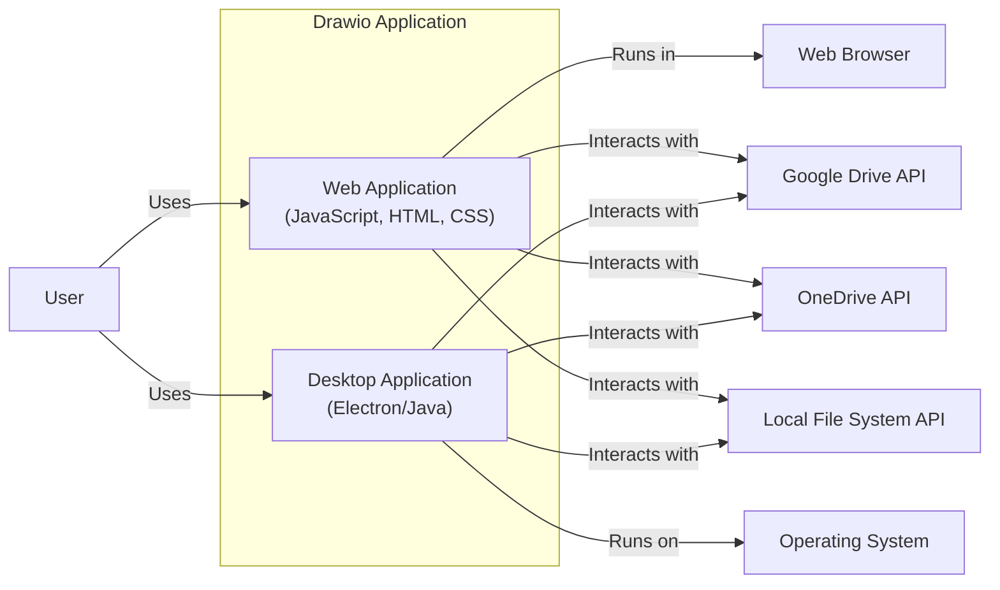
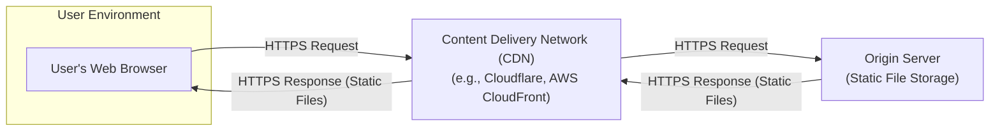
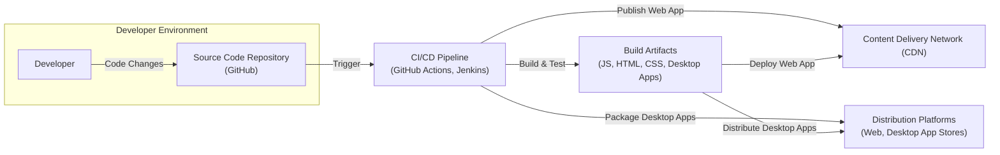

# BUSINESS POSTURE

- Business Priorities and Goals:
 - Provide a user-friendly, feature-rich, and accessible diagramming tool.
 - Enable users to create and edit diagrams easily within web browsers and desktop applications.
 - Support a wide range of diagram types and use cases.
 - Offer seamless integration with various cloud storage providers for diagram storage and sharing.
 - Maintain a free and open-source model to encourage broad adoption and community contributions.

- Business Risks:
 - Data Loss: Risk of users losing diagrams due to software bugs, browser issues, or storage problems.
 - Data Breach: Risk of unauthorized access to user diagrams, especially if stored in cloud services or if the application has vulnerabilities.
 - Availability: Risk of the application becoming unavailable due to technical issues or cyberattacks, disrupting user workflows.
 - Reputational Damage: Negative publicity and loss of user trust due to security incidents or data breaches.
 - Intellectual Property Theft: Risk of sensitive information contained within diagrams being exposed or stolen.

# SECURITY POSTURE

- Existing Security Controls:
 - security control: Client-Side Execution Environment: Drawio primarily runs in the user's web browser or as a desktop application, leveraging browser security features and operating system security. Implemented by: Web browsers and operating systems.
 - security control: Content Security Policy (CSP): Web application can utilize CSP headers to mitigate risks of cross-site scripting (XSS) attacks by controlling the resources the browser is allowed to load. Implemented by: Web application configuration (if deployed as a web application).
 - security control: Subresource Integrity (SRI): Can be used to ensure that resources fetched from CDNs or external sources have not been tampered with. Implemented by: Web application HTML structure.
 - security control: HTTPS for Web Access: If accessed via a web server, HTTPS encryption protects data in transit between the user's browser and the server. Implemented by: Web server configuration.
 - security control: Browser Sandboxing: Modern browsers provide sandboxing to isolate web applications from the underlying operating system and other browser tabs, limiting the impact of potential vulnerabilities. Implemented by: Web browsers.

- Accepted Risks:
 - accepted risk: Client-Side Security Limitations: As a client-side application, drawio's security is heavily reliant on the security of the user's browser and operating system, which are outside of the direct control of the drawio project.
 - accepted risk: Third-Party Storage Provider Security: When users choose to store diagrams in third-party cloud storage services (e.g., Google Drive, OneDrive), the security of those diagrams becomes dependent on the security measures implemented by those providers.
 - accepted risk: Open-Source Vulnerabilities: As an open-source project, vulnerabilities might be publicly disclosed before patches are available, potentially increasing the window of opportunity for exploitation.

- Recommended Security Controls:
 - security control: Regular Security Audits and Penetration Testing: Conduct periodic security assessments to identify and address potential vulnerabilities in the application code and infrastructure.
 - security control: Dependency Scanning: Implement automated scanning of third-party libraries and dependencies used by drawio to detect and remediate known vulnerabilities.
 - security control: Input Sanitization and Output Encoding: Ensure proper sanitization of user inputs and encoding of outputs to prevent injection attacks (e.g., XSS, HTML injection) even in a client-side context.
 - security control: Secure Build Pipeline: Implement a secure build pipeline with automated security checks (SAST, DAST, dependency scanning) to minimize the risk of introducing vulnerabilities during the development process.
 - security control: Security Awareness Training for Developers: Provide security training to developers to promote secure coding practices and awareness of common web application vulnerabilities.

- Security Requirements:
 - Authentication:
  - requirement: Not applicable for core diagramming functionality as it is primarily a client-side application. If collaboration features or user accounts are added in the future, robust authentication mechanisms (e.g., OAuth 2.0, OpenID Connect) should be implemented.
 - Authorization:
  - requirement: Authorization is primarily managed by the user's operating system and browser for local file access. For cloud storage integration, authorization is handled by the respective cloud storage providers (e.g., Google Drive API permissions). Drawio should adhere to the principle of least privilege when requesting access to user resources.
 - Input Validation:
  - requirement: Implement client-side and potentially server-side (if server components are introduced) input validation to prevent injection attacks. Validate diagram data, file uploads, and any other user-provided input to ensure data integrity and security.
 - Cryptography:
  - requirement: Consider implementing client-side encryption for sensitive diagrams, especially if users are storing them in cloud environments. If implemented, use robust and well-vetted cryptographic libraries and algorithms. Ensure proper key management if client-side encryption is used. For HTTPS, ensure strong cipher suites are configured.

# DESIGN

## C4 CONTEXT

```mermaid
graph LR
    subgraph "Diagramming Tool Context"
        center["Drawio Application"]
    end
    user["User"]
    browser["Web Browser"]
    desktop_app["Desktop Application"]
    google_drive["Google Drive"]
    one_drive["OneDrive"]
    local_storage["Local File System"]

    user -- Uses --> center
    center -- Runs in --> browser
    center -- Runs as --> desktop_app
    center -- Stores/Retrieves Diagrams --> google_drive
    center -- Stores/Retrieves Diagrams --> one_drive
    center -- Stores/Retrieves Diagrams --> local_storage
end
```

- Context Diagram Elements:
 - - Name: Drawio Application
   - Type: Software System
   - Description: The drawio diagramming tool, allowing users to create, edit, and store diagrams.
   - Responsibilities:
    - Providing a user interface for diagram creation and editing.
    - Supporting various diagram types and shapes.
    - Integrating with different storage options.
    - Exporting diagrams in various formats.
   - Security controls:
    - security control: Client-Side Input Validation: Validating user input within the application to prevent client-side injection vulnerabilities.
    - security control: Content Security Policy (CSP): If deployed as a web application, utilize CSP to restrict resource loading and mitigate XSS risks.

 - - Name: User
   - Type: Person
   - Description: Individuals who use the drawio application to create and manage diagrams.
   - Responsibilities:
    - Creating and editing diagrams using the application.
    - Choosing storage locations for diagrams.
    - Managing access to their diagrams.
   - Security controls:
    - security control: User Awareness: Users are responsible for choosing strong passwords for their cloud storage accounts and protecting their local devices.

 - - Name: Web Browser
   - Type: Software System
   - Description: Web browsers (e.g., Chrome, Firefox, Safari) in which the web version of drawio runs.
   - Responsibilities:
    - Executing the drawio web application code.
    - Rendering the user interface.
    - Providing a secure execution environment (sandboxing, same-origin policy).
   - Security controls:
    - security control: Browser Security Features: Browsers implement various security features like sandboxing, same-origin policy, and built-in XSS protection.

 - - Name: Desktop Application
   - Type: Software System
   - Description: Desktop versions of drawio that run directly on user operating systems (e.g., Windows, macOS, Linux).
   - Responsibilities:
    - Executing the drawio application code.
    - Providing a native application environment.
    - Interacting with the local file system.
   - Security controls:
    - security control: Operating System Security: Desktop application security relies on the underlying operating system's security features and user permissions.

 - - Name: Google Drive
   - Type: External System
   - Description: Google's cloud storage service, used by users to store and retrieve drawio diagrams.
   - Responsibilities:
    - Storing user diagrams securely in the cloud.
    - Providing access control and authentication for user accounts.
    - Ensuring data availability and durability.
   - Security controls:
    - security control: Google Drive Security: Google Drive implements its own security measures, including encryption at rest and in transit, access controls, and threat detection systems.

 - - Name: OneDrive
   - Type: External System
   - Description: Microsoft's cloud storage service, used by users to store and retrieve drawio diagrams.
   - Responsibilities:
    - Storing user diagrams securely in the cloud.
    - Providing access control and authentication for user accounts.
    - Ensuring data availability and durability.
   - Security controls:
    - security control: OneDrive Security: OneDrive implements its own security measures, including encryption at rest and in transit, access controls, and threat detection systems.

 - - Name: Local File System
   - Type: Environment
   - Description: The user's local computer file system where diagrams can be stored.
   - Responsibilities:
    - Storing diagram files locally on the user's machine.
    - Providing file system access to the drawio desktop application or browser (if permitted).
   - Security controls:
    - security control: Operating System Access Controls: Security is managed by the user's operating system access controls and file system permissions.
    - security control: User Responsibility: Security of locally stored files is primarily the user's responsibility (e.g., device security, backups).

## C4 CONTAINER



- Container Diagram Elements:
 - - Name: Web Application
   - Type: Container
   - Description: The client-side web application built using JavaScript, HTML, and CSS, providing the diagramming functionality within a web browser.
   - Responsibilities:
    - Rendering the user interface for diagram creation and editing.
    - Handling user interactions and diagram manipulations.
    - Implementing diagram logic and features.
    - Interfacing with storage APIs (Google Drive, OneDrive, Local File System) via browser APIs.
   - Security controls:
    - security control: Client-Side Input Validation: Validating user input within the web application.
    - security control: Output Encoding: Encoding output to prevent injection vulnerabilities.
    - security control: Content Security Policy (CSP): Utilizing CSP headers to control resource loading.
    - security control: Subresource Integrity (SRI): Using SRI for external resources.

 - - Name: Desktop Application
   - Type: Container
   - Description: The desktop application wrapper, potentially built using Electron or Java, providing a native application experience.
   - Responsibilities:
    - Packaging the web application for desktop execution.
    - Providing native operating system integrations.
    - Handling file system access for desktop users.
    - Interfacing with storage APIs (Google Drive, OneDrive, Local File System) via platform-specific APIs.
   - Security controls:
    - security control: Application Packaging Security: Ensuring the desktop application package is securely built and distributed.
    - security control: Operating System API Security: Securely using operating system APIs for file access and other native functionalities.

 - - Name: Google Drive API
   - Type: External System Interface
   - Description: Google Drive API used for integrating with Google Drive for diagram storage and retrieval.
   - Responsibilities:
    - Providing an interface for drawio to interact with Google Drive.
    - Handling authentication and authorization with Google Drive.
    - Managing diagram files within Google Drive.
   - Security controls:
    - security control: OAuth 2.0 Authentication: Using OAuth 2.0 for secure authorization with Google Drive.
    - security control: API Access Control: Google Drive API access is controlled by user permissions and API keys (if applicable).

 - - Name: OneDrive API
   - Type: External System Interface
   - Description: OneDrive API used for integrating with OneDrive for diagram storage and retrieval.
   - Responsibilities:
    - Providing an interface for drawio to interact with OneDrive.
    - Handling authentication and authorization with OneDrive.
    - Managing diagram files within OneDrive.
   - Security controls:
    - security control: OAuth 2.0 Authentication: Using OAuth 2.0 for secure authorization with OneDrive.
    - security control: API Access Control: OneDrive API access is controlled by user permissions and API keys (if applicable).

 - - Name: Local File System API
   - Type: System Interface
   - Description: Browser or operating system APIs used to access the local file system for saving and opening diagrams locally.
   - Responsibilities:
    - Providing an interface for drawio to interact with the local file system.
    - Handling file read and write operations.
    - Managing file permissions.
   - Security controls:
    - security control: Browser File System API Security: Browser file system APIs have security restrictions to protect user data.
    - security control: Operating System File Permissions: Operating system file permissions control access to local files.

## DEPLOYMENT

- Deployment Options:
 - Web Deployment: Deployed as a static website hosted on a web server or CDN, accessible via web browsers.
 - Desktop Deployment: Distributed as desktop applications for various operating systems (Windows, macOS, Linux), installed and run locally.
 - Embedded Deployment: Can be embedded within other web applications or platforms as an iframe or component.

- Detailed Deployment (Web Deployment - Static Website on CDN):



- Deployment Diagram Elements (Web Deployment - Static Website on CDN):
 - - Name: User's Web Browser
   - Type: Environment
   - Description: The user's web browser accessing the drawio web application.
   - Responsibilities:
    - Rendering and executing the drawio web application code.
    - Interacting with the CDN to retrieve application files.
   - Security controls:
    - security control: Browser Security Features: Leverages browser security features (sandboxing, same-origin policy).
    - security control: HTTPS: Secure communication channel with the CDN.

 - - Name: Content Delivery Network (CDN)
   - Type: Infrastructure
   - Description: A CDN used to host and distribute the static files of the drawio web application.
   - Responsibilities:
    - Caching and delivering static files (HTML, CSS, JavaScript, images) to users globally.
    - Improving application loading speed and availability.
    - Potentially providing DDoS protection and other security features.
   - Security controls:
    - security control: CDN Security Features: CDNs often provide security features like DDoS protection, WAF, and SSL/TLS termination.
    - security control: HTTPS: Serving content over HTTPS.
    - security control: Access Control: CDN configurations to restrict access to management interfaces.

 - - Name: Origin Server (Static File Storage)
   - Type: Infrastructure
   - Description: The origin server where the static files of the drawio web application are stored. This could be cloud storage (e.g., AWS S3, Google Cloud Storage) or a traditional web server.
   - Responsibilities:
    - Storing the static files of the drawio web application.
    - Serving files to the CDN upon request.
   - Security controls:
    - security control: Storage Access Control: Access controls to restrict who can manage and modify the static files.
    - security control: Server Hardening: If a traditional server is used, standard server hardening practices should be applied.
    - security control: Data Integrity: Ensuring the integrity of the static files stored on the origin server.

## BUILD



- Build Diagram Elements:
 - - Name: Developer
   - Type: Person
   - Description: Software developers who write and maintain the drawio codebase.
   - Responsibilities:
    - Writing, reviewing, and committing code changes.
    - Performing local testing and debugging.
    - Adhering to secure coding practices.
   - Security controls:
    - security control: Secure Development Training: Developers should receive training on secure coding practices.
    - security control: Code Review: Code changes should be reviewed by other developers to identify potential security vulnerabilities.

 - - Name: Source Code Repository (GitHub)
   - Type: System
   - Description: A version control system (e.g., GitHub) used to store and manage the drawio source code.
   - Responsibilities:
    - Storing the source code securely.
    - Managing code versions and branches.
    - Tracking code changes and history.
   - Security controls:
    - security control: Access Control: Restricting access to the source code repository to authorized developers.
    - security control: Branch Protection: Implementing branch protection rules to prevent unauthorized code changes.
    - security control: Audit Logging: Logging access and changes to the source code repository.

 - - Name: CI/CD Pipeline (GitHub Actions, Jenkins)
   - Type: System
   - Description: An automated CI/CD pipeline used to build, test, and deploy the drawio application.
   - Responsibilities:
    - Automating the build process.
    - Running automated tests (unit, integration, security).
    - Performing static analysis security testing (SAST).
    - Building and packaging web and desktop application artifacts.
    - Deploying the web application to the CDN.
    - Publishing desktop applications to distribution platforms.
   - Security controls:
    - security control: Automated Security Scans (SAST, Dependency Scanning): Integrating security scanning tools into the CI/CD pipeline.
    - security control: Build Environment Security: Securing the CI/CD build environment to prevent tampering.
    - security control: Access Control: Restricting access to the CI/CD pipeline configuration and execution.
    - security control: Artifact Signing: Signing build artifacts to ensure integrity and authenticity.

 - - Name: Build Artifacts (JS, HTML, CSS, Desktop Apps)
   - Type: Data
   - Description: The output of the build process, including compiled JavaScript, HTML, CSS files for the web application, and packaged desktop applications.
   - Responsibilities:
    - Representing the deployable versions of the drawio application.
    - Being stored securely before deployment.
   - Security controls:
    - security control: Artifact Integrity Checks: Verifying the integrity of build artifacts before deployment.
    - security control: Secure Storage: Storing build artifacts in a secure location with access controls.

 - - Name: Content Delivery Network (CDN)
   - Type: Infrastructure
   - Description: The CDN used to host and distribute the web application, as described in the Deployment section.
   - Responsibilities:
    - Hosting and serving the web application build artifacts.
   - Security controls:
    - security control: CDN Security Features: Leveraging CDN security features.
    - security control: Secure Deployment: Deploying build artifacts to the CDN securely.

 - - Name: Distribution Platforms (Web, Desktop App Stores)
   - Type: Infrastructure
   - Description: Platforms used to distribute the drawio application to users, including web access via CDN and desktop application stores (e.g., Microsoft Store, Apple App Store).
   - Responsibilities:
    - Making the drawio application available to users.
    - Handling application updates and distribution.
   - Security controls:
    - security control: Platform Security: Relying on the security measures of the distribution platforms.
    - security control: Application Signing: Signing desktop applications for distribution through app stores.

# RISK ASSESSMENT

- Critical Business Processes:
 - Diagram Creation and Editing: The core functionality of drawio, enabling users to create and modify diagrams. Disruption or compromise of this process would directly impact user productivity and the value proposition of the tool.
 - Diagram Storage and Retrieval: The ability for users to reliably store and retrieve their diagrams is crucial. Data loss or inability to access diagrams would be a significant business risk.
 - Application Availability: Ensuring the application is accessible and functional for users when they need it. Downtime or performance issues can disrupt user workflows.

- Data to Protect and Sensitivity:
 - Diagram Data: The primary data to protect is the diagrams created by users. The sensitivity of this data varies depending on the user and the content of the diagrams. Diagrams can contain sensitive business information, intellectual property, personal data, or confidential project details.
  - Sensitivity Levels:
   - Confidential: Diagrams containing highly sensitive business secrets, trade secrets, or personal data requiring strict access control and confidentiality.
   - Private: Diagrams containing internal business information or personal projects that users would prefer to keep private.
   - Public: Diagrams intended for public sharing or general use, with lower sensitivity.

# QUESTIONS & ASSUMPTIONS

- Questions:
 - Does drawio plan to introduce server-side components for collaboration, user accounts, or other features in the future? If so, the security posture and design will need to be re-evaluated to address server-side security concerns.
 - What are the specific security requirements and compliance needs for drawio, especially if it is used in regulated industries or by organizations with strict security policies?
 - Are there any specific threat models or attack vectors that are considered high priority for drawio?
 - What is the process for handling security vulnerabilities reported by the community or discovered through internal testing?

- Assumptions:
 - BUSINESS POSTURE:
  - Drawio prioritizes user accessibility and ease of use, maintaining a free and open-source model.
  - Data privacy and security are important considerations, but the primary focus is on providing a functional and widely adopted diagramming tool.
 - SECURITY POSTURE:
  - Drawio currently relies heavily on client-side security and the security of third-party storage providers.
  - There is an awareness of security best practices, but resources for dedicated security efforts might be limited due to the open-source nature of the project.
 - DESIGN:
  - The architecture is primarily client-side, with integrations to external storage services via APIs.
  - Deployment is focused on web and desktop platforms, with a static web application deployment model being a common approach.
  - The build process includes basic automation but might not have extensive security checks integrated currently.