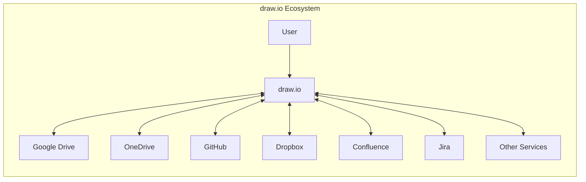
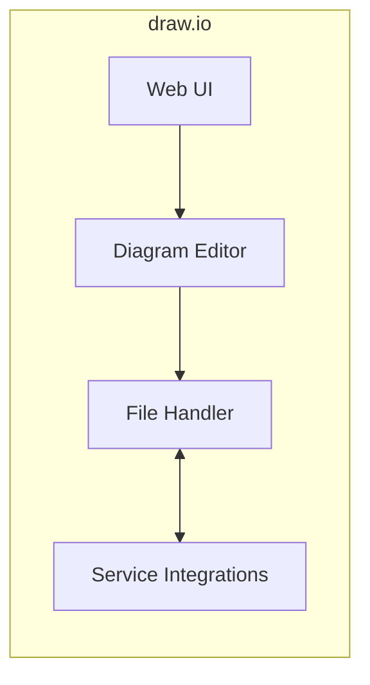
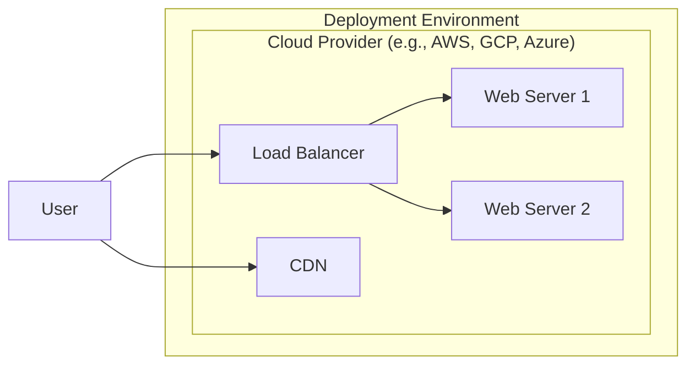
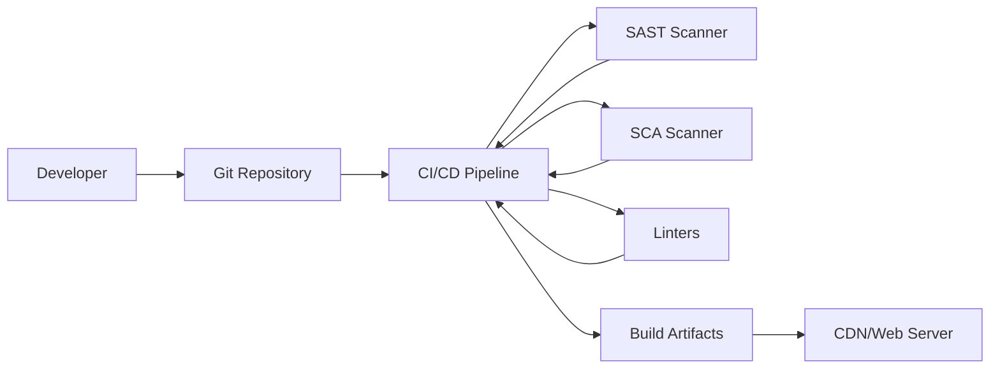

Okay, let's create a design document for the draw.io project based on the provided GitHub repository.

# BUSINESS POSTURE

Business Priorities and Goals:

*   Provide a free, open-source, and high-quality diagramming tool.
*   Offer a versatile platform supporting various diagram types (flowcharts, network diagrams, UML, etc.).
*   Ensure accessibility across different platforms (web, desktop).
*   Maintain a high level of user privacy and data security, especially given the potential for sensitive information within diagrams.
*   Foster a strong community and ecosystem around the project.
*   Provide option for easy integration with different services, like cloud storages, git providers, etc.

Most Important Business Risks:

*   Data breaches or leaks of user diagrams, potentially exposing confidential information.
*   Malicious code injection or vulnerabilities that could compromise user systems.
*   Service downtime or unavailability, disrupting user workflows.
*   Reputational damage due to security incidents or perceived lack of privacy.
*   Supply chain attacks, compromising the integrity of the software.
*   Intellectual property theft or unauthorized use of the codebase.

# SECURITY POSTURE

Existing Security Controls:

*   security control: Content Security Policy (CSP) to mitigate XSS attacks (defined in code and configurable).
*   security control: Subresource Integrity (SRI) for JavaScript dependencies to prevent tampering (used in build process).
*   security control: Regular updates and dependency management to address known vulnerabilities (evident in commit history and dependency files).
*   security control: Use of HTTPS for secure communication (assumed for web deployment).
*   security control: Sandboxing of diagram rendering to isolate potential exploits (mentioned in documentation).
*   security control: Input sanitization to prevent injection attacks (inferred from code and best practices).
*   security control: Option for offline use, reducing reliance on external services and potential attack vectors.
*   security control: Integration with cloud storage providers using OAuth 2.0 for secure authorization (observed in code and integrations).
*   security control: Code reviews and static analysis (inferred from project practices and open-source nature).
*   security control: No default credentials, all integrations require explicit user authorization.

Accepted Risks:

*   accepted risk: Reliance on third-party libraries, introducing potential vulnerabilities (inherent in software development).
*   accepted risk: User-generated content risks, such as malicious links or scripts within diagrams (mitigated by CSP and sandboxing, but not eliminated).
*   accepted risk: Potential for denial-of-service attacks due to resource exhaustion (inherent risk for web applications).
*   accepted risk: Limited control over user environments and client-side security configurations.

Recommended Security Controls:

*   Implement a robust vulnerability disclosure program (VDP) to encourage responsible reporting of security issues.
*   Perform regular penetration testing and security audits to identify and address vulnerabilities proactively.
*   Implement dynamic application security testing (DAST) to complement static analysis.
*   Consider implementing a bug bounty program to incentivize security researchers.
*   Provide clear and accessible security documentation for users and contributors.
*   Implement two-factor authentication (2FA) for administrative access and sensitive operations.
*   Enforce strong password policies and secure storage of user credentials (if applicable).

Security Requirements:

*   Authentication:
    *   No user accounts are managed directly by draw.io itself. Authentication is delegated to integrated services (e.g., Google Drive, OneDrive, GitHub) via OAuth 2.0.
    *   For offline use, no authentication is required.
*   Authorization:
    *   Access control is primarily managed by the integrated services. draw.io relies on the authorization mechanisms of these services to determine user permissions.
    *   Within the application, access to features and functionalities is role-based (e.g., editor, viewer).
*   Input Validation:
    *   All user input, including diagram data, URLs, and configuration settings, must be validated and sanitized to prevent injection attacks (XSS, etc.).
    *   Input validation should be performed both on the client-side (for immediate feedback) and server-side (for security).
*   Cryptography:
    *   HTTPS must be used for all communication between the client and any external services.
    *   Sensitive data stored locally (e.g., in browser storage) should be encrypted if possible.
    *   Cryptographic libraries used should be up-to-date and well-vetted.
*   Data Protection:
    *   Diagram data should be treated as potentially sensitive and protected accordingly.
    *   Users should be provided with clear information about data storage and privacy practices.

# DESIGN

## C4 CONTEXT

Element Descriptions:

*   1.  Name: User
    *   Type: Person
    *   Description: A person who uses draw.io to create and edit diagrams.
    *   Responsibilities: Creating, editing, saving, and loading diagrams.
    *   Security controls: Browser security settings, operating system security.

*   2.  Name: draw.io
    *   Type: Software System
    *   Description: The diagramming application itself.
    *   Responsibilities: Providing the user interface, rendering diagrams, handling file operations, integrating with external services.
    *   Security controls: CSP, SRI, input sanitization, sandboxing, HTTPS.

*   3.  Name: Google Drive
    *   Type: Software System
    *   Description: Cloud storage service provided by Google.
    *   Responsibilities: Storing and retrieving diagram files, managing user authentication and authorization.
    *   Security controls: Google's security infrastructure, OAuth 2.0.

*   4.  Name: OneDrive
    *   Type: Software System
    *   Description: Cloud storage service provided by Microsoft.
    *   Responsibilities: Storing and retrieving diagram files, managing user authentication and authorization.
    *   Security controls: Microsoft's security infrastructure, OAuth 2.0.

*   5.  Name: GitHub
    *   Type: Software System
    *   Description: Web-based hosting service for version control using Git.
    *   Responsibilities: Storing and retrieving diagram files, managing user authentication and authorization.
    *   Security controls: GitHub's security infrastructure, OAuth 2.0.

*   6.  Name: Dropbox
    *   Type: Software System
    *   Description: Cloud storage service.
    *   Responsibilities: Storing and retrieving diagram files, managing user authentication and authorization.
    *   Security controls: Dropbox's security infrastructure, OAuth 2.0.

*   7.  Name: Confluence
    *   Type: Software System
    *   Description: Collaboration and documentation platform.
    *   Responsibilities: Embedding and displaying diagrams within Confluence pages.
    *   Security controls: Atlassian's security infrastructure, OAuth 2.0 (if used for integration).

*   8.  Name: Jira
    *   Type: Software System
    *   Description: Issue tracking and project management software.
    *   Responsibilities: Embedding and displaying diagrams within Jira issues.
    *   Security controls: Atlassian's security infrastructure, OAuth 2.0 (if used for integration).

*   9.  Name: Other Services
    *   Type: Software System
    *   Description: Other services that draw.io can integrate with.
    *   Responsibilities: Varies depending on the service.
    *   Security controls: Varies depending on the service.

## C4 CONTAINER

Element Descriptions:

*   1.  Name: Web UI
    *   Type: Web Application
    *   Description: The user interface of the draw.io application, rendered in the browser.
    *   Responsibilities: Providing the user interface elements, handling user interactions, communicating with the Diagram Editor.
    *   Security controls: CSP, browser security features.

*   2.  Name: Diagram Editor
    *   Type: JavaScript Library
    *   Description: The core component responsible for rendering and editing diagrams.
    *   Responsibilities: Rendering diagrams, handling user input, managing diagram state, interacting with the File Handler.
    *   Security controls: Input sanitization, sandboxing.

*   3.  Name: File Handler
    *   Type: JavaScript Component
    *   Description: Component responsible for handling file operations (saving, loading, importing, exporting).
    *   Responsibilities: Reading and writing diagram files, interacting with the Service Integrations component.
    *   Security controls: Input validation, secure communication with external services.

*   4.  Name: Service Integrations
    *   Type: JavaScript Component
    *   Description: Component responsible for interacting with external services (e.g., cloud storage providers).
    *   Responsibilities: Authenticating with external services, sending and receiving data, handling API calls.
    *   Security controls: OAuth 2.0, HTTPS, secure handling of API keys and tokens.

## DEPLOYMENT

Possible Deployment Solutions:

1.  Web Application (draw.io online): Deployed to a web server and accessed through a browser.
2.  Desktop Application (draw.io desktop): Packaged as a standalone application using Electron and installed locally.
3.  Embedded Application: Integrated into other applications (e.g., Confluence, Jira) via plugins or extensions.

Chosen Deployment Solution (Web Application):

Element Descriptions:

*   1.  Name: User
    *   Type: Person
    *   Description: A person accessing draw.io through a web browser.
    *   Responsibilities: Interacting with the web application.
    *   Security controls: Browser security settings, operating system security.

*   2.  Name: Load Balancer
    *   Type: Infrastructure
    *   Description: Distributes incoming traffic across multiple web servers.
    *   Responsibilities: Ensuring high availability and scalability.
    *   Security controls: DDoS protection, SSL termination.

*   3.  Name: Web Server 1 & 2
    *   Type: Infrastructure
    *   Description: Servers hosting the draw.io web application.
    *   Responsibilities: Serving static files (HTML, CSS, JavaScript), handling API requests.
    *   Security controls: Firewall, intrusion detection system, regular security updates.

*   4.  Name: CDN
    *   Type: Infrastructure
    *   Description: Content Delivery Network, caching static assets closer to the users.
    *   Responsibilities: Improving performance and reducing latency.
    *   Security controls: DDoS protection, SSL.

## BUILD

Build Process Description:

1.  Developers write code and push changes to the Git repository (GitHub).
2.  A CI/CD pipeline (e.g., GitHub Actions, Jenkins) is triggered by the push event.
3.  The pipeline checks out the code and performs various build steps:
    *   Static Application Security Testing (SAST): Scans the codebase for potential security vulnerabilities.
    *   Software Composition Analysis (SCA): Identifies and analyzes third-party dependencies for known vulnerabilities.
    *   Linters: Enforce code style and identify potential errors.
    *   Build: Compiles and packages the application into build artifacts (e.g., HTML, CSS, JavaScript files).
4.  If all checks pass, the build artifacts are deployed to the target environment (e.g., CDN, web server).

Security Controls:

*   security control: SAST scanning to identify vulnerabilities in the codebase.
*   security control: SCA scanning to manage and mitigate risks associated with third-party dependencies.
*   security control: Linters to enforce code quality and prevent common errors.
*   security control: Automated build process to ensure consistency and reduce manual errors.
*   security control: Code signing (for desktop application) to verify the authenticity and integrity of the software.
*   security control: Use of signed commits in Git to ensure the integrity of the codebase.

# RISK ASSESSMENT

Critical Business Processes:

*   Diagram creation and editing: The core functionality of the application.
*   Data storage and retrieval: Ensuring users can access their diagrams.
*   Integration with external services: Providing seamless workflows with other tools.

Data Sensitivity:

*   Diagram data: Can range from low sensitivity (public diagrams) to high sensitivity (confidential business information).
*   User credentials (for integrated services): High sensitivity, as they provide access to user accounts.
*   API keys and tokens: High sensitivity, as they provide access to external services.

# QUESTIONS & ASSUMPTIONS

Questions:

*   What specific cloud provider(s) are used for hosting the web application?
*   What are the specific SAST and SCA tools used in the CI/CD pipeline?
*   Are there any specific compliance requirements (e.g., GDPR, HIPAA) that need to be considered?
*   What is the process for handling security incidents and vulnerabilities?
*   Is there a formal threat model in place for draw.io?
*   What is logging and monitoring strategy?

Assumptions:

*   The web application is hosted on a reputable cloud provider with robust security infrastructure.
*   The CI/CD pipeline is configured securely and follows best practices.
*   Developers are trained in secure coding practices.
*   Regular security updates are applied to the application and its dependencies.
*   Users are responsible for securing their own accounts and devices.
*   draw.io doesn't store user passwords, and use OAuth 2.0 for authentication.