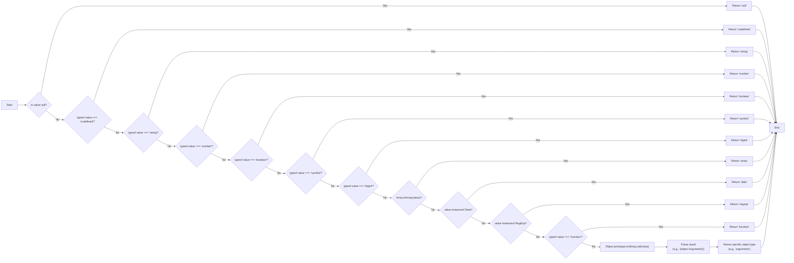
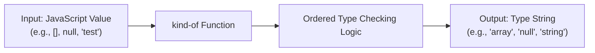

# Project Design Document: kind-of Library

**Version:** 1.1
**Date:** October 26, 2023
**Author:** Gemini (AI Language Model)

## 1. Introduction

This document provides an enhanced design overview of the `kind-of` JavaScript library, located at [https://github.com/jonschlinkert/kind-of](https://github.com/jonschlinkert/kind-of). This document aims to provide a clear and detailed understanding of the library's functionality, architecture, and data flow, specifically tailored for subsequent threat modeling activities. It builds upon the previous version with added clarity and emphasis on security considerations.

## 2. Project Overview

The `kind-of` library is a lightweight yet powerful JavaScript utility designed for accurate identification of the native JavaScript type of any given value. It offers a more precise and nuanced type detection mechanism compared to the standard `typeof` operator, particularly when distinguishing between various object types (e.g., plain objects vs. instances of custom classes). This library is a common dependency in other JavaScript projects where robust type checking and validation are required.

## 3. Goals and Objectives

*   **Primary Goal:** To reliably and accurately determine the native JavaScript type of any input value.
*   **Secondary Goals:**
    *   To provide more granular and accurate type identification than the built-in `typeof` operator, especially for objects.
    *   To maintain a minimal footprint and avoid external dependencies for ease of integration and reduced risk.
    *   To offer a simple, intuitive, and easily understandable API for developers.
    *   To be performant and avoid introducing significant overhead in applications.

## 4. Architecture and Design

The `kind-of` library's core functionality resides within a single function that accepts a single argument (the value to be type-checked) and returns a string representing its determined type. The internal logic employs a cascading series of checks, prioritizing specific and reliable methods for type identification.

*   **Entry Point:** The primary function serves as the entry point. It receives the input value and initiates the type determination process.

*   **Ordered Type Checks:** The function implements a specific order of checks to accurately identify the type:
    *   **Null Check:**  The first check is for `null`, as `typeof null` returns "object".
    *   **Undefined Check:** Checks for `undefined`.
    *   **Primitive Typeof Check:** Utilizes the `typeof` operator for standard primitive types: "string", "number", "boolean", "symbol", and "bigint".
    *   **Object Type Checks:** For values that are not null or primitive, more specific checks are performed:
        *   **Array Check:** Uses `Array.isArray()` for accurate array identification.
        *   **Date Check:**  Uses the `instanceof Date` operator.
        *   **RegExp Check:** Uses the `instanceof RegExp` operator.
        *   **Function Check:** Uses `typeof value === 'function'`.
        *   **Object.prototype.toString.call() Fallback:**  For other objects, it uses `Object.prototype.toString.call()` to get a more specific type string (e.g., "[object Arguments]", "[object Map]", "[object Set]"). This helps differentiate between plain objects and other built-in object types.

*   **Return Value:** The function returns a lowercase string representing the determined type. Examples include "string", "array", "date", "regexp", "null", "undefined", "arguments", "map", "set", and "object" for plain objects.

## 5. Data Flow

The data flow within the `kind-of` library is simple and direct:

*   **Input:** A single JavaScript value of any type is passed as an argument to the main function. Examples include: `null`, `"hello"`, `123`, `true`, `[]`, `new Date()`, `/abc/`, `function() {}`, `{}`.
*   **Processing:** The `kind-of` function executes its internal, ordered type checking logic. For instance, if the input is `[]`, it will pass the `Array.isArray()` check and proceed no further. If the input is a plain object `{}` it will likely reach the `Object.prototype.toString.call()` check.
*   **Output:** A lowercase string representing the determined type of the input value is returned. Examples of outputs include: `"null"`, `"string"`, `"number"`, `"boolean"`, `"array"`, `"date"`, `"regexp"`, `"function"`, `"object"`.

## 6. Security Considerations

While `kind-of` is a focused utility with a small attack surface, it's crucial to consider potential security implications, especially when used in security-sensitive contexts.

*   **Input Handling and Robustness:** Although designed to handle any JavaScript value, the library's internal logic must be robust against unexpected or maliciously crafted inputs that could potentially cause errors or unexpected behavior. For example, while unlikely, extremely large or deeply nested objects could theoretically impact performance. The library should gracefully handle such edge cases without crashing or throwing unhandled exceptions.

*   **Information Disclosure (Low Risk):** The detailed type information provided by `kind-of` could, in very specific and unusual scenarios, reveal minor implementation details or internal structures of an application. However, this is generally considered a very low-risk concern for a type-checking utility. The benefit of accurate type detection usually outweighs this minimal risk.

*   **Denial of Service (Very Low Risk):** Given the simplicity and efficiency of the type-checking logic, it's highly improbable that providing specific input values to `kind-of` could lead to significant performance degradation or a denial-of-service condition. The operations performed are generally lightweight.

*   **Dependency Chain Vulnerabilities (Indirect):** Although `kind-of` itself has no runtime dependencies, vulnerabilities in projects that *depend* on `kind-of` could indirectly affect systems using it. Therefore, maintaining awareness of vulnerabilities in the broader dependency tree is important.

*   **Type Confusion Vulnerabilities (Mitigation):**  The primary purpose of `kind-of` is to *prevent* type confusion vulnerabilities in applications that rely on accurate type checking. By providing a more reliable way to determine types, it helps developers write safer code.

## 7. Deployment Considerations

The `kind-of` library is typically deployed as a dependency within other JavaScript projects, both in browser and Node.js environments.

*   **Installation:** Installed via standard package managers like npm or yarn using commands such as `npm install kind-of` or `yarn add kind-of`.
*   **Usage:** Imported and utilized as a regular JavaScript function within the consuming project's code. Examples:
    *   `const kindOf = require('kind-of');` (Node.js)
    *   `import kindOf from 'kind-of';` (Modern JavaScript with module support)
*   **Context:** Commonly used in data validation, input sanitization, and conditional logic where precise type checking is necessary.

## 8. Dependencies

The `kind-of` library has **zero runtime dependencies**. This is a significant advantage from a security perspective, as it reduces the attack surface and eliminates the risk of vulnerabilities arising from dependent libraries.

## 9. Future Considerations

*   **Performance Benchmarking:**  Regular performance benchmarking to ensure the library remains efficient as JavaScript engines evolve.
*   **Potential for Edge Case Refinement:** Continuously review and refine the type checking logic to handle any newly introduced or unusual edge cases in JavaScript.
*   **TypeScript Enhancements:** Maintain and potentially enhance TypeScript definition files to provide even better type safety for TypeScript users.

This enhanced design document provides a more detailed and security-focused overview of the `kind-of` library. It serves as a solid foundation for conducting thorough threat modeling and understanding the library's role within the broader ecosystem of JavaScript applications.