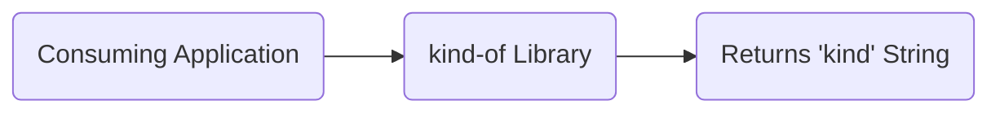
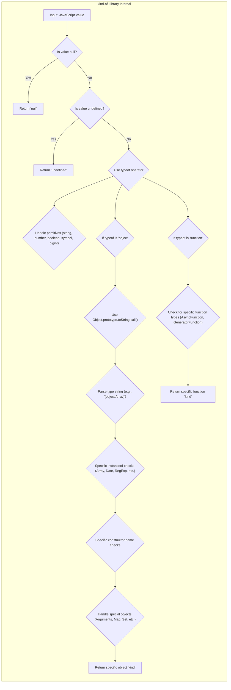
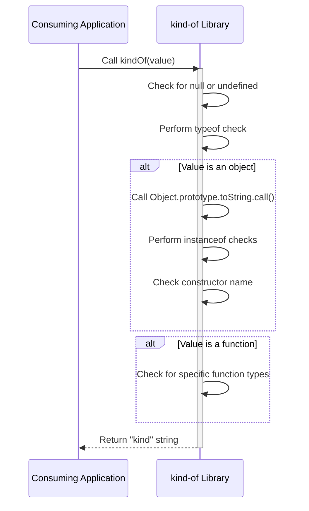

# Project Design Document: kind-of Library

**Version:** 1.1
**Date:** October 26, 2023
**Author:** AI Software Architect

## 1. Introduction

This document provides an enhanced design overview of the `kind-of` JavaScript library, available at [https://github.com/jonschlinkert/kind-of](https://github.com/jonschlinkert/kind-of). This revised document aims to provide an even clearer and more detailed articulation of the library's architecture, functionality, and data flow to facilitate robust threat modeling activities. It serves as a refined reference point for understanding the system's components and their interactions, enabling a more comprehensive security analysis.

## 2. Goals and Objectives

The primary goal of this design document remains to provide a clear and comprehensive understanding of the `kind-of` library's design for security analysis and threat modeling. Specific objectives include:

*   Clearly describing the library's core functionality and purpose with illustrative examples.
*   Illustrating the high-level and detailed architecture of the library with greater specificity regarding internal checks.
*   Mapping the flow of data within the library with a more precise sequence diagram.
*   Identifying key components and their interactions with detailed descriptions.
*   Providing a stronger foundation for identifying potential security vulnerabilities by elaborating on potential attack vectors.

## 3. System Overview

The `kind-of` library is a lightweight yet powerful JavaScript utility designed to accurately determine the "kind" of a JavaScript value. It surpasses the limitations of the standard `typeof` operator by offering more precise and reliable type identification for a wide range of JavaScript data types, encompassing primitives, various object types, and built-in objects. Its intended use is as a performant and dependable dependency for other JavaScript projects that require thorough and accurate type checking. For instance, it can distinguish between plain objects and instances of custom classes, which `typeof` cannot.

## 4. Architectural Design

### 4.1. High-Level Architecture

The `kind-of` library functions as an independent module that is imported and utilized by external JavaScript applications. It accepts a JavaScript value as input and returns a string that represents the precisely determined "kind" of that value.

*   **Consuming Application:** Any JavaScript application or module that imports and invokes the `kindOf` function from the `kind-of` library.
*   **kind-of Library:** The central module responsible for the core logic of determining the type of the input value.
*   **Returns 'kind' String:** The output of the library, which is a string accurately representing the identified type (e.g., "string", "array", "date", "regexp", "arguments", "map", "set", "weakmap", "weakset", "promise", "buffer", "error", etc.).

### 4.2. Detailed Architecture

Internally, the `kind-of` library employs a carefully ordered series of checks and conditional logic to accurately identify the type of the input value. This process likely involves a combination of the following techniques:

*   **Null and Undefined Check:** The first step is typically to check if the input value is `null` or `undefined`.
*   **`typeof` Operator Utilization:** The built-in `typeof` operator is used for initial, basic type identification of primitives.
*   **`Object.prototype.toString.call()` Method:** This method is crucial for obtaining a more specific object type string, especially for built-in objects. For example, `Object.prototype.toString.call([])` returns `"[object Array]"`.
*   **`instanceof` Operator Application:** The `instanceof` operator is used to check the prototype chain of objects, helping to identify instances of specific constructors (e.g., `value instanceof Array`).
*   **Constructor Name Inspection:**  The `constructor.name` property of an object can be inspected to further refine type identification, particularly for custom objects.
*   **Specific Checks for Built-in Objects:** Dedicated logic is implemented to identify specific built-in object types like `Date`, `RegExp`, `Array`, `Map`, `Set`, `WeakMap`, `WeakSet`, `Promise`, `Buffer`, and `Error` objects.
*   **Handling of Arguments Object:** Specific checks are likely in place to correctly identify the `arguments` object.
*   **Edge Case Handling:** The library likely includes logic to handle various edge cases and ensure accurate identification across different JavaScript environments.

*   **Input: JavaScript Value:** The value passed as an argument to the `kindOf()` function.
*   **Is value null?:**  A check to determine if the input is `null`.
*   **Return 'null':** The output when the input is `null`.
*   **Is value undefined?:** A check to determine if the input is `undefined`.
*   **Return 'undefined':** The output when the input is `undefined`.
*   **Use typeof operator:**  Utilizing the built-in `typeof` operator for basic type detection.
*   **Handle primitives (string, number, boolean, symbol, bigint):** Logic to identify and return the kind of primitive values.
*   **If typeof is 'object':**  Branch for handling values identified as objects by `typeof`.
*   **Use Object.prototype.toString.call():** Employing this method for more accurate object type identification.
*   **Parse type string (e.g., '[object Array]'):** Extracting the type information from the string returned by `Object.prototype.toString.call()`.
*   **Specific instanceof checks (Array, Date, RegExp, etc.):** Using `instanceof` to check against specific built-in constructors.
*   **Specific constructor name checks:** Examining the `constructor.name` property for further type refinement.
*   **Handle special objects (Arguments, Map, Set, etc.):** Specific logic to identify these object types.
*   **Return specific object 'kind':** The output for various object types (e.g., 'array', 'date', 'regexp', 'map', 'set').
*   **If typeof is 'function':** Specific handling for values identified as functions by `typeof`.
*   **Check for specific function types (AsyncFunction, GeneratorFunction):** Identifying different kinds of functions.
*   **Return specific function 'kind':** The output for different function types (e.g., 'function', 'asyncfunction', 'generatorfunction').

## 5. Data Flow

The data flow within the `kind-of` library is a sequential process of type checking:

1. A JavaScript value is provided as an argument to the `kindOf(value)` function.
2. The function initiates a series of type checks, starting with null and undefined checks.
3. Based on the initial checks, the flow proceeds to `typeof` checks for primitives.
4. For objects, `Object.prototype.toString.call()` is used, followed by `instanceof` and constructor name checks.
5. Specific logic handles built-in objects and special object types.
6. Finally, the function returns a string accurately representing the determined "kind" of the input value.

## 6. Key Components

*   **`kindOf(val)` function:** This is the primary and sole public function of the library. It accepts a single JavaScript value as input and orchestrates the type checking process.
*   **Type checking logic:** This encompasses the core internal logic of the library, consisting of a series of conditional statements and checks designed to accurately determine the value's type. This logic includes:
    *   Explicit checks for `null` and `undefined`.
    *   Invocation and evaluation of the `typeof` operator.
    *   Calling `Object.prototype.toString.call()` and parsing its result.
    *   Application of the `instanceof` operator against various constructors.
    *   Comparison of object constructor names.
    *   Specific handling for built-in objects like `Arguments`, `Map`, `Set`, etc.
*   **Return value:** The function returns a string literal representing the determined "kind" of the input value. This string is consistent and predictable for each JavaScript type.

## 7. Security Considerations (Pre-Threat Model)

While the `kind-of` library is a utility focused on type identification and does not directly handle sensitive data or interact with external systems, security considerations are relevant in the context of its usage within larger applications:

*   **Incorrect Type Identification Leading to Logic Errors:** If the `kind-of` library incorrectly identifies the type of an object due to unforeseen edge cases or vulnerabilities, consuming applications relying on this information for critical logic could experience unexpected behavior or security flaws. For example, if a manipulated object is misidentified as a safe type, security checks might be bypassed.
*   **Prototype Pollution Exploitation:** Although `kind-of` itself doesn't directly manipulate prototypes, if a consuming application uses its output to make decisions about object properties or methods, vulnerabilities related to prototype pollution in other parts of the application could be exacerbated if `kind-of` misidentifies a polluted object.
*   **Regular Expression Denial of Service (ReDoS) (Low Likelihood):** If the internal parsing of the `Object.prototype.toString.call()` output relies on complex regular expressions, there's a theoretical, albeit low, risk of ReDoS if an attacker can craft input that causes the regex to perform excessive backtracking.
*   **Performance Issues with Complex Objects:** While designed to be performant, extremely large or deeply nested objects passed to `kindOf()` could potentially lead to performance degradation or, in extreme cases, stack overflow errors. This could be a concern in denial-of-service scenarios, although JavaScript engines have limitations to mitigate this.
*   **Dependency Chain Vulnerabilities:** Although `kind-of` likely has no runtime dependencies, vulnerabilities in its development dependencies (used for building, testing, etc.) could potentially introduce supply chain risks if an attacker compromises the build process.

## 8. Dependencies

The `kind-of` library strives to be lightweight and typically has **no external runtime dependencies**. This minimizes its footprint and reduces the potential attack surface associated with third-party code. However, it's important to note that development dependencies are likely used for tasks such as:

*   **Testing:** Libraries like `mocha` or `jest`.
*   **Linting:** Tools like `eslint`.
*   **Building/Bundling:** Potentially tools like `rollup` or `webpack` (though less likely for a simple utility).

These development dependencies are typically managed through `npm` or `yarn` and are crucial for the development and maintenance of the library but are not included in the final distributed package.

## 9. Deployment

The `kind-of` library is deployed as a package on the npm registry. Its integration into other JavaScript projects is straightforward:

*   **Installation:** Developers typically install it using a package manager like `npm` (`npm install kind-of`) or `yarn` (`yarn add kind-of`).
*   **Usage:** Once installed, it can be imported and used within JavaScript modules: `const kindOf = require('kind-of');` or `import kindOf from 'kind-of';`.

The deployment process is standard for Node.js libraries and relies on the npm ecosystem.

## 10. Future Considerations

Potential future enhancements or changes to the `kind-of` library that could influence its design and security include:

*   **Support for Emerging JavaScript Types:** As JavaScript evolves and introduces new built-in data types or language features, the library might require updates to accurately identify these new types.
*   **Performance Optimizations:** Continuous efforts to optimize the type checking logic for improved performance, especially when handling complex objects, might be considered.
*   **TypeScript Definitions:** Providing official TypeScript definition files (`.d.ts`) could improve the developer experience and type safety for TypeScript users.
*   **Potential for Configuration (Unlikely):** While currently a straightforward utility, future considerations might explore optional configuration for specific type handling scenarios, though this is less likely given its core purpose.

This enhanced document provides a more detailed and nuanced design overview of the `kind-of` library, offering a stronger foundation for comprehensive threat modeling. By elaborating on the internal architecture, data flow, and potential security considerations, this document aims to facilitate a more thorough security analysis of systems that depend on this widely used utility.