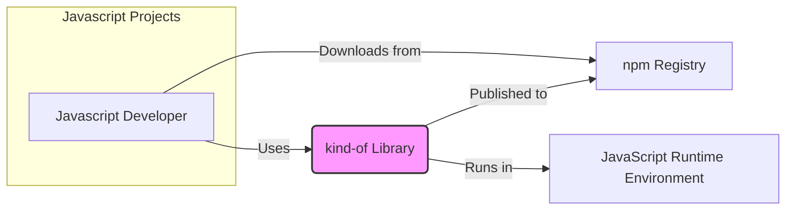
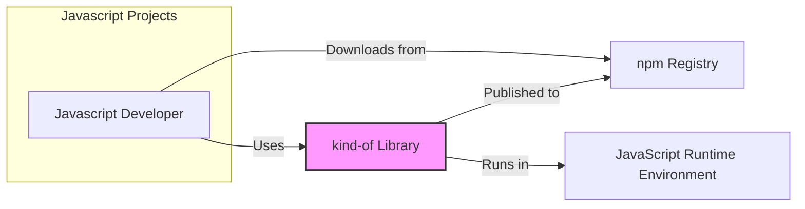
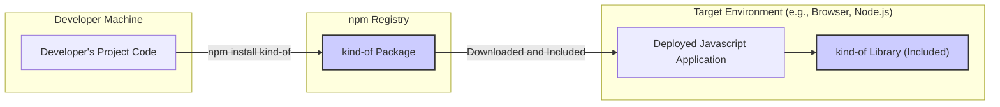
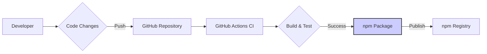

# BUSINESS POSTURE

This project is a Javascript library called `kind-of`. It is designed to accurately determine the type of any Javascript value.

*   Business Priorities and Goals:
    *   Provide a reliable and accurate Javascript type checking utility for developers.
    *   Increase code quality and reduce bugs in Javascript projects by enabling robust type checking.
    *   Promote code reusability and efficiency by offering a well-tested and readily available type checking solution.
    *   Gain adoption and usage within the Javascript developer community.

*   Business Risks:
    *   Incorrect type identification leading to unexpected behavior or bugs in projects that depend on this library.
    *   Lack of maintenance and updates, causing the library to become outdated or incompatible with newer Javascript environments.
    *   Security vulnerabilities within the library code, although less likely for a utility library of this nature, could still impact dependent projects.
    *   Limited adoption if the library is not perceived as reliable, efficient, or well-documented compared to alternative solutions.

# SECURITY POSTURE

*   Existing Security Controls:
    *   security control: Code review by maintainers (inferred from open source nature and contribution model). Implemented during pull request reviews on GitHub.
    *   security control: Unit tests to ensure functionality and catch regressions. Described in repository's testing setup and visible in CI workflows.
    *   accepted risk: Limited formal security testing or dedicated security audits. Accepted due to the nature of a small utility library and community-driven development.
    *   accepted risk: Reliance on community contributions for identifying and reporting security issues. Accepted due to resource constraints and open-source development model.

*   Recommended Security Controls:
    *   security control: Implement automated static analysis security testing (SAST) in the CI/CD pipeline to identify potential code-level vulnerabilities.
    *   security control: Integrate dependency scanning to monitor for known vulnerabilities in any external dependencies (though this library appears to have none).
    *   security control: Establish a clear process for reporting and handling security vulnerabilities, including a security policy and contact information.
    *   security control: Regularly update dependencies and review code for potential security improvements.

*   Security Requirements:
    *   Authentication: Not applicable. This library is a utility and does not handle user authentication.
    *   Authorization: Not applicable. This library does not manage access control or authorization.
    *   Input Validation:
        *   Requirement: The library must handle all possible Javascript value types as input without crashing or producing unexpected errors.
        *   Requirement: Input validation should be performed internally to ensure robustness and prevent unexpected behavior due to malformed or unusual inputs.
    *   Cryptography: Not applicable. This library does not involve cryptographic operations or handle sensitive data requiring encryption.

# DESIGN

## C4 CONTEXT

*   C4 Context Elements:
    *   Element:
        *   Name: Javascript Developer
        *   Type: Person
        *   Description: Developers who use the `kind-of` library in their Javascript projects to perform type checking.
        *   Responsibilities: Integrate the `kind-of` library into their projects, use its API to check variable types, and report any issues or bugs.
        *   Security controls: Responsible for securely integrating and using the library within their own projects, following best practices for software development.
    *   Element:
        *   Name: kind-of Library
        *   Type: Software System
        *   Description: A Javascript library that provides functions to accurately determine the type of any Javascript value.
        *   Responsibilities: Accurately identify the type of Javascript values, provide a simple and easy-to-use API, and maintain compatibility with various Javascript environments.
        *   Security controls: Input validation within the library to handle various Javascript value types safely, unit tests to ensure functional correctness and prevent regressions.
    *   Element:
        *   Name: npm Registry
        *   Type: External System
        *   Description: A public registry for Javascript packages, used to distribute and manage the `kind-of` library.
        *   Responsibilities: Host and distribute the `kind-of` library package, manage versions, and provide access for developers to download and install the library.
        *   Security controls: npm registry implements security controls to protect packages from tampering and malware, including package signing and vulnerability scanning.
    *   Element:
        *   Name: JavaScript Runtime Environment
        *   Type: Environment
        *   Description: The environment in which Javascript code, including the `kind-of` library, is executed (e.g., web browsers, Node.js).
        *   Responsibilities: Execute Javascript code, provide necessary APIs and functionalities for Javascript programs to run.
        *   Security controls: Security controls are provided by the runtime environment itself, such as browser security policies, sandboxing, and Node.js security features.

## C4 CONTAINER

*   C4 Container Elements:
    *   Element:
        *   Name: kind-of Library
        *   Type: Library
        *   Description:  The `kind-of` Javascript library, consisting of Javascript modules and code to perform type checking. It is distributed as an npm package.
        *   Responsibilities: Implement type checking logic, expose functions for developers to use, and handle different Javascript value types.
        *   Security controls: Input validation within the library's functions, unit tests to ensure correct functionality, and potentially static analysis security scanning during development.

## DEPLOYMENT

Deployment for this library is straightforward as it is distributed as an npm package. Developers install it into their projects using package managers like npm or yarn.

*   Deployment Elements:
    *   Element:
        *   Name: Developer's Project Code
        *   Type: Codebase
        *   Description: The Javascript project being developed by a developer, which will utilize the `kind-of` library.
        *   Responsibilities: Integrate and use the `kind-of` library correctly within the project's codebase.
        *   Security controls: Secure coding practices within the developer's project, dependency management to ensure integrity of included libraries.
    *   Element:
        *   Name: kind-of Package
        *   Type: Package
        *   Description: The packaged and published version of the `kind-of` library available on the npm registry.
        *   Responsibilities: Be available for download and installation via npm, contain all necessary code and metadata for the library.
        *   Security controls: Package signing and integrity checks by npm registry, potential vulnerability scanning of packages on the registry.
    *   Element:
        *   Name: Deployed Javascript Application
        *   Type: Application
        *   Description: The final Javascript application deployed to a target environment (browser, Node.js server, etc.), which includes the `kind-of` library as a dependency.
        *   Responsibilities: Execute the application code, including the `kind-of` library, in the target environment.
        *   Security controls: Security controls of the target environment itself (browser security policies, server security configurations), and secure deployment practices for the application.
    *   Element:
        *   Name: kind-of Library (Included)
        *   Type: Library Instance
        *   Description: An instance of the `kind-of` library running as part of the deployed Javascript application.
        *   Responsibilities: Perform type checking operations when called by the application code.
        *   Security controls: Inherits security controls from the library itself (input validation, unit tests) and the security context of the deployed application.

## BUILD

The build process for this project likely involves standard Javascript library build steps, potentially using npm scripts and GitHub Actions for CI.

*   Build Elements:
    *   Element:
        *   Name: Developer
        *   Type: Person
        *   Description: A developer working on the `kind-of` library, making code changes and improvements.
        *   Responsibilities: Write code, fix bugs, add new features, and ensure code quality.
        *   Security controls: Secure development practices, code review before committing changes.
    *   Element:
        *   Name: GitHub Repository
        *   Type: Code Repository
        *   Description: The Git repository hosted on GitHub that stores the source code of the `kind-of` library.
        *   Responsibilities: Version control, code storage, collaboration platform for development.
        *   Security controls: Access control to the repository, branch protection, audit logs.
    *   Element:
        *   Name: GitHub Actions CI
        *   Type: CI/CD System
        *   Description: GitHub's built-in CI/CD service used to automate the build, test, and potentially deployment processes for the library.
        *   Responsibilities: Automate build and test workflows, run linters and static analysis, and potentially publish the package.
        *   Security controls: Secure workflow definitions, secrets management for API keys, and access control to CI/CD pipelines.
    *   Element:
        *   Name: Build & Test
        *   Type: Build Process
        *   Description: The automated process of compiling (if necessary), bundling, and running tests for the `kind-of` library.
        *   Responsibilities: Compile code, run unit tests, perform code quality checks (linting, static analysis).
        *   Security controls: Running SAST tools during build, dependency scanning, ensuring build process integrity.
    *   Element:
        *   Name: npm Package
        *   Type: Build Artifact
        *   Description: The packaged version of the `kind-of` library created during the build process, ready for publishing to the npm registry.
        *   Responsibilities: Contain all necessary code and metadata for distribution, be a valid npm package format.
        *   Security controls: Package integrity checks, signing of the package (if implemented).
    *   Element:
        *   Name: npm Registry
        *   Type: Package Registry
        *   Description: The public npm registry where the `kind-of` package is published and made available for developers to download.
        *   Responsibilities: Host and distribute the package, manage versions, and provide access for developers.
        *   Security controls: Package signing, vulnerability scanning, and security measures to protect the registry itself.

# RISK ASSESSMENT

*   Critical Business Processes:
    *   Maintaining the integrity and availability of the `kind-of` library on the npm registry.
    *   Ensuring the accuracy and reliability of the type checking functionality provided by the library.
    *   Supporting the Javascript developer community by providing a useful and well-maintained utility.

*   Data Sensitivity:
    *   The `kind-of` library itself does not handle sensitive data.
    *   The data processed by the library is the Javascript values passed as input for type checking, which can be of any type and sensitivity depending on the context of use in consuming projects.
    *   The library's source code and build artifacts are considered public and are stored in a public GitHub repository and npm registry.

# QUESTIONS & ASSUMPTIONS

*   Questions:
    *   Are there any specific industries or applications where the `kind-of` library is considered particularly critical or used in security-sensitive contexts?
    *   Are there any known vulnerabilities or past security incidents related to the `kind-of` library or similar type checking utilities?
    *   What is the expected level of security assurance required for this library? Is it intended for use in highly regulated or security-critical environments?

*   Assumptions:
    *   The primary goal of the `kind-of` library is to provide a general-purpose, accurate, and reliable Javascript type checking utility for the broader Javascript developer community.
    *   Security is important but is secondary to functionality and ease of use for a utility library of this nature.
    *   The library is intended to be distributed and used in public Javascript projects and environments.
    *   The development and maintenance of the library are primarily community-driven, with reliance on open-source best practices and community contributions for security.