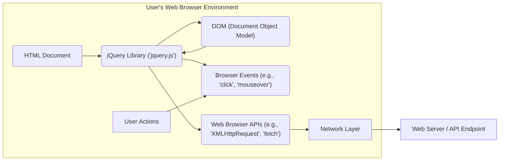
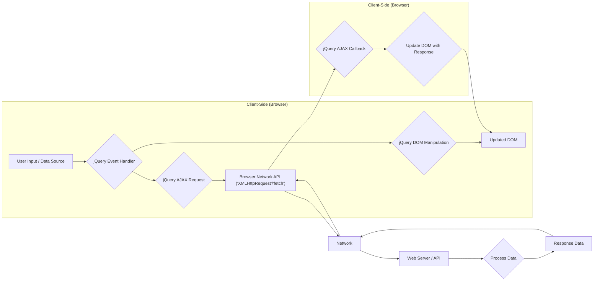

# Project Design Document: jQuery Library

**Version:** 1.1
**Date:** October 26, 2023
**Author:** AI Software Architect

## 1. Introduction

This document provides a detailed design overview of the jQuery JavaScript library, specifically tailored for threat modeling purposes. It outlines the core functionalities, architecture, data flow, and critical security considerations relevant for identifying potential vulnerabilities and attack vectors. This document serves as a foundational resource for security assessments and threat modeling exercises.

## 2. Goals and Objectives (Threat Modeling Perspective)

From a threat modeling perspective, understanding jQuery's goals and objectives helps identify potential misuse or vulnerabilities. The primary goals of the jQuery library are:

*   **Simplified DOM Manipulation:**  This introduces potential risks if user input influences DOM manipulation without proper sanitization, leading to XSS.
*   **Simplified Event Handling:**  Improperly handled events or the ability to inject malicious event handlers can be an attack vector.
*   **Animation Effects:** While seemingly benign, the logic behind animations could be manipulated in unexpected ways or contribute to denial-of-service.
*   **AJAX Interactions:**  AJAX functionality introduces risks related to data exchange with servers, including injection vulnerabilities, insecure data transfer, and CORS issues.
*   **Cross-Browser Compatibility:**  While a benefit, ensuring consistent security across different browsers can be challenging, and browser-specific vulnerabilities might interact with jQuery.
*   **Utility Functions:**  The utility functions themselves might have subtle vulnerabilities or be misused in insecure ways.

## 3. Architectural Overview

jQuery is a client-side JavaScript library executed within the user's web browser. It interacts directly with the Document Object Model (DOM) and browser APIs.

**Component Descriptions:**

*   **'HTML Document'**: The webpage where the jQuery library is included and executed. This is the primary context for jQuery's operations.
*   **'jQuery Library ('jquery.js')'**: The core JavaScript file containing all of jQuery's functionalities. This is the component under scrutiny for potential vulnerabilities.
*   **'DOM (Document Object Model)'**: The tree-like representation of the HTML document. jQuery manipulates this structure, making it a key target for XSS attacks.
*   **'Browser Events (e.g., 'click', 'mouseover')'**: User interactions and browser-generated events that trigger jQuery event handlers. Malicious scripts could try to trigger or intercept these events.
*   **'Web Browser APIs (e.g., 'XMLHttpRequest', 'fetch')'**:  Browser-provided interfaces used by jQuery for making network requests. These are potential points for vulnerabilities related to data transmission and server interaction.
*   **'User Actions'**: Interactions performed by the user, which can trigger JavaScript code, including jQuery event handlers.
*   **'Network Layer'**: The underlying network infrastructure used for communication between the browser and the web server.
*   **'Web Server / API Endpoint'**: The remote server that jQuery interacts with for data retrieval or submission via AJAX. This is a potential source of vulnerabilities if not properly secured.

## 4. Data Flow (Threat Modeling Perspective)

Understanding the data flow helps identify where malicious data could be injected or where vulnerabilities might be exploited.

**Detailed Data Flow Description for Threat Modeling:**

*   **'User Input / Data Source'**: Data originating from user interactions (form fields, URL parameters, etc.) or other client-side sources. This is a primary entry point for potentially malicious data.
*   **'jQuery Event Handler'**: jQuery functions that respond to events. Vulnerabilities here could allow attackers to execute arbitrary code by triggering specific events with crafted data.
*   **'jQuery DOM Manipulation'**: jQuery functions used to modify the structure and content of the DOM. If user-controlled data is used here without sanitization, it can lead to Cross-Site Scripting (XSS).
*   **'Updated DOM'**: The modified DOM, which can now contain malicious scripts if DOM manipulation was not done securely.
*   **'jQuery AJAX Request'**: jQuery's functions for making asynchronous HTTP requests. Malicious actors could manipulate these requests to send unintended data or access unauthorized resources.
*   **'Browser Network API ('XMLHttpRequest'/'fetch')'**: The browser's built-in APIs used by jQuery for network communication. Vulnerabilities here are less about jQuery itself but about the browser's implementation.
*   **'Network'**: The communication channel, susceptible to eavesdropping or man-in-the-middle attacks if not secured with HTTPS.
*   **'Web Server / API'**: The backend server processing requests. Vulnerabilities on the server-side can be exploited through jQuery AJAX calls.
*   **'Process Data'**: Server-side logic that handles the incoming data. Server-side input validation is crucial to prevent attacks.
*   **'Response Data'**: Data sent back from the server. If this data is not properly handled on the client-side, it can introduce vulnerabilities.
*   **'jQuery AJAX Callback'**: Functions executed when an AJAX response is received. Improper handling of the response data can lead to vulnerabilities.
*   **'Update DOM with Response'**:  jQuery updating the DOM with data received from the server. This is another critical point where unsanitized data can lead to XSS.

## 5. Key Components and Functionality (Security Implications)

*   **Selectors:** While powerful, using user-provided input directly in selectors can lead to unintended consequences or even security vulnerabilities if not carefully handled.
    *   Example: `$(userInput)` - if `userInput` is `""`, it will execute script.
*   **DOM Manipulation Methods (`.html()`, `.append()`, etc.):** These are primary vectors for XSS if used with unsanitized user input.
    *   Using `.text()` is generally safer for displaying plain text.
*   **Event Handling (`.on()`, `.click()`, etc.):**  Care must be taken to prevent the injection of malicious event handlers or the triggering of unintended actions.
    *   Ensure event handlers are properly scoped and do not inadvertently expose sensitive functionality.
*   **AJAX Methods (`.ajax()`, `.get()`, `.post()`):**  These introduce risks related to:
    *   **Cross-Site Request Forgery (CSRF):** Ensure proper anti-CSRF tokens are used for state-changing requests.
    *   **Cross-Origin Resource Sharing (CORS):** Misconfigured CORS policies can expose APIs to unintended origins.
    *   **Insecure Data Transmission:**  Always use HTTPS to encrypt data in transit.
    *   **Server-Side Vulnerabilities:** jQuery can be used to exploit vulnerabilities on the backend if input is not validated server-side.
*   **Utility Functions:** Some utility functions, if misused, could have security implications. For example, improper use of `$.parseJSON()` with untrusted data could lead to vulnerabilities.

## 6. Security Considerations (Expanded)

*   **Cross-Site Scripting (XSS):**  The most significant security risk associated with jQuery.
    *   **DOM-based XSS:** Occurs when the vulnerability is in the client-side script itself. jQuery's DOM manipulation functions are often involved.
        *   Example: `$("#result").html(location.hash.substring(1));` - if the URL is `#`.
    *   **Reflected XSS:**  Occurs when user-provided data is included in the server's response without proper sanitization and then rendered by the browser. jQuery might be used to display this unsanitized data.
    *   **Stored XSS:**  Occurs when malicious data is stored on the server and then displayed to other users. jQuery might be used to render this stored malicious content.
    *   **Mitigation:**  Always sanitize user input before inserting it into the DOM. Use methods like `.text()` for plain text or employ robust sanitization libraries.
*   **Dependency Vulnerabilities:** While jQuery's core has been relatively stable, vulnerabilities can be discovered.
    *   **Mitigation:** Keep jQuery updated to the latest stable version. Use tools to scan for known vulnerabilities in dependencies.
*   **Third-Party Plugin Vulnerabilities:** Projects often use jQuery plugins, which can introduce their own security flaws.
    *   **Mitigation:**  Carefully vet third-party plugins before using them. Keep plugins updated.
*   **AJAX Security Vulnerabilities:**
    *   **CSRF:**  Ensure proper anti-CSRF tokens are implemented for state-changing requests.
    *   **CORS Misconfiguration:**  Restrict allowed origins to prevent unauthorized access to APIs.
    *   **Insecure Data Transfer:** Always use HTTPS.
    *   **Server-Side Injection Flaws:** jQuery can be used to trigger SQL injection, command injection, etc., if server-side input validation is lacking.
*   **Selector Injection:**  Treat user input intended for use in jQuery selectors as untrusted.
    *   **Mitigation:** Avoid directly using user input in selectors. If necessary, use whitelisting or other input validation techniques.
*   **Prototype Pollution:** While not directly a jQuery vulnerability, malicious scripts could potentially pollute JavaScript prototypes, affecting jQuery's behavior or introducing vulnerabilities.
    *   **Mitigation:** Be mindful of the risks of prototype pollution and implement appropriate safeguards.
*   **Supply Chain Attacks:**  Ensure jQuery is loaded from trusted sources (official CDN or self-hosted with integrity checks).
    *   **Mitigation:** Use Subresource Integrity (SRI) hashes when including jQuery from CDNs.
*   **Error Handling:**  Improper error handling in jQuery event handlers or AJAX callbacks could potentially leak sensitive information or lead to unexpected behavior.
    *   **Mitigation:** Implement robust error handling and avoid exposing sensitive details in error messages.

## 7. Dependencies

*   **Browser Environment:**  Fundamentally dependent on the browser's JavaScript engine and DOM implementation. Browser vulnerabilities can indirectly affect jQuery.
*   **No Mandatory External Runtime Dependencies:**  jQuery itself doesn't require other JavaScript libraries to run.
*   **Optional Plugins:**  Projects may include various jQuery plugins, each with its own potential dependencies and security considerations.

## 8. Deployment (Security Considerations)

*   **Content Delivery Networks (CDNs):** Using CDNs can improve performance but introduces a dependency on a third-party. Ensure the CDN is reputable and consider using SRI hashes.
*   **Self-Hosting:**  Provides more control but requires managing updates and ensuring secure delivery.
*   **Subresource Integrity (SRI):**  Crucial when using CDNs to ensure the integrity of the loaded jQuery file.

## 9. Future Considerations (Security Focus)

*   **Migration to Modern JavaScript:**  As native browser APIs evolve, consider if jQuery's functionality can be replaced with more secure and performant native alternatives, reducing the attack surface.
*   **Regular Security Audits:**  Conduct periodic security assessments of projects using jQuery to identify and address potential vulnerabilities.
*   **Static Analysis Tools:** Utilize static analysis tools to automatically detect potential security flaws in JavaScript code, including jQuery usage.
*   **Content Security Policy (CSP):** Implement a strong CSP to mitigate the impact of XSS vulnerabilities, even if jQuery is present.