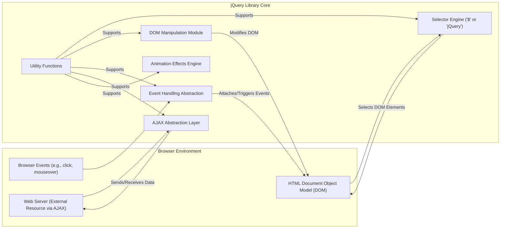
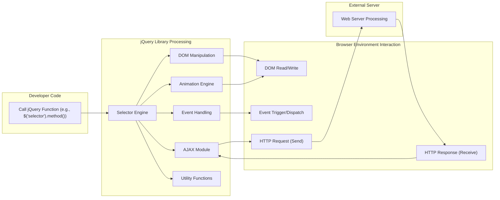

# Project Design Document: jQuery Library

**Version:** 1.1
**Date:** October 26, 2023
**Author:** AI Software Architect

## 1. Introduction

This document provides a detailed design overview of the jQuery JavaScript library, intended for use in threat modeling activities. It describes the key architectural components, data flow within the library, and crucial security considerations for applications utilizing jQuery. This document serves as a foundational resource for security professionals and developers to understand jQuery's internal workings and potential attack surfaces.

## 2. Project Goals

The primary goals of the jQuery library are to:

*   Simplify Document Object Model (DOM) traversal and manipulation within web browsers.
*   Streamline event handling mechanisms across different browsers.
*   Provide an abstraction layer for making Asynchronous JavaScript and XML (AJAX) requests.
*   Offer a suite of animation effects for enhancing user interface interactions.
*   Supply utility functions that simplify common JavaScript programming tasks.
*   Ensure consistent behavior across a wide range of web browsers, abstracting away browser-specific inconsistencies.
*   Maintain a lightweight footprint to minimize impact on page load times and performance.

## 3. High-Level Architecture

jQuery's architecture is centered around a core engine that provides a chainable interface for interacting with web page elements. Key modules provide distinct functionalities.

*   **Browser Environment:**  The context where jQuery operates, encompassing the live DOM structure, user-initiated browser events, and external web servers accessed via network requests.
*   **jQuery Library Core:** The main JavaScript file containing all jQuery functionalities, organized into logical modules.
*   **Selector Engine (`$` or `jQuery`):** The entry point for most jQuery operations, responsible for identifying and selecting DOM elements based on CSS selectors.
*   **DOM Manipulation Module:** Provides methods for altering the structure, content, and attributes of selected DOM elements.
*   **Event Handling Abstraction:**  Simplifies the process of attaching, detaching, and triggering event listeners on DOM elements, normalizing browser differences.
*   **AJAX Abstraction Layer:**  Offers a consistent API for making asynchronous HTTP requests, handling different data formats, and managing request lifecycle.
*   **Animation Effects Engine:**  Implements methods for creating visual animations and effects on DOM elements by manipulating their CSS properties over time.
*   **Utility Functions:** A collection of general-purpose functions for tasks like array and object manipulation, string operations, and type checking, used internally by jQuery and available to developers.

## 4. Detailed Component Description

*   **Selector Engine (`$` or `jQuery`):**
    *   **Input:** Takes a string representing a CSS selector.
    *   **Process:**
        *   Parses the selector string to understand the selection criteria.
        *   Optimizes the selection process based on the selector complexity and browser capabilities (leveraging native `querySelectorAll` when possible).
        *   Traverses the DOM tree to locate elements matching the selector.
    *   **Output:** Returns a jQuery object, which is an array-like object containing references to the matched DOM elements, along with jQuery's chainable methods.

*   **DOM Manipulation Module:**
    *   **Functionality:** Provides methods to:
        *   Retrieve and modify HTML content (`.html()`, `.text()`). **Security Note:**  `.html()` can introduce XSS if used with unsanitized user input.
        *   Get and set element attributes (`.attr()`) and properties (`.prop()`).
        *   Dynamically add, remove, and toggle CSS classes (`.addClass()`, `.removeClass()`, `.toggleClass()`).
        *   Alter the DOM structure by inserting, appending, prepending, or removing elements (`.append()`, `.prepend()`, `.after()`, `.before()`, `.remove()`, `.empty()`).
        *   Traverse the DOM tree relative to selected elements (`.parent()`, `.children()`, `.find()`, `.siblings()`).
    *   **Security Note:** DOM manipulation methods are direct interfaces to modify the web page's structure and are critical points for potential XSS vulnerabilities.

*   **Event Handling Abstraction:**
    *   **Functionality:**
        *   Provides a unified API for attaching event listeners to selected DOM elements (`.on()`).
        *   Supports event delegation, allowing event listeners on parent elements to handle events from their descendants.
        *   Offers methods for detaching event listeners (`.off()`).
        *   Allows programmatically triggering events on elements (`.trigger()`).
        *   Normalizes event objects to provide consistent properties across different browsers.
    *   **Security Note:**  Careless use of `.trigger()` with custom events could potentially lead to unexpected behavior or security vulnerabilities if not properly controlled.

*   **AJAX Abstraction Layer:**
    *   **Functionality:**
        *   Simplifies making asynchronous HTTP requests to servers (`$.ajax()`, `.get()`, `.post()`, `.getJSON()`, `.getScript()`).
        *   Supports various data formats for requests and responses (e.g., JSON, XML, HTML, text).
        *   Provides callbacks to handle different stages of the request lifecycle (success, error, complete).
        *   Allows setting request headers and parameters.
        *   Offers features for managing AJAX request lifecycle and caching.
    *   **Security Note:** AJAX requests interact with external systems and are subject to vulnerabilities like Cross-Site Request Forgery (CSRF) and the need for careful handling of sensitive data in transit and upon receipt. CORS policies are also relevant here.

*   **Animation Effects Engine:**
    *   **Functionality:**
        *   Provides methods for creating visual animations by gradually changing CSS properties over time (`.animate()`, `.fadeIn()`, `.fadeOut()`, `.slideUp()`, `.slideDown()`, `.fadeTo()`).
        *   Allows customization of animation duration, easing functions, and callbacks.
        *   Manages an internal queue of animations to ensure smooth execution.
    *   **Security Note:** While primarily a visual feature, animations that rely on user-controlled input could potentially be manipulated for denial-of-service or other unintended effects, though this is less of a direct security risk compared to DOM manipulation or AJAX.

*   **Utility Functions:**
    *   **Functionality:**  A diverse set of helper functions for common JavaScript tasks, including:
        *   Array and object manipulation (`$.each()`, `$.map()`, `$.extend()`).
        *   String manipulation (`$.trim()`).
        *   Type checking (`$.isArray()`, `$.isFunction()`, `$.isNumeric()`).
        *   Deferred objects for managing asynchronous operations (`$.Deferred`).
    *   **Security Note:** While generally safe, the security of applications using these utilities depends on how they are used and the context of the data being processed.

## 5. Data Flow

The typical data flow within jQuery involves the following stages:

1. **Initiation:** A developer writes JavaScript code that calls jQuery functions, often starting with the selector engine (`$()`).
2. **Selection:** The selector engine processes the CSS selector and identifies matching DOM elements.
3. **Action:** Based on the selected elements, a jQuery method is invoked. This could involve:
    *   **DOM Manipulation:** Modifying the properties or structure of the selected DOM elements.
    *   **Event Binding:** Attaching event listeners to the selected elements, waiting for browser events.
    *   **AJAX Request:** Sending an HTTP request to a server, potentially including data.
    *   **Animation:**  Initiating a visual animation on the selected elements.
4. **Browser Interaction:** jQuery interacts with the browser's rendering engine and event system to reflect the changes or handle events.
5. **Server Interaction (for AJAX):** If an AJAX request is made, the browser sends the request to the server. The server processes the request and sends a response back to the browser.
6. **Callback Execution:** jQuery executes callback functions defined by the developer to handle the results of AJAX requests, animations, or other asynchronous operations.
7. **DOM Update (if applicable):**  Based on the results of the operations (e.g., AJAX response), jQuery might further update the DOM.

## 6. Security Considerations for Threat Modeling

When threat modeling applications using jQuery, consider the following:

*   **Cross-Site Scripting (XSS) Vulnerabilities:**
    *   **Sink:** jQuery's DOM manipulation methods (`.html()`, `.append()`, etc.) are potential XSS sinks if they render untrusted data (e.g., user input) without proper sanitization.
    *   **Mitigation:**  Employ input validation and output encoding/escaping techniques *before* passing data to jQuery's DOM manipulation methods. Consider using `.text()` for displaying plain text.
    *   **Threat:** An attacker could inject malicious scripts into the DOM, leading to session hijacking, data theft, or defacement.

*   **Selector Injection:**
    *   **Sink:** While less common, if user-controlled input is directly incorporated into jQuery selectors without validation, it could potentially lead to the selection of unintended elements.
    *   **Mitigation:** Avoid directly embedding user input into selectors. If necessary, strictly validate and sanitize the input.
    *   **Threat:** An attacker could manipulate the application's behavior by targeting elements they shouldn't have access to.

*   **AJAX Security Risks:**
    *   **Cross-Site Request Forgery (CSRF):** If AJAX requests initiated by jQuery do not include appropriate anti-CSRF tokens, attackers could potentially trick authenticated users into performing unintended actions.
    *   **Mitigation:** Implement CSRF protection mechanisms (e.g., synchronizer tokens) for state-changing AJAX requests.
    *   **Threat:** An attacker could perform actions on behalf of a logged-in user without their knowledge.
    *   **CORS Misconfiguration:** Improperly configured CORS headers on the server can expose APIs to unintended origins.
    *   **Mitigation:** Ensure that CORS policies on the server are correctly configured to restrict access to authorized origins.
    *   **Threat:**  Unauthorized websites could potentially access sensitive data or functionality.
    *   **Insecure Data Handling:**  Sensitive data transmitted or received via AJAX should be encrypted (HTTPS). Responses should be carefully validated to prevent injection attacks.
    *   **Mitigation:** Always use HTTPS for AJAX requests involving sensitive data. Implement robust input validation on the server-side.

*   **Event Handling Exploits:**
    *   **Unintended Event Triggering:**  Careless use of `.trigger()` with custom events could be exploited if not properly secured.
    *   **Mitigation:**  Be cautious when using `.trigger()` with custom events, especially when the event data originates from untrusted sources.
    *   **Threat:** An attacker might be able to trigger unintended application logic.

*   **Dependency Vulnerabilities:**
    *   Using outdated versions of jQuery with known vulnerabilities can expose applications to attacks.
    *   **Mitigation:** Regularly update jQuery to the latest stable version to patch known security flaws. Use dependency management tools to track and update libraries.
    *   **Threat:** Attackers can exploit known vulnerabilities in older versions of jQuery.

## 7. Deployment Model

jQuery is typically deployed by including its JavaScript file in the HTML document:

*   **Local Hosting:** The jQuery file is downloaded and served from the same origin as the web application.
    *   **Consideration:** Requires managing updates and ensuring file integrity.
*   **Content Delivery Network (CDN):** Linking to jQuery hosted on a public CDN (e.g., Google Hosted Libraries, cdnjs).
    *   **Consideration:**  Potential single point of failure if the CDN is compromised. Subresource Integrity (SRI) should be used to verify the integrity of the downloaded file.

## 8. Assumptions and Constraints

*   This design document assumes a basic understanding of web development concepts, including HTML, CSS, and JavaScript.
*   The security of applications using jQuery heavily relies on secure coding practices implemented by developers.
*   This document focuses on the client-side aspects of jQuery and does not cover server-side security considerations in detail.

## 9. Future Considerations

*   As web development standards evolve, jQuery may need to adapt to new browser APIs and features.
*   Ongoing security audits and community contributions are crucial for identifying and addressing potential vulnerabilities.
*   The library's maintainability and performance will continue to be important factors in its evolution.
