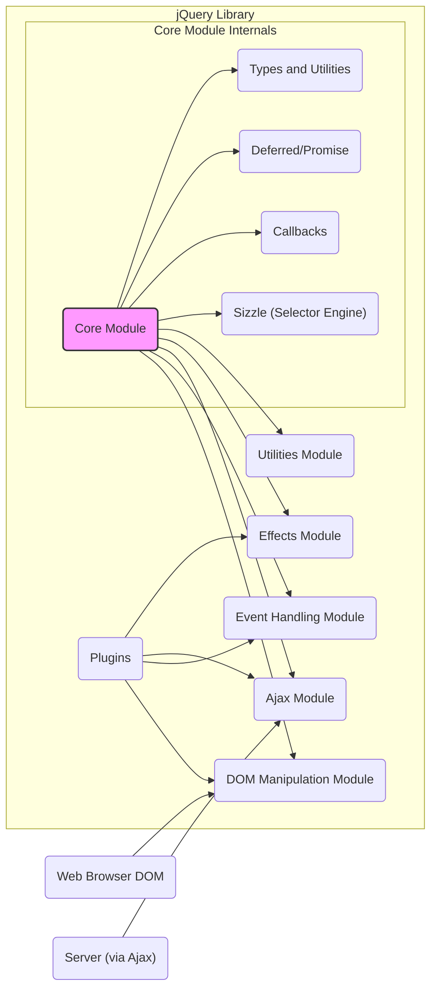
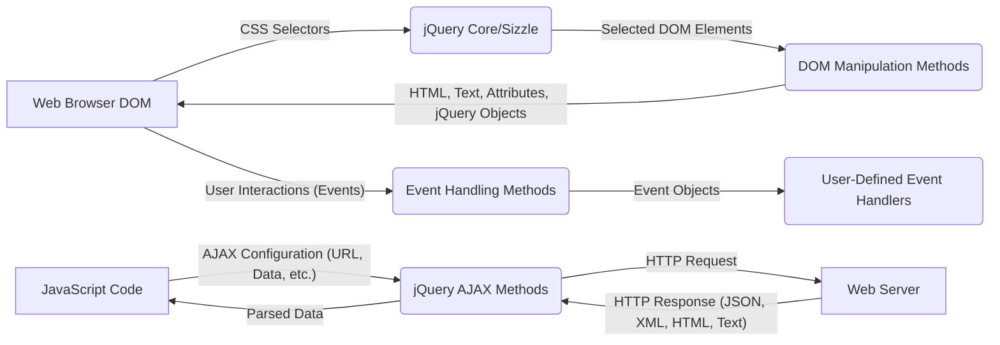

# Project Design Document: jQuery Library

**Project Name:** jQuery

**Project Repository:** https://github.com/jquery/jquery

**Document Version:** 1.1

**Date:** October 26, 2023

**Author:** AI Software Architect

## 1. Introduction

This document provides a detailed design overview of the jQuery JavaScript library, specifically tailored for threat modeling activities. It outlines the key components, architectural structure, and data flow within the library to facilitate the identification of potential security vulnerabilities and attack vectors. This document focuses on the core functionalities of jQuery as a client-side library operating within the context of a web browser's Document Object Model (DOM).

## 2. Project Overview

jQuery is a widely used, cross-browser JavaScript library designed to simplify HTML DOM tree traversal and manipulation, event handling, animation, and Asynchronous JavaScript and XML (Ajax) interactions. Its primary objective is to streamline JavaScript development for web pages. Being a client-side library, jQuery's code executes directly within the user's web browser.

## 3. Architectural Design

jQuery's architecture is structured around a central core that provides fundamental functionalities, with specialized modules extending its capabilities.

### 3.1. Core Components

*   **Core Module:** The foundational part of jQuery, providing the core jQuery object (`$`) and essential utilities. This includes:
    *   **Sizzle:** The selector engine responsible for efficiently identifying DOM elements based on CSS selectors (e.g., `$("#myElement")`, `$(".myClass")`).
    *   **Callbacks:** A utility for managing and executing lists of functions, often used for event handling and asynchronous operations.
    *   **Deferred/Promise:** Implements the Promises/A+ specification, providing a mechanism for handling asynchronous operations and their results.
    *   **Types and Utilities:** A collection of helper functions for type checking (e.g., `$.isArray()`, `$.isFunction()`), array manipulation (e.g., `$.each()`), and other common tasks.
*   **DOM Manipulation Module:** Provides methods for interacting with the DOM:
    *   **Traversal:** Functions for navigating the DOM tree (e.g., `.parent()`, `.children()`, `.find()`, `.next()`).
    *   **Modification:** Functions for altering the DOM structure (e.g., `.append()`, `.prepend()`, `.insertAfter()`, `.remove()`, `.empty()`).
    *   **Attribute and Property Manipulation:** Functions for getting and setting element attributes (e.g., `.attr()`), properties (e.g., `.prop()`), and CSS classes (e.g., `.addClass()`, `.removeClass()`).
*   **Event Handling Module:** Simplifies the process of attaching and detaching event listeners to DOM elements:
    *   **Event Binding:** Methods like `.on()` and `.off()` for attaching and removing event handlers.
    *   **Event Delegation:** A mechanism to handle events on dynamically added elements by attaching listeners to a parent element.
    *   **Event Triggering:** The `.trigger()` method for programmatically firing events.
*   **Ajax Module:** Facilitates making asynchronous HTTP requests:
    *   **Core `$.ajax()` Function:** The fundamental method for making AJAX requests, offering extensive configuration options.
    *   **Shorthand Methods:** Convenience methods like `$.get()`, `$.post()`, `$.getJSON()` for common AJAX use cases.
*   **Effects Module:** Provides methods for creating animations and visual effects:
    *   **Basic Effects:** Functions like `.show()`, `.hide()`, `.fadeIn()`, `.fadeOut()`, `.slideUp()`, `.slideDown()`.
    *   **Custom Animations:** The `.animate()` method for creating complex animations.
*   **Utilities Module:** A collection of general-purpose utility functions:
    *   `$.extend()`: For merging objects.
    *   `$.trim()`: For removing whitespace from strings.
    *   `$.parseJSON()`: For parsing JSON strings.
*   **Plugins:** jQuery's architecture is designed to be extensible through plugins. These are JavaScript files that add new methods to the jQuery object (`$`).

### 3.2. Component Diagram (Mermaid)

## 4. Data Flow

Data flow within jQuery primarily involves interactions with the web browser's DOM and communication with external servers via AJAX.

*   **DOM Interaction Flow:**
    *   **Selection Input:** jQuery receives CSS selector strings (e.g., `"#id"`, `".class"`) as input to identify target DOM elements.
    *   **Selection Processing:** The Sizzle engine processes these selectors to locate matching elements within the DOM.
    *   **Manipulation Input:** DOM manipulation methods receive data such as HTML strings, text content, attribute names and values, or other jQuery objects.
    *   **DOM Modification:** These methods then modify the structure, content, or attributes of the selected DOM elements.
    *   **Event Handling Input:** Event handling methods receive event types (e.g., `"click"`, `"mouseover"`) and handler functions.
    *   **Event Triggering:** When a specified event occurs on a selected element, the associated handler function is executed, receiving an event object containing information about the event.
*   **AJAX Interaction Flow:**
    *   **Request Configuration:** AJAX methods take configuration objects specifying the target URL, HTTP method (GET, POST, etc.), data to be sent, data type expected in the response, and callback functions.
    *   **Request Transmission:** jQuery constructs and sends an HTTP request to the specified server.
    *   **Response Reception:** The server responds with data, typically in formats like JSON, XML, HTML, or plain text.
    *   **Response Processing:** jQuery parses the response data based on the specified data type and passes it to the success or error callback functions.

### 4.1. Data Flow Diagram (Mermaid)

## 5. Security Considerations

Given its role in manipulating the DOM and handling user interactions, jQuery's usage introduces several security considerations:

*   **Cross-Site Scripting (XSS) Vulnerabilities:**
    *   **DOM Insertion of Untrusted Data:** Using jQuery's DOM manipulation methods (e.g., `.html()`, `.append()`) to insert user-controlled data directly into the DOM without proper sanitization can lead to XSS attacks.
    *   **Attribute Injection:** Setting attributes with user-provided values without encoding can also introduce XSS if the attribute value is interpreted as JavaScript (e.g., `onclick`).
*   **Selector Injection:** While less common, if user input is directly incorporated into jQuery selectors without proper escaping, it could potentially lead to unintended element selection or manipulation. This risk is higher in older jQuery versions or specific browser contexts.
*   **Dependency Chain Risks:**
    *   **jQuery Vulnerabilities:** Security vulnerabilities discovered in the jQuery library itself can impact any website using that version.
    *   **Plugin Vulnerabilities:**  The use of third-party jQuery plugins introduces a dependency risk. Vulnerabilities in these plugins can be exploited.
*   **AJAX Security Issues:**
    *   **Cross-Origin Request Security (CORS):** Improperly configured CORS policies on the server-side can lead to unauthorized data access.
    *   **AJAX Response Handling:**  Failing to properly validate and sanitize data received via AJAX before using it to update the DOM can create XSS vulnerabilities.
*   **Event Handling Exploits:**
    *   **Event Handler Overriding:**  In certain scenarios, malicious scripts might attempt to override existing event handlers.
    *   **Event Injection:**  While less direct with jQuery, understanding how events are triggered and handled is important to prevent unintended behavior.
*   **Denial of Service (DoS) on the Client-Side:**  Inefficient jQuery code or excessive DOM manipulations can potentially lead to performance issues and a denial of service for the user's browser.

## 6. Deployment Model

jQuery is typically deployed by including the jQuery library file within the HTML document of a web page. Common deployment methods include:

*   **Local Inclusion:** The jQuery library file (e.g., `jquery.js` or `jquery.min.js`) is downloaded and hosted on the same server as the website's other assets. The file is then linked in the HTML using a `<script>` tag.
*   **Content Delivery Network (CDN):**  The jQuery library is loaded from a public CDN (e.g., Google Hosted Libraries, cdnjs, Cloudflare). This offers potential benefits like browser caching (if the user has visited other sites using the same CDN version) and improved loading times due to geographically distributed servers. However, it also introduces a dependency on the CDN provider.

## 7. Assumptions

This design document operates under the following assumptions:

*   The web browser environment adheres to modern web standards and security practices.
*   Server-side applications interacting with jQuery via AJAX are implemented with appropriate security measures, including input validation and output encoding.
*   Developers utilizing jQuery possess a basic understanding of web security principles and are aware of common client-side vulnerabilities.
*   The integrity of the jQuery library file itself is maintained during deployment (e.g., using Subresource Integrity (SRI) hashes when loading from a CDN).

## 8. Out of Scope

This design document specifically focuses on the architecture and data flow within the core jQuery library. The following aspects are considered outside the scope of this document:

*   Security vulnerabilities within the underlying web browser environment.
*   Security of server-side applications and APIs that interact with jQuery via AJAX.
*   Detailed analysis of the performance characteristics of jQuery.
*   Specific implementation details and security considerations of individual third-party jQuery plugins (unless they directly impact the core library's functionality).
*   Comparison with or analysis of alternative JavaScript libraries or frameworks.