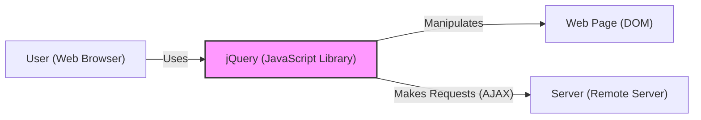
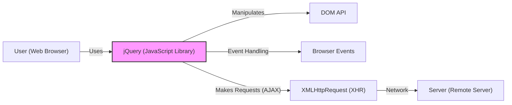
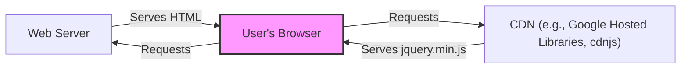
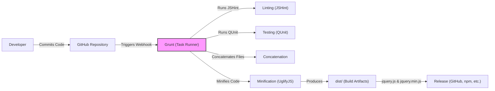

# BUSINESS POSTURE

jQuery is a widely used, established open-source JavaScript library. Its primary goal is to simplify HTML DOM manipulation, event handling, animation, and Ajax interactions for rapid web development. Given its widespread adoption and age, the business priorities likely revolve around maintaining backward compatibility, ensuring stability, and minimizing the introduction of new vulnerabilities. The project is not driven by revenue generation directly, but by its utility and adoption within the web development community.

Business Priorities:

*   Maintainability: Ensure the codebase remains manageable and understandable for contributors.
*   Backward Compatibility: Avoid breaking changes that would disrupt existing websites relying on jQuery.
*   Stability: Minimize bugs and regressions.
*   Performance: Maintain or improve performance, especially on low-powered devices.
*   Community Trust: Preserve the trust of the large community of developers who use jQuery.
*   Security: Prevent introduction of new vulnerabilities.

Business Risks:

*   Loss of Community Trust: Security vulnerabilities or significant breaking changes could lead to developers abandoning jQuery for alternatives.
*   Fragmentation: Incompatible forks or community splits could dilute the project's strength.
*   Obsolescence: Failure to adapt to evolving web standards could render jQuery irrelevant.
*   Reputational Damage: Major security incidents could damage the reputation of the project and its maintainers.
*   Legal Liability: In extreme cases, vulnerabilities could lead to legal action if exploited in high-value systems.

# SECURITY POSTURE

jQuery, being a client-side JavaScript library, has a specific security profile. It primarily deals with manipulating the DOM within the context of a web browser's security model.

Existing Security Controls:

*   security control: Code Reviews: The project uses pull requests on GitHub, implying a code review process before merging changes. (Described in contribution guidelines).
*   security control: Testing: The project has an extensive test suite, including unit and integration tests, to catch regressions and potential security issues. (Described in testing documentation).
*   security control: Security Policy: The project has a security policy outlining how to report vulnerabilities. (SECURITY.md file).
*   security control: Static Analysis: Likely use of linters (e.g., ESLint) and potentially other static analysis tools to enforce code style and identify potential issues. (Inferred from project structure and common practices).
*   security control: Issue Tracking: Use of GitHub Issues to track bugs and security vulnerabilities. (Visible on the GitHub repository).

Accepted Risks:

*   accepted risk: Cross-Site Scripting (XSS) via Misuse: jQuery provides tools that, if misused, can lead to XSS vulnerabilities. The library itself doesn't inherently prevent XSS; it's the responsibility of the developer using jQuery to sanitize inputs and outputs appropriately.
*   accepted risk: Denial of Service (DoS) via Complex Selectors: Extremely complex or deeply nested selectors could potentially cause performance issues or even browser crashes, although modern browsers are generally resilient to this.
*   accepted risk: Prototype Pollution: While efforts are made to mitigate it, prototype pollution vulnerabilities have historically been a concern in jQuery and similar libraries.

Recommended Security Controls:

*   security control: Regular Security Audits: Conduct periodic independent security audits to identify potential vulnerabilities.
*   security control: Dependency Management: Implement a robust dependency management system to track and update any third-party libraries used by jQuery.
*   security control: Content Security Policy (CSP) Compatibility: Ensure that jQuery is fully compatible with CSP and provide guidance to developers on using it effectively.
*   security control: Subresource Integrity (SRI) Support: Provide SRI hashes for official releases to allow developers to verify the integrity of downloaded files.

Security Requirements:

*   Authentication: Not directly applicable, as jQuery is a client-side library and doesn't handle authentication.
*   Authorization: Not directly applicable, as jQuery is a client-side library and doesn't handle authorization.
*   Input Validation: jQuery itself doesn't perform input validation. Developers using jQuery *must* implement proper input validation on both the client-side (for user experience) and server-side (for security) to prevent XSS and other injection attacks.
*   Cryptography: jQuery doesn't directly handle cryptographic operations. If cryptographic functionality is needed, developers should use the Web Crypto API or a dedicated cryptography library. jQuery's AJAX functions can be used to communicate with servers that handle cryptographic operations.

# DESIGN

## C4 CONTEXT

Context Diagram Element List:

*   Element:
    *   Name: User
    *   Type: Person
    *   Description: A person interacting with a web page that uses jQuery.
    *   Responsibilities: Browsing the web page, triggering events (clicks, form submissions, etc.).
    *   Security controls: Browser security mechanisms (same-origin policy, sandboxing, etc.).

*   Element:
    *   Name: jQuery
    *   Type: Software System
    *   Description: The jQuery JavaScript library.
    *   Responsibilities: DOM manipulation, event handling, animation, AJAX requests.
    *   Security controls: Code reviews, testing, security policy, static analysis.

*   Element:
    *   Name: Web Page
    *   Type: Software System
    *   Description: The HTML Document Object Model (DOM) of the web page.
    *   Responsibilities: Structure and content of the web page.
    *   Security controls: Dependent on server-side security and developer practices (input sanitization, output encoding).

*   Element:
    *   Name: Server
    *   Type: Software System
    *   Description: A remote server that the web page interacts with via AJAX requests.
    *   Responsibilities: Handling requests, processing data, providing responses.
    *   Security controls: Server-side security measures (authentication, authorization, input validation, etc.).

## C4 CONTAINER

Since jQuery is a single library, the container diagram is essentially an expanded view of the context diagram.

Container Diagram Element List:

*   Element:
    *   Name: User
    *   Type: Person
    *   Description: A person interacting with a web page that uses jQuery.
    *   Responsibilities: Browsing the web page, triggering events.
    *   Security controls: Browser security mechanisms.

*   Element:
    *   Name: jQuery
    *   Type: JavaScript Library
    *   Description: The jQuery JavaScript library.
    *   Responsibilities: DOM manipulation, event handling, animation, AJAX requests.
    *   Security controls: Code reviews, testing, security policy, static analysis.

*   Element:
    *   Name: DOM
    *   Type: API
    *   Description: The browser's Document Object Model API.
    *   Responsibilities: Providing an interface for manipulating the web page's structure and content.
    *   Security controls: Browser's implementation of DOM security.

*   Element:
    *   Name: Events
    *   Type: Browser Events
    *   Description: Browser events (click, mouseover, keypress, etc.).
    *   Responsibilities: Triggering actions in response to user interactions.
    *   Security controls: Browser's event handling security.

*   Element:
    *   Name: XMLHttpRequest
    *   Type: API
    *   Description: The browser's XMLHttpRequest API.
    *   Responsibilities: Enabling AJAX requests to the server.
    *   Security controls: Browser's implementation of XHR security (same-origin policy, CORS).

*   Element:
    *   Name: Server
    *   Type: Software System
    *   Description: A remote server.
    *   Responsibilities: Handling requests, processing data, providing responses.
    *   Security controls: Server-side security measures.

## DEPLOYMENT

jQuery is typically deployed in one of two ways:

1.  **Direct Inclusion:** The jQuery library file (e.g., `jquery.min.js`) is downloaded from a CDN (Content Delivery Network) or hosted directly on the web server and included in the HTML using a `<script>` tag.
2.  **Package Manager:** Using a package manager like npm or yarn, jQuery is installed as a dependency and bundled with other JavaScript code using a build tool like Webpack or Parcel.

We will describe the Direct Inclusion method using a CDN, as it's a very common deployment scenario.

Deployment Diagram Element List:

*   Element:
    *   Name: Web Server
    *   Type: Web Server
    *   Description: The server hosting the website's HTML, CSS, and potentially other JavaScript files.
    *   Responsibilities: Serving web pages to users.
    *   Security controls: Standard web server security measures (firewall, TLS/SSL, etc.).

*   Element:
    *   Name: User's Browser
    *   Type: Web Browser
    *   Description: The user's web browser.
    *   Responsibilities: Rendering web pages, executing JavaScript code.
    *   Security controls: Browser security mechanisms.

*   Element:
    *   Name: CDN
    *   Type: Content Delivery Network
    *   Description: A geographically distributed network of servers that hosts the jQuery library.
    *   Responsibilities: Providing fast and reliable access to jQuery.
    *   Security controls: CDN provider's security measures (DDoS protection, etc.). Subresource Integrity (SRI) can be used by the website to verify the integrity of the downloaded file.

## BUILD

jQuery's build process involves several steps, automated using Grunt (a JavaScript task runner). The process includes linting, testing, concatenation, and minification.

Build Process Description:

1.  Developers commit code changes to the GitHub repository.
2.  A webhook triggers Grunt, the task runner.
3.  Grunt runs JSHint for linting to check code style and potential errors.
4.  Grunt runs QUnit for unit testing.
5.  Grunt concatenates the source files into a single file.
6.  Grunt minifies the code using UglifyJS to reduce file size.
7.  The build artifacts (`jquery.js` and `jquery.min.js`) are placed in the `dist/` directory.
8.  The build artifacts are released on GitHub, npm, and other distribution channels.

Security Controls in Build Process:

*   security control: Linting (JSHint): Helps identify potential code quality and security issues.
*   security control: Testing (QUnit): Ensures that the code functions as expected and helps prevent regressions.
*   security control: Dependency Management (npm): Although not explicitly shown in the diagram, npm is used to manage dependencies, and tools like `npm audit` can be used to identify known vulnerabilities in dependencies.

# RISK ASSESSMENT

Critical Business Processes:

*   Website Functionality: Websites relying on jQuery for core functionality (DOM manipulation, event handling, AJAX) are the primary business process being protected.
*   Web Application Development: jQuery is a tool used by developers to build web applications. Its security impacts the security of those applications.

Data Sensitivity:

*   jQuery itself does not directly handle sensitive data. However, it *can* be used to manipulate data entered by users (e.g., form data) or data received from the server (via AJAX). The sensitivity of this data depends entirely on the specific website or application using jQuery. If jQuery is used to handle personally identifiable information (PII), financial data, or other sensitive information, then that data is at risk if jQuery is misused or exploited. The primary concern is indirect exposure of sensitive data through XSS vulnerabilities introduced by improper use of jQuery in conjunction with user-supplied data.

# QUESTIONS & ASSUMPTIONS

Questions:

*   Are there any specific server-side technologies or frameworks used in conjunction with jQuery that might influence the overall security posture? (Assumption: No specific server-side technology is assumed.)
*   What is the specific process for handling reported security vulnerabilities? (Assumption: The process described in SECURITY.md is followed.)
*   Are there any plans to adopt newer web standards or features that might impact jQuery's design or security? (Assumption: jQuery aims to maintain compatibility with evolving web standards.)
*   What is the frequency of security audits? (Assumption: No regular external security audits are performed.)
*   What is the process for updating dependencies? (Assumption: Dependencies are updated periodically, but there isn't a strict, automated process.)

Assumptions:

*   BUSINESS POSTURE: The primary goal is to maintain jQuery's widespread use and trust within the web development community.
*   SECURITY POSTURE: The project relies heavily on community contributions and code reviews for security. There is a reactive approach to security vulnerabilities (addressing them as they are reported).
*   DESIGN: jQuery is primarily used via direct inclusion from a CDN or by being bundled with other JavaScript code. The build process uses Grunt and includes linting and testing.