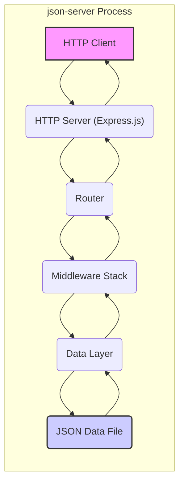
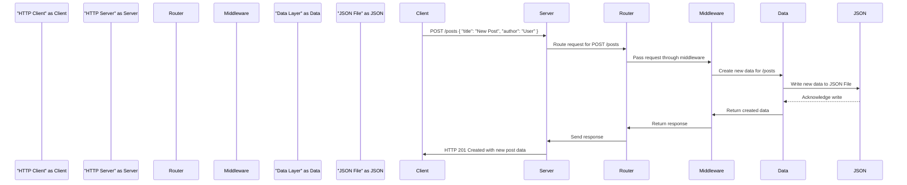

# Project Design Document: json-server

**Version:** 1.1
**Date:** October 26, 2023
**Author:** AI Software Architect

## 1. Project Overview

This document provides an enhanced design overview of `json-server`, a widely used open-source tool that facilitates the creation of mock REST APIs from a JSON file. This detailed design serves as a crucial foundation for subsequent threat modeling activities, enabling a comprehensive security analysis.

### 1.1. Project Goals

* To offer a straightforward and rapid method for prototyping and testing front-end applications independently of a fully implemented back-end.
* To empower developers to simulate API interactions and explore various data structures effectively.
* To provide fundamental CRUD (Create, Read, Update, Delete) operations on JSON data, mirroring typical API functionalities.
* To support advanced features like filtering, sorting, and pagination of resources, enhancing the realism of the mock API.
* To enable the definition of relationships between different resources within the JSON data, simulating complex data models.

### 1.2. Target Audience

* Front-end developers seeking to test their UI components against realistic API responses.
* Mobile app developers needing a backend to develop against before the actual API is ready.
* Quality assurance testers requiring a predictable and controllable API for testing purposes.
* Individuals and teams involved in proof-of-concept development and API exploration.

## 2. System Architecture

The `json-server` application, built on Node.js, functions as a lightweight HTTP server. It dynamically serves data from a provided JSON file, exposing it as a set of RESTful endpoints.

### 2.1. Architecture Diagram

### 2.2. Component Description

* **HTTP Client:** Any entity capable of sending HTTP requests to the `json-server`. This includes web browsers, command-line tools like `curl` or `wget`, dedicated API testing tools (e.g., Postman), or other applications.
* **HTTP Server (Express.js):**  `json-server` leverages the Express.js framework, a popular Node.js web application framework, to manage incoming HTTP requests and construct responses. It listens for connections on a configurable port.
* **Router:** The Express.js router component is responsible for interpreting the incoming HTTP request's method (GET, POST, PUT, DELETE, PATCH) and URL path. It then maps these requests to the appropriate handlers within the `json-server` application logic, effectively directing traffic to the correct resource.
* **Middleware Stack:** An ordered sequence of functions that intercept and process incoming requests before they reach the final route handler. This stack performs various tasks:
    * **CORS Middleware:**  Manages Cross-Origin Resource Sharing headers, controlling which domains are permitted to access the API. This is crucial for web applications hosted on different domains.
    * **Body Parser Middleware:**  Parses the body of incoming requests, particularly for `POST`, `PUT`, and `PATCH` methods. It converts the request body (e.g., JSON, URL-encoded data) into a usable format for the application.
    * **`json-server` Specific Middleware:**  Implements the core logic for `json-server` features, including:
        * **Filtering:**  Allows clients to retrieve specific resources based on query parameters (e.g., `/posts?author=typicode`).
        * **Sorting:** Enables clients to specify the order in which resources are returned (e.g., `/posts?_sort=title&_order=asc`).
        * **Pagination:**  Provides a mechanism for retrieving resources in chunks, improving performance for large datasets (e.g., `/posts?_page=2&_limit=10`).
        * **Relationship Handling:** Manages relationships between resources defined in the JSON data.
* **Data Layer:** This component is responsible for managing the interaction with the underlying JSON data file. It performs the following actions:
    * **Reading:** Loads the JSON data file into memory when the `json-server` starts.
    * **Querying:** Provides mechanisms to efficiently search and retrieve data based on client requests (filtering, sorting).
    * **Modification:**  Handles the creation, updating, and deletion of data, reflecting these changes in memory.
    * **Persistence:** Writes the in-memory data back to the JSON data file when changes are made through `POST`, `PUT`, `PATCH`, or `DELETE` requests.
* **JSON Data File:** A plain text file adhering to the JSON format. This file serves as the persistent data store for the API. The structure of this file dictates the available resources (e.g., `/posts`, `/comments`) and their associated properties.

## 3. Data Flow

The following describes the typical flow of an HTTP request through the `json-server` application:

1. An **HTTP Client** initiates a request to the `json-server` instance, targeting a specific endpoint and potentially including data or query parameters.
2. The **HTTP Server (Express.js)** receives the incoming request on the configured port.
3. The **Router** examines the request's HTTP method and URL path to identify the matching route defined within `json-server`.
4. The request is then passed through the **Middleware Stack**. Each middleware function in the stack has the opportunity to process or modify the request or response. Examples include:
    * The CORS middleware checks the request origin and adds appropriate headers to the response.
    * The body parser middleware extracts and parses the request body if it's a `POST`, `PUT`, or `PATCH` request.
    * `json-server`'s specific middleware applies filtering, sorting, and pagination logic based on the query parameters.
5. The request reaches the **Data Layer**. Based on the request method and target resource, the Data Layer performs the corresponding operation:
    * **GET:** Retrieves data from the **JSON Data File**.
    * **POST:** Creates new data and appends it to the data in memory and the **JSON Data File**.
    * **PUT/PATCH:** Updates existing data in memory and the **JSON Data File**.
    * **DELETE:** Removes data from memory and the **JSON Data File**.
6. The **Data Layer** returns the processed data (or confirmation of the operation) back to the **Middleware Stack**.
7. The **Middleware Stack** may perform further processing on the response before it's sent back.
8. The **Router** sends the generated response back to the **HTTP Server (Express.js)**.
9. The **HTTP Server** transmits the response back to the originating **HTTP Client**.

### 3.1. Data Flow Diagram (Example: POST request to create a new resource)

## 4. Security Considerations (Initial)

This section outlines initial security considerations for `json-server`. A dedicated threat modeling exercise will build upon this foundation to identify and analyze potential vulnerabilities in detail.

* **Data Exposure:** The entire content of the **JSON Data File** is potentially accessible through the API endpoints. Sensitive information should not be stored in this file if it's not intended for broad access. For example, storing user passwords directly in `db.json` would be a significant security risk.
* **Lack of Authentication and Authorization:** By default, `json-server` does not implement any mechanisms to verify the identity of clients or control their access to resources. Any client can perform any CRUD operation on the data. This makes it unsuitable for production environments handling sensitive data.
* **Cross-Site Scripting (XSS) Vulnerabilities:** If user-provided data (e.g., through `POST` or `PUT` requests) is directly included in API responses without proper sanitization or encoding, it could lead to XSS vulnerabilities. Malicious scripts could be injected and executed in the context of a user's browser.
* **Cross-Origin Resource Sharing (CORS) Misconfiguration:** Incorrectly configured CORS settings can allow unintended access to the API from malicious websites. For instance, a wildcard (`*`) for allowed origins can expose the API to any website.
* **Denial of Service (DoS) Potential:**  `json-server` might be vulnerable to DoS attacks if it receives a large volume of requests, especially if the **JSON Data File** is large or complex, requiring significant processing resources.
* **Injection Attacks (Limited Scope):** While direct SQL injection is not applicable due to the file-based nature of `json-server`, if custom routes or middleware are added that interact with external systems (e.g., databases), those integrations could be susceptible to injection vulnerabilities.
* **Dependency Vulnerabilities:**  As a Node.js application, `json-server` relies on various npm packages. Vulnerabilities in these dependencies could introduce security risks. Regularly updating dependencies is crucial.
* **Code Injection (Custom Routes):** If developers implement custom routes using `json-server`'s extensibility features, they must be cautious about potential code injection vulnerabilities if they process user-provided input without proper sanitization.
* **Data Integrity Risks:** Without input validation, malicious or erroneous client requests could potentially corrupt the data within the **JSON Data File**. For example, sending a `POST` request with an unexpected data structure could lead to inconsistencies.

## 5. Deployment Considerations

`json-server` is typically deployed in non-production environments for the following purposes:

* **Local Development Environments:** Developers commonly run `json-server` on their local machines to simulate a backend API during the development of front-end applications. This allows for isolated testing and development without relying on a live backend.
* **Continuous Integration/Continuous Deployment (CI/CD) Pipelines:** `json-server` can be integrated into CI/CD pipelines to provide a consistent and predictable API for automated testing. This ensures that front-end tests are reliable and not dependent on the availability of a full backend.
* **Demonstrations and Prototypes:**  Its simplicity makes `json-server` an excellent tool for quickly creating working API endpoints for demonstrations, proof-of-concepts, and initial prototyping phases.
* **Educational Purposes:**  `json-server` serves as a valuable tool for learning about RESTful APIs and how they function.

Typical deployment steps involve:

* Ensuring Node.js and npm (or yarn) are installed on the target system.
* Installing `json-server` either globally or as a project dependency using npm or yarn.
* Creating a `db.json` file containing the mock data for the API.
* Executing the `json-server` command in the terminal, specifying the path to the `db.json` file and optionally the port number.

## 6. Assumptions and Constraints

* **Primarily for Development/Testing:** The core assumption is that `json-server` is primarily intended for development, testing, and prototyping purposes, not for production environments handling sensitive or critical data.
* **In-Memory Data Handling:** `json-server` primarily operates with the JSON data loaded into memory. Changes are written back to the file system. This in-memory approach can have performance implications for very large datasets.
* **Single User/Isolated Environment:** It's generally assumed that `json-server` is used in a single-user or isolated development environment where security threats are less prevalent than in public-facing production systems.
* **Adherence to Basic REST Principles:** `json-server` implements fundamental RESTful principles for resource representation and manipulation through standard HTTP methods.
* **Command-Line or Configuration File Based Configuration:** Configuration is primarily managed through command-line arguments or a `json-server.json` configuration file.

## 7. Future Considerations

* **HTTPS Support:** Implementing HTTPS support would encrypt communication between the client and the `json-server`, enhancing security for data transmitted over the network. This is particularly important if any sensitive data is being simulated.
* **Basic Authentication Mechanisms:** Adding support for basic authentication methods, such as API keys or username/password authentication, would provide a rudimentary level of access control, limiting who can interact with the API.
* **Input Validation Capabilities:** Incorporating built-in input validation would help prevent data corruption and mitigate certain types of injection attacks by ensuring that incoming data conforms to expected formats and constraints.
* **Rate Limiting Functionality:** Implementing rate limiting would help protect the `json-server` instance from denial-of-service attacks by limiting the number of requests a client can make within a specific timeframe.
* **More Granular CORS Configuration:** Providing more fine-grained control over CORS settings, allowing specific HTTP methods or headers for certain origins, would enhance security and flexibility.

This improved design document provides a more detailed and comprehensive overview of the `json-server` project. It serves as a robust foundation for conducting a thorough threat model, enabling the identification and mitigation of potential security risks more effectively.