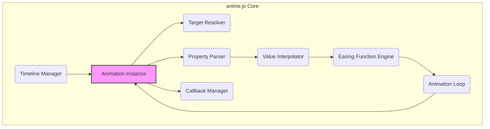
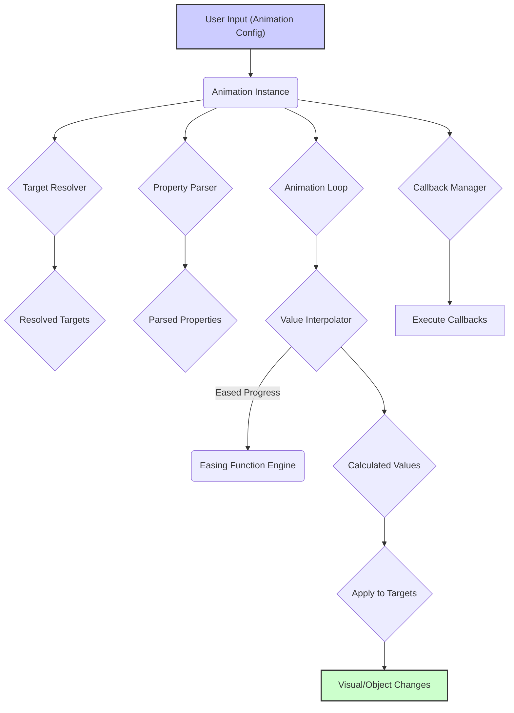

# Project Design Document: anime.js

**Version:** 1.1
**Date:** October 26, 2023
**Author:** Gemini (AI Language Model)
**Project Link:** https://github.com/juliangarnier/anime

## 1. Introduction

This document provides an enhanced and more detailed design overview of the anime.js library, a lightweight JavaScript animation library. This revised document aims to provide a stronger foundation for subsequent threat modeling activities by offering a more granular understanding of the library's architecture, components, data flow, and key functionalities.

### 1.1. Purpose

The primary purpose of this document is to provide a comprehensive and technically detailed description of anime.js to facilitate a more thorough and effective threat identification and risk assessment process. It will serve as a key reference point during subsequent threat modeling exercises.

### 1.2. Scope

This document covers the core functionality and architecture of the anime.js library as described in its public documentation and source code. It maintains its focus on the client-side aspects of the library and does not delve into server-side interactions or the hosting environment where it might be used. This version includes more detail on internal component behavior.

### 1.3. Goals

*   Clearly define the key components and provide a more detailed explanation of their internal workings and interactions within anime.js.
*   Describe the data flow and manipulation within the library with greater specificity, including data types.
*   Identify potential areas of interest from a security perspective with more concrete examples.
*   Provide clear and accurate visual representations of the library's architecture and data flow.

## 2. Overview

anime.js is a versatile JavaScript animation library designed for creating intricate and engaging animations within web browsers. It operates by manipulating CSS properties, SVG attributes, and JavaScript object properties. The library is entirely client-side, executing within the user's browser.

### 2.1. Key Features

*   **Flexible Targeting:**  Ability to target a wide range of elements, including individual DOM nodes, collections of nodes via CSS selectors, and JavaScript objects.
*   **Versatile Property Animation:** Animates numeric properties, CSS color values (including hex, RGB, HSL), and CSS transform properties (translate, rotate, scale, skew).
*   **Sophisticated Easing Functions:** Offers a rich set of built-in easing functions (linear, easeInQuad, easeOutCubic, etc.) and allows for the creation of custom Bezier curves for fine-grained control over animation timing.
*   **Comprehensive Callback System:** Provides callbacks for various stages of the animation lifecycle, including `begin`, `update` (fired on each frame), and `complete`.
*   **Powerful Timeline Management:** Enables the creation of complex animation sequences with precise control over timing, including overlapping animations and synchronization.
*   **Staggering Effects:** Simplifies the animation of multiple elements with sequential or grid-based delays.
*   **Precise Synchronization:** Offers mechanisms for synchronizing animations based on various parameters.

## 3. Architecture

anime.js features a modular architecture centered around an animation engine that orchestrates the animation process.

### 3.1. Core Components

*   **Animation Instance:** The fundamental unit of animation. It encapsulates all configuration details for a specific animation, including:
    *   Target elements.
    *   Animated properties and their target values.
    *   Duration, easing, and delay settings.
    *   Registered callbacks.
    *   Internal state (e.g., current time, progress).
*   **Target Resolver:** Responsible for translating the user-provided target (string selector, DOM element, array of elements, or JavaScript object) into a concrete list of elements to be animated. It handles different input types and ensures a consistent representation of the targets.
*   **Property Parser:** Analyzes the animation properties specified by the user. This involves:
    *   Identifying the type of property (CSS, SVG, JavaScript object).
    *   Extracting the starting and ending values.
    *   Handling unit conversions (e.g., pixels, percentages).
    *   Preparing the property for interpolation.
*   **Value Interpolator:**  Calculates the intermediate values for each animated property at each frame. This component:
    *   Takes the normalized animation progress (0 to 1) as input.
    *   Applies the selected easing function to adjust the progress.
    *   Calculates the interpolated value based on the starting and ending values and the eased progress.
    *   Handles different data types (numbers, colors, transforms) appropriately.
*   **Easing Function Engine:** Implements the various easing functions. It receives the normalized progress (0 to 1) and returns an adjusted progress value based on the selected easing curve.
*   **Animation Loop:** The core engine that drives the animation. It uses `requestAnimationFrame` to ensure smooth, browser-optimized updates. The loop:
    *   Calculates the elapsed time.
    *   Updates the animation progress.
    *   Triggers the value interpolation for each animated property.
    *   Applies the calculated values to the target elements.
    *   Manages the animation lifecycle (starting, pausing, stopping, completing).
*   **Callback Manager:**  Manages the execution of user-defined callback functions at specific points in the animation lifecycle (`begin`, `update`, `complete`). It ensures that callbacks are executed with the correct context and arguments.
*   **Timeline Manager:**  Enables the creation and management of complex animation sequences. It allows for:
    *   Adding multiple animation instances to a timeline.
    *   Specifying offsets and durations for each animation within the timeline.
    *   Synchronizing animations.
    *   Controlling the overall timeline playback.

### 3.2. Component Interactions

**Detailed Description of Interactions:**

*   The "Animation Instance" acts as the central configuration hub, providing necessary information to other components.
*   The "Target Resolver" receives the target specification from the "Animation Instance" and returns a list of resolved DOM elements or JavaScript objects.
*   The "Property Parser" analyzes the animation properties from the "Animation Instance," determining data types and preparing for interpolation.
*   The "Value Interpolator" uses the parsed property information and the output of the "Easing Function Engine" (driven by the "Animation Loop") to calculate intermediate values.
*   The "Easing Function Engine" provides the timing curves based on the normalized progress from the "Animation Loop."
*   The "Animation Loop" orchestrates the animation cycle, updating the "Animation Instance's" internal state and triggering value interpolation.
*   The "Callback Manager" receives events from the "Animation Instance" (triggered by the "Animation Loop") and executes registered callbacks.
*   The "Timeline Manager" manipulates multiple "Animation Instances," controlling their start times and durations to create synchronized sequences.

## 4. Data Flow

The data flow within anime.js involves the transformation of user-defined animation parameters into dynamic visual changes on the targeted elements.

### 4.1. Data Inputs

*   **Target Specification (String, DOM Element, Object):**  Identifies the elements to be animated. This can be a CSS selector string, a direct DOM element reference, an array of elements, or a JavaScript object.
*   **Property Definitions (Object):** Defines the properties to animate and their target values. Examples include:
    *   `translateX: 200` (number)
    *   `backgroundColor: '#FF0000'` (string - color)
    *   `opacity: [0, 1]` (array of numbers for start and end values)
*   **Timing Parameters (Number, String):** Controls the animation's duration, delay, and easing.
    *   `duration: 1000` (milliseconds)
    *   `easing: 'easeOutElastic'` (string - easing function name)
    *   `delay: anime.stagger(100)` (function or number)
*   **Callback Functions (Function):** Functions to be executed at specific animation stages.
    *   `begin: function() { ... }`
    *   `update: function(anim) { ... }` (receives the animation instance as an argument)
    *   `complete: function() { ... }`
*   **Timeline Configuration (Object):**  For timeline animations, this includes:
    *   `targets`: The elements to animate within the timeline.
    *   `properties`: The animation properties for each step.
    *   `offset`:  The starting time of the animation within the timeline.

### 4.2. Data Processing

1. The **Animation Instance** receives the animation parameters (target, properties, timing, callbacks) from the user.
2. The **Target Resolver** processes the target specification, resolving it into a concrete list of DOM elements or JavaScript objects.
3. The **Property Parser** analyzes the provided properties, determining their types, extracting start and end values, and preparing them for interpolation.
4. The **Animation Loop** starts, driven by `requestAnimationFrame`, maintaining the animation's internal time and progress.
5. At each frame, the **Value Interpolator** calculates the current value of each animated property:
    *   It receives the normalized progress from the **Animation Loop**.
    *   The **Easing Function Engine** applies the selected easing function to this progress.
    *   The **Value Interpolator** uses the eased progress, start value, and end value to calculate the intermediate value.
6. The calculated values are then applied to the target elements. For DOM elements, this involves setting CSS properties or SVG attributes. For JavaScript objects, it involves directly updating the object's properties.
7. The **Callback Manager** checks the animation's progress and triggers the appropriate callback functions (`begin`, `update`, `complete`) at the corresponding times.

### 4.3. Data Outputs

*   **Visual Transformations:** The primary output is the dynamic modification of the visual presentation of the targeted DOM elements in the browser (e.g., changes in position, opacity, color).
*   **JavaScript Object Property Updates:** When animating JavaScript objects, the output is the modification of the object's properties.
*   **Callback Execution:**  Callbacks can trigger further actions within the application, such as updating UI elements, making API calls, or initiating other animations. The `update` callback provides access to the current animation instance, allowing for dynamic behavior based on the animation's progress.

## 5. Security Considerations (Detailed)

Given its client-side nature, anime.js's security considerations primarily revolve around how it's used within a larger web application and the potential for malicious input.

*   **Cross-Site Scripting (XSS) via Unsafe Target Selectors:** If user-provided data is directly used to construct CSS selectors passed to anime.js without proper sanitization, an attacker could inject malicious scripts. For example, if a user input field determines the target selector, a malicious user could input `"; alert('XSS');"` which, if not sanitized, could execute arbitrary JavaScript.
*   **XSS via Unsafe Property Values:** Similarly, if user input is used to define animation property values (especially string-based properties or those involving URLs), it could lead to XSS. For instance, animating the `backgroundImage` property with a user-supplied, unsanitized URL could load malicious content.
*   **Resource Exhaustion/Client-Side DoS:** Maliciously crafted animation configurations could consume excessive client-side resources, leading to a denial-of-service for the user. This could involve:
    *   Animating a very large number of elements simultaneously.
    *   Creating animations with extremely long durations.
    *   Using complex easing functions or property calculations that strain the browser's processing capabilities.
*   **Manipulation of Sensitive Information:** If anime.js is used to animate elements displaying sensitive data, there's a risk of unintended exposure or manipulation during the animation. For example, animating the position of a password field or temporarily revealing masked content could be exploited.
*   **Third-Party Library Vulnerabilities (Indirect):** While anime.js has no direct dependencies, the overall web application might include other libraries with vulnerabilities. If these libraries interact with elements being animated by anime.js, those vulnerabilities could indirectly be relevant.
*   **Timing Attacks (Low Probability):** While generally a low risk, in highly specific and controlled scenarios, subtle timing differences in animation execution might theoretically be used to infer information. This is highly unlikely to be a practical attack vector for most uses of anime.js.
*   **Prototype Pollution (If Used with Object Animation):** If anime.js is used to animate plain JavaScript objects and the property names are derived from unsanitized user input, it could potentially lead to prototype pollution vulnerabilities, depending on how those objects are later used.

## 6. Dependencies

anime.js is designed to be a standalone library and has **zero external dependencies**. It relies solely on standard web browser APIs available in modern browsers.

## 7. Deployment

anime.js is deployed as a static JavaScript file. Developers typically include this file in their HTML using a `<script>` tag, either by linking to a hosted version (CDN) or by including it directly in their project's assets. The library executes entirely within the user's web browser upon page load.

## 8. Future Considerations (Out of Scope for Threat Modeling, but relevant for design)

*   **WebAssembly (Wasm) for Performance:** Exploring the use of WebAssembly for performance-critical parts of the animation engine could potentially improve performance, especially for complex animations.
*   **Declarative Animation Syntax:**  Investigating more declarative approaches to defining animations, potentially integrating with web components or other declarative UI frameworks.
*   **Enhanced SVG Capabilities:**  Further expanding the support for animating a wider range of SVG attributes and properties, including more complex filter effects.
*   **Improved TypeScript Support:**  Maintaining and enhancing the existing TypeScript definitions to ensure type safety and a better developer experience for TypeScript users.

This improved document provides a more in-depth understanding of the anime.js library's design and operation. The enhanced details and more specific security considerations presented here will be valuable for conducting a more comprehensive and effective threat modeling exercise.