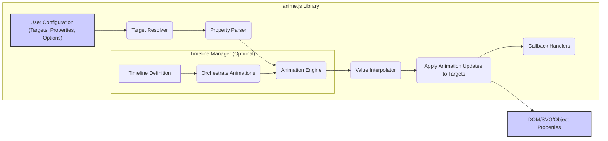

# Project Design Document: anime.js Library

**Version:** 1.1
**Date:** October 26, 2023
**Author:** AI Software Architect

## 1. Introduction

This document provides an enhanced design overview of the anime.js JavaScript animation library, focusing on aspects relevant to security analysis and threat modeling. It details the library's architecture, key components, data flow, and potential security considerations. This document serves as a refined foundation for future security assessments and the development of mitigation strategies.

## 2. Project Overview

*   **Project Name:** anime.js
*   **Project Repository:** [https://github.com/juliangarnier/anime](https://github.com/juliangarnier/anime)
*   **Project Description:** anime.js is a lightweight JavaScript animation library enabling manipulation of CSS properties, SVG attributes, DOM attributes, and JavaScript Object properties. Its primary function is to smoothly transition values over time.

## 3. Goals

*   Deliver a clear and comprehensive architectural description of the anime.js library.
*   Precisely identify core components and their interactions within the library.
*   Illustrate the flow of data through the animation process.
*   Emphasize potential security implications and areas of concern for threat modeling.
*   Act as a robust reference point for subsequent security evaluations and the planning of risk mitigation efforts.

## 4. Non-Goals

*   In-depth, line-by-line code analysis or implementation specifics.
*   Performance benchmarking or optimization strategies.
*   Proposing new features or modifications to the library's functionality.
*   Comparative analysis against other JavaScript animation libraries.

## 5. Architecture and Design

### 5.1. Components

*   **Animation Engine:** The central module responsible for managing the animation lifecycle, calculating intermediate values, and applying updates. It orchestrates the timing and progression of animations.
*   **Target Resolver:**  Identifies the specific DOM elements, SVG elements, or JavaScript objects that will be animated. It interprets the target selectors provided in the animation configuration.
*   **Property Parser:**  Analyzes the animation properties specified by the user (e.g., `translateX`, `opacity`, `fill`). It determines the starting and ending values for each property.
*   **Value Interpolator:**  Calculates the intermediate values between the start and end states of an animation property at each step of the animation. This calculation is influenced by the selected easing function.
*   **Timeline Manager:** (Optional) Facilitates the creation and management of animation sequences, allowing for precise control over the timing and order of multiple animations.
*   **Easing Functions:** A collection of predefined mathematical functions that define the rate of change of an animated property over time, creating effects like ease-in, ease-out, etc.
*   **Callback Handlers:** Functions provided by the user that are executed at specific points during the animation lifecycle, such as when an animation begins, updates, or completes.
*   **Settings/Configuration:**  An object containing customizable options that control the behavior of animations, including `duration`, `easing`, `delay`, and more.

### 5.2. Data Flow

**Detailed Data Flow Description:**

*   **User Configuration:** The animation process begins with user-provided configuration data. This includes specifying the target elements (using CSS selectors or direct object references), the CSS properties, SVG attributes, DOM attributes, or JavaScript object properties to animate, and various animation options (duration, easing, etc.).
*   **Target Resolver:** The `Target Resolver` component takes the user-provided target specification and identifies the corresponding elements or objects. This involves querying the DOM or directly referencing provided objects.
*   **Property Parser:** The `Property Parser` analyzes the animation properties and their target values. It determines the initial and final values for each property to be animated. This might involve reading the current style or attribute values of the target elements.
*   **Animation Engine:** The core `Animation Engine` takes the parsed properties and initiates the animation loop. It manages the timing of the animation based on the specified duration and delay.
*   **Value Interpolator:** For each step of the animation, the `Value Interpolator` calculates the intermediate value for each animated property. This calculation uses the specified easing function to determine the rate of change between the start and end values.
*   **Apply Animation Updates to Targets:** The calculated intermediate values are then applied to the target elements. This involves modifying the DOM styles, SVG attributes, DOM attributes, or JavaScript object properties.
*   **Callback Handlers:** At various stages of the animation (e.g., start, progress, completion), the `Animation Engine` triggers the execution of any user-defined callback functions that have been registered.
*   **Timeline Manager (Optional):** When using the `Timeline Manager`, the user defines a sequence of animations. The `Timeline Manager` orchestrates the execution of these individual animations, ensuring they run in the specified order and with the correct timing.
*   **DOM/SVG/Object Properties:** The final result of the animation process is the modification of the visual or data properties of the target elements or objects.

### 5.3. Key Interactions

*   **User Code Invocation:** Developers initiate animations by calling the `anime()` function or creating `anime.timeline()` instances, passing in configuration objects that define the animation parameters.
*   **Internal Component Communication:** The various components within the anime.js library interact closely to process animation requests. For example, the `Target Resolver` provides targets to the `Property Parser`, and the `Animation Engine` relies on the `Value Interpolator`.
*   **Browser/Environment Interaction:** anime.js interacts with the web browser's DOM and SVG rendering engines to apply the calculated style and attribute changes. It also directly manipulates JavaScript object properties in memory.
*   **Callback Execution:** The library invokes user-provided callback functions at specific animation lifecycle events, allowing developers to execute custom logic at these points.

## 6. Security Considerations

This section details potential security considerations relevant to the anime.js library, providing a basis for threat modeling activities.

*   **Input Validation and Sanitization:**
    *   **Malicious Configuration Objects:** How robust is the library against malformed or malicious data within the animation configuration object? Could providing unexpected data types or excessively large values cause errors or unexpected behavior?
    *   **CSS Selector Injection:** If target selectors are derived from user input (though generally not recommended), could this lead to CSS injection vulnerabilities, potentially targeting unintended elements?
    *   **Property Name Validation:** Does the library validate the provided CSS property names or attribute names? Could attempting to animate non-existent or browser-specific properties lead to errors or unexpected side effects?
*   **Output Context and Potential for XSS:**
    *   While primarily focused on visual changes, could the manipulation of specific SVG attributes (e.g., those related to hyperlinks or event handlers) inadvertently introduce cross-site scripting (XSS) vulnerabilities if user-controlled data is involved in constructing these attributes? This is a low-probability scenario but should be considered.
*   **Dependency Chain Security:**
    *   While anime.js is generally dependency-free, if future versions introduce dependencies, the security of those dependencies becomes a concern. Vulnerable dependencies could introduce security risks to projects using anime.js.
*   **Client-Side Resource Consumption and DoS:**
    *   Could a maliciously crafted animation configuration (e.g., extremely long duration, very high number of animated elements, complex easing functions) lead to excessive CPU or memory usage on the client-side, potentially causing a denial-of-service (DoS) for the user?
*   **Callback Function Security:**
    *   The security of user-provided callback functions is paramount. anime.js executes these functions, but it does not control their logic. Malicious or poorly written callbacks could introduce vulnerabilities. Developers must ensure their callback functions are secure.
*   **Timing Attacks (Low Risk):**
    *   In highly specific and sensitive contexts, could the timing of animations be subtly manipulated to infer information? This is a very low-risk scenario for a general-purpose animation library but is a theoretical consideration in security-sensitive applications.
*   **Source Integrity:**
    *   Ensuring the integrity of the anime.js source code is crucial. Developers should obtain the library from trusted sources (official releases, reputable CDNs) to avoid using compromised versions. Subresource Integrity (SRI) hashes can be used to verify the integrity of the loaded file.

## 7. Deployment

*   **Direct Inclusion via `<script>` Tag:** The most common deployment method involves including the anime.js library directly in an HTML file using a `<script>` tag, referencing either a local copy or a Content Delivery Network (CDN).
*   **Module Bundlers:** In modern JavaScript projects, anime.js can be included as a module using module bundlers like Webpack, Parcel, or Rollup. This allows for better dependency management and code organization.
*   **Client-Side Execution:** anime.js is executed entirely within the user's web browser on the client-side. No server-side processing is required for the core animation functionality.

## 8. Future Considerations

*   Further detailed analysis of input validation routines within the anime.js codebase to identify potential weaknesses.
*   Investigation into the specific mechanisms used to apply animation updates to different types of targets (DOM elements, SVG elements, JavaScript objects) and any associated security implications.
*   Continuous monitoring for any reported security vulnerabilities in anime.js or its potential future dependencies.
*   Providing clear guidelines and best practices for developers on how to use anime.js securely, particularly regarding the use of callback functions and handling user-provided data in animation configurations.

This improved design document provides a more detailed and security-focused overview of the anime.js library. It serves as a valuable resource for conducting thorough threat modeling and developing strategies to mitigate potential security risks.