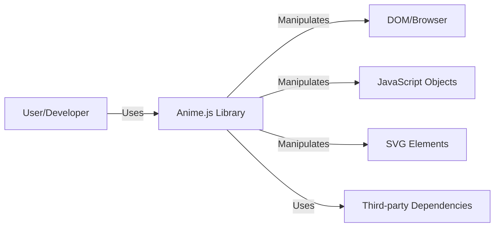
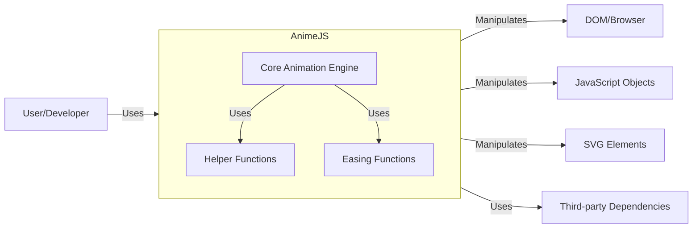
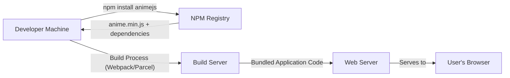
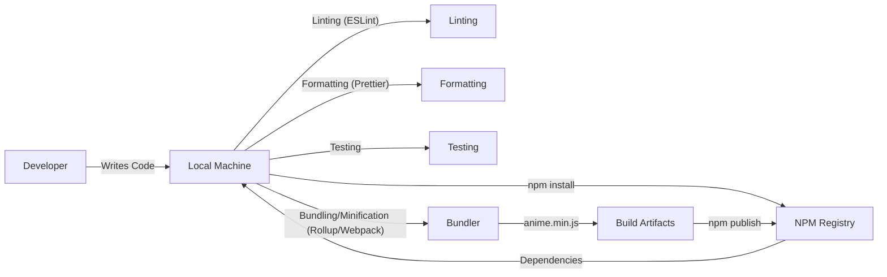

Okay, let's create a design document for the Anime.js project, focusing on aspects relevant for threat modeling.

# BUSINESS POSTURE

Anime.js is a JavaScript animation library.  It's an open-source project, likely aiming for wide adoption and community contribution.  The primary business goals are likely:

*   Ease of Use:  Make animation simple and intuitive for developers of all skill levels.
*   Performance:  Provide smooth and efficient animations, even with complex scenarios.
*   Flexibility:  Support a wide range of animation targets (DOM elements, SVG, JavaScript objects) and properties.
*   Community Growth:  Foster an active and engaged community around the library.
*   Reputation: Maintain a positive reputation for quality, reliability, and responsiveness to issues.

Based on these goals, the most important business risks are:

*   Malicious Code Injection:  A compromised version of the library (e.g., through a supply chain attack or a compromised dependency) could be used to inject malicious code into websites using Anime.js. This is the highest risk.
*   Denial of Service (DoS):  While less likely to be targeted directly, vulnerabilities in the library could potentially be exploited to cause performance issues or crashes in applications using it.
*   Reputational Damage:  Security vulnerabilities, even if not actively exploited, could damage the library's reputation and discourage adoption.
*   Intellectual Property Theft: While open-source, there might be concerns about unauthorized commercial use or modification without attribution (though this is mitigated by the MIT license).

# SECURITY POSTURE

The provided GitHub repository gives us insights into the existing security controls and accepted risks.

*   security control: MIT License: The project uses the MIT license, which is permissive and allows for broad use, modification, and distribution. (Found in the LICENSE file).
*   security control: Dependency Management: The project uses a package manager (likely npm or yarn, based on the presence of `package.json`) to manage dependencies. (Found in `package.json`).
*   security control: Code Style and Linting: The presence of configuration files like `.eslintrc.js` and `.prettierrc.js` suggests the use of linters and code formatters to maintain code quality and potentially catch some basic errors. (Found in root directory).
*   security control: Testing: The project includes a `test` directory, indicating the presence of automated tests. The extent and coverage of these tests would need further investigation. (Found in `test` directory).
*   accepted risk: Limited Formal Security Reviews: There's no explicit mention of formal security audits or penetration testing. This is common for open-source projects, but it's an accepted risk.
*   accepted risk: Dependency Vulnerabilities: While dependencies are managed, there's always a risk of vulnerabilities in third-party libraries. This is a common and generally accepted risk, mitigated by staying up-to-date.
*   accepted risk: User-Controlled Input: Anime.js inherently deals with user-provided input (animation parameters, target elements, etc.).  This introduces a risk of misuse, though the library's design likely mitigates many direct injection vulnerabilities.

Recommended Security Controls (High Priority):

*   security control: Supply Chain Security: Implement measures to verify the integrity of dependencies. This could include using tools like `npm audit` or `yarn audit`, and potentially using tools for Software Composition Analysis (SCA).
*   security control: Security-Focused Code Review: Integrate security considerations into the code review process.  Encourage contributors to think about potential security implications of their changes.
*   security control: Fuzz Testing: Consider adding fuzz testing to the test suite. Fuzz testing can help identify unexpected behavior and potential vulnerabilities by providing random or malformed input to the library.

Security Requirements:

*   Authentication: Not directly applicable to this library, as it doesn't handle user authentication.
*   Authorization: Not directly applicable, as the library doesn't manage user roles or permissions.
*   Input Validation:
    *   The library should gracefully handle invalid or unexpected input values for animation parameters (e.g., non-numeric values for durations, invalid CSS property names).
    *   The library should sanitize or escape any user-provided input that is used to construct DOM elements or modify attributes, to prevent potential XSS vulnerabilities (though this is less of a concern as Anime.js primarily manipulates existing elements).
*   Cryptography: Not directly applicable, as the library doesn't handle sensitive data requiring encryption.

# DESIGN

## C4 CONTEXT

Element Descriptions:

*   Element:
    *   Name: User/Developer
    *   Type: Person
    *   Description: A web developer who integrates Anime.js into their website or application.
    *   Responsibilities: Provides animation parameters and target elements to Anime.js.
    *   Security controls: None (external to the library).

*   Element:
    *   Name: Anime.js Library
    *   Type: Software System
    *   Description: The core Anime.js library, providing animation functionality.
    *   Responsibilities: Parses animation parameters, manages animation timelines, updates target element properties.
    *   Security controls: Input validation, dependency management, code style/linting, testing.

*   Element:
    *   Name: DOM/Browser
    *   Type: External System
    *   Description: The web browser's Document Object Model.
    *   Responsibilities: Renders the web page and provides an interface for manipulating elements.
    *   Security controls: Browser's built-in security mechanisms (e.g., same-origin policy, XSS protection).

*   Element:
    *   Name: JavaScript Objects
    *   Type: External System
    *   Description: Plain JavaScript objects that can be animated.
    *   Responsibilities: Store data that can be animated by Anime.js.
    *   Security controls: None (managed by the user's code).

*   Element:
    *   Name: SVG Elements
    *   Type: External System
    *   Description: Scalable Vector Graphics elements within the DOM.
    *   Responsibilities: Render vector graphics and provide an interface for manipulating their properties.
    *   Security controls: Browser's built-in security mechanisms for SVG.

*   Element:
    *   Name: Third-party Dependencies
    *   Type: External System
    *   Description: External libraries used by Anime.js (if any).
    *   Responsibilities: Provide functionality required by Anime.js.
    *   Security controls: Managed through dependency management tools (e.g., npm audit).

## C4 CONTAINER

Since Anime.js is a single library, the container diagram is essentially the same as the context diagram, with the addition of internal modules.

Element Descriptions:

*   Elements from Context Diagram are the same.

*   Element:
    *   Name: Core Animation Engine
    *   Type: Component
    *   Description: The main module responsible for parsing parameters, managing timelines, and updating values.
    *   Responsibilities: Core animation logic.
    *   Security controls: Input validation.

*   Element:
    *   Name: Helper Functions
    *   Type: Component
    *   Description: Utility functions used by the core engine.
    *   Responsibilities: Provide common functionality (e.g., unit conversion, value parsing).
    *   Security controls: Input validation (where applicable).

*   Element:
    *   Name: Easing Functions
    *   Type: Component
    *   Description: Functions that define the rate of change of animation parameters over time.
    *   Responsibilities: Calculate intermediate values for animations.
    *   Security controls: None (mathematical functions).

## DEPLOYMENT

Anime.js is a JavaScript library, so deployment typically involves including it in a web page or application. Several deployment options exist:

1.  **Direct Download:** Download the `anime.min.js` file and include it in the project's directory structure.
2.  **CDN:** Use a Content Delivery Network (CDN) like jsDelivr or unpkg to include Anime.js without hosting it yourself.
3.  **Package Manager:** Install Anime.js using a package manager like npm or yarn, and then bundle it with the application's code using a build tool like Webpack or Parcel.

We'll describe the **Package Manager** approach, as it's the most common for modern web development and allows for better dependency management.

Element Descriptions:

*   Element:
    *   Name: Developer Machine
    *   Type: Infrastructure Node
    *   Description: The developer's local machine.
    *   Responsibilities: Writing code, installing dependencies, running build tools.
    *   Security controls: Developer's own security practices.

*   Element:
    *   Name: NPM Registry
    *   Type: External System
    *   Description: The public npm registry, hosting open-source JavaScript packages.
    *   Responsibilities: Providing access to Anime.js and its dependencies.
    *   Security controls: npm's security measures (e.g., package signing, vulnerability scanning).

*   Element:
    *   Name: Build Server
    *   Type: Infrastructure Node
    *   Description: A server (or local machine) that runs the build process.
    *   Responsibilities: Bundling the application code, including Anime.js.
    *   Security controls: Secure configuration of the build environment, dependency checking.

*   Element:
    *   Name: Web Server
    *   Type: Infrastructure Node
    *   Description: The server that hosts the web application.
    *   Responsibilities: Serving the bundled application code to users.
    *   Security controls: Standard web server security practices (e.g., HTTPS, firewalls).

*   Element:
    *   Name: User's Browser
    *   Type: External System
    *   Description: The user's web browser.
    *   Responsibilities: Rendering the web page and executing the JavaScript code, including Anime.js.
    *   Security controls: Browser's built-in security mechanisms.

## BUILD

The build process for Anime.js, based on the repository, likely involves the following steps:

1.  **Development:** Developers write code and tests on their local machines.
2.  **Dependency Installation:** Dependencies are installed using `npm install` (or `yarn install`).
3.  **Linting and Formatting:** Code is checked for style and potential errors using ESLint and Prettier.
4.  **Testing:** Automated tests are run to ensure code quality.
5.  **Bundling/Minification:** The code is likely bundled and minified using a tool like Rollup or Webpack (based on common practices, though not explicitly stated in the provided repository information). This creates the `anime.min.js` file.
6.  **Publishing (to npm):** The library is published to the npm registry, making it available for others to install.

Security Controls in the Build Process:

*   security control: Dependency Management: Using `npm` or `yarn` to manage dependencies.
*   security control: Linting: Using ESLint to catch potential errors and enforce code style.
*   security control: Formatting: Using Prettier to maintain consistent code formatting.
*   security control: Testing: Running automated tests to verify code correctness.
*   security control: (Recommended) `npm audit` or `yarn audit`: Running these commands during the build process to check for known vulnerabilities in dependencies.
*   security control: (Recommended) Software Composition Analysis (SCA): Using a dedicated SCA tool for more in-depth dependency analysis.

# RISK ASSESSMENT

*   Critical Business Process: Delivering animations to users' browsers without compromising their security or the application's performance.
*   Data to Protect:
    *   Source Code: While open-source, unauthorized modification or distribution of a compromised version is a risk. Sensitivity: Low (publicly available).
    *   User Data (Indirectly): Anime.js itself doesn't directly handle user data. However, a compromised version could be used to exfiltrate user data from the application using it. Sensitivity: Potentially High (depending on the application).
    *   Dependencies: The integrity of the dependencies is crucial. Sensitivity: Medium (impacts the library's security).

# QUESTIONS & ASSUMPTIONS

*   Questions:
    *   What is the exact build process (e.g., which bundler is used)?
    *   What is the test coverage of the automated tests?
    *   Are there any specific security concerns raised by the community or in past issues?
    *   Are there any plans for formal security reviews or audits?
    *   Is there a process for handling security vulnerability reports?

*   Assumptions:
    *   BUSINESS POSTURE: The primary goal is to provide a widely used, reliable, and performant animation library.
    *   SECURITY POSTURE: The project follows common open-source security practices, but may not have dedicated security resources.
    *   DESIGN: The library is designed to be efficient and minimize potential attack surfaces, but inherent risks exist due to its interaction with the DOM and user-provided input. The build process uses standard JavaScript tooling.
    *   The project uses Rollup or Webpack for building and bundling.
    *   The project uses npm for publishing.
    *   The project has automated tests.
    *   The project has linting and formatting setup.