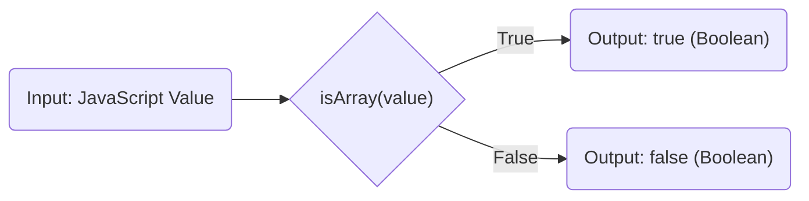

# Project Design Document: isarray Library

**Version:** 1.1
**Date:** October 26, 2023
**Author:** AI Software Architect

## 1. Introduction

This document provides an enhanced design overview of the `isarray` JavaScript library, located at [https://github.com/juliangruber/isarray](https://github.com/juliangruber/isarray). This revised document aims to provide a more robust foundation for subsequent threat modeling activities by offering clearer explanations and more specific security considerations.

## 2. Goals

*   Provide a clear and concise description of the `isarray` library's design and architecture.
*   Precisely identify the core component and its interaction with input and output.
*   Visually represent the data flow within the library for better understanding.
*   Offer more targeted security considerations to guide the threat modeling process effectively.

## 3. Scope

This document details the design of the `isarray` library as represented in the linked GitHub repository. The focus remains on the fundamental functionality of accurately determining if a given JavaScript value is an array, addressing potential inconsistencies across different JavaScript environments. Interactions with external environments are considered solely in the context of their direct impact on this library's function.

## 4. System Overview

The `isarray` library is a minimalist JavaScript utility designed to provide a dependable mechanism for verifying if a value is an array. Its primary purpose is to mitigate potential discrepancies or edge cases encountered when using the native `Array.isArray()` method across various JavaScript environments (e.g., different browsers, Node.js versions, and iframes). The library exposes a single function that accepts one argument and returns a boolean indicating whether the argument is an array. This library is often used in other JavaScript libraries to ensure consistent array checks.

## 5. Component Design

The `isarray` library comprises a single, central component:

*   **`isArray(value)` Function:**
    *   **Description:** This is the sole function within the library, responsible for the array check. It accepts a single JavaScript value as input.
    *   **Input:**  Any valid JavaScript value, which can be a primitive type (string, number, boolean, null, undefined, symbol) or an object.
    *   **Processing:** The function's internal logic aims to reliably determine if the provided `value` is an array. Common implementation techniques involve:
        *   Checking the `[[Class]]` internal property of the object using `Object.prototype.toString.call(value)`. This is a robust method for identifying the object's type.
        *   Potentially checking the `constructor` property against the `Array` constructor, although this method can be less reliable across different execution contexts.
    *   **Output:** A boolean value indicating the result of the array check:
        *   `true`: Returned if the input `value` is determined to be an array.
        *   `false`: Returned if the input `value` is not an array.

## 6. Data Flow Diagram

## 7. Security Considerations (For Threat Modeling)

This section provides specific areas to focus on during threat modeling, considering the library's simplicity:

*   **Input Type Confusion:**
    *   While the function is designed to handle any JavaScript value, threat modelers should consider scenarios where unexpected input types might lead to unexpected behavior or potential vulnerabilities in consuming applications.
    *   For example, how does the function behave with cross-realm objects or objects with manipulated `toStringTag` symbols?
*   **Logic Vulnerabilities in Implementation:**
    *   Careful examination of the actual implementation code is necessary to identify any subtle logic flaws that could lead to incorrect array identification in specific edge cases or JavaScript environments.
    *   Could a carefully crafted object bypass the array check?
*   **Indirect Dependency Risks:**
    *   Although `isarray` has no direct dependencies, its widespread use means vulnerabilities, however unlikely, could impact numerous dependent projects.
    *   Threat modeling should consider the potential impact on the broader ecosystem if a flaw were discovered.
*   **Supply Chain Vulnerabilities:**
    *   The risk of malicious code injection into the library's source code or published package remains a concern, as with any open-source dependency.
    *   Verification of the package's integrity and provenance is important.
*   **Performance Issues (Resource Exhaustion):**
    *   While highly improbable given the function's simplicity, consider if there are any theoretical scenarios where providing specific inputs could lead to excessive processing time, potentially causing a denial-of-service in resource-constrained environments.
*   **Prototype Pollution:**
    *   Although less directly relevant to the `isarray` function itself, if the library were extended or used in conjunction with other code that manipulates object prototypes, there's a theoretical risk of prototype pollution affecting the behavior of the `isArray` check. This is more of a contextual concern.

## 8. Assumptions and Constraints

*   The library's sole responsibility is to accurately determine if a given JavaScript value is an array.
*   The library is designed for use within standard JavaScript environments (browsers and Node.js).
*   The library does not perform any form of input sanitization or validation beyond the core type checking.
*   The library is expected to be lightweight and execute efficiently.

## 9. Future Considerations (Beyond Initial Threat Model)

These are potential future developments that are not within the scope of the current threat model but could be considered later:

*   **Performance Benchmarking:**  Formal performance testing across different JavaScript environments to ensure optimal efficiency.
*   **TypeScript Definitions:**  Providing official TypeScript declaration files (`.d.ts`) to enhance type safety for TypeScript users.
*   **Alternative Implementation Strategies:**  Exploring alternative, potentially more performant or robust, implementation techniques while maintaining backward compatibility.

This improved design document provides a more detailed and nuanced understanding of the `isarray` library, offering a stronger foundation for identifying and mitigating potential security threats during the threat modeling process. The added specificity in the security considerations aims to guide threat modelers towards more targeted and effective analysis.
