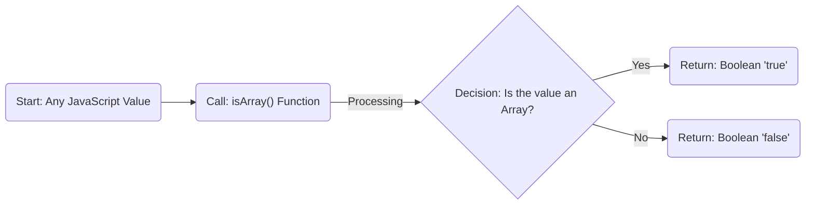
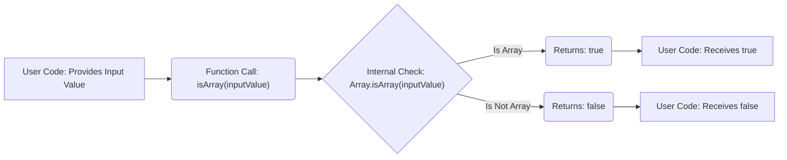

# Project Design Document: isarray Library

**Version:** 1.1
**Date:** October 26, 2023
**Author:** Gemini (AI Language Model)

## 1. Introduction

This document provides an enhanced design overview of the `isarray` JavaScript library ([https://github.com/juliangruber/isarray](https://github.com/juliangruber/isarray)). This detailed design serves as a foundation for comprehensive threat modeling, outlining the library's architecture, functionality, and potential security considerations. The goal is to provide a clear understanding of the system to identify potential vulnerabilities.

## 2. Goals

The primary objective of the `isarray` library is to offer a reliable and efficient method for verifying if a given JavaScript value is an array. Key goals include:

* **Accurate Array Identification:**  Consistently and correctly identify JavaScript array objects across various environments and JavaScript realms.
* **High Performance:** Execute the array check with minimal computational overhead to ensure it doesn't become a performance bottleneck.
* **Code Simplicity and Readability:** Maintain a codebase that is easy to understand, audit, and maintain.
* **Zero External Dependencies:** Avoid reliance on any external libraries to minimize the attack surface and reduce complexity.
* **Wide Compatibility:** Function correctly in a broad range of JavaScript environments (browsers, Node.js, etc.).

## 3. Architectural Overview

The `isarray` library features a straightforward architecture centered around a single, exported JavaScript function. This function is designed to perform the array check in isolation.



* **Entry Point:** The primary interaction with the library is through the `isArray()` function.
* **Core Logic:**  The `isArray()` function contains the core logic for determining if the input is an array.
* **Output:** The function returns a boolean value indicating whether the input is an array (`true`) or not (`false`).

## 4. Functional Description

The `isarray` library provides a single function for checking array types. Here's how it's typically used:

* **Installation:**  Installed via a package manager like npm: `npm install isarray`.
* **Usage:** Imported and called within JavaScript code:

```javascript
const isArray = require('isarray');

// Examples:
const array1 = [];
const array2 = [1, 2, 3];
const array3 = new Array();
const object1 = {};
const string1 = "hello";
const nullValue = null;
const undefinedValue = undefined;
const numberValue = 123;

// Expected Outputs:
// isArray(array1) === true
// isArray(array2) === true
// isArray(array3) === true
// isArray(object1) === false
// isArray(string1) === false
// isArray(nullValue) === false
// isArray(undefinedValue) === false
// isArray(numberValue) === false
```

The implementation of the `isArray()` function generally relies on the built-in JavaScript method:

* **`Array.isArray()`:** This static method of the `Array` constructor is the standard and most efficient way to determine if a value is an array. It's highly likely that `isarray` uses this internally.

## 5. Data Flow

The flow of data within the `isarray` library is simple and direct:



1. **Input Provision:** User code provides a JavaScript value as input to the `isArray()` function.
2. **Function Invocation:** The `isArray()` function is called with the provided input value.
3. **Internal Check:** The core logic, likely `Array.isArray()`, evaluates the input value.
4. **Conditional Return:**
    * If the internal check confirms the input is an array, the function returns the boolean value `true`.
    * If the internal check determines the input is not an array, the function returns the boolean value `false`.
5. **Output Reception:** The user code receives the boolean result returned by the `isArray()` function.

## 6. Deployment and Infrastructure

The `isarray` library is primarily deployed and distributed through the npm (Node Package Manager) registry.

* **Development:** Code is developed and maintained in a GitHub repository.
* **Packaging:** The library is packaged as a module for distribution.
* **Distribution:** Published to the npm registry, making it available for download and installation by developers.
* **Integration:** Developers integrate the library into their projects using package managers like npm or yarn.

The underlying infrastructure is minimal, relying on:

* **GitHub:** For version control and collaboration.
* **npm Registry:** For package hosting and distribution.

As a widely used package, the security of the npm registry and the maintainer's account are critical for the supply chain security of projects depending on `isarray`.

## 7. Dependencies

A significant design characteristic of the `isarray` library is its **lack of external dependencies**. This "zero-dependency" nature has several benefits:

* **Reduced Attack Surface:** Eliminates potential vulnerabilities introduced by external libraries.
* **Simplified Integration:** Easier to integrate into projects without worrying about dependency conflicts.
* **Smaller Bundle Size:** Contributes to a smaller overall application size.
* **Improved Reliability:** Reduces the risk of issues arising from updates or vulnerabilities in dependencies.

## 8. Security Considerations

While the `isarray` library is simple, it's important to consider potential security aspects for threat modeling:

* **Input Handling:** Although `Array.isArray()` is robust, understanding how the calling code uses the boolean result is crucial. Incorrect logic based on this result could introduce vulnerabilities elsewhere in the application.
* **Supply Chain Attacks:** As a widely used package, `isarray` is a potential target for supply chain attacks:
    * **Malicious Code Injection:**  A compromised maintainer account could lead to malicious code being injected into the package.
    * **Typosquatting:**  Attackers might create packages with similar names to trick developers into installing malicious versions.
* **Prototype Pollution (Indirect):** While `Array.isArray()` itself is not susceptible to prototype pollution, if the result is used to manipulate objects without proper validation, it could indirectly contribute to such vulnerabilities in the consuming application.
* **Denial of Service (DoS):** Due to its simplicity and efficiency, direct DoS attacks targeting `isarray` are unlikely. However, in extremely resource-constrained environments or under massive call volumes, the cumulative effect could be a consideration.
* **Compromised Maintainer Account:** The security of the maintainer's npm account is paramount. If compromised, malicious updates could be pushed to the registry.
* **Integrity of npm Registry:**  The security of the npm registry itself is a dependency for the safe distribution of `isarray`.

## 9. Assumptions and Constraints

The design of this document is based on the following assumptions and constraints:

* **JavaScript Environment:** The library is designed for standard JavaScript environments (browsers, Node.js, and others conforming to ECMAScript standards).
* **Standard Library Functionality:** It assumes the availability and correct functioning of built-in JavaScript features like `Array.isArray()`.
* **Single Responsibility:** The library's sole responsibility is to accurately determine if a value is an array.
* **Current Version:** This document reflects the design of the `isarray` library based on its current state in the linked GitHub repository.

## 10. Future Considerations

While `isarray` is a mature and stable library, some future considerations could include:

* **TypeScript Definitions:** Providing official TypeScript definition files could enhance the developer experience for TypeScript users.
* **Performance Benchmarking:**  Regular performance benchmarking across different JavaScript engines could ensure continued efficiency.
* **Security Audits:** Periodic security audits, even for such a simple library, can help identify potential unforeseen vulnerabilities or supply chain risks.
* **Subresource Integrity (SRI) for CDN Usage:** If the library is delivered via CDNs, providing SRI hashes can enhance security by ensuring the integrity of the delivered file.

This enhanced design document provides a more detailed understanding of the `isarray` library, specifically tailored for threat modeling purposes. By outlining its architecture, functionality, and potential security considerations, it serves as a valuable resource for identifying and mitigating potential risks.