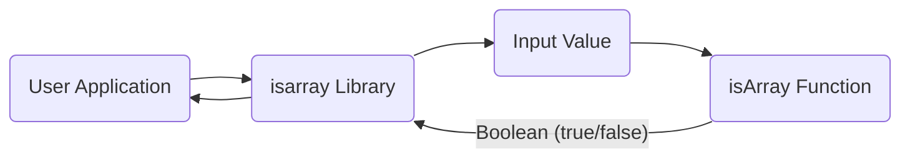
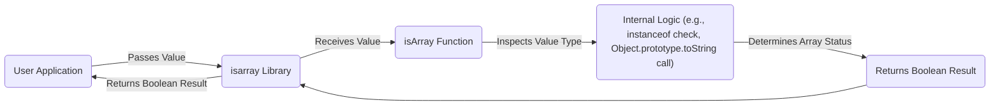

# Project Design Document: isarray Library

**Version:** 1.1
**Date:** October 26, 2023
**Author:** AI Software Architect

## 1. Introduction

This document details the design of the `isarray` JavaScript library, located at [https://github.com/juliangruber/isarray](https://github.com/juliangruber/isarray). It provides a clear understanding of the library's architecture and functionality, serving as a basis for subsequent threat modeling activities. This document aims to identify potential security considerations arising from the library's design and its integration into other software.

## 2. Project Overview

The `isarray` library offers a single, focused JavaScript function designed to efficiently determine if a given value is a JavaScript Array. It aims to provide a reliable alternative or polyfill for the native `Array.isArray()` method, particularly in environments where compatibility or performance of the native method might be a concern. The library's simplicity is a key design principle.

## 3. System Architecture

The `isarray` library is structured as a standalone JavaScript module. Its architecture is intentionally minimal, consisting of a single JavaScript file containing the core `isArray` function.

### 3.1. Architecture Diagram

This diagram illustrates the interaction between a user application and the `isarray` library.



### 3.2. Data Flow Diagram

This diagram shows how data (the input value) flows through the `isarray` library.



## 4. Key Functionality

The core functionality of the `isarray` library is encapsulated within the `isArray(value)` function.

*   **`isArray(value)`:**
    *   **Purpose:**  Determines if the provided `value` is a JavaScript Array.
    *   **Input:**  Accepts any valid JavaScript value.
    *   **Output:** Returns a boolean: `true` if the input is an Array, `false` otherwise.

## 5. Technology Stack

The `isarray` library utilizes the following technologies:

*   **Core Language:** JavaScript (ECMAScript standard)
*   **Distribution:** npm (Node Package Manager) for package distribution and management.
*   **Development & Testing (Implied):**  Standard JavaScript development tools and potentially a testing framework (e.g., Mocha, Jest) for ensuring code correctness, although these are not runtime dependencies.

## 6. Deployment Model

The `isarray` library is deployed as a package on the npm registry. Developers integrate it into their projects by installing it as a dependency.

*   **Installation Methods:**
    *   Using npm: `npm install isarray`
    *   Using yarn: `yarn add isarray`
    *   Using pnpm: `pnpm add isarray`
*   **Integration:**  The library is imported and the `isArray` function is called within JavaScript code.
    ```javascript
    const isArray = require('isarray');

    console.log(isArray([])); // Output: true
    console.log(isArray("string")); // Output: false
    ```

## 7. Security Considerations and Potential Threats

Given the focused nature of the `isarray` library, direct runtime security vulnerabilities within the core function are unlikely. However, it's crucial to consider potential threats related to its distribution and usage.

*   **Supply Chain Vulnerabilities:**
    *   **Compromised npm Package:**  A malicious actor could potentially compromise the npm registry or the maintainer's account and publish a modified, malicious version of the `isarray` package. This could introduce arbitrary code execution into applications using the compromised package.
    *   **Dependency Confusion:** While `isarray` has no runtime dependencies, vulnerabilities in the build or development dependencies could indirectly affect the integrity of the published package.
*   **Denial of Service (DoS) (Low Risk):** Although the `isArray` function is simple, in extremely resource-constrained environments or under massive load, the cumulative effect of numerous calls with unusual or very large inputs *could* theoretically lead to performance degradation. This is a low-probability threat given the function's nature.
*   **Type Confusion/Prototype Pollution (Mitigated by Design):**  While JavaScript's dynamic nature can lead to type confusion issues, the `isarray` function's specific purpose (checking for Array type) inherently mitigates risks related to it being misused to manipulate object prototypes or cause unexpected behavior based on input type. However, the *context* in which `isarray` is used might be susceptible to such issues if the calling code doesn't handle types correctly.
*   **Information Disclosure (Not Directly Applicable):** The `isarray` function itself does not handle or process sensitive data. Therefore, it's not directly susceptible to information disclosure vulnerabilities. However, the applications using `isarray` might handle sensitive data, and the correctness of `isarray` could be important for their logic.

## 8. Assumptions and Constraints

The design and threat model are based on the following assumptions and constraints:

*   **Target Environment:** Primarily intended for use in standard JavaScript environments (browsers and Node.js).
*   **Core Functionality Focus:** The library's sole purpose is to check if a value is an Array. It does not perform any other operations.
*   **Lightweight Design:** The library is designed to be small and performant, minimizing overhead.
*   **Correctness Priority:** The primary goal is to accurately determine if a value is an Array.
*   **No External Dependencies (Runtime):** The core functionality does not rely on any external runtime libraries.

## 9. Threat Modeling Focus Areas

Based on the design and potential threats, the following areas should be the primary focus during threat modeling exercises:

*   **Supply Chain Security Analysis:**  Evaluate the risks associated with the npm package distribution process and potential vulnerabilities in the development toolchain.
*   **Input Handling and Edge Cases:** While the function is simple, consider how it behaves with various JavaScript data types, including less common ones or objects mimicking arrays.
*   **Performance Under Stress:**  Assess the potential for performance degradation under high load or with unusual inputs, although this is a lower priority.
*   **Contextual Usage:**  Consider how the correctness of `isarray` impacts the security of applications that rely on it for type checking, especially when dealing with potentially untrusted data.

## 10. Future Considerations

Potential future enhancements for the `isarray` library could include:

*   **TypeScript Definitions:** Providing official TypeScript declaration files (`.d.ts`) to improve type safety and developer experience in TypeScript projects.
*   **Performance Benchmarking:**  Conducting and publishing performance benchmarks comparing `isarray` to the native `Array.isArray()` across different JavaScript environments.
*   **Security Audits:**  Consider periodic security audits of the codebase and the development/release process.

This revised document provides a more detailed and structured overview of the `isarray` library's design, explicitly highlighting potential security considerations relevant for threat modeling. The emphasis on supply chain security and the context of usage strengthens its value for security analysis.