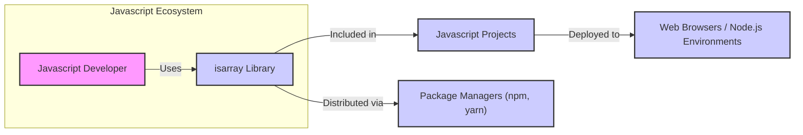
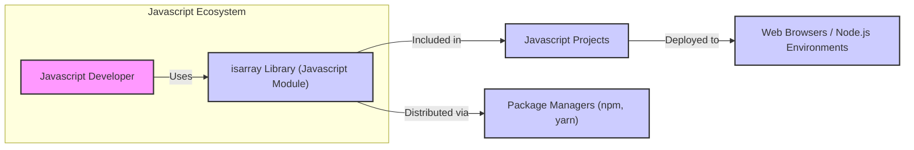
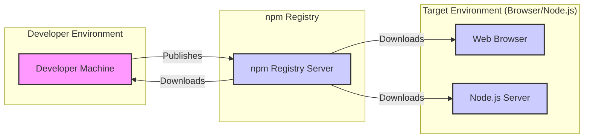

# BUSINESS POSTURE

- Business Priorities and Goals:
  - The primary goal of the `isarray` project is to provide a reliable and efficient utility function for Javascript developers to determine if a given value is an array. This enhances code quality and reduces potential errors in Javascript applications by ensuring accurate array type checking. The project prioritizes simplicity, performance, and correctness.
- Business Risks:
  - Dependency Risk: Although `isarray` has no dependencies, projects that depend on `isarray` might be indirectly affected if `isarray` were to introduce a bug or vulnerability.
  - Code Quality Risk: Bugs or inaccuracies in the `isarray` function could lead to incorrect array checks in dependent applications, potentially causing unexpected behavior or errors.
  - Supply Chain Risk: While unlikely for such a small, standalone library, there is a theoretical risk of supply chain attacks if the distribution mechanism (e.g., npm) were compromised.

# SECURITY POSTURE

- Existing Security Controls:
  - security control: Publicly accessible code repository on GitHub, allowing for community review and scrutiny. (Implemented: GitHub Repository)
  - security control: Version control using Git, providing history and traceability of code changes. (Implemented: GitHub Repository)
  - accepted risk: Limited formal security testing or code review processes are explicitly documented for this small, open-source utility library.
  - accepted risk: Reliance on community contributions and issue reporting for identifying and addressing potential vulnerabilities.
- Recommended Security Controls:
  - security control: Implement basic static analysis (linting) in the development and build process to catch potential code quality issues and simple security vulnerabilities.
  - security control: Establish a basic automated test suite, including unit tests, to ensure the correctness of the `isarray` function and prevent regressions.
- Security Requirements:
  - Authentication: Not applicable for a utility library. No authentication is required for usage.
  - Authorization: Not applicable for a utility library. No authorization is required for usage.
  - Input Validation: The `isarray` function itself performs input validation by checking the type of the input value to determine if it is an array.
  - Cryptography: Not applicable for a utility library that performs type checking. Cryptographic operations are not within the scope of this project.

# DESIGN

## C4 CONTEXT

- Context Diagram Elements:
  - - Name: Javascript Developer
    - Type: Person
    - Description: Software developers who write Javascript code and need to check if a value is an array.
    - Responsibilities: Uses the `isarray` library in their Javascript projects to ensure correct array type checking.
    - Security controls: Developers are responsible for securely integrating and using the `isarray` library in their projects, following secure coding practices.
  - - Name: isarray Library
    - Type: Software System
    - Description: A Javascript library that provides a single function to reliably determine if a value is an array.
    - Responsibilities: Accurately and efficiently checks if a given Javascript value is an array.
    - Security controls:  Basic code quality controls, community review on GitHub.
  - - Name: Javascript Projects
    - Type: Software System
    - Description: Various Javascript applications, libraries, or frameworks that incorporate and utilize the `isarray` library.
    - Responsibilities:  Application logic, including utilizing `isarray` for array checks as needed.
    - Security controls: Security controls are specific to each Javascript project and are not directly related to `isarray` itself, but proper usage of `isarray contributes to overall project security by reducing potential errors.
  - - Name: Web Browsers / Node.js Environments
    - Type: Environment
    - Description: The runtime environments where Javascript projects, including those using `isarray`, are executed.
    - Responsibilities: Executing Javascript code, providing Javascript runtime environment.
    - Security controls: Browser security models, Node.js security best practices, environment-specific security configurations.
  - - Name: Package Managers (npm, yarn)
    - Type: Software System
    - Description: Package managers used to distribute and install Javascript libraries, including `isarray`.
    - Responsibilities:  Distribution of Javascript packages, dependency management.
    - Security controls: Package manager security features (e.g., package signing, vulnerability scanning), repository security.

## C4 CONTAINER

- Container Diagram Elements:
  - - Name: isarray Library (Javascript Module)
    - Type: Container - Javascript Module
    - Description:  The `isarray` library is packaged as a single Javascript module, containing the `isArray` function. It is designed to be easily included and used in other Javascript projects.
    - Responsibilities:  Provides the core functionality of checking if a value is an array in Javascript.
    - Security controls:  Basic code quality controls, community review on GitHub.  No specific container-level security controls are directly applicable as it's a Javascript module. All security considerations are at the code and usage level.
  - - Name: Javascript Developer, Javascript Projects, Web Browsers / Node.js Environments, Package Managers (npm, yarn)
    - Type: Person, Software System, Environment, Software System
    - Description: Same as in C4 Context Diagram.
    - Responsibilities: Same as in C4 Context Diagram.
    - Security controls: Same as in C4 Context Diagram.

## DEPLOYMENT

- Deployment Diagram Elements:
  - - Name: Developer Machine
    - Type: Infrastructure - Computer
    - Description: The local computer used by the developer to write, test, and publish the `isarray` library.
    - Responsibilities: Development environment, running build and test processes, publishing the library to the npm registry.
    - Security controls: Developer machine security practices, code repository access controls.
  - - Name: npm Registry Server
    - Type: Infrastructure - Server
    - Description: The npm registry server that hosts and distributes Javascript packages, including `isarray`.
    - Responsibilities: Storing and serving Javascript packages, managing package versions, user authentication for publishing.
    - Security controls: npm registry security measures, access controls, vulnerability scanning of packages.
  - - Name: Web Browser
    - Type: Infrastructure - Environment
    - Description: Web browsers where Javascript applications using `isarray` are executed on client machines.
    - Responsibilities: Running Javascript code, providing a browser environment.
    - Security controls: Browser security model, sandboxing, web security standards.
  - - Name: Node.js Server
    - Type: Infrastructure - Server
    - Description: Node.js servers where Javascript applications using `isarray` are executed on server infrastructure.
    - Responsibilities: Running Javascript code, providing a server-side Javascript environment.
    - Security controls: Server operating system security, Node.js security best practices, network security controls.

## BUILD

```mermaid
flowchart LR
    A["Developer"] --> B["Code Repository (GitHub)"]
    B --> C["Build System (GitHub Actions / Local Script)"]
    C --> D["Tests & Linting"]
    D --> E["Package Creation"]
    E --> F["npm Registry"]
    F --> G["Distribution (npm install)"]
    style A fill:#f9f,stroke:#333,stroke-width:2px
    style B fill:#ccf,stroke:#333,stroke-width:2px
    style C fill:#ccf,stroke:#333,stroke-width:2px
    style D fill:#ccf,stroke:#333,stroke-width:2px
    style E fill:#ccf,stroke:#333,stroke-width:2px
    style F fill:#ccf,stroke:#333,stroke-width:2px
    style G fill:#ccf,stroke:#333,stroke-width:2px
```

- Build Process:
  - - Name: Developer
    - Type: Person
    - Description:  A software developer who writes and maintains the `isarray` library code.
    - Responsibilities: Writing code, committing changes to the repository, initiating the build and release process.
    - Security controls: Developer authentication to code repository, code review practices.
  - - Name: Code Repository (GitHub)
    - Type: Software System
    - Description:  GitHub repository hosting the source code of the `isarray` library.
    - Responsibilities: Version control, source code storage, collaboration platform.
    - Security controls: Access controls, branch protection, audit logs.
  - - Name: Build System (GitHub Actions / Local Script)
    - Type: Software System
    - Description:  Automated or manual system used to build, test, and package the `isarray` library. Could be GitHub Actions or a local script run by the developer.
    - Responsibilities: Automating the build process, running tests, linting, creating distributable packages.
    - Security controls: Secure build environment, access control to build system, audit logs.
  - - Name: Tests & Linting
    - Type: Process
    - Description:  Automated tests and linting tools used to verify code quality and catch potential issues.
    - Responsibilities: Ensuring code correctness, enforcing code style, identifying potential bugs or vulnerabilities.
    - Security controls: Static analysis tools, unit tests, integration tests.
  - - Name: Package Creation
    - Type: Process
    - Description:  Process of packaging the built library into a distributable format (e.g., npm package).
    - Responsibilities: Creating package artifacts, versioning, preparing for publication.
    - Security controls: Package integrity checks, signing (if applicable).
  - - Name: npm Registry
    - Type: Software System
    - Description:  npm registry where the `isarray` package is published and made available for download.
    - Responsibilities: Hosting and distributing the `isarray` package.
    - Security controls: npm registry security measures, package verification.
  - - Name: Distribution (npm install)
    - Type: Process
    - Description:  Process of developers and systems downloading and installing the `isarray` package from the npm registry.
    - Responsibilities: Making the library available to users.
    - Security controls: npm client security, secure download channels (HTTPS).

# RISK ASSESSMENT

- Critical Business Processes:
  - For a utility library like `isarray`, the critical business process is the reliable execution of Javascript code in applications that depend on it. Incorrect array checks due to bugs in `isarray` could lead to functional errors in dependent applications. However, the impact is generally low due to the library's simplicity and narrow scope.
- Data Sensitivity:
  - The `isarray` library itself does not handle sensitive data. The data it processes are Javascript values passed to the `isArray` function, which are not inherently sensitive. The sensitivity of data depends on the applications that use `isarray`, not `isarray` itself. The library's code is publicly available and not considered sensitive.

# QUESTIONS & ASSUMPTIONS

- Questions:
  - Are there any specific performance requirements for the `isarray` library beyond general efficiency?
  - Is there a formal process for reporting and addressing security vulnerabilities in this project, even though it's a small utility library?
  - Are there any specific coding standards or linting rules that are enforced for this project?
- Assumptions:
  - Assumption: The primary goal is to provide a correct and efficient `isArray` function. Security is a secondary consideration due to the library's simplicity and low risk profile.
  - Assumption: Standard open-source development practices are followed, including public code repository and community contributions.
  - Assumption: The library is intended for general use in Javascript environments and does not have specific deployment environment constraints beyond standard Javascript compatibility.