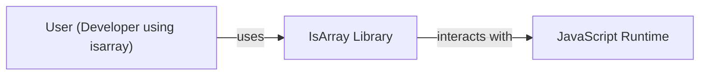
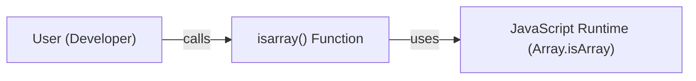
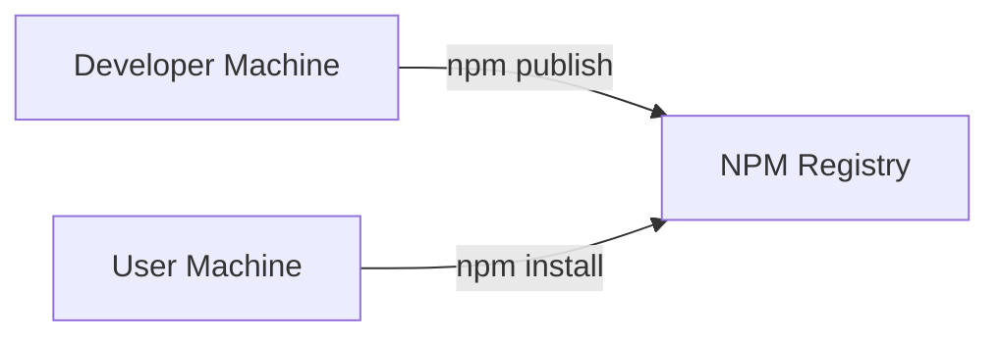
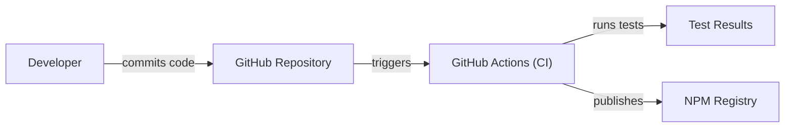

Okay, let's create a design document for the `isarray` project.

# BUSINESS POSTURE

Business Priorities and Goals:

*   Provide a simple, reliable, and highly performant utility function to determine if a given JavaScript value is an array.
*   Ensure the library is lightweight and has minimal dependencies to avoid bloating projects that use it.
*   Maintain broad compatibility across different JavaScript environments (browsers, Node.js, etc.).
*   Offer the library as an easily installable and updatable package via npm.
*   The project is a small, open-source utility. The primary goal is to provide a correct and efficient solution to a very specific problem.

Business Risks:

*   Incorrect Implementation: The primary risk is that the `isarray` function itself is flawed, leading to incorrect results (false positives or false negatives). This could cause unexpected behavior in applications relying on it.
*   Cross-Environment Incompatibility: If the library doesn't behave consistently across different JavaScript runtimes, it could break applications in specific environments.
*   Maintenance Overhead: While small, the library still requires maintenance (e.g., addressing potential bugs, updating dependencies if any, responding to issues).
*   Obsolescence: As JavaScript evolves, built-in methods might supersede the need for this library, although `Array.isArray` is already a standard. The risk is more about the library becoming irrelevant over time rather than a direct security risk.
*   Supply Chain Attacks: While the library itself has no dependencies, the build and publishing process could be a target. Compromise of the developer's npm account or build system could lead to malicious code being distributed.

# SECURITY POSTURE

Existing Security Controls:

*   security control: Code Reviews: The GitHub repository shows a history of pull requests and code changes, suggesting that some level of code review is performed.
*   security control: Testing: The project includes a test suite (`test.js`) that verifies the functionality of `isarray` across various inputs. This helps prevent regressions and ensures correctness.
*   security control: Simple Codebase: The core logic is extremely concise, reducing the attack surface.
*   security control: No Dependencies: The library explicitly avoids external dependencies, minimizing the risk of supply chain vulnerabilities through third-party code.
*   security control: Read only GitHub Workflows: Build process is protected by read only token.
*   security control: Semantic versioning: Project is using semantic versioning.

Accepted Risks:

*   accepted risk: Limited Formal Security Audits: Given the project's size and nature (a single, simple function), it's unlikely to have undergone extensive formal security audits.
*   accepted risk: Reliance on Developer Account Security: The security of the published package depends heavily on the security practices of the developer's npm account.

Recommended Security Controls:

*   security control: npm 2FA: Ensure that two-factor authentication is enabled for the npm account used to publish the package. This is a critical protection against account takeover.
*   security control: Automated Build Verification: Even though the build process is simple, ensure that the published package is built from the verified source code in the repository, ideally using a CI/CD system.
*   security control: Regularly review and update build tools: Keep build tools and dependencies up-to-date to mitigate potential vulnerabilities in the build process itself.

Security Requirements:

*   Authentication: Not applicable. This library does not handle authentication.
*   Authorization: Not applicable. This library does not handle authorization.
*   Input Validation: The library's single input is the value to be checked. The "validation" is the core functionality: determining if the input is an array. The library should handle all possible JavaScript values gracefully (e.g., null, undefined, objects, numbers, strings, etc.) without throwing errors or causing unexpected behavior.
*   Cryptography: Not applicable. This library does not involve cryptographic operations.

# DESIGN

## C4 CONTEXT

Element Description:

*   Element:
    *   Name: User (Developer using isarray)
    *   Type: Person
    *   Description: A developer who integrates the `isarray` library into their JavaScript project.
    *   Responsibilities: Calls the `isarray()` function with a value to check if it's an array.
    *   Security controls: Not applicable.

*   Element:
    *   Name: IsArray Library
    *   Type: Software System
    *   Description: The `isarray` library itself, providing the `isarray()` function.
    *   Responsibilities: Accurately determines if a given value is a JavaScript array.
    *   Security controls: Simple Codebase, No Dependencies, Testing.

*   Element:
    *   Name: JavaScript Runtime
    *   Type: System
    *   Description: The environment where the JavaScript code is executed (e.g., a browser's JavaScript engine, Node.js).
    *   Responsibilities: Executes the `isarray` code and provides the underlying JavaScript engine capabilities.
    *   Security controls: Relies on the security of the runtime environment itself.

## C4 CONTAINER

Element Description:

*   Element:
    *   Name: User (Developer)
    *   Type: Person
    *   Description: A developer who integrates the `isarray` library into their JavaScript project.
    *   Responsibilities: Calls the `isarray()` function.
    *   Security controls: Not applicable.

*   Element:
    *   Name: isarray() Function
    *   Type: Container (Function)
    *   Description: The single function provided by the library.
    *   Responsibilities: Implements the logic to determine if a value is an array.
    *   Security controls: Simple Codebase, Testing.

*   Element:
    *   Name: JavaScript Runtime (Array.isArray)
    *   Type: Container (Runtime)
    *   Description: The built-in `Array.isArray` function provided by the JavaScript runtime.
    *   Responsibilities: Provides the native implementation for array checking.
    *   Security controls: Relies on the security of the runtime environment.

## DEPLOYMENT

Deployment Solutions:

1.  Direct npm Installation: Developers install the package directly from the npm registry using `npm install isarray`. This is the standard and most common approach.
2.  Bundled with Application Code: The library's code might be bundled directly into an application's codebase using a bundler like Webpack or Browserify. This eliminates the external dependency at runtime but makes updates less direct.
3.  Included via CDN: While less common for small utility libraries, it's theoretically possible to include the library from a CDN.

Chosen Solution (Direct npm Installation):

Element Description:

*   Element:
    *   Name: Developer Machine
    *   Type: Infrastructure
    *   Description: The developer's local development environment.
    *   Responsibilities: Hosts the source code, runs tests, and publishes the package.
    *   Security controls: Relies on the developer's machine security.

*   Element:
    *   Name: NPM Registry
    *   Type: Infrastructure
    *   Description: The public npm registry where the `isarray` package is hosted.
    *   Responsibilities: Stores and serves the published package.
    *   Security controls: npm's security measures (e.g., 2FA, package signing, vulnerability scanning).

*   Element:
    *   Name: User Machine
    *   Type: Infrastructure
    *   Description: The machine where a user installs and uses the `isarray` library.
    *   Responsibilities: Downloads and installs the package from npm.
    *   Security controls: Relies on the user's machine security and npm client security.

## BUILD

Build Process Description:

1.  Developer commits code changes to the GitHub repository.
2.  GitHub Actions is triggered by the commit (or a pull request).
3.  The GitHub Actions workflow checks out the code.
4.  The workflow runs the test suite (`npm test`).
5.  If tests pass, and the commit is on the main branch (or a designated release branch), the workflow publishes the package to the npm registry using `npm publish`.  This step should ideally use a dedicated npm token with limited permissions.
6.  Read only token is used to access GitHub Workflows.

Security Controls in Build Process:

*   security control: Automated Testing: The test suite is run automatically on every commit/pull request, ensuring that changes don't introduce regressions.
*   security control: CI/CD: GitHub Actions provides a controlled and reproducible build environment.
*   security control: Limited npm Token: The npm token used for publishing should have the minimum necessary permissions (ideally, only publish permissions).
*   security control: Code Review: Pull requests and code reviews before merging to the main branch help catch potential issues.
*   security control: Read only GitHub Workflows: Build process is protected by read only token.

# RISK ASSESSMENT

Critical Business Process:

*   Providing a reliable and accurate array-checking utility. The critical process is the correct execution of the `isarray()` function.

Data Protection:

*   The library itself does not handle any sensitive data. It operates solely on the input value provided to it, determining its type.  The sensitivity of the data being checked is entirely dependent on the application using the library.  The library itself does not store, transmit, or process any data beyond the immediate input value.

# QUESTIONS & ASSUMPTIONS

Questions:

*   Are there any specific performance benchmarks or targets that the library should meet?
*   Are there any plans to expand the functionality of the library beyond the core `isarray` check?
*   Is there a specific process for handling vulnerability reports or security issues?

Assumptions:

*   BUSINESS POSTURE: The primary goal is to provide a correct and efficient solution, prioritizing simplicity and reliability over extensive features.
*   SECURITY POSTURE: The developer has basic security awareness and will implement recommended security controls (like npm 2FA).
*   DESIGN: The library will remain a single-function utility with no external dependencies. The deployment will primarily be via npm. The build process will continue to use GitHub Actions.