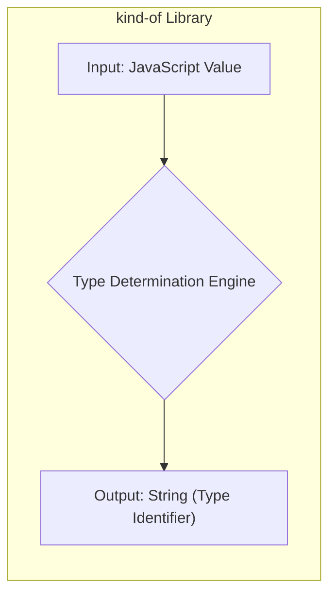
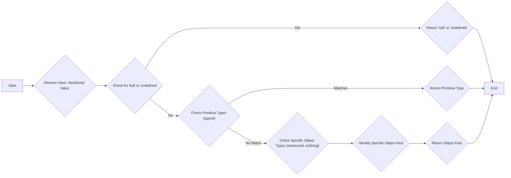

# Project Design Document: kind-of Library

**Version:** 1.1
**Date:** October 26, 2023
**Author:** Gemini (AI Language Model)

## 1. Introduction

This document provides an enhanced design overview of the `kind-of` JavaScript library. This library is designed to accurately determine the "kind" of a JavaScript value, offering more precise type identification than the built-in `typeof` operator. This detailed design will serve as a robust foundation for future threat modeling activities.

**Project Repository:** [https://github.com/jonschlinkert/kind-of](https://github.com/jonschlinkert/kind-of)

## 2. Project Overview

The `kind-of` library offers a reliable and comprehensive solution for identifying the underlying type of JavaScript values. It surpasses the limitations of the basic `typeof` operator by distinguishing between a wider range of object types, primitive values, and special cases. This granular type detection is essential for developers requiring precise type checks for tasks such as data validation, function overloading, dynamic type handling, and robust conditional logic.

## 3. Goals and Objectives

*   **Accurate Type Identification:**  Provide highly accurate and consistent type identification across a broad spectrum of JavaScript values, including complex objects and edge cases.
*   **Granular Type Detection:** Offer a significantly more detailed level of type detection compared to the standard `typeof` operator, differentiating between various object subtypes.
*   **Performance Efficiency:** Maintain a small performance footprint to ensure minimal overhead, as type checking is often a frequently executed operation.
*   **Ease of Integration:**  Be simple and straightforward to integrate into existing JavaScript projects with minimal configuration.
*   **High Reliability:**  Ensure the library is well-tested, dependable, and produces consistent results across different JavaScript runtime environments (browsers, Node.js).
*   **Maintainable Codebase:**  Maintain a clean, well-documented, and modular codebase to facilitate future maintenance, updates, and potential contributions.

## 4. Target Audience

The primary users of the `kind-of` library are JavaScript developers who need precise and reliable type checking capabilities in their projects. This includes:

*   Frontend Web Developers: For robust data handling and component logic.
*   Backend Node.js Developers: For API development, data validation, and server-side logic.
*   JavaScript Library and Framework Authors: To build more robust and type-aware libraries.
*   Quality Assurance and Testing Engineers: For writing more accurate and effective unit and integration tests.

## 5. Functional Description

The core functionality of the `kind-of` library revolves around a central function (or a focused set of internal functions) that analyzes a given JavaScript value and returns a string representing its specific "kind."

**Key Functionality and Examples:**

*   **Primitive Type Detection:** Accurately identifies fundamental JavaScript primitives:
    *   `string`:  e.g., `"hello"`, `String('world')`
    *   `number`: e.g., `123`, `NaN`, `Infinity`
    *   `boolean`: e.g., `true`, `false`
    *   `null`: e.g., `null`
    *   `undefined`: e.g., `undefined`
    *   `symbol`: e.g., `Symbol('foo')`
    *   `bigint`: e.g., `10n`
*   **Object Type Detection:**  Provides detailed identification of various JavaScript object types:
    *   `plainObject`: Objects created with literal syntax or `new Object()`: e.g., `{}`, `new Object()`
    *   `date`: Instances of the `Date` object: e.g., `new Date()`
    *   `regexp`: Regular expression objects: e.g., `/abc/`, `new RegExp('abc')`
    *   `array`: Array instances: e.g., `[]`, `new Array()`
    *   `arguments`: The `arguments` object available within non-arrow functions.
    *   `function`: Standard JavaScript functions.
    *   `generatorfunction`: Generator functions declared with `function*`.
    *   `asyncfunction`: Asynchronous functions declared with `async function`.
    *   `promise`: Instances of the `Promise` object.
    *   `error`: Instances of `Error` and its subtypes (e.g., `TypeError`, `RangeError`).
    *   `map`: Instances of the `Map` object.
    *   `set`: Instances of the `Set` object.
    *   `weakmap`: Instances of the `WeakMap` object.
    *   `weakset`: Instances of the `WeakSet` object.
    *   `arraybuffer`: Instances of the `ArrayBuffer` object.
    *   `sharedarraybuffer`: Instances of the `SharedArrayBuffer` object.
    *   `dataview`: Instances of the `DataView` object.
    *   `int8array`, `uint8array`, `uint8clampedarray`, `int16array`, `uint16array`, `int32array`, `uint32array`, `float32array`, `float64array`, `biguint64array`, `bigint64array`: Instances of Typed Array objects.
*   **Special Value Handling:**  Correctly identifies special JavaScript values:
    *   `NaN`:  Not a Number.
*   **Potential Customization/Extension Points:** While not explicitly a core feature, the library's internal structure might allow for extending its type detection capabilities in specific scenarios.

## 6. Non-Functional Requirements

*   **High Performance:** The library must execute type checks with minimal performance overhead. Given the frequency of type checking in many applications, even small performance bottlenecks can be significant. This requires efficient algorithms and minimal function call overhead.
*   **Exceptional Accuracy:**  The primary objective is to provide highly accurate type identification. Incorrectly identifying a value's type can lead to logical errors and potential security vulnerabilities in consuming applications. Rigorous testing is crucial to ensure accuracy across all JavaScript environments.
*   **Cross-Environment Reliability:** The library should function consistently and reliably across various JavaScript runtime environments, including different web browsers (Chrome, Firefox, Safari, Edge) and Node.js versions. This requires careful consideration of browser-specific quirks and standard compliance.
*   **Maintainability and Readability:** The codebase should be well-organized, clearly commented, and adhere to consistent coding standards. This facilitates easier understanding, debugging, and future maintenance by the original developers or community contributors.
*   **Security Integrity:** The library itself must not introduce security vulnerabilities. This involves ensuring the type checking logic is robust and does not inadvertently create opportunities for exploitation, such as prototype pollution or unexpected behavior with specially crafted inputs. Supply chain security is also a key consideration.

## 7. System Architecture

The `kind-of` library employs a straightforward architecture centered around its core type detection logic.



**Components:**

*   **Input: JavaScript Value:** The value whose type needs to be determined. This can be any valid JavaScript value.
*   **Type Determination Engine:** The central component containing the logic for identifying the type of the input value. This likely involves a series of conditional checks and comparisons using JavaScript operators and built-in methods.
*   **Output: String (Type Identifier):** A string representing the determined "kind" of the input value (e.g., "object", "array", "number", "null").

## 8. Data Flow Diagram

The data flow within the `kind-of` library involves a sequence of checks to determine the value's type.



**Detailed Data Flow Steps:**

1. **Start:** The `kind-of` function is invoked with a JavaScript value as input.
2. **Receive Input: JavaScript Value:** The function receives the value to be analyzed.
3. **Check for Null or Undefined:** The first checks often involve explicitly checking if the value is `null` or `undefined`, as `typeof null` returns "object" which is inaccurate.
4. **Return 'null' or 'undefined':** If the value is `null` or `undefined`, the corresponding string is returned.
5. **Check Primitive Types (typeof):** If not `null` or `undefined`, the `typeof` operator is used to check for basic primitive types (e.g., "string", "number", "boolean", "symbol", "bigint", "function").
6. **Return Primitive Type:** If `typeof` yields a primitive type, that type name is returned.
7. **Check Specific Object Types (instanceof, toString):** If `typeof` returns "object" or "function", more specific checks are performed. This often involves:
    *   Using the `instanceof` operator to check against specific constructor functions (e.g., `value instanceof Date`, `value instanceof Array`).
    *   Using `Object.prototype.toString.call(value)` to get a more precise type string, which can then be parsed to identify specific object types like `"[object Array]"`, `"[object Date]"`, `"[object RegExp]"`, etc.
8. **Identify Specific Object Kind:** Based on the results of the `instanceof` checks and `toString` analysis, the specific "kind" of the object is determined.
9. **Return Object Kind:** The string representing the specific object type (e.g., "array", "date", "regexp", "map") is returned.
10. **End:** The function returns the determined type identifier.

## 9. Security Considerations

While `kind-of` is a utility library, its role in determining data types makes security considerations important, especially when used in contexts involving untrusted data.

**Potential Security Concerns and Mitigation Strategies:**

*   **Incorrect Type Identification Leading to Exploits:** If `kind-of` incorrectly identifies the type of an input, consuming applications might make incorrect assumptions, potentially leading to vulnerabilities. For example, if a string is misidentified as an object, it might bypass sanitization routines designed for strings.
    *   **Mitigation:** Rigorous unit and integration testing with a wide range of inputs, including edge cases and potentially malicious payloads, is crucial. Code reviews should focus on the accuracy of the type checking logic.
*   **Prototype Pollution:** Although less likely in a library like `kind-of`, vulnerabilities in the type checking logic could potentially be exploited to pollute the `Object.prototype`.
    *   **Mitigation:**  Careful scrutiny of the code to ensure no unintended modifications to prototype chains occur. Employing secure coding practices and avoiding dynamic property access based on potentially untrusted input within the library itself.
*   **Denial of Service (DoS) through Complex Inputs:**  While the logic is generally simple, extremely large or deeply nested objects could potentially cause performance issues if the type checking logic is not efficient.
    *   **Mitigation:**  Performance testing with large and complex inputs. Ensuring the type checking logic has reasonable time complexity.
*   **Supply Chain Attacks:**  Compromise of the `kind-of` library's dependencies or the library itself could introduce malicious code into projects that depend on it.
    *   **Mitigation:**  Regularly auditing dependencies for known vulnerabilities. Using tools like `npm audit` or `yarn audit`. Verifying the integrity of the library's source code and releases.
*   **Regular Expression Denial of Service (ReDoS):** If regular expressions are used internally for type checking (e.g., parsing the output of `toString`), poorly written regexes could be vulnerable to ReDoS attacks.
    *   **Mitigation:**  Careful review and testing of any regular expressions used within the library to ensure they are not susceptible to ReDoS.

## 10. Dependencies

As a relatively small and focused utility, `kind-of` aims to have minimal runtime dependencies to reduce its footprint and potential attack surface.

*   **Runtime Dependencies:**  *(Refer to the project's `package.json` file on GitHub for the most accurate and up-to-date list of runtime dependencies.)*  Ideally, this library should have zero or very few runtime dependencies.
*   **Development Dependencies:**  The project will likely have development dependencies for tasks such as testing, linting, and building. These dependencies should also be considered from a supply chain security perspective. *(Refer to the project's `package.json` file for the list of development dependencies.)*

It is crucial to regularly review the `package.json` file to stay informed about the library's dependencies and any potential security vulnerabilities associated with them.

## 11. Deployment

The `kind-of` library is deployed as a reusable module within the JavaScript ecosystem.

**Deployment and Usage:**

1. **Installation:** Developers install the library into their projects using a package manager like npm or yarn:
    ```bash
    npm install kind-of
    ```
    or
    ```bash
    yarn add kind-of
    ```
2. **Integration:**  The library is then imported and used within JavaScript code:
    ```javascript
    const kindOf = require('kind-of');

    console.log(kindOf("example string"));   // Output: string
    console.log(kindOf([1, 2, 3]));        // Output: array
    console.log(kindOf(new Date()));       // Output: date
    console.log(kindOf(null));             // Output: null
    ```
3. **Distribution:** The library is typically distributed through npm (Node Package Manager) for public consumption.

## 12. Future Considerations

*   **TypeScript Definitions:** Providing official TypeScript definition files (`.d.ts`) would significantly enhance the developer experience for TypeScript users by providing static typing and improved IDE support.
*   **Performance Benchmarking and Optimization:**  Continuously monitor and benchmark the library's performance across different JavaScript engines and identify areas for potential optimization.
*   **Extensibility Mechanisms:** Explore providing well-defined interfaces or mechanisms for developers to extend the library's type detection capabilities for custom object types or specific use cases.
*   **More Granular Error Type Detection:**  Potentially differentiate between more specific error types (e.g., `TypeError`, `SyntaxError`) instead of just returning "error".
*   **Internationalization (i18n) Considerations (If Applicable):** While less likely for a type checking library, consider if any aspects of the library's output or behavior might need to be localized in the future.
*   **Security Audits:**  Conduct periodic security audits by independent security experts to identify and address potential vulnerabilities.

This enhanced design document provides a more detailed and comprehensive overview of the `kind-of` library, offering a solid foundation for understanding its functionality, architecture, security considerations, and future development. This document is well-suited for supporting thorough threat modeling activities.
