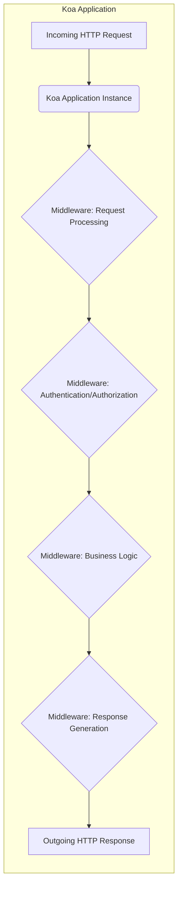
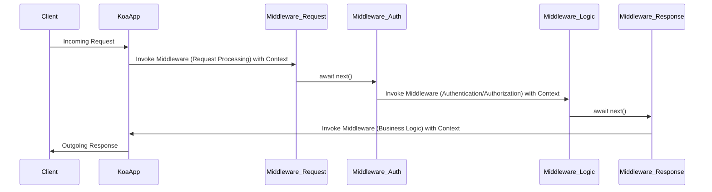

# Project Design Document: Koa.js Framework

**Version:** 1.1
**Date:** October 26, 2023
**Author:** AI Software Architect

## 1. Introduction

This document provides an enhanced design overview of the Koa.js framework, specifically tailored for threat modeling. It details the architecture, key components, and data flow within Koa.js to facilitate a comprehensive understanding for security analysis and the identification of potential vulnerabilities. This document serves as a crucial reference point for security assessments and the development of mitigation strategies.

## 2. Goals and Objectives

*   Provide a clear and detailed articulation of the architectural design of the Koa.js framework, optimized for security analysis.
*   Identify and describe the core components of Koa.js, emphasizing their interactions and potential security implications.
*   Thoroughly describe the request/response lifecycle and data flow within the framework, highlighting critical points for security considerations.
*   Explicitly highlight key areas relevant for security considerations, providing a structured approach to threat modeling.
*   Serve as a foundational document for conducting thorough threat modeling exercises and developing robust security mitigation strategies.

## 3. System Architecture

Koa.js is a minimalist and flexible Node.js web application framework, renowned for its elegant design and focus on middleware. Built by the team behind Express, Koa leverages asynchronous functions (`async`/`await`) to enhance error handling and streamline middleware composition. The core of Koa's architecture is its middleware pipeline, through which each incoming request flows.

### 3.1. Key Architectural Concepts

*   **Middleware Pipeline:** The fundamental architectural pattern in Koa. Middleware functions are chained together and executed sequentially for each incoming request. Each middleware can perform specific tasks, modify the request or response, and either pass control to the next middleware or terminate the pipeline.
*   **Context (`ctx`):** A central object unique to each request. It encapsulates the Node.js request and response objects, along with Koa-specific helpers and properties. The context provides a consistent and convenient interface for middleware to interact with the request and response.
*   **Request and Response Abstractions:** Koa provides enhanced `Request` and `Response` objects, built upon Node.js's native equivalents. These abstractions offer more user-friendly methods and properties for accessing request information and manipulating the response.
*   **Asynchronous Control Flow:** The use of `async`/`await` simplifies asynchronous operations within middleware, making code easier to read and reason about, particularly for error handling.
*   **Layered Architecture:** Koa promotes a layered architecture through its middleware system, allowing for clear separation of concerns and modularity.

## 4. Data Flow

The journey of a request through a Koa application can be broken down into distinct stages:

1. **Client Request:** A client initiates an HTTP request targeting the Koa.js application.
2. **Request Reception:** The Koa application instance receives the incoming HTTP request.
3. **Middleware Execution:** The request enters the middleware pipeline, and each middleware is invoked in the order it was defined.
    *   **Request Processing Middleware:**  Middleware at the beginning of the pipeline often handles tasks like logging, request body parsing, and header processing.
    *   **Authentication and Authorization Middleware:** These middleware components verify the identity of the client and determine if they have the necessary permissions to access the requested resource.
    *   **Business Logic Middleware:** This layer contains the core application logic, processing the request and interacting with data sources.
    *   **Response Generation Middleware:** Middleware towards the end of the pipeline is responsible for constructing and formatting the HTTP response.
4. **Response Construction:** After the middleware pipeline completes (or is short-circuited), the application (or a specific middleware) constructs the HTTP response.
5. **Response Transmission:** The Koa application sends the generated HTTP response back to the client.

## 5. Key Components

A Koa.js application comprises several key components that work together to handle requests and generate responses.

*   **`Application` Class Instance:**
    *   The central orchestrator of the Koa application.
    *   Manages the middleware stack and the order of execution.
    *   Listens for incoming connections and dispatches requests to the middleware pipeline.
    *   Provides methods for configuring application settings and handling errors (e.g., `app.use()`, `app.listen()`, `app.on('error')`).
*   **`Context` Class Instance (`ctx`):**
    *   A per-request object providing a unified interface to the request and response.
    *   Exposes properties and methods for accessing request headers, body, query parameters, and for setting response status, headers, and body (e.g., `ctx.request`, `ctx.response`, `ctx.body`, `ctx.status`).
    *   Facilitates data sharing and communication between middleware.
*   **`Request` Class Instance (`ctx.request`):**
    *   An abstraction over Node.js's `http.IncomingMessage`, providing a higher-level API for accessing request information.
    *   Includes properties for accessing headers, URL, method, and parsed body (depending on body-parsing middleware).
*   **`Response` Class Instance (`ctx.response`):**
    *   An abstraction over Node.js's `http.ServerResponse`, offering a more convenient way to manipulate the response.
    *   Provides methods for setting headers, status codes, and the response body.
*   **Middleware Functions:**
    *   Asynchronous functions with the signature `async (ctx, next) => { ... }`.
    *   Executed sequentially in the order they are added to the application.
    *   Responsible for handling specific aspects of the request/response cycle.
    *   Examples include:
        *   **Logging Middleware:** Records request details.
        *   **Body Parsing Middleware:** Parses request bodies (e.g., JSON, URL-encoded).
        *   **Authentication Middleware:** Verifies user credentials.
        *   **Authorization Middleware:** Checks user permissions.
        *   **Routing Middleware (e.g., `koa-router`):** Maps incoming requests to specific handlers based on URL and method.
        *   **Error Handling Middleware:** Catches and handles errors that occur during request processing.
*   **Router Middleware (e.g., `koa-router`):**
    *   An external middleware used for defining routes and associating them with specific handler middleware.
    *   Provides a structured way to map HTTP methods and paths to application logic.
    *   Often used for building RESTful APIs.

## 6. Security Considerations for Threat Modeling

This section outlines key areas to consider when performing threat modeling on a Koa.js application. Understanding these aspects is crucial for identifying potential vulnerabilities.

*   **Input Handling and Validation:**
    *   **Vulnerability:** Injection attacks (e.g., SQL injection, command injection, cross-site scripting).
    *   **Considerations:** How is user-provided data validated and sanitized within middleware? Are appropriate encoding and escaping techniques used? Are there any implicit trust assumptions about incoming data?
*   **Authentication and Authorization:**
    *   **Vulnerability:** Unauthorized access, privilege escalation, session hijacking.
    *   **Considerations:** How is user identity verified? What mechanisms are in place for managing user sessions? How are access controls enforced to protect resources? Are there any weaknesses in the authentication or authorization logic?
*   **Session Management:**
    *   **Vulnerability:** Session fixation, session hijacking, insecure session storage.
    *   **Considerations:** How are session IDs generated and protected? Where is session data stored? Is session data encrypted in transit and at rest? Are there appropriate timeouts and invalidation mechanisms?
*   **Cross-Site Scripting (XSS):**
    *   **Vulnerability:** Execution of malicious scripts in the user's browser.
    *   **Considerations:** How is user-generated content handled and displayed? Are appropriate output encoding techniques used to prevent the injection of malicious scripts?
*   **Cross-Site Request Forgery (CSRF):**
    *   **Vulnerability:** Unauthorized actions performed on behalf of an authenticated user.
    *   **Considerations:** Are CSRF tokens used to protect state-changing requests? Are there any exceptions or bypasses to CSRF protection?
*   **Data Protection:**
    *   **Vulnerability:** Data breaches, exposure of sensitive information.
    *   **Considerations:** How is sensitive data stored and transmitted? Is encryption used for data at rest and in transit (HTTPS)? Are there any vulnerabilities related to data leakage through logging or error messages?
*   **Dependency Management:**
    *   **Vulnerability:** Exploitation of vulnerabilities in third-party libraries.
    *   **Considerations:** Are dependencies regularly updated to address known vulnerabilities? Is there a process for reviewing and managing dependencies?
*   **Error Handling and Logging:**
    *   **Vulnerability:** Information disclosure through error messages, insecure logging practices.
    *   **Considerations:** How are errors handled within the application? Are error messages sanitized to prevent the disclosure of sensitive information? Are logs securely stored and accessed?
*   **Middleware Security:**
    *   **Vulnerability:** Malicious or vulnerable middleware compromising the application.
    *   **Considerations:** Are all middleware components trusted and well-maintained? Could a compromised middleware component be used to bypass security controls or access sensitive data?
*   **Rate Limiting and Abuse Prevention:**
    *   **Vulnerability:** Denial-of-service attacks, brute-force attacks.
    *   **Considerations:** Are there mechanisms in place to limit the number of requests from a single source? Are there protections against automated attacks?

## 7. Deployment Considerations and Security Implications

The deployment environment significantly impacts the security posture of a Koa.js application.

*   **Reverse Proxy Configuration:** A properly configured reverse proxy (e.g., Nginx, Apache) can provide essential security features such as SSL termination, request filtering, and protection against common web attacks. Misconfigurations can introduce vulnerabilities.
*   **Operating System and Node.js Security:** Keeping the underlying operating system and Node.js runtime updated with security patches is critical.
*   **Containerization (e.g., Docker):** Containerization can enhance security by providing isolation and limiting the impact of potential breaches. However, container images themselves need to be secured.
*   **Cloud Environment Security:** Cloud providers offer various security services (e.g., firewalls, intrusion detection, vulnerability scanning) that should be configured and utilized effectively.
*   **Network Security:** Proper network segmentation, firewall rules, and intrusion detection systems are essential for protecting the application and its environment.

## 8. Out of Scope

This document focuses on the design and architecture of the Koa.js framework for threat modeling purposes. The following aspects are considered out of scope:

*   Specific applications built on top of Koa.js.
*   Detailed design and implementation of individual middleware components.
*   Comprehensive vulnerability assessments or penetration testing results.
*   Deployment-specific infrastructure configurations and security policies.
*   Performance tuning and optimization strategies.

## 9. Future Considerations

*   Detailed sequence diagrams illustrating complex interactions between middleware components in specific security-sensitive scenarios.
*   A dedicated section outlining common attack vectors targeting Koa.js applications and recommended mitigation strategies.
*   Integration with threat modeling methodologies (e.g., STRIDE, PASTA).
*   Guidance on secure coding practices for developing Koa.js middleware.

This enhanced design document provides a more detailed and security-focused overview of the Koa.js framework. It aims to equip security professionals with the necessary information to conduct thorough threat modeling exercises and identify potential vulnerabilities within Koa.js applications. By understanding the architecture, data flow, and key security considerations, developers and security teams can build more secure and resilient web applications.
