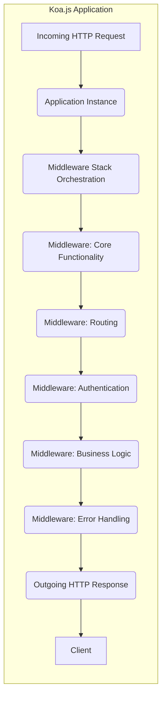
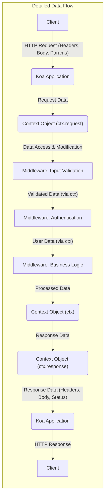

## Project Design Document: Koa.js Framework (Improved)

**Version:** 1.1
**Date:** October 26, 2023
**Author:** AI Software Architect

### 1. Introduction

This document provides an enhanced architectural design of the Koa.js web framework, focusing on aspects relevant to security threat modeling. It details the core components, their interactions during the request lifecycle, and potential security considerations. This document serves as a refined foundation for subsequent threat modeling activities.

### 2. Project Overview

Koa.js is a modern, lightweight, and flexible web framework for Node.js. It leverages asynchronous functions (async/await) to improve error handling and provides a clean, middleware-based architecture for building web applications and APIs. Koa.js distinguishes itself by its small core and reliance on middleware for most functionalities, offering greater control and customization compared to more monolithic frameworks.

### 3. Architectural Overview

Koa.js applications are structured as a pipeline of middleware functions that process incoming HTTP requests. The request flows through this stack, with each middleware having the opportunity to inspect, modify, or terminate the request/response cycle.



### 4. Core Components

*   **Application Instance:** The central object, responsible for managing the middleware stack and initiating the request processing pipeline. It extends Node.js's `EventEmitter`.
*   **Context Object (ctx):** A crucial object created per request, providing a unified interface to both the request and response. It encapsulates Node.js's `http.IncomingMessage` and `http.ServerResponse`, offering helper methods and properties for common tasks. The context is the primary mechanism for passing data and control through the middleware stack.
*   **Request Object (ctx.request):** A Koa-specific request object built on top of Node.js's `http.IncomingMessage`. It provides higher-level abstractions for accessing request headers, query parameters, request body (often handled by body-parsing middleware), and other request-related information.
*   **Response Object (ctx.response):** A Koa-specific response object built on top of Node.js's `http.ServerResponse`. It offers methods and properties for setting response status codes, headers, and the response body. Koa encourages setting response properties via `ctx.response` rather than directly manipulating the underlying Node.js response object.
*   **Middleware:** Asynchronous functions with the signature `async (ctx, next) => { ... }`. They are the fundamental building blocks of a Koa.js application. Middleware functions are executed sequentially, forming a stack.
    *   `ctx`: The context object for the current request.
    *   `next`: A function that, when called, yields control to the next middleware in the stack. The execution of subsequent middleware happens *after* the `await next()` call returns, allowing for pre- and post-processing logic.
*   **Router (External Middleware):**  While not part of the Koa.js core, router middleware (like `koa-router`) is essential for mapping incoming requests to specific handler functions based on the request path and HTTP method.
*   **Error Handling (Middleware):** Dedicated middleware can be used to catch errors thrown during the request processing pipeline, allowing for centralized error logging and response formatting.

### 5. Request Lifecycle (Detailed)

The journey of an HTTP request through a Koa.js application involves the following stages:

1. **Client Request:** A client sends an HTTP request to the server.
2. **Node.js Server Reception:** The underlying Node.js HTTP server receives the request.
3. **Koa Application Handling:** The request is passed to the registered Koa.js application instance.
4. **Context Creation:** A new `Context` object is created, encapsulating the Node.js request and response objects.
5. **Middleware Stack Invocation:** The Koa application begins iterating through its registered middleware stack.
    *   **Middleware Execution (Pre-processing):** Each middleware function is invoked with the `Context` object and the `next` function. Middleware can perform actions *before* calling `await next()`.
    *   **Control Transfer (`await next()`):** When `await next()` is called, control is passed to the next middleware in the stack. This process continues until the end of the stack is reached or a middleware doesn't call `next()`, effectively terminating the chain.
    *   **Route Matching (Router Middleware):** Typically, a router middleware will examine the request path and method to find a matching route.
    *   **Route Handler Execution:** Once a route is matched, the associated handler function (which can be another middleware or a specific application logic function) is executed.
    *   **Middleware Execution (Post-processing):** As the middleware stack unwinds (after `await next()` calls return), middleware can perform actions *after* subsequent middleware have completed. This is useful for tasks like logging, setting response headers, or error handling.
6. **Response Generation:** The route handler or a middleware sets the response status, headers, and body using the `ctx.response` object.
7. **Error Handling (If Applicable):** If an error is thrown during middleware execution, it can be caught by an error-handling middleware.
8. **Response Sending:** Koa.js sends the constructed HTTP response back to the client via the underlying Node.js `http.ServerResponse`.

```mermaid
graph LR
    subgraph "Detailed Request Lifecycle"
        A["Incoming HTTP Request"] --> B("Koa Application Instance");
        B --> C("Create Context Object");
        C --> D["Middleware 1 (Pre-processing)"];
        D -- "await next()" --> E["Middleware 2 (Pre-processing)"];
        E -- "await next()" --> F["Middleware: Router"];
        F -- "Route Match" --> G["Route Handler / Application Logic"];
        F -- "No Match" --> H["Middleware N (e.g., 404 Handler)"];
        G --> I["Set Response (ctx.response)"];
        H --> J["Set Response (ctx.response)"];
        I --> K["Middleware 2 (Post-processing)"];
        J --> K
        K <-- "Return from next()" -- E;
        K --> L["Middleware 1 (Post-processing)"];
        L <-- "Return from next()" -- D;
        L --> M["Send HTTP Response"];
    end
```

### 6. Data Flow (Detailed)

Data flows through the Koa.js application primarily via the `Context` object and its associated `request` and `response` properties.

*   **Incoming Data:**
    *   Request headers are accessible via `ctx.request.headers`.
    *   Query parameters are available through `ctx.request.query`.
    *   The request body is typically parsed by middleware (e.g., `koa-bodyparser`) and accessible via `ctx.request.body`.
    *   Route parameters (from URL segments) are often provided by router middleware and accessible via `ctx.params`.
*   **Data Processing within Middleware:**
    *   Middleware can access and modify data within the `Context` object.
    *   Data can be passed between middleware by attaching properties to the `ctx` object (e.g., `ctx.user`, `ctx.data`).
    *   Middleware can interact with external services, databases, or file systems.
*   **Outgoing Data:**
    *   Response headers are set using `ctx.response.set()` or individual header properties like `ctx.response.type` and `ctx.response.length`.
    *   The response status code is set via `ctx.response.status`.
    *   The response body is set using `ctx.response.body`. This can be a string, a buffer, a stream, or a JSON object.



### 7. External Dependencies (Categorized)

Koa.js applications commonly rely on external middleware packages, which can be broadly categorized:

*   **Routing:**
    *   `koa-router`:  Provides a robust routing solution.
    *   `@koa/router`:  The official Koa router.
*   **Body Parsing:**
    *   `koa-bodyparser`: Parses request bodies (JSON, URL-encoded, text).
    *   `koa-body`: A more feature-rich body parser with support for multipart forms.
*   **Static File Serving:**
    *   `koa-static`:  Serves static files from a specified directory.
*   **Templating Engines:**
    *   `koa-views`: Integrates with various template engines (e.g., EJS, Pug, Handlebars).
*   **Logging:**
    *   `koa-logger`:  Provides basic request logging.
    *   Winston, Morgan (used as middleware): More advanced logging solutions.
*   **Authentication & Authorization:**
    *   Passport.js (often used with Koa.js): A popular authentication middleware.
    *   `koa-jwt`:  Middleware for verifying JSON Web Tokens.
    *   `koa-passport`: Koa-specific bindings for Passport.js.
*   **Session Management:**
    *   `koa-session`:  Provides session middleware.
    *   `koa-generic-session`: A more flexible session middleware.
*   **Error Handling:**
    *   Custom error handling middleware.
    *   `@koa/onerror`:  Default error handling for Koa.
*   **Security Middleware:**
    *   `koa-helmet`:  Sets various security-related HTTP headers.
    *   `koa-csrf`:  Provides CSRF protection.
    *   `rate-limit`:  Middleware for rate limiting requests.

The security posture of a Koa.js application is significantly influenced by the security of these external dependencies. Vulnerabilities in these packages can directly impact the application's security.

### 8. Security Considerations (Categorized)

*   **Input Validation & Sanitization:**
    *   Middleware is crucial for validating and sanitizing user input to prevent injection attacks (SQL, XSS, command injection, etc.).
    *   Properly handling different input types (query parameters, request body, headers) is essential.
*   **Output Encoding:**
    *   Middleware or templating engines must properly encode output to prevent XSS vulnerabilities. Context-aware encoding is important.
*   **Authentication & Authorization:**
    *   Secure authentication mechanisms (e.g., multi-factor authentication) and robust authorization logic are critical.
    *   Proper handling of authentication tokens (e.g., JWTs) and session management is necessary.
*   **Session Management:**
    *   Secure session configuration (e.g., HTTPOnly, Secure flags) and protection against session fixation and hijacking are important.
*   **Cross-Site Request Forgery (CSRF) Protection:**
    *   Implementing CSRF protection mechanisms (e.g., synchronizer tokens) is vital for state-changing requests.
*   **Security Headers:**
    *   Setting appropriate security headers (e.g., Content-Security-Policy, Strict-Transport-Security, X-Frame-Options) can mitigate various attacks.
*   **Error Handling & Information Disclosure:**
    *   Preventing the leakage of sensitive information through error messages or stack traces is crucial.
    *   Centralized and secure error logging is important for auditing and incident response.
*   **Dependency Management:**
    *   Regularly auditing and updating dependencies to patch known vulnerabilities is essential.
    *   Using tools like `npm audit` or `yarn audit` can help identify vulnerabilities.
*   **Rate Limiting & DoS Prevention:**
    *   Implementing rate limiting middleware can help protect against denial-of-service attacks.
*   **HTTPS/TLS Configuration:**
    *   Ensuring secure communication over HTTPS is paramount to protect data in transit. Proper certificate management and TLS configuration are necessary.

### 9. Assumptions and Constraints

*   The underlying Node.js environment is assumed to be securely configured and patched.
*   The security of external middleware packages is the responsibility of their respective maintainers, but developers must choose and configure them securely.
*   Developers are expected to adhere to secure coding practices when implementing application logic and custom middleware.
*   Proper infrastructure security measures (firewalls, intrusion detection, etc.) are assumed to be in place.

### 10. Potential Threat Areas (Detailed for Threat Modeling)

Based on the architecture and common vulnerabilities, the following are potential threat areas to consider during threat modeling:

*   **Input Validation Vulnerabilities:**
    *   SQL Injection in database interactions.
    *   Cross-Site Scripting (XSS) through reflected or stored input.
    *   Command Injection via unsanitized user input passed to system commands.
    *   NoSQL Injection in NoSQL database interactions.
    *   LDAP Injection.
*   **Authentication and Authorization Vulnerabilities:**
    *   Broken authentication schemes (e.g., weak passwords, default credentials).
    *   Insecure session management leading to session hijacking.
    *   Authorization bypass allowing unauthorized access to resources.
    *   Missing or flawed multi-factor authentication.
*   **Cross-Site Request Forgery (CSRF):**
    *   State-changing requests without proper CSRF protection.
*   **Denial of Service (DoS) Attacks:**
    *   Resource exhaustion through excessive requests.
    *   Application-level DoS vulnerabilities.
*   **Information Disclosure:**
    *   Exposure of sensitive data through verbose error messages.
    *   Insecure logging practices revealing sensitive information.
    *   Exposure of internal application details.
*   **Dependency Vulnerabilities:**
    *   Exploitation of known vulnerabilities in third-party middleware packages.
*   **Man-in-the-Middle (MitM) Attacks:**
    *   Interception of sensitive data transmitted over unencrypted connections (HTTP).
*   **Server-Side Request Forgery (SSRF):**
    *   Exploiting the application to make unintended requests to internal or external resources.
*   **Insecure Deserialization:**
    *   Exploiting vulnerabilities in deserialization processes if used.
*   **HTTP Header Injection:**
    *   Manipulating HTTP headers to cause unintended behavior.

This detailed design document provides a comprehensive overview of the Koa.js architecture, emphasizing aspects relevant to security. It serves as a valuable input for conducting thorough threat modeling exercises to identify and mitigate potential security risks.