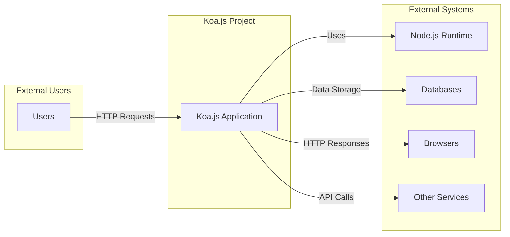
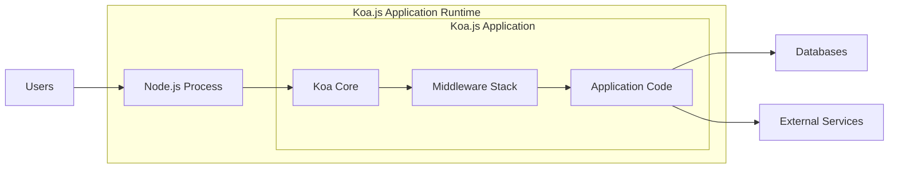
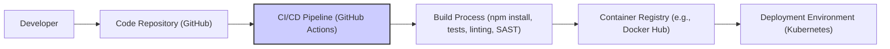

# BUSINESS POSTURE

- Business Priorities and Goals:
 - Koa.js is designed to be a lightweight and flexible web framework for Node.js.
 - It aims to provide a more streamlined and expressive foundation for web applications and APIs compared to its predecessor, Express.js.
 - The primary goal is to enhance developer productivity and application performance by offering a smaller, more modern, and middleware-centric architecture.
 - Koa.js prioritizes clean error handling, content negotiation, and a rich set of utilities to simplify common web development tasks.
 - It is intended for building robust, scalable, and maintainable web services.

- Most Important Business Risks:
 - Risk of vulnerabilities in Koa.js core or its middleware ecosystem that could be exploited in applications built with Koa.js.
 - Risk of insecure coding practices by developers using Koa.js, leading to application-level vulnerabilities (e.g., injection flaws, broken authentication).
 - Risk of denial of service attacks against Koa.js applications due to improper resource management or lack of rate limiting.
 - Risk of data breaches if sensitive data is not properly handled or secured within Koa.js applications.
 - Risk of supply chain attacks targeting dependencies used by Koa.js or applications built on it.

# SECURITY POSTURE

- Existing Security Controls:
 - security control: Dependency vulnerability scanning is likely performed by developers using tools like `npm audit` or `yarn audit` during development and build processes. (Implemented by developers locally and in CI/CD pipelines).
 - security control: Regular updates to Koa.js and its dependencies are expected to address known vulnerabilities. (Implemented by developers and maintainers).
 - security control: Middleware-based security practices are encouraged, allowing developers to implement security features like authentication, authorization, and input validation as middleware components. (Implemented by developers in application code).
 - accepted risk: Reliance on community-maintained middleware may introduce vulnerabilities if middleware is not actively maintained or securely developed.
 - accepted risk: Security is largely the responsibility of the application developer using Koa.js, as Koa.js itself provides minimal built-in security features beyond basic request handling.

- Recommended Security Controls:
 - security control: Implement automated Static Application Security Testing (SAST) in the CI/CD pipeline to detect potential vulnerabilities in application code and configurations.
 - security control: Implement Dynamic Application Security Testing (DAST) to identify runtime vulnerabilities in deployed Koa.js applications.
 - security control: Establish a Web Application Firewall (WAF) in front of production deployments to protect against common web attacks.
 - security control: Implement rate limiting and request throttling middleware to mitigate denial of service attacks.
 - security control: Conduct regular security audits and penetration testing of Koa.js applications to identify and remediate vulnerabilities.

- Security Requirements:
 - Authentication:
  - Requirement: Implement secure authentication mechanisms to verify the identity of users or clients accessing the application.
  - Requirement: Support for various authentication methods such as session-based authentication, token-based authentication (JWT), or OAuth 2.0.
 - Authorization:
  - Requirement: Implement robust authorization controls to ensure that authenticated users or clients only have access to the resources and actions they are permitted to access.
  - Requirement: Role-Based Access Control (RBAC) or Attribute-Based Access Control (ABAC) should be considered for managing permissions.
 - Input Validation:
  - Requirement: Implement comprehensive input validation on all user-supplied data to prevent injection attacks (e.g., SQL injection, cross-site scripting).
  - Requirement: Input validation should be performed both on the client-side and server-side.
 - Cryptography:
  - Requirement: Use strong cryptography to protect sensitive data in transit and at rest.
  - Requirement: Implement HTTPS for all communication to ensure confidentiality and integrity of data transmitted over the network.
  - Requirement: Securely store and manage cryptographic keys and secrets.

# DESIGN

## C4 CONTEXT



- Context Diagram Elements:
 - - Name: Users
   - Type: Person
   - Description: End-users who interact with the Koa.js application through web browsers or other clients.
   - Responsibilities: Accessing application features and data, providing input to the application.
   - Security controls: Authentication to verify user identity, session management to maintain user sessions.
 - - Name: Koa.js Application
   - Type: Software System
   - Description: The web application built using the Koa.js framework. This is the system being designed and analyzed.
   - Responsibilities: Handling user requests, processing data, interacting with databases and other services, generating responses.
   - Security controls: Input validation, authorization, secure session management, error handling, logging and monitoring.
 - - Name: Node.js Runtime
   - Type: Container
   - Description: The JavaScript runtime environment that executes the Koa.js application.
   - Responsibilities: Providing the execution environment for the application, managing resources, handling I/O operations.
   - Security controls: Operating system level security controls, Node.js security updates, process isolation.
 - - Name: Databases
   - Type: External System
   - Description: Databases used by the Koa.js application to store and retrieve data (e.g., PostgreSQL, MySQL, MongoDB).
   - Responsibilities: Persisting application data, providing data access and management.
   - Security controls: Database access controls, encryption at rest, data backups, vulnerability patching.
 - - Name: Browsers
   - Type: External System
   - Description: Web browsers used by users to access the Koa.js application.
   - Responsibilities: Rendering the user interface, sending HTTP requests, receiving and displaying responses.
   - Security controls: Browser security features (e.g., Content Security Policy, Same-Origin Policy), user-managed security settings.
 - - Name: Other Services
   - Type: External System
   - Description: External APIs, microservices, or third-party services that the Koa.js application may interact with.
   - Responsibilities: Providing additional functionalities or data to the Koa.js application.
   - Security controls: API authentication and authorization, secure communication protocols (HTTPS), input validation of external data.

## C4 CONTAINER



- Container Diagram Elements:
 - - Name: Node.js Process
   - Type: Container
   - Description: The operating system process running the Node.js runtime, hosting the Koa.js application.
   - Responsibilities: Process management, resource allocation, network communication.
   - Security controls: Operating system security hardening, process isolation, resource limits.
 - - Name: Koa Core
   - Type: Container
   - Description: The core Koa.js framework, providing the fundamental request/response handling and middleware architecture.
   - Responsibilities: Request routing, context creation, middleware execution.
   - Security controls: Minimal core functionality to reduce attack surface, focus on secure coding practices in the framework itself.
 - - Name: Middleware Stack
   - Type: Container
   - Description: A series of middleware functions that intercept and process incoming requests and outgoing responses.
   - Responsibilities: Implementing cross-cutting concerns like logging, authentication, authorization, input validation, error handling.
   - Security controls: Secure middleware implementation, careful selection and review of third-party middleware, middleware-specific configurations.
 - - Name: Application Code
   - Type: Container
   - Description: The custom code developed for the specific Koa.js application, including routes, controllers, and business logic.
   - Responsibilities: Implementing application-specific features, handling business logic, interacting with data storage and external services.
   - Security controls: Secure coding practices, input validation, output encoding, proper error handling, secure data handling.
 - - Name: Databases
   - Type: External System
   - Description: Databases used by the Koa.js application.
   - Responsibilities: Data persistence, data retrieval.
   - Security controls: Database access controls, encryption at rest, network security.
 - - Name: External Services
   - Type: External System
   - Description: External APIs or services consumed by the Koa.js application.
   - Responsibilities: Providing external functionalities or data.
   - Security controls: API authentication, secure communication protocols.
 - - Name: Users
   - Type: Person
   - Description: End-users interacting with the application.
   - Responsibilities: Initiating requests to the application.
   - Security controls: Authentication, session management.

## DEPLOYMENT

- Deployment Architecture Options:
 - Option 1: Single Server Deployment - Koa.js application and database on the same server. Suitable for development or small applications.
 - Option 2: Cloud Platform Deployment - Deploy Koa.js application to a cloud platform like AWS, Google Cloud, or Azure using services like EC2, Compute Engine, or Azure VMs, potentially with managed database services.
 - Option 3: Containerized Deployment - Deploy Koa.js application in containers (e.g., Docker) orchestrated by Kubernetes or similar container orchestration platforms. Suitable for scalability and resilience.

- Detailed Deployment Architecture (Option 3: Containerized Deployment with Kubernetes):

```mermaid
flowchart LR
    subgraph "Kubernetes Cluster"
        subgraph "Nodes"
            A["Node 1"]
            B["Node 2"]
        end
        subgraph "Pods"
            C["Koa.js App Pod 1"] -- A
            D["Koa.js App Pod 2"] -- B
            E["Database Pod"] -- A
        end
        F["Load Balancer"]
    end
    G["Users"] --> F
    F --> C & D
    C & D --> E
```

- Deployment Diagram Elements:
 - - Name: Kubernetes Cluster
   - Type: Environment
   - Description: A Kubernetes cluster providing container orchestration and management.
   - Responsibilities: Container deployment, scaling, and management, service discovery, load balancing.
   - Security controls: Kubernetes RBAC, network policies, pod security policies, security audits of Kubernetes configuration.
 - - Name: Nodes
   - Type: Infrastructure
   - Description: Worker nodes in the Kubernetes cluster, physical or virtual machines running container runtime.
   - Responsibilities: Running containerized applications, providing compute resources.
   - Security controls: Operating system hardening, security patching, access controls, monitoring.
 - - Name: Koa.js App Pods
   - Type: Container Instance
   - Description: Pods in Kubernetes running instances of the Koa.js application container.
   - Responsibilities: Handling application logic, serving user requests.
   - Security controls: Container image security scanning, least privilege container configurations, resource limits, application-level security controls.
 - - Name: Database Pod
   - Type: Container Instance
   - Description: Pod in Kubernetes running a database container.
   - Responsibilities: Data persistence, data management.
   - Security controls: Database container image security scanning, database access controls, data encryption at rest, network policies.
 - - Name: Load Balancer
   - Type: Infrastructure
   - Description: A load balancer distributing incoming traffic across Koa.js application pods.
   - Responsibilities: Traffic distribution, high availability, SSL termination.
   - Security controls: Load balancer security configurations, DDoS protection, SSL/TLS configuration.
 - - Name: Users
   - Type: Person
   - Description: End-users accessing the application.
   - Responsibilities: Sending requests to the application.
   - Security controls: User authentication (handled by application), secure communication (HTTPS).

## BUILD



- Build Process Description:
 - Developer commits code changes to the Code Repository (e.g., GitHub).
 - CI/CD Pipeline (e.g., GitHub Actions) is triggered on code changes.
 - Build Process includes:
  - Dependency installation (`npm install` or `yarn install`).
  - Running unit and integration tests.
  - Code linting and static analysis (e.g., ESLint).
  - Static Application Security Testing (SAST) to identify potential vulnerabilities.
  - Building container image (if containerized deployment).
 - Build artifacts (e.g., container image) are pushed to a Container Registry (e.g., Docker Hub, GitHub Container Registry).
 - Deployment Environment (e.g., Kubernetes) pulls the latest image from the Container Registry for deployment.

- Build Diagram Elements:
 - - Name: Developer
   - Type: Person
   - Description: Software developer writing and committing code.
   - Responsibilities: Writing secure code, performing local testing, committing code changes.
   - Security controls: Developer workstation security, code review process, secure coding training.
 - - Name: Code Repository (GitHub)
   - Type: System
   - Description: Version control system hosting the project's source code.
   - Responsibilities: Source code management, version control, collaboration.
   - Security controls: Access controls, branch protection, audit logging, vulnerability scanning of repository dependencies.
 - - Name: CI/CD Pipeline (GitHub Actions)
   - Type: System
   - Description: Automated CI/CD pipeline for building, testing, and deploying the application.
   - Responsibilities: Build automation, testing, security checks, deployment automation.
   - Security controls: Secure pipeline configuration, secret management, access controls, audit logging.
 - - Name: Build Process
   - Type: Process
   - Description: Steps involved in building and packaging the application.
   - Responsibilities: Dependency management, compilation, testing, security scanning, artifact creation.
   - Security controls: Dependency vulnerability scanning, SAST, linting, secure build environment, build artifact integrity checks.
 - - Name: Container Registry (e.g., Docker Hub)
   - Type: System
   - Description: Registry for storing and distributing container images.
   - Responsibilities: Container image storage, versioning, distribution.
   - Security controls: Access controls, vulnerability scanning of container images, image signing, audit logging.
 - - Name: Deployment Environment (Kubernetes)
   - Type: Environment
   - Description: Target environment where the application is deployed and run.
   - Responsibilities: Application execution, resource management, runtime environment.
   - Security controls: Environment security hardening, runtime security controls, monitoring and logging.

# RISK ASSESSMENT

- Critical Business Processes:
 - Serving user requests and providing application functionality.
 - Data storage and retrieval.
 - User authentication and authorization.
 - API integrations with external services.

- Data Sensitivity:
 - Data sensitivity depends on the specific application built with Koa.js.
 - Could include Personally Identifiable Information (PII), financial data, or other sensitive business data.
 - Sensitivity level needs to be determined based on the application's purpose and data it handles.
 - High sensitivity data requires strong protection measures like encryption at rest and in transit, strict access controls, and data loss prevention mechanisms.

# QUESTIONS & ASSUMPTIONS

- Questions:
 - What type of application is being built with Koa.js? (e.g., e-commerce, API, content management system).
 - What is the sensitivity of the data handled by the application?
 - What are the specific compliance requirements (e.g., GDPR, HIPAA, PCI DSS)?
 - What is the organization's risk appetite?
 - Are there any existing security policies or standards that need to be followed?
 - What is the expected scale and performance requirements of the application?

- Assumptions:
 - The Koa.js application will handle user data and requires security measures to protect confidentiality, integrity, and availability.
 - The application will be deployed in a cloud environment using containers and Kubernetes for scalability and resilience.
 - Security is a high priority for the project, and a proactive approach to security is desired.
 - The development team has some familiarity with secure coding practices and web application security principles.
 - The organization is willing to invest in security tools and processes to mitigate identified risks.