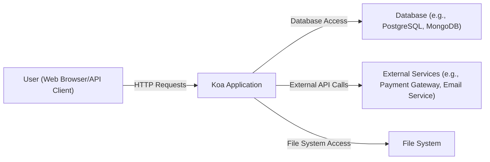
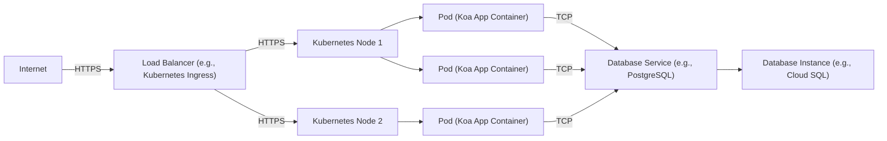
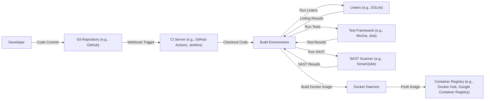

Okay, let's create a design document for the Koa.js framework based on the provided GitHub repository.

# BUSINESS POSTURE

Koa.js is a lightweight, next-generation web framework for Node.js. It aims to be a smaller, more expressive, and more robust foundation for web applications and APIs.  It leverages async functions to ditch callbacks and greatly increase error-handling.  It does *not* bundle any middleware within its core.

Business Priorities:

*   Provide a minimal, high-performance, and elegant foundation for web applications and APIs.
*   Enable developers to write cleaner, more manageable code using async/await.
*   Maintain a small core library without bundling middleware, promoting flexibility and customization.
*   Foster a strong and active community for support, contributions, and ecosystem growth.
*   Ensure long-term maintainability and evolution of the framework.

Business Goals:

*   Become a preferred choice for Node.js developers building web applications and APIs.
*   Attract and retain a vibrant community of contributors.
*   Maintain a high level of code quality and performance.
*   Adapt to evolving web development trends and standards.

Most Important Business Risks:

*   Loss of community interest and adoption due to competition from other frameworks (e.g., Express.js, Fastify).
*   Inability to keep up with evolving Node.js features and security best practices, leading to vulnerabilities or performance issues.
*   Lack of maintainers or key contributors, hindering the project's long-term sustainability.
*   Security vulnerabilities within the core framework or commonly used middleware, leading to data breaches or application compromise.
*   Poor documentation or lack of clear examples, hindering developer adoption and usage.

# SECURITY POSTURE

Existing Security Controls:

*   security control: Regular dependency updates to address known vulnerabilities in third-party libraries. (Visible in package.json and related workflows)
*   security control: Code reviews and pull request process to ensure code quality and identify potential security issues. (Visible in GitHub's pull request history)
*   security control: Use of linters and static analysis tools to enforce coding standards and identify potential errors. (Visible in configuration files like .eslintrc.js)
*   security control: Issue tracking and vulnerability reporting process. (Visible in GitHub's issue tracker)
*   security control: Security Policy. (Visible in SECURITY.md)

Accepted Risks:

*   accepted risk: Koa's core is minimal and does not include built-in protection against many common web vulnerabilities (e.g., XSS, CSRF, SQL injection). Developers are responsible for implementing appropriate middleware or security measures to address these risks.
*   accepted risk: The framework's reliance on community-maintained middleware introduces a potential risk of vulnerabilities in those external components. Developers need to carefully vet and manage their middleware dependencies.

Recommended Security Controls:

*   security control: Implement automated security scanning (SAST, DAST) in the CI/CD pipeline.
*   security control: Provide official security guidelines and best practices documentation for developers, specifically addressing common web vulnerabilities and how to mitigate them using Koa.
*   security control: Establish a clear process for handling and disclosing security vulnerabilities, including a security contact and response timeline.
*   security control: Consider creating a curated list of recommended and vetted middleware for common security tasks (e.g., authentication, authorization, input validation).

Security Requirements:

*   Authentication: Koa itself does not provide authentication mechanisms. Developers must implement authentication using middleware (e.g., Passport.js, custom solutions).
*   Authorization: Koa does not include built-in authorization features. Developers are responsible for implementing authorization logic, often using middleware or custom code.
*   Input Validation: Koa does not provide built-in input validation. Developers must implement input validation to prevent vulnerabilities like XSS, SQL injection, and command injection. This can be done using middleware or custom validation logic.
*   Cryptography: Koa does not include specific cryptographic utilities. Developers should use Node.js's built-in `crypto` module or established cryptographic libraries for tasks like password hashing, encryption, and digital signatures.

# DESIGN

## C4 CONTEXT

Context Diagram Element List:

*   Element:
    *   Name: User
    *   Type: Person
    *   Description: Represents a user interacting with the Koa application through a web browser or API client.
    *   Responsibilities: Initiates HTTP requests to the Koa application.
    *   Security controls: Browser security features (e.g., same-origin policy, content security policy), TLS/SSL encryption.

*   Element:
    *   Name: Koa Application
    *   Type: Software System
    *   Description: The web application or API built using the Koa.js framework.
    *   Responsibilities: Handles incoming HTTP requests, processes business logic, interacts with databases and external services, and returns HTTP responses.
    *   Security controls: Input validation, authentication, authorization, output encoding, error handling, session management (implemented via middleware).

*   Element:
    *   Name: Database
    *   Type: Software System
    *   Description: Represents a database system used by the Koa application to store and retrieve data.
    *   Responsibilities: Stores and manages data, provides data access to the Koa application.
    *   Security controls: Database access controls, encryption at rest, encryption in transit, auditing, input validation (at the database level).

*   Element:
    *   Name: External Services
    *   Type: Software System
    *   Description: Represents external services that the Koa application interacts with (e.g., payment gateways, email services, third-party APIs).
    *   Responsibilities: Provides specific functionalities to the Koa application.
    *   Security controls: API keys, authentication tokens, TLS/SSL encryption, input validation, rate limiting.

*   Element:
    *   Name: File System
    *   Type: Software System
    *   Description: Represents the file system used by Koa application.
    *   Responsibilities: Provides access to files.
    *   Security controls: File access permissions.

## C4 CONTAINER

```mermaid
graph LR
    User["User (Web Browser/API Client)"] -- "HTTP Requests" -->  Middleware1["Middleware 1 (e.g., Request Logging)"]
    Middleware1 -- "Processed Request" --> Middleware2["Middleware 2 (e.g., Authentication)"]
    Middleware2 -- "Authenticated Request" --> Middleware3["Middleware 3 (e.g., Body Parsing)"]
    Middleware3 -- "Parsed Request" --> Router["Router"]
    Router -- "Route-Specific Request" --> Controller["Controller (Route Handler)"]
    Controller -- "Database Query" --> Database["Database (e.g., PostgreSQL, MongoDB)"]
    Controller -- "External API Call" --> ExternalServices["External Services (e.g., Payment Gateway)"]
    Controller -- "Response Data" --> Router
    Router -- "Formatted Response" --> Middleware3
    Middleware3 -- "Processed Response" --> Middleware2
    Middleware2 -- "Authenticated Response" --> Middleware1
    Middleware1 -- "Logged Response" --> User

```

Container Diagram Element List:

*   Element:
    *   Name: User
    *   Type: Person
    *   Description: Represents a user interacting with the Koa application.
    *   Responsibilities: Initiates HTTP requests.
    *   Security controls: Browser security features, TLS/SSL.

*   Element:
    *   Name: Middleware 1 (e.g., Request Logging)
    *   Type: Container (Middleware)
    *   Description: Intercepts incoming requests and performs logging.
    *   Responsibilities: Logs request details.
    *   Security controls: None specific to logging, but should not log sensitive data.

*   Element:
    *   Name: Middleware 2 (e.g., Authentication)
    *   Type: Container (Middleware)
    *   Description: Intercepts requests and authenticates the user.
    *   Responsibilities: Verifies user credentials, sets authentication context.
    *   Security controls: Authentication mechanisms (e.g., JWT, sessions), protection against brute-force attacks.

*   Element:
    *   Name: Middleware 3 (e.g., Body Parsing)
    *   Type: Container (Middleware)
    *   Description: Parses the request body (e.g., JSON, form data).
    *   Responsibilities: Makes request data accessible to subsequent middleware and controllers.
    *   Security controls: Input validation (to prevent excessively large bodies or malicious payloads).

*   Element:
    *   Name: Router
    *   Type: Container (Component)
    *   Description: Maps incoming requests to specific controllers based on the URL path and HTTP method.
    *   Responsibilities: Routes requests to the appropriate handler.
    *   Security controls: None specific to routing, but should ensure proper route configuration to prevent unauthorized access.

*   Element:
    *   Name: Controller (Route Handler)
    *   Type: Container (Component)
    *   Description: Handles the business logic for a specific route.
    *   Responsibilities: Processes requests, interacts with databases and external services, generates responses.
    *   Security controls: Input validation, authorization, output encoding, error handling.

*   Element:
    *   Name: Database
    *   Type: Container (Database)
    *   Description: Stores and manages application data.
    *   Responsibilities: Provides data access to controllers.
    *   Security controls: Database access controls, encryption, auditing.

*   Element:
    *   Name: External Services
    *   Type: Container (External System)
    *   Description: External services used by the application.
    *   Responsibilities: Provides specific functionalities.
    *   Security controls: API keys, authentication tokens, TLS/SSL.

## DEPLOYMENT

Possible Deployment Solutions:

1.  Traditional Server Deployment (e.g., using PM2, systemd)
2.  Containerized Deployment (e.g., using Docker, Kubernetes)
3.  Serverless Deployment (e.g., using AWS Lambda, Google Cloud Functions)
4.  Platform-as-a-Service (PaaS) Deployment (e.g., Heroku, AWS Elastic Beanstalk)

Chosen Solution: Containerized Deployment using Docker and Kubernetes

Deployment Diagram Element List:

*   Element:
    *   Name: Internet
    *   Type: External
    *   Description: The public internet.
    *   Responsibilities: Routes traffic to the load balancer.
    *   Security controls: Network firewalls, DDoS protection.

*   Element:
    *   Name: Load Balancer
    *   Type: Infrastructure Node
    *   Description: Distributes incoming traffic across multiple Kubernetes nodes.
    *   Responsibilities: Load balancing, SSL termination.
    *   Security controls: SSL/TLS certificates, access control lists.

*   Element:
    *   Name: Kubernetes Node 1, Node 2
    *   Type: Infrastructure Node
    *   Description: Physical or virtual machines that host the application pods.
    *   Responsibilities: Runs containerized applications.
    *   Security controls: Node-level security hardening, network policies.

*   Element:
    *   Name: Pod 1, Pod 2, Pod 3
    *   Type: Container Instance
    *   Description: Instances of the Koa application container running within Kubernetes.
    *   Responsibilities: Handles incoming requests.
    *   Security controls: Container image security scanning, resource limits, network policies.

*   Element:
    *   Name: Database Service
    *   Type: Service
    *   Description: A Kubernetes service that provides access to the database.
    *   Responsibilities: Abstracts the database instance from the application pods.
    *   Security controls: Network policies, service-level access control.

*   Element:
    *   Name: Database Instance
    *   Type: Infrastructure Node
    *   Description: The actual database instance (e.g., a managed database service like Cloud SQL).
    *   Responsibilities: Stores and manages data.
    *   Security controls: Database-level security controls, encryption, access control.

## BUILD

Build Process Description:

1.  Developer commits code to the Git repository.
2.  A webhook triggers the CI server (e.g., GitHub Actions).
3.  The CI server checks out the code into a build environment.
4.  Linters (e.g., ESLint) are run to enforce code style and identify potential errors.
5.  Tests (e.g., unit tests, integration tests) are run using a test framework (e.g., Mocha, Jest).
6.  A SAST scanner (e.g., SonarQube) is run to analyze the code for security vulnerabilities.
7.  If all checks pass, a Docker image is built using the Docker daemon.
8.  The Docker image is pushed to a container registry (e.g., Docker Hub, Google Container Registry).

Security Controls:

*   security control: Linting: Enforces code style and identifies potential errors.
*   security control: Testing: Ensures code functionality and helps prevent regressions.
*   security control: SAST Scanning: Analyzes code for security vulnerabilities.
*   security control: Dependency Scanning: Identifies vulnerable dependencies (can be integrated into the build process).
*   security control: Image Signing: Ensures the integrity and authenticity of the Docker image (can be implemented as a separate step after pushing to the registry).
*   security control: Least Privilege: Build environment should have limited access to resources.

# RISK ASSESSMENT

Critical Business Processes:

*   Serving web requests and API responses reliably and efficiently.
*   Maintaining the integrity and confidentiality of user data (if applicable).
*   Ensuring the availability of the application.
*   Protecting against malicious attacks that could disrupt service or compromise data.

Data Sensitivity:

*   Koa itself does not handle data directly. The sensitivity of data handled by a Koa application depends entirely on the application's purpose and implementation.
*   If the application handles user data (e.g., personal information, financial data, health data), that data should be considered sensitive and protected accordingly.
*   Even if the application does not handle sensitive user data directly, it may still process data that is important for business operations (e.g., configuration data, internal metrics).

# QUESTIONS & ASSUMPTIONS

Questions:

*   Are there any specific compliance requirements (e.g., GDPR, HIPAA, PCI DSS) that the Koa application must adhere to?
*   What is the expected traffic volume and load for the application?
*   What are the specific security concerns of the stakeholders?
*   What is the team's experience with secure coding practices?
*   What monitoring and logging capabilities are required?

Assumptions:

*   BUSINESS POSTURE: The primary goal is to provide a flexible and performant framework, not a fully-featured, opinionated solution.
*   SECURITY POSTURE: Developers are responsible for implementing appropriate security measures using middleware and custom code. The Koa core team prioritizes security but relies on the community for many security-related components.
*   DESIGN: The application architecture will be modular and extensible, allowing developers to choose the components that best suit their needs. The deployment environment will be secure and scalable. The build process will include automated security checks.