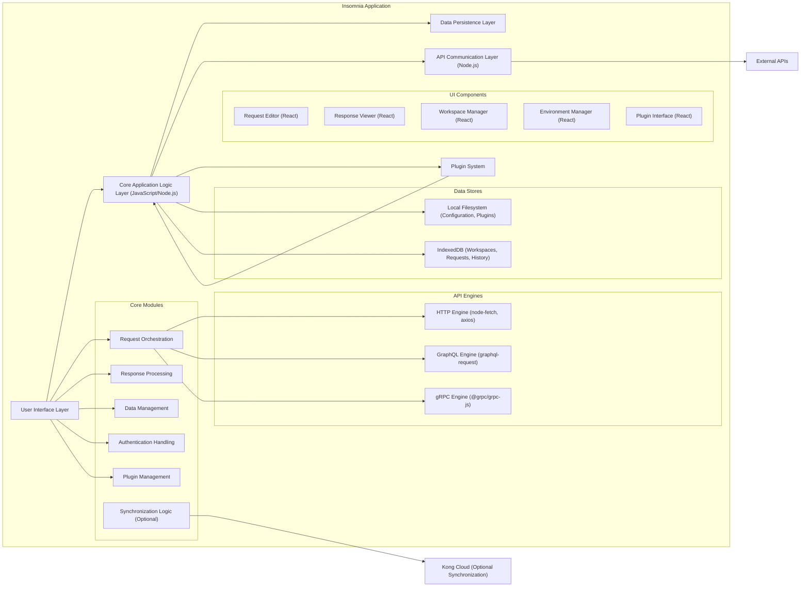
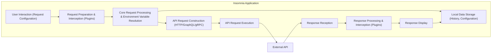

# Project Design Document: Insomnia API Client - Improved

**Document Version:** 2.0
**Date:** October 26, 2023
**Author:** AI Software Architect

## 1. Introduction

This document provides an enhanced architectural design of the Insomnia API Client, an open-source desktop application for designing, debugging, and testing APIs. This revised document offers a more detailed understanding of the system's components, data flow, and key architectural decisions, building upon the previous version. It continues to serve as a foundational resource for subsequent threat modeling activities.

## 2. Goals and Objectives

The core goals of Insomnia remain:

* To offer an intuitive user interface for interacting with HTTP, GraphQL, and gRPC APIs.
* To simplify the creation, organization, and execution of diverse API requests.
* To facilitate thorough inspection and analysis of API responses.
* To support team collaboration through efficient sharing and synchronization of API configurations.
* To provide advanced functionalities such as code generation, environment management, and robust authentication handling.

This improved design document aims to provide a more granular articulation of the architecture supporting these objectives.

## 3. High-Level Architecture

The fundamental architecture of Insomnia as a desktop application leveraging web technologies is further detailed below:

* **User Interface Layer (React/Electron):**  This layer is further broken down into specific UI components for better clarity.
    * **Request Editor (React):**  Handles the composition of API requests.
    * **Response Viewer (React):**  Displays and allows inspection of API responses.
    * **Workspace Manager (React):**  Manages the organization of API requests into workspaces.
    * **Environment Manager (React):**  Facilitates the creation and management of different environments and variables.
    * **Plugin Interface (React):**  Provides UI elements for interacting with installed plugins.
* **Core Application Logic Layer (JavaScript/Node.js):** This layer orchestrates the application's functionality.
    * **Request Orchestration:**  Manages the process of preparing and executing API requests.
    * **Response Processing:**  Handles the incoming API responses and prepares them for display.
    * **Data Management:**  Manages the loading, saving, and manipulation of application data.
    * **Authentication Handling:**  Implements and manages various authentication mechanisms.
    * **Plugin Management:**  Loads, initializes, and manages the lifecycle of plugins.
    * **Synchronization Logic (Optional):**  Handles the synchronization of data with Kong Cloud.
* **Data Persistence Layer:**  Responsible for storing application data.
    * **Local Filesystem (Configuration, Plugins):** Stores application configuration files and plugin code.
    * **IndexedDB (Workspaces, Requests, History):**  Stores user-created workspaces, request definitions, and request history.
* **API Communication Layer (Node.js):**  Handles the actual communication with external APIs.
    * **HTTP Engine (node-fetch, axios):**  Utilizes libraries for making HTTP requests.
    * **GraphQL Engine (graphql-request):**  Uses a library for executing GraphQL queries and mutations.
    * **gRPC Engine (@grpc/grpc-js):**  Employs the gRPC library for making gRPC calls.
* **Plugin System:** Allows extending Insomnia's capabilities through custom extensions.
* **External APIs:** The target APIs that Insomnia interacts with.
* **Kong Cloud (Optional Synchronization):**  The cloud service used for optional workspace synchronization.

## 4. Key Components

This section provides a more detailed breakdown of the major components within Insomnia:

* **Workspace Management:**
    * Enables users to create, organize, and manage collections of API requests within isolated workspaces.
    * Supports importing and exporting workspace configurations in JSON format.
    * Facilitates the organization of requests into folders and collections.
* **Request Composer:**
    * Offers a comprehensive interface for defining API requests, including:
        * Specification of HTTP methods (GET, POST, PUT, DELETE, PATCH, etc.).
        * Input fields for request URLs with intelligent autocompletion.
        * Editors for request headers with key-value pairs.
        * Parameterization of request URLs and headers using environment variables.
        * Support for various request body types (JSON, XML, Form Data, Raw Text, Binary).
        * Advanced options for setting request timeouts and redirects.
        * Dedicated interfaces for composing GraphQL queries and mutations with schema exploration.
        * Support for composing gRPC requests by importing `.proto` definitions and setting message fields.
* **Response Viewer:**
    * Presents API responses in a structured and easily digestible manner.
    * Features syntax highlighting for common content types (JSON, XML, HTML, JavaScript, CSS).
    * Provides tools for inspecting response headers, HTTP status codes, and response times with performance metrics.
    * Offers options for pretty-printing and formatting response bodies.
    * Includes search functionality to find specific information within the response.
* **Environment Management:**
    * Allows users to define and manage multiple environments (e.g., Development, Staging, Production).
    * Enables the definition of environment variables with different scopes (e.g., global, workspace, environment).
    * Supports the use of environment variables within request URLs, headers, and bodies using a templating language (e.g., Handlebars).
    * Provides features for importing and exporting environment configurations.
* **Code Generation:**
    * Generates code snippets for making the currently configured API request in various programming languages (e.g., JavaScript, Python, Java, Go) and HTTP client libraries (e.g., `fetch`, `axios`, `requests`).
    * Offers options to customize the generated code based on user preferences.
* **Authentication Handling:**
    * Supports a wide range of authentication mechanisms:
        * Basic Authentication (username/password).
        * Bearer Token Authentication (API keys, JWTs).
        * OAuth 1.0 and OAuth 2.0 flows with interactive authorization.
        * API Key authentication (in headers, query parameters).
        * Digest Authentication.
        * Custom authentication methods via plugins.
    * Provides secure storage for authentication credentials (where applicable) using platform-specific secure storage mechanisms.
    * Manages OAuth 2.0 flows, including token retrieval, refresh, and storage.
* **Plugin System:**
    * Offers a robust API for developers to create custom plugins using JavaScript.
    * Allows extending Insomnia's functionality with features such as:
        * Custom authentication methods.
        * Request pre-processing and post-processing logic.
        * Response interceptors and modifiers.
        * Custom data visualization and analysis tools.
        * Integration with external services.
* **Data Synchronization (Optional - via Kong Cloud):**
    * Provides an optional feature to synchronize workspaces, requests, and environments across multiple devices using a Kong Cloud account.
    * Involves secure communication with Kong Cloud services for data transfer and storage.
    * Utilizes authentication and authorization mechanisms to ensure data privacy and security.

## 5. Data Flow

The typical data flow for executing an API request in Insomnia is elaborated below:

1. **User Interaction (Request Configuration):** The user configures the API request details (URL, method, headers, body, authentication, etc.) through the user interface.
2. **Request Preparation & Interception (Plugins):**  Installed plugins have the opportunity to intercept and modify the request before it's sent. This allows for custom logic like adding headers or transforming the request body.
3. **Core Request Processing & Environment Variable Resolution:** The core application logic processes the configured request, resolves any environment variables used in the request details, and prepares the final request object.
4. **API Request Construction (HTTP/GraphQL/gRPC):** Based on the request type, the appropriate API communication engine constructs the actual API request using the relevant libraries.
5. **API Request Execution:** The API request is sent to the target external API over the network.
6. **Response Reception:** The Insomnia application receives the response from the external API.
7. **Response Processing & Interception (Plugins):** Installed plugins can intercept and process the response before it's displayed to the user. This allows for custom response analysis or modification.
8. **Response Display:** The core application logic processes the response and renders it in the Response Viewer for the user to inspect.
9. **Local Data Storage (History, Configuration):** Request details, responses (optionally), and application settings are stored locally for future use and reference.

For workspace synchronization, data flows between the Insomnia application and Kong Cloud services via secure API calls.

## 6. Security Considerations

This section provides a more detailed examination of security considerations:

* **Local Data Storage Security:**
    * Sensitive data, including API keys, authentication tokens, and potentially request/response bodies, are stored locally.
    * Encryption at rest is crucial. Insomnia should leverage platform-specific secure storage mechanisms (e.g., Keychain on macOS, Credential Vault on Windows, Secret Service API on Linux) or employ its own encryption using robust algorithms.
    * Consider the risk of unauthorized access to the local filesystem. Implement measures to protect against this, such as proper file permissions.
* **Authentication Handling Security:**
    * Secure storage of user credentials for various authentication methods is paramount. Avoid storing plaintext credentials.
    * Proper implementation of OAuth 2.0 flows is essential to prevent vulnerabilities like authorization code interception or token theft. Follow best practices for redirect URI validation and state parameter usage.
    * Be aware of potential vulnerabilities in different authentication schemes and implement them securely.
    * Educate users on the importance of not storing highly sensitive credentials directly within environment variables that might be inadvertently shared.
* **Plugin Security:**
    * Plugins execute within the Insomnia application's process and have access to its resources.
    * Malicious or poorly written plugins pose a significant security risk.
    * Implement a plugin sandboxing mechanism to limit the access and capabilities of plugins.
    * Consider a plugin verification or signing process to ensure the integrity and trustworthiness of plugins.
    * Clearly communicate the risks associated with installing untrusted plugins to users.
* **Network Security:**
    * Insomnia communicates with external APIs over the network.
    * Enforce the use of HTTPS for all API requests whenever possible to protect data in transit.
    * Be mindful of potential Man-in-the-Middle (MITM) attacks. Consider implementing certificate pinning for critical APIs.
    * Protect against DNS spoofing attacks.
* **Code Generation Security:**
    * Generated code snippets might inadvertently expose sensitive information or promote insecure coding practices if not handled carefully.
    * Provide clear warnings and guidance to users regarding the security implications of the generated code and encourage them to review it before use.
* **Dependency Management:**
    * Regularly update dependencies to patch known security vulnerabilities in third-party libraries.
    * Utilize dependency scanning tools to identify and address potential vulnerabilities.
* **Cross-Site Scripting (XSS) Prevention:**
    * Sanitize and escape any user-provided data that is displayed in the UI to prevent XSS attacks. This is particularly important when rendering response bodies or plugin outputs.
* **Electron Security:**
    * Adhere to Electron's security best practices to mitigate risks associated with running web content in a desktop environment.
    * Enable context isolation for renderer processes.
    * Disable Node.js integration in renderer processes where it's not strictly necessary.
    * Implement a strong Content Security Policy (CSP).
    * Avoid using `remote` module.
* **Workspace Synchronization Security (if enabled):**
    * Ensure secure communication channels (HTTPS) with Kong Cloud services.
    * Implement robust authentication and authorization mechanisms for accessing and modifying synchronized data.
    * Employ encryption in transit and at rest for data stored on the Kong Cloud platform.
    * Clearly communicate the security practices of the synchronization feature to users.

## 7. Deployment

Insomnia is deployed as a desktop application for the following operating systems:

* **Windows:** Distributed as a standalone executable (`.exe`) through the official website and potentially package managers.
* **macOS:** Distributed as an application bundle (`.app`) via the official website and potentially through package managers like Homebrew Cask.
* **Linux:** Distributed through various methods, including:
    * AppImage (a universal package format).
    * Snap packages (via the Snap Store).
    * DEB packages (for Debian-based distributions).
    * RPM packages (for Red Hat-based distributions).

The application bundles contain the Electron runtime environment and the application code. Updates are typically delivered through an auto-update mechanism built into the application.

## 8. Technologies Used

* **Frontend:**
    * React (for building the user interface components)
    * Redux (for managing application state)
    * Electron (framework for building cross-platform desktop applications)
    * JavaScript/TypeScript (primary programming languages)
    * HTML (for structuring the UI)
    * CSS (for styling the UI)
    * Various UI component libraries (e.g., for buttons, forms, etc.)
* **Backend/Core Logic:**
    * Node.js (JavaScript runtime environment)
* **API Request Libraries:**
    * `node-fetch` and `axios` (for making HTTP requests)
    * `@apollo/client` or `graphql-request` (for GraphQL API interactions)
    * `@grpc/grpc-js` (for gRPC API interactions)
* **Data Storage:**
    * IndexedDB (for storing structured data within the browser environment)
    * Local Filesystem API (for accessing and managing files)
    * Platform-specific secure storage APIs (e.g., Keychain, Credential Vault)
* **Plugin System:**
    * Node.js module system (for plugin development and management)
* **Testing:**
    * Jest or Mocha (for unit testing)
    * Cypress or Playwright (for end-to-end testing)
* **Build and Packaging:**
    * Electron Builder or Electron Packager (for creating distributable application packages)
    * Webpack or Parcel (for bundling JavaScript modules and assets)

## 9. Future Considerations

* **Enhanced Real-time Collaboration:** Implementing features for real-time collaborative editing of workspaces and requests.
* **Advanced API Testing and Validation:** Integrating more sophisticated API testing capabilities, such as contract testing and schema validation.
* **Improved Plugin Ecosystem and Discoverability:** Expanding the plugin API and creating a marketplace or registry for easier plugin discovery and management.
* **Performance Optimization for Large Workspaces:** Addressing performance challenges associated with managing very large numbers of requests and environments.
* **Enhanced Security Features:** Continuously evaluating and implementing new security measures to protect user data and the application itself.
* **Accessibility Improvements:**  Ongoing efforts to improve the application's accessibility for users with disabilities, adhering to WCAG guidelines.

This improved document provides a more detailed and comprehensive architectural design of the Insomnia API Client, offering a stronger foundation for understanding the system and conducting thorough threat modeling.