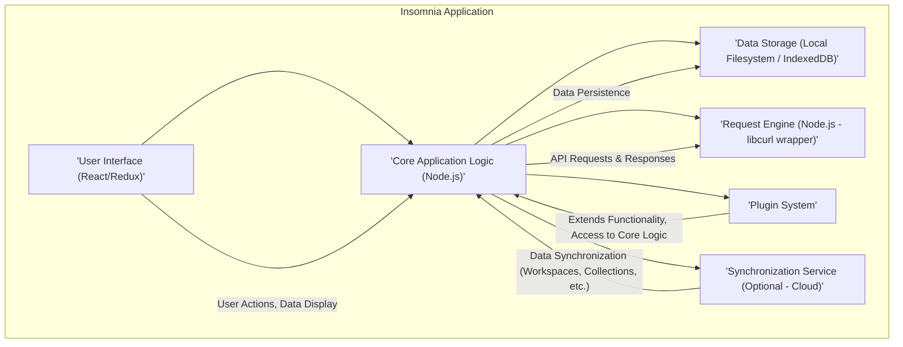
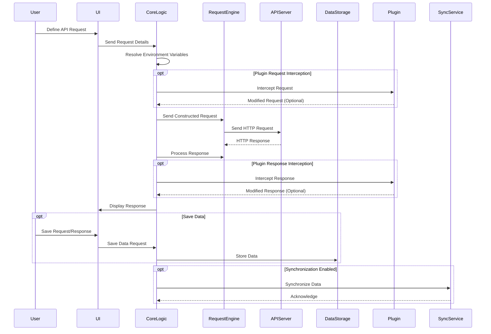

## Project Design Document: Insomnia API Client (Improved)

**1. Introduction**

This document provides a detailed design overview of the Insomnia API client application, a widely used open-source tool for designing, debugging, and testing APIs. This document is specifically crafted to serve as a foundation for subsequent threat modeling activities by clearly outlining the system's architecture, key components, data flow, and external interactions.

**2. Project Overview**

Insomnia is a desktop application built using the Electron framework, enabling cross-platform compatibility (Windows, macOS, Linux). It empowers developers to interact with HTTP-based APIs through a user-friendly interface. Core functionalities include:

*   Constructing and sending API requests with diverse authentication mechanisms.
*   Managing environments and variables for flexible API interactions.
*   Generating code snippets for API calls in various programming languages.
*   Optional collaboration features facilitated through a paid cloud service.
*   Extensibility via a robust plugin system.
*   Support for GraphQL API interactions.
*   Support for gRPC API interactions.

**3. System Architecture**

Insomnia employs an architecture based on the Electron framework, which embeds a Chromium browser instance for the user interface and utilizes Node.js for backend logic. This structure allows for a rich user experience while leveraging the capabilities of Node.js for core functionalities.

**4. Key Components**

*   **User Interface (React/Redux):**
    *   The primary interface for user interaction, built using React for a component-based architecture and Redux for managing application state.
    *   Responsible for rendering all visual elements, including request editors, response viewers, environment management tools, and settings panels.
    *   Handles user input and translates it into actions for the Core Application Logic.

*   **Core Application Logic (Node.js):**
    *   The central processing unit of the application, written in JavaScript and running within the Electron-provided Node.js environment.
    *   Manages the application's business logic, including request construction, environment variable resolution, interaction with the Plugin System, and data persistence.
    *   Orchestrates the flow of data between the UI, Data Storage, Request Engine, and Synchronization Service.

*   **Data Storage (Local Filesystem / IndexedDB):**
    *   Responsible for the persistent storage of application data, such as API requests, collections, environments, settings, and plugin configurations.
    *   Utilizes the local filesystem for storing larger files and potentially sensitive information.
    *   Employs IndexedDB, a browser-based NoSQL database, for structured data storage within the application's context. Data is typically serialized in JSON format.

*   **Request Engine (Node.js - libcurl wrapper):**
    *   The component responsible for executing API requests. It leverages a Node.js wrapper around the `libcurl` library, providing robust support for various HTTP methods, headers, and authentication schemes (e.g., OAuth 2.0, API keys, Basic Auth).
    *   Handles the complexities of network communication, including TLS/SSL negotiation.
    *   Processes responses from API servers and makes them available to the Core Application Logic.

*   **Plugin System:**
    *   A modular system that allows developers to extend Insomnia's functionality by creating and installing plugins.
    *   Plugins can introduce new features, modify existing behavior, integrate with external services, and access Insomnia's internal APIs.
    *   Plugins are typically distributed as Node.js modules and have access to the Node.js environment.

*   **Synchronization Service (Optional - Cloud):**
    *   An optional, cloud-based service provided by Kong that allows users to synchronize their workspaces, collections, and other data across multiple devices and collaborate with others.
    *   Requires user authentication and transmits data over the internet to Kong's servers. Data exchanged includes potentially sensitive information like API keys and request details.

**5. Data Flow (Detailed)**

The following outlines a detailed data flow for a typical API request initiated by a user:

1. **User Input and Request Definition:** The user interacts with the User Interface to define the API request, specifying the URL, HTTP method, headers, request body, and authentication details.
2. **Request Data Transmission to Core Logic:** The UI transmits the defined request parameters to the Core Application Logic.
3. **Environment Variable Resolution:** The Core Application Logic resolves any environment variables present in the request parameters using the currently active environment.
4. **Plugin Request Interception (Optional):** If plugins are configured to intercept requests, the Core Application Logic passes the constructed request object to the relevant plugins. Plugins can modify the request before it's sent.
5. **Request Forwarding to Request Engine:** The Core Application Logic forwards the final request object to the Request Engine.
6. **API Call Execution:** The Request Engine utilizes the `libcurl` wrapper to send the HTTP request to the target API server over the network. This involves DNS resolution, TCP connection establishment, TLS handshake (if HTTPS), and sending the HTTP request.
7. **Response Reception:** The Request Engine receives the HTTP response from the API server, including headers, status code, and response body.
8. **Response Processing by Core Logic:** The Request Engine passes the raw response data back to the Core Application Logic. The Core Application Logic may perform actions like parsing JSON or XML, handling errors, and extracting relevant information.
9. **Plugin Response Interception (Optional):** If plugins are configured to intercept responses, the Core Application Logic passes the response object to the relevant plugins. Plugins can modify the response before it's displayed.
10. **Response Display in UI:** The Core Application Logic sends the processed response data back to the User Interface for display to the user.
11. **Optional Data Persistence:** The user may choose to save the request and response data. This triggers the Core Application Logic to store the data using the Data Storage component (either in the local filesystem or IndexedDB).
12. **Optional Synchronization:** If the synchronization feature is enabled and the user is authenticated, changes to workspaces, collections, and requests are synchronized with the Synchronization Service. This involves transmitting data over HTTPS to Kong's servers.

**6. External Interactions (Security Relevant)**

Insomnia interacts with several external entities, some of which have significant security implications:

*   **Target API Servers:** The primary interaction, where Insomnia sends requests to and receives responses from potentially untrusted API servers. This involves transmitting potentially sensitive data like API keys and request payloads.
*   **Plugin Repositories (e.g., npm):** When users install plugins, Insomnia interacts with package managers like npm to download and install plugin packages. This introduces a supply chain risk, as compromised or malicious plugins could be installed.
*   **Synchronization Service (Kong Cloud):**  Data, including potentially sensitive API credentials and request details, is transmitted to and stored on Kong's servers. The security of this communication and storage is critical. Authentication to this service is also a key security consideration.
*   **Operating System:** Insomnia relies on the underlying operating system for file system access, network operations, and UI rendering. OS-level vulnerabilities could potentially be exploited.
*   **External Editors (User-Configured):** Users can configure external editors to edit request bodies or other data. This interaction relies on the security of the configured external editor.

**7. Security Considerations (Detailed)**

This section outlines potential security considerations relevant for threat modeling:

*   **Local Data Storage Security:**
    *   **Threat:** Unauthorized access to locally stored data (e.g., API keys, authentication tokens, request history) if the system is compromised.
    *   **Considerations:** Encryption of sensitive data at rest, secure file permissions, protection against malware and physical access.
*   **Plugin Security:**
    *   **Threat:** Malicious plugins could steal sensitive data, execute arbitrary code, or compromise the application's integrity.
    *   **Considerations:** Plugin sandboxing, code signing, a mechanism for reporting and vetting plugins, clear communication about plugin permissions.
*   **Synchronization Service Security:**
    *   **Threat:** Unauthorized access to synchronized data, data breaches on the server-side, man-in-the-middle attacks during data transmission.
    *   **Considerations:** Strong authentication mechanisms, encryption in transit (HTTPS) and at rest, robust access controls, regular security audits.
*   **Request Engine Vulnerabilities:**
    *   **Threat:** Vulnerabilities in `libcurl` or its Node.js wrapper could be exploited to perform actions like arbitrary code execution or information disclosure.
    *   **Considerations:** Keeping dependencies up-to-date, monitoring for security advisories related to `libcurl`.
*   **Electron Framework Security:**
    *   **Threat:** Vulnerabilities in the Electron framework itself could be exploited to compromise the application.
    *   **Considerations:** Keeping the Electron framework updated, adhering to Electron security best practices (e.g., disabling Node.js integration where not necessary).
*   **Cross-Site Scripting (XSS) in UI:**
    *   **Threat:** If user-provided data (e.g., in API responses) is not properly sanitized before being rendered in the UI, it could lead to XSS vulnerabilities.
    *   **Considerations:** Implementing robust input sanitization and output encoding techniques.
*   **Man-in-the-Middle Attacks:**
    *   **Threat:** Attackers could intercept sensitive data transmitted over insecure connections (e.g., when interacting with non-HTTPS APIs).
    *   **Considerations:** Encouraging the use of HTTPS, providing warnings for insecure connections.
*   **Credential Management:**
    *   **Threat:** Insecure storage or handling of API credentials could lead to their compromise.
    *   **Considerations:** Secure storage mechanisms (e.g., OS-level credential managers), avoiding storing credentials in plain text, secure input methods.
*   **Exposure of Sensitive Data in Memory/Logs:**
    *   **Threat:** Sensitive data might be inadvertently exposed in memory dumps or application logs.
    *   **Considerations:** Careful handling of sensitive data in code, avoiding logging sensitive information, secure memory management practices.

**8. Assumptions and Limitations**

*   This document primarily focuses on the core, open-source functionality of Insomnia. Specific security implementations and features of the paid collaboration service are not detailed here.
*   The security considerations listed are intended to be comprehensive but may not cover all potential threats. A thorough threat modeling exercise is necessary for a complete analysis.
*   The technology stack and specific implementations are subject to change. This document reflects the architecture and understanding at the time of writing.

**9. Conclusion**

This improved design document provides a more detailed and security-focused overview of the Insomnia API client. It aims to provide a solid foundation for effective threat modeling by clearly outlining the system's architecture, components, data flow, and potential security considerations. This document should enable security professionals to identify and analyze potential vulnerabilities and develop appropriate mitigation strategies.
