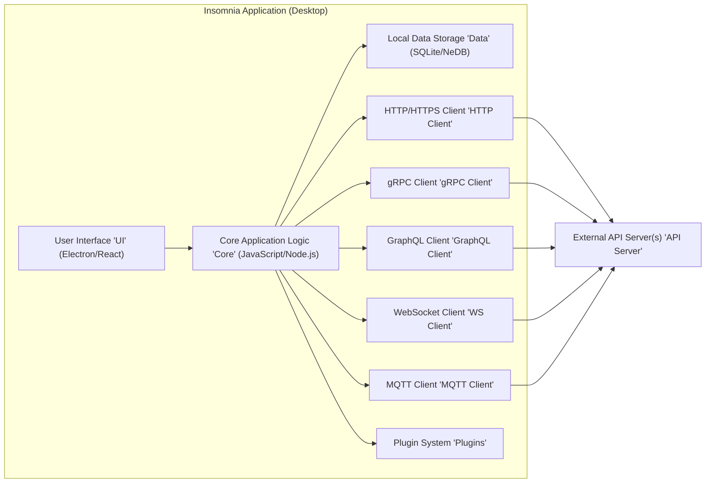
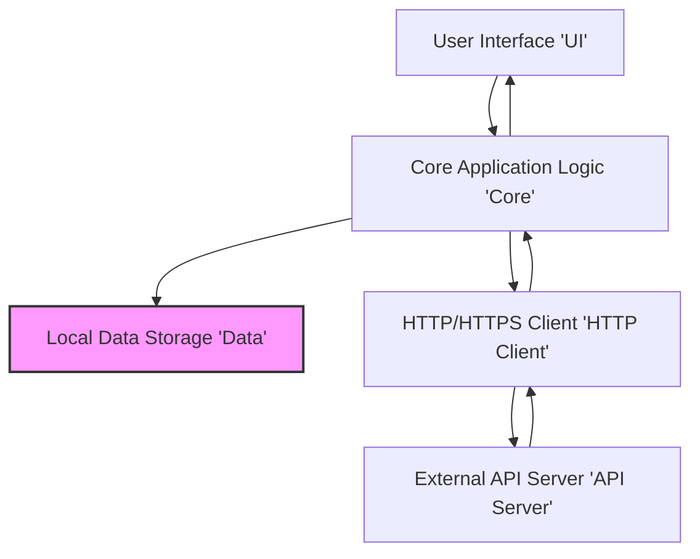

# Project Design Document: Insomnia API Client

**Version:** 1.1
**Date:** October 26, 2023
**Prepared By:** Gemini (AI Language Model)

## 1. Introduction

This document provides a detailed design overview of the Insomnia API Client, an open-source desktop application for designing, debugging, and testing APIs. This document is intended to serve as a foundation for subsequent threat modeling activities. It outlines the key components, data flows, and technologies involved in the application, with a focus on aspects relevant to security.

## 2. Goals

* Provide a comprehensive and security-focused architectural overview of the Insomnia application.
* Clearly identify key components, their functionalities, and potential security implications.
* Describe the flow of various types of data within the application and its interactions with external services.
* Highlight specific potential threat vectors and vulnerabilities for future threat modeling.

## 3. Scope

This document covers the core functionalities of the Insomnia application as described in the provided GitHub repository. It focuses on the desktop application itself, its internal workings, and its interactions with external services. While it mentions different API protocols, the focus remains on the client application's architecture and security considerations related to handling those protocols. Specific details of individual API protocol implementations are outside the scope.

## 4. Target Audience

This document is intended for:

* Security engineers and architects responsible for threat modeling the Insomnia application.
* Developers working on or contributing to the Insomnia project, particularly those focused on security.
* Quality assurance engineers involved in security testing.
* Anyone requiring a detailed understanding of Insomnia's architecture from a security perspective.

## 5. High-Level Overview

Insomnia is a desktop application built using the Electron framework, enabling cross-platform compatibility. It empowers users to construct, manage, and execute API requests across various protocols. Key features include request organization into collections, environment management for variable substitution, and inspection of API responses. The application's primary function involves interacting with external API servers based on user-defined configurations and stored data.

## 6. Architectural Diagram

## 7. Component Descriptions

* **User Interface 'UI' (Electron/React):**
    * Renders the application's graphical interface and handles all user interactions.
    * Built using web technologies (HTML, CSS, JavaScript) within the Electron environment.
    * Responsible for:
        * Presenting forms and controls for defining API requests.
        * Displaying API responses, logs, and other application data.
        * Handling user input for managing collections, environments, and settings.
        * Rendering plugin UIs.
    * **Security Implications:** Potential for Cross-Site Scripting (XSS) if rendering untrusted data from API responses or plugins without proper sanitization. Vulnerabilities in the underlying Electron framework or React library could also be exploited.

* **Core Application Logic 'Core' (JavaScript/Node.js):**
    * Contains the central business logic and orchestrates the application's functionality.
    * Responsible for:
        * Managing the lifecycle of API requests.
        * Handling environment variable substitution and templating.
        * Processing and parsing API responses.
        * Interacting with the local data storage.
        * Managing the plugin system and plugin lifecycle.
        * Implementing core features like code generation and testing.
    * **Security Implications:**  Vulnerabilities here could lead to arbitrary code execution, data breaches, or privilege escalation. Improper handling of user input or external data could introduce injection flaws.

* **Local Data Storage 'Data' (SQLite/NeDB):**
    * Persists application data locally on the user's machine. The specific database engine (SQLite or NeDB) impacts the underlying storage mechanism and potential security features.
    * Stores sensitive information including:
        * API request definitions (URLs, headers, bodies, etc.).
        * Collections of requests and organizational structures.
        * Environment variables, including potentially sensitive values.
        * Authentication credentials (API keys, tokens, passwords - if configured to be saved).
        * Plugin configurations and potentially plugin-specific data.
        * Application settings and user preferences.
    * **Security Implications:**  This is a critical component for security. Lack of encryption or weak encryption of the database file could expose sensitive data. Insufficient access controls on the file system could allow unauthorized access.

* **HTTP/HTTPS Client 'HTTP Client':**
    * Responsible for sending HTTP and HTTPS requests to external API servers.
    * Handles:
        * Construction of HTTP requests based on user-defined parameters.
        * Management of SSL/TLS connections, including certificate validation.
        * Handling of various HTTP authentication schemes.
        * Processing and returning HTTP responses to the Core Logic.
    * **Security Implications:** Vulnerabilities in the underlying HTTP client library could lead to man-in-the-middle attacks or exposure of sensitive data during transmission. Improper handling of SSL/TLS certificates could weaken security.

* **gRPC Client 'gRPC Client':**
    * Facilitates communication with gRPC-based API servers.
    * Handles:
        * Serialization and deserialization of gRPC messages.
        * Management of gRPC channels and connections.
        * Handling of gRPC authentication and authorization mechanisms.
    * **Security Implications:** Similar to the HTTP client, vulnerabilities in the gRPC client library or improper handling of secure connections could lead to security issues.

* **GraphQL Client 'GraphQL Client':**
    * Enables interaction with GraphQL APIs.
    * Handles:
        * Construction and execution of GraphQL queries and mutations.
        * Parsing of GraphQL responses.
        * Potentially handles GraphQL-specific authentication mechanisms.
    * **Security Implications:**  Improper construction of GraphQL queries based on user input could lead to information disclosure or denial-of-service attacks on the backend API.

* **WebSocket Client 'WS Client':**
    * Enables real-time, bidirectional communication with WebSocket servers.
    * Handles:
        * Establishing and maintaining WebSocket connections.
        * Sending and receiving messages over WebSocket connections.
    * **Security Implications:**  Vulnerabilities in the WebSocket client implementation or insecure handling of WebSocket connections could lead to data injection or eavesdropping.

* **MQTT Client 'MQTT Client':**
    * Supports interaction with MQTT brokers for publish/subscribe messaging.
    * Handles:
        * Connecting to MQTT brokers.
        * Publishing and subscribing to MQTT topics.
        * Handling MQTT authentication.
    * **Security Implications:**  Insecure configuration or vulnerabilities in the MQTT client could expose sensitive messages or allow unauthorized control of MQTT topics.

* **Plugin System 'Plugins':**
    * Allows extending Insomnia's functionality through third-party plugins.
    * Plugins can:
        * Introduce new features and functionalities.
        * Integrate with external services.
        * Modify the behavior of existing features.
        * Access certain parts of the application's API.
    * **Security Implications:**  Plugins represent a significant attack surface. Malicious or poorly written plugins could:
        * Access sensitive data stored by Insomnia.
        * Make unauthorized network requests.
        * Execute arbitrary code on the user's machine.
        * Introduce vulnerabilities that compromise the entire application. The plugin system's security model, including permissions and sandboxing, is critical.

* **External API Server(s) 'API Server':**
    * The target servers that Insomnia interacts with. The security of these servers is outside the direct control of the Insomnia application but impacts the overall security posture when using Insomnia.

## 8. Data Flow

The data flow within Insomnia can be categorized into several key scenarios. Here's a breakdown of the typical flow for sending an API request and handling sensitive data:

**8.1. Sending an API Request (Example - HTTP):**

1. **User Input 'UI':** The user enters API request details (URL, method, headers, body, authentication details) in the User Interface.
2. **Request Data to Core 'UI' -> 'Core':** The UI sends the raw request data to the Core Application Logic.
3. **Data Retrieval 'Core' -> 'Data':** The Core Logic retrieves relevant data from the Local Data Storage, such as environment variables, authentication credentials, and collection settings.
4. **Request Construction 'Core':** The Core Logic constructs the complete API request, substituting environment variables and applying authentication mechanisms. Sensitive data like API keys or tokens are incorporated at this stage.
5. **Protocol Handling 'Core' -> 'HTTP Client':** The Core Logic passes the constructed request to the appropriate client (in this case, the HTTP/HTTPS Client).
6. **Network Transmission 'HTTP Client' -> 'API Server':** The HTTP Client sends the request over the network to the External API Server, ideally over HTTPS.
7. **Response Reception 'API Server' -> 'HTTP Client':** The HTTP Client receives the response from the External API Server.
8. **Response Processing 'HTTP Client' -> 'Core':** The HTTP Client passes the raw response to the Core Logic.
9. **Data Storage (Optional) 'Core' -> 'Data':** The Core Logic might store parts of the response or request history in the Local Data Storage. This could include sensitive information.
10. **UI Update 'Core' -> 'UI':** The Core Logic sends the processed response data to the User Interface for display.

**8.2. Handling Sensitive Data (e.g., API Keys):**

* **Storage:** Sensitive data like API keys can be stored in the Local Data Storage, often within environment variables or authentication configurations.
* **Retrieval:** When constructing an API request, the Core Logic retrieves these sensitive values from the Data Storage.
* **Transmission:** Sensitive data is transmitted to the External API Server as part of the API request (e.g., in headers, query parameters, or the request body).
* **Potential Risks:** Exposure of the local database, insecure transmission over the network (if not using HTTPS), and potential logging or accidental disclosure of sensitive data.

**Data Flow Diagram (Example - HTTP Request with Sensitive Data):**

## 9. Security Considerations (Detailed)

This section expands on potential security concerns, providing more specific examples of threats and vulnerabilities:

* **Local Data Storage Security:**
    * **Threat:** Unauthorized access to the local database file.
    * **Vulnerability:** Lack of encryption or weak encryption of the database. Insufficient file system permissions.
    * **Threat:** Exposure of sensitive data within the database.
    * **Vulnerability:** Storing API keys, tokens, and passwords in plaintext or using reversible encryption.
    * **Mitigation:** Implement strong encryption for the local database. Enforce strict file system permissions. Consider using operating system-level key management for encryption keys.

* **Network Communication Security:**
    * **Threat:** Man-in-the-middle (MITM) attacks.
    * **Vulnerability:** Failure to use HTTPS for sensitive API requests. Improper handling of TLS certificates (e.g., ignoring certificate errors).
    * **Threat:** Exposure of sensitive data during transmission.
    * **Vulnerability:** Transmitting API keys or other credentials in the URL or unencrypted headers.
    * **Mitigation:** Enforce HTTPS for all API requests. Implement proper certificate validation. Avoid transmitting sensitive data in URLs.

* **Plugin Security:**
    * **Threat:** Malicious plugins stealing sensitive data or executing arbitrary code.
    * **Vulnerability:** Lack of proper sandboxing or permission controls for plugins. Insufficient validation of plugin code.
    * **Threat:** Vulnerable plugins introducing security flaws into the application.
    * **Vulnerability:** Plugins with their own dependencies that have known vulnerabilities.
    * **Mitigation:** Implement a robust plugin security model with clear permission boundaries. Code-sign plugins. Regularly audit popular plugins for vulnerabilities.

* **Cross-Site Scripting (XSS) in UI:**
    * **Threat:** Attackers injecting malicious scripts into the UI.
    * **Vulnerability:** Rendering untrusted data from API responses or plugin outputs without proper sanitization.
    * **Mitigation:** Implement robust input and output sanitization techniques. Use a Content Security Policy (CSP).

* **Code Injection Risks:**
    * **Threat:** Attackers injecting malicious code through features like pre-request scripts or plugin functionalities.
    * **Vulnerability:** Allowing the execution of arbitrary JavaScript code without proper sandboxing or validation.
    * **Mitigation:** Implement secure coding practices for scripting features. Use sandboxed environments for executing user-provided code.

* **Authentication and Authorization:**
    * **Threat:** Compromise of stored authentication credentials.
    * **Vulnerability:** Storing credentials in a reversible format or using weak encryption.
    * **Threat:** Improper handling of different authentication mechanisms.
    * **Vulnerability:**  Flaws in the implementation of OAuth 2.0 flows or other authentication protocols.
    * **Mitigation:** Use secure storage mechanisms for credentials (e.g., operating system's credential manager). Follow best practices for implementing authentication protocols.

* **Electron Security:**
    * **Threat:** Remote code execution vulnerabilities in the main or renderer processes.
    * **Vulnerability:** Using outdated Electron versions with known vulnerabilities. Improper configuration of Electron security settings.
    * **Mitigation:** Keep Electron and its dependencies up-to-date. Follow Electron security best practices.

* **Dependency Vulnerabilities:**
    * **Threat:** Exploitation of known vulnerabilities in third-party libraries.
    * **Vulnerability:** Using outdated or vulnerable Node.js modules.
    * **Mitigation:** Regularly scan dependencies for vulnerabilities and update them. Use tools like `npm audit` or `yarn audit`.

## 10. Technologies Used

* **Framework:** Electron
* **UI Library:** React
* **Programming Language:** JavaScript (Node.js)
* **Local Database:** Likely SQLite or NeDB (requires verification from the codebase for definitive confirmation)
* **HTTP Client Library:**  Likely a standard Node.js HTTP library (e.g., `node-fetch`, `axios`) or a wrapper around it.
* **gRPC Library:**  Likely `@grpc/grpc-js` or a similar Node.js gRPC library.
* **GraphQL Library:**  Likely `graphql-js` or a similar Node.js GraphQL client library.
* **WebSocket Library:** Likely `ws` or a similar Node.js WebSocket library.
* **MQTT Library:** Likely `mqtt` or a similar Node.js MQTT library.

## 11. Future Considerations

* **Cloud Synchronization:** Introducing cloud synchronization of user data would introduce new security considerations related to:
    * Secure storage and transmission of data in the cloud.
    * User authentication and authorization for cloud services.
    * Data privacy and compliance requirements.
* **Collaboration Features:** Implementing collaboration features would necessitate addressing:
    * Access control mechanisms for shared collections and environments.
    * Secure sharing of sensitive data.
    * Auditing of user actions.
* **More Advanced Scripting Capabilities:** Expanding scripting capabilities (e.g., with access to more application APIs) could introduce new security risks if not carefully designed with security in mind, including:
    * Potential for privilege escalation through scripting.
    * Increased attack surface for code injection vulnerabilities.

This improved document provides a more detailed and security-focused overview of the Insomnia API Client's architecture, serving as a more robust foundation for subsequent threat modeling activities.