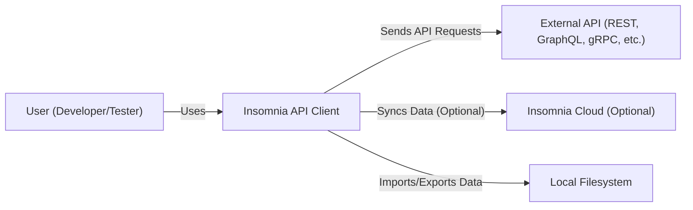
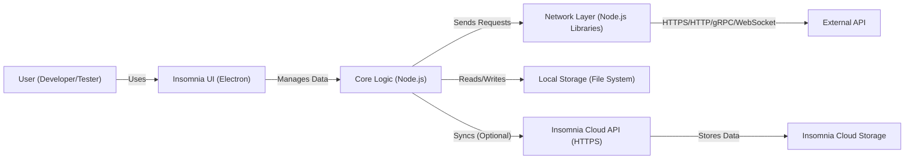
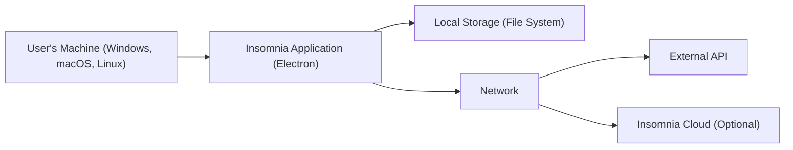
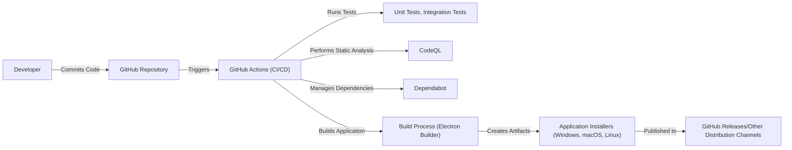

Okay, let's create a design document for the Insomnia project based on the provided GitHub repository.

# BUSINESS POSTURE

Insomnia is an open-source API client that allows users to test and debug APIs. It supports various API specifications like REST, GraphQL, gRPC, and WebSockets. The project seems to be targeting individual developers and teams working with APIs.  It's a mature project with a large user base.

Priorities:

*   Maintain a positive user experience (ease of use, performance, stability).
*   Support a wide range of API technologies and specifications.
*   Foster a strong community and encourage contributions.
*   Ensure the security of the application, especially concerning user-provided data and API interactions.
*   Provide options for data synchronization and collaboration.

Goals:

*   Be the preferred API client for developers.
*   Enable efficient API testing and debugging.
*   Facilitate collaboration on API development.

Business Risks:

*   Data breaches: Sensitive information like API keys, authentication tokens, and environment variables could be exposed if the application has vulnerabilities or is misconfigured.
*   Supply chain attacks: Compromised dependencies could introduce malicious code into the application.
*   Loss of user trust: Security incidents or data breaches could damage the project's reputation and lead to user attrition.
*   Competition: Other API clients could offer superior features or security, leading to a decline in Insomnia's user base.
*   Compliance violations: Failure to comply with relevant data privacy regulations (e.g., GDPR, CCPA) could result in legal and financial penalties.

# SECURITY POSTURE

Existing Security Controls:

*   security control: CodeQL: GitHub's CodeQL is used for static code analysis to identify potential security vulnerabilities. (Visible in GitHub repository's security settings and workflows).
*   security control: Dependency Management: Dependabot is used to keep dependencies up to date, reducing the risk of known vulnerabilities. (Visible in GitHub repository's security settings).
*   security control: Encryption in transit: Insomnia likely uses HTTPS for communication with external services and APIs (Assumption, standard practice).
*   security control: Data Sanitization: Insomnia likely sanitizes user inputs to prevent injection attacks (Assumption, standard practice).
*   security control: Authentication for Cloud Sync: Insomnia Cloud likely uses secure authentication mechanisms (e.g., OAuth 2.0) (Assumption, based on industry best practices).

Accepted Risks:

*   accepted risk: Local Data Storage: Sensitive data (API keys, tokens) may be stored locally on the user's machine, making it vulnerable to local attacks if the machine is compromised.
*   accepted risk: Third-Party Dependencies: While Dependabot helps, there's always a residual risk of zero-day vulnerabilities in third-party dependencies.
*   accepted risk: User Misconfiguration: Users may inadvertently expose sensitive data by misconfiguring the application or sharing their workspaces inappropriately.

Recommended Security Controls:

*   security control: Secret Scanning: Implement secret scanning in the CI/CD pipeline to detect accidental commits of API keys, tokens, or other sensitive information.
*   security control: Software Bill of Materials (SBOM): Generate and maintain an SBOM to improve supply chain security and vulnerability management.
*   security control: Content Security Policy (CSP): Implement CSP to mitigate the risk of cross-site scripting (XSS) attacks.
*   security control: Regular Penetration Testing: Conduct regular penetration testing to identify and address vulnerabilities that automated tools might miss.
*   security control: Security Audits: Perform regular security audits of the codebase and infrastructure.

Security Requirements:

*   Authentication:
    *   Support secure authentication methods for Insomnia Cloud (e.g., OAuth 2.0, multi-factor authentication).
    *   Provide guidance to users on securely storing API keys and tokens.
    *   Consider implementing features for managing secrets (e.g., integration with secrets management tools).

*   Authorization:
    *   Implement role-based access control (RBAC) for team collaboration features in Insomnia Cloud.
    *   Ensure that users can only access the data and resources they are authorized to use.

*   Input Validation:
    *   Validate and sanitize all user inputs to prevent injection attacks (e.g., XSS, command injection).
    *   Implement robust input validation for API requests and responses.

*   Cryptography:
    *   Use strong encryption algorithms and protocols for data in transit (HTTPS) and at rest (if applicable, e.g., for encrypted workspaces).
    *   Securely manage cryptographic keys.
    *   Provide options for users to encrypt sensitive data locally.

# DESIGN

## C4 CONTEXT

Element Descriptions:

*   Element:
    *   Name: User
    *   Type: Person
    *   Description: A developer or tester who uses Insomnia to interact with APIs.
    *   Responsibilities:
        *   Creating and managing API requests.
        *   Configuring environments and variables.
        *   Analyzing API responses.
        *   Collaborating with other users (optionally).
    *   Security controls:
        *   Strong password practices.
        *   Awareness of phishing and social engineering attacks.
        *   Securely managing their local machine.

*   Element:
    *   Name: Insomnia API Client
    *   Type: Software System
    *   Description: The Insomnia desktop application.
    *   Responsibilities:
        *   Providing a user interface for interacting with APIs.
        *   Sending API requests and receiving responses.
        *   Managing API collections, environments, and workspaces.
        *   Importing and exporting data.
        *   Optionally syncing data with Insomnia Cloud.
    *   Security controls:
        *   Input validation and sanitization.
        *   Secure communication (HTTPS).
        *   Dependency management.
        *   Static code analysis (CodeQL).

*   Element:
    *   Name: External API
    *   Type: Software System
    *   Description: Any external API that Insomnia interacts with.
    *   Responsibilities:
        *   Providing API endpoints for various functionalities.
        *   Processing API requests and returning responses.
    *   Security controls:
        *   API security best practices (authentication, authorization, rate limiting, etc.). This is outside the control of the Insomnia project.

*   Element:
    *   Name: Insomnia Cloud
    *   Type: Software System
    *   Description: The optional cloud service for syncing data and collaborating.
    *   Responsibilities:
        *   Storing user data securely.
        *   Providing synchronization capabilities.
        *   Facilitating team collaboration.
    *   Security controls:
        *   Secure authentication (OAuth 2.0, MFA).
        *   Role-based access control (RBAC).
        *   Data encryption at rest and in transit.
        *   Regular security audits and penetration testing.

*   Element:
    *   Name: Local Filesystem
    *   Type: System
    *   Description: The user's local filesystem.
    *   Responsibilities: Storing Insomnia data locally, including collections, environments, and workspaces.
    *   Security controls:
        *   Operating system security controls.
        *   User-managed file permissions.

## C4 CONTAINER

Element Descriptions:

*   Element:
    *   Name: User
    *   Type: Person
    *   Description: A developer or tester who uses Insomnia.
    *   Responsibilities: Same as in the Context diagram.
    *   Security controls: Same as in the Context diagram.

*   Element:
    *   Name: Insomnia UI
    *   Type: Container (Electron Application)
    *   Description: The user interface of the Insomnia application, built using Electron.
    *   Responsibilities:
        *   Rendering the UI.
        *   Handling user interactions.
        *   Communicating with the core logic.
    *   Security controls:
        *   Content Security Policy (CSP).
        *   Input validation.

*   Element:
    *   Name: Core Logic
    *   Type: Container (Node.js)
    *   Description: The core business logic of the Insomnia application.
    *   Responsibilities:
        *   Managing API collections, environments, and workspaces.
        *   Handling API requests and responses.
        *   Interacting with the local filesystem and Insomnia Cloud (if enabled).
    *   Security controls:
        *   Input validation and sanitization.
        *   Dependency management.
        *   Secure coding practices.

*   Element:
    *   Name: Network Layer
    *   Type: Container (Node.js Libraries)
    *   Description: Handles the actual sending of API requests and receiving of responses.
    *   Responsibilities:
        *   Making HTTP, HTTPS, gRPC, and WebSocket requests.
        *   Handling network errors.
    *   Security controls:
        *   Using secure protocols (HTTPS).
        *   Validating certificates.

*   Element:
    *   Name: External API
    *   Type: Software System
    *   Description: Any external API that Insomnia interacts with.
    *   Responsibilities: Same as in the Context diagram.
    *   Security controls: Same as in the Context diagram.

*   Element:
    *   Name: Local Storage
    *   Type: Container (File System)
    *   Description: The local filesystem where Insomnia stores data.
    *   Responsibilities:
        *   Storing API collections, environments, and workspaces.
    *   Security controls:
        *   Operating system security controls.
        *   User-managed file permissions.

*   Element:
    *   Name: Cloud API
    *   Type: Container (HTTPS API)
    *   Description: The API for Insomnia Cloud.
    *   Responsibilities:
        *   Handling authentication and authorization.
        *   Providing data synchronization and collaboration features.
    *   Security controls:
        *   Secure authentication (OAuth 2.0, MFA).
        *   Role-based access control (RBAC).
        *   Data encryption in transit (HTTPS).

*   Element:
    *   Name: Cloud Storage
    *   Type: Container (Database/Storage Service)
    *   Description: The storage service used by Insomnia Cloud.
    *   Responsibilities:
        *   Storing user data securely.
    *   Security controls:
        *   Data encryption at rest.
        *   Access controls.
        *   Regular backups.

## DEPLOYMENT

Possible Deployment Solutions:

1.  Desktop Application (Electron): Users download and install the application directly on their operating systems (Windows, macOS, Linux).
2.  Insomnia Cloud: Users access a web-based version of Insomnia through their browser. This requires a backend infrastructure to host the application and data.
3.  Self-Hosted Insomnia Cloud:  Potentially, users could deploy their own instance of Insomnia Cloud (though this is not explicitly mentioned in the repository, it's a common pattern for open-source projects).

Chosen Solution (for detailed description): Desktop Application (Electron)

Element Descriptions:

*   Element:
    *   Name: User's Machine
    *   Type: Desktop Computer
    *   Description: The user's personal computer running Windows, macOS, or Linux.
    *   Responsibilities: Running the Insomnia application.
    *   Security controls:
        *   Operating system security updates.
        *   Antivirus software.
        *   Firewall.

*   Element:
    *   Name: Insomnia Application
    *   Type: Desktop Application (Electron)
    *   Description: The installed Insomnia application.
    *   Responsibilities: Same as in the Container diagram.
    *   Security controls: Same as in the Container diagram.

*   Element:
    *   Name: Local Storage
    *   Type: File System
    *   Description: The local filesystem on the user's machine.
    *   Responsibilities: Same as in the Container diagram.
    *   Security controls: Same as in the Container diagram.

*   Element:
    *   Name: Network
    *   Type: Network
    *   Description: The network connection between the user's machine and external services.
    *   Responsibilities: Transmitting data between the Insomnia application and external APIs or Insomnia Cloud.
    *   Security controls:
        *   Network firewalls.
        *   Secure protocols (HTTPS).

*   Element:
    *   Name: External API
    *   Type: Software System
    *   Description: Any external API that Insomnia interacts with.
    *   Responsibilities: Same as in the Context diagram.
    *   Security controls: Same as in the Context diagram.

*   Element:
    *   Name: Insomnia Cloud
    *   Type: Software System
    *   Description: The optional cloud service for syncing data and collaborating.
    *   Responsibilities: Same as in the Context diagram.
    *   Security controls: Same as in the Context diagram.

## BUILD

Build Process Description:

1.  Developers commit code changes to the GitHub repository.
2.  GitHub Actions, the CI/CD platform, is triggered by these commits.
3.  GitHub Actions runs various jobs:
    *   Unit and integration tests are executed to ensure code quality.
    *   CodeQL performs static code analysis to identify potential security vulnerabilities.
    *   Dependabot checks for outdated or vulnerable dependencies and creates pull requests to update them.
4.  The build process, likely using Electron Builder, packages the application for different operating systems (Windows, macOS, Linux).
5.  Application installers are created as build artifacts.
6.  These artifacts are published to GitHub Releases or other distribution channels, making them available for users to download.

Security Controls in Build Process:

*   security control: Static Code Analysis (CodeQL): Identifies potential security vulnerabilities in the codebase.
*   security control: Dependency Management (Dependabot): Keeps dependencies up to date, reducing the risk of known vulnerabilities.
*   security control: Automated Testing: Unit and integration tests help ensure code quality and prevent regressions.
*   security control: Build Automation (GitHub Actions): Provides a consistent and reproducible build process.
*   security control: (Recommended) Secret Scanning: Scan for accidentally committed secrets during the build process.
*   security control: (Recommended) Software Bill of Materials (SBOM) generation: Create a list of all software components used in the build.

# RISK ASSESSMENT

Critical Business Processes:

*   API Testing and Debugging:  The core functionality of Insomnia is to allow users to efficiently test and debug APIs.  Any disruption to this process would significantly impact users.
*   Data Synchronization (Insomnia Cloud): For users who rely on Insomnia Cloud, the ability to sync their data across devices and collaborate with team members is critical.
*   Data Management: Users need to be able to manage their API collections, environments, and workspaces effectively.

Data Sensitivity:

*   API Keys and Tokens:  Highly sensitive.  Exposure could lead to unauthorized access to APIs and sensitive data.
*   Environment Variables:  May contain sensitive information like passwords, database credentials, or other secrets.
*   API Request and Response Data:  May contain sensitive business data, depending on the APIs being tested.
*   User Account Information (Insomnia Cloud):  Usernames, email addresses, and potentially billing information.  Subject to data privacy regulations.
*   Workspace Data (Insomnia Cloud): API collections, environments, and other data shared within a team.

# QUESTIONS & ASSUMPTIONS

Questions:

*   What specific data encryption methods are used for Insomnia Cloud data at rest?
*   Are there any plans to implement end-to-end encryption for user data?
*   What is the incident response plan for security breaches?
*   What are the specific compliance requirements (e.g., GDPR, CCPA) that Insomnia aims to meet?
*   Is there a bug bounty program or a process for handling vulnerability reports from external researchers?
*   What is the process for managing and rotating cryptographic keys used by Insomnia Cloud?
*   Are there any plans to support hardware security modules (HSMs) or other secure enclaves for storing sensitive data?

Assumptions:

*   BUSINESS POSTURE: Assumed that maintaining user trust and a positive reputation is a high priority.
*   SECURITY POSTURE: Assumed that HTTPS is used for all communication with external services and APIs. Assumed that basic input sanitization is performed. Assumed that Insomnia Cloud uses secure authentication mechanisms.
*   DESIGN: Assumed the general architecture based on the GitHub repository and common patterns for Electron applications and cloud services. Assumed that Electron Builder is used for building the application.