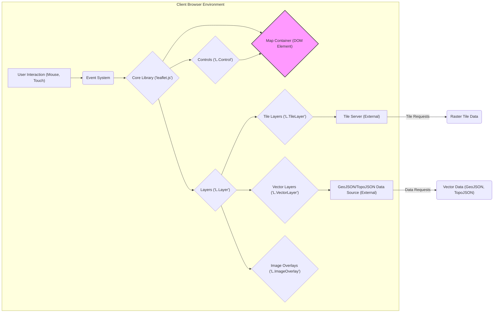

## Project Design Document: Leaflet - A JavaScript Library for Interactive Maps (Improved)

**1. Introduction**

This document provides an enhanced design overview of Leaflet, an open-source JavaScript library for embedding interactive maps into web applications. The purpose of this document is to offer a clear and detailed articulation of Leaflet's architecture, components, data flow, and critical considerations, specifically tailored to facilitate comprehensive threat modeling. This document will serve as a foundational resource for identifying potential security vulnerabilities and informing the design of robust mitigation strategies.

**2. Project Overview**

Leaflet is a lightweight, performant, and user-friendly JavaScript library designed to integrate interactive maps seamlessly into web applications. Its architecture prioritizes simplicity and flexibility, ensuring broad compatibility across modern desktop and mobile browsers through the utilization of HTML5 and CSS3. The core functionality encompasses the display of map tiles sourced from various providers, the intuitive handling of user interactions such as panning and zooming, and the rendering of diverse map elements including markers, popups, and vector-based overlays.

**3. Target Audience**

This document is primarily intended for:

*   Security engineers and architects tasked with performing threat modeling and security assessments of systems utilizing Leaflet.
*   Software developers actively contributing to the development of the Leaflet library itself.
*   System architects responsible for designing and implementing systems that incorporate Leaflet as a key component.

**4. System Architecture**

Leaflet operates predominantly on the client-side, executing directly within a user's web browser. It interacts with external services primarily to retrieve map tiles and potentially other geospatial data.

*   **Core Library (`leaflet.js`):** The fundamental component providing the core map functionalities, including map initialization, view management, and event handling.
*   **Map Container (`
` element):** The designated HTML element within the Document Object Model (DOM) where the interactive map is rendered and displayed.
*   **Layers (`L.Layer`):** Abstract representation of different types of map data visualized on the map.
    *   **Tile Layers (`L.TileLayer`):** Display raster-based map tiles fetched from external tile servers (e.g., OpenStreetMap, Mapbox, custom tile providers).
    *   **Vector Layers (`L.VectorLayer`):** Render vector data formats (e.g., GeoJSON, TopoJSON) as interactive map features like markers, polylines, and polygons.
    *   **Image Overlays (`L.ImageOverlay`):** Display static or dynamically updated images positioned over specific map bounds.
    *   **Popup Layers (`L.Popup`):** Display temporary information windows anchored to specific map locations or features.
*   **Controls (`L.Control`):** User interface elements providing interactive control over the map.
    *   **Zoom Control (`L.Control.Zoom`):** Allows users to zoom in and out of the map.
    *   **Attribution Control (`L.Control.Attribution`):** Displays copyright and attribution information for map data.
    *   **Scale Control (`L.Control.Scale`):** Shows a scale bar indicating distances on the map.
    *   **Custom Controls:** Developers can create custom controls to add specific functionalities.
*   **Event System (`L.Evented`):** A robust mechanism for handling user interactions (e.g., clicks, mouse movements, key presses) and internal map events (e.g., zoom changes, map moves, layer add/remove).
*   **Handlers (`L.Handler`):** Specialized modules responsible for managing specific types of user interactions and map behaviors.
    *   **Drag Handler (`L.Handler.Drag`):** Enables map panning via mouse or touch dragging.
    *   **Zoom Handlers (`L.Handler.Zoom`):** Implement different zoom interaction methods (e.g., mousewheel zoom, double-click zoom).
*   **Renderer (`L.Renderer`):** An abstraction layer that handles the actual rendering of map elements, adapting to different browser capabilities.
    *   **Canvas Renderer (`L.Canvas`):** Utilizes the HTML5 Canvas API for rendering.
    *   **SVG Renderer (`L.SVG`):** Employs Scalable Vector Graphics (SVG) for rendering.
*   **Plugins (Community-Developed):** Extensions that add supplementary features and functionalities to Leaflet, often introducing new components and dependencies.

**5. Data Flow (Detailed)**

The data flow within Leaflet involves the fetching, processing, and rendering of various types of geospatial data.

*   **Initialization Phase:**
    *   The web application instantiates an `L.Map` object, specifying the target HTML container and initial map view parameters (center coordinates, zoom level).
    *   Base layers (typically tile layers) are added to the map instance, defining the underlying map imagery.
*   **Tile Loading and Rendering:**
    *   Upon initial load and during map navigation (panning, zooming), Leaflet calculates the set of visible map tiles based on the current map bounds and zoom level.
    *   For each required tile, Leaflet constructs a URL based on the configured tile server URL template and requests the tile image from the server.
    *   The tile server responds with raster image data (e.g., PNG, JPEG), which Leaflet then renders within the map container as individual `` elements.
*   **Vector Data Loading and Rendering:**
    *   When vector layers (e.g., `L.GeoJSON`) are added to the map, Leaflet initiates requests to the specified data source (either a remote API endpoint or a local file).
    *   The data source responds with vector data, typically in GeoJSON or TopoJSON format.
    *   Leaflet parses the vector data and uses the configured renderer (Canvas or SVG) to draw the corresponding shapes (markers, polylines, polygons) on the map. Styling rules defined in the data or through Leaflet options are applied during rendering.
*   **User Interaction and Event Handling:**
    *   User interactions with the map (e.g., mouse clicks, touch events) are captured by the browser and propagated to Leaflet's event system.
    *   Event handlers attached to map elements or the map itself are triggered, allowing the application to respond to user actions.
    *   These events can trigger various actions, such as updating the map view, displaying popups associated with specific features, or interacting with other parts of the web application.
*   **Control Interactions:**
    *   User interactions with map controls (e.g., clicking the zoom buttons) directly manipulate the map state (e.g., changing the zoom level), which in turn triggers tile loading and rendering updates.

**6. Key Components and Their Responsibilities (Elaborated)**

*   **`L.Map`:** The central orchestrator of the map instance. It manages the collection of layers, controls, and handlers, and maintains the current map view (center, zoom, bounds). It also provides methods for interacting with the map programmatically.
*   **`L.TileLayer`:** Specifically designed for fetching and displaying raster map tiles. It handles tile URL generation based on zoom level and tile coordinates, manages tile caching, and provides options for customizing tile loading behavior.
*   **`L.GeoJSON`:** Facilitates the seamless integration of GeoJSON data into the map. It parses GeoJSON objects and renders them as vector features, allowing for styling and interaction with individual features.
*   **`L.Marker`:** Represents a point of interest on the map, typically displayed with an icon. Markers can be interactive, triggering events when clicked or hovered over, and can be associated with popups.
*   **`L.Popup`:** A temporary information window that can be opened at a specific location on the map or associated with a map feature (e.g., a marker). Popups can contain arbitrary HTML content.
*   **`L.Control`:** The abstract base class for all map controls. Concrete control implementations provide specific UI elements for map interaction.
*   **`L.DomEvent`:** Provides a consistent and cross-browser API for handling DOM events, simplifying event binding and unbinding within Leaflet.
*   **`L.Renderer`:**  Abstracts the underlying rendering technology, allowing Leaflet to work efficiently across different browsers and devices. The Canvas and SVG renderers provide different performance characteristics and capabilities.

**7. External Dependencies and Integrations (Specific Examples)**

While Leaflet's core is dependency-free, its practical use often involves integration with external resources and libraries:

*   **Tile Servers:**  Crucial for providing the base map imagery. Examples include:
    *   **OpenStreetMap (OSM):** A collaborative, open-source map of the world.
    *   **Mapbox:** A commercial provider of map tiles and geospatial tools.
    *   **Stamen:** Provides stylized map tiles.
    *   **Custom Tile Servers:** Organizations may host their own tile servers.
*   **GeoJSON/TopoJSON Data Sources:**  Provide the data for vector layers. These can be:
    *   **REST APIs:**  Fetching data dynamically from backend services.
    *   **Static Files:** Loading data from local files within the web application.
    *   **Databases:**  Retrieving data from geospatial databases.
*   **Plugins:** Extend Leaflet's functionality. Examples include:
    *   **Leaflet.draw:**  Adds drawing and editing capabilities for vector layers.
    *   **Leaflet.markercluster:**  Optimizes the display of large numbers of markers.
    *   **Leaflet.heat:**  Creates heatmap visualizations from point data.
*   **Web Frameworks:**  Integration with frameworks often involves wrapper libraries or direct DOM manipulation. Examples include:
    *   **React Leaflet:**  A popular React wrapper for Leaflet.
    *   **Angular Leaflet Directive:**  An Angular directive for integrating Leaflet.
    *   **Vue2Leaflet/Vue3Leaflet:** Vue.js integrations for Leaflet.

**8. Security Considerations (Detailed for Threat Modeling)**

This section expands on potential security vulnerabilities and threats relevant to Leaflet deployments.

*   **Cross-Site Scripting (XSS):**
    *   **Vulnerability:**  If user-provided data is directly rendered within popups or custom controls without proper sanitization, malicious scripts can be injected and executed in the user's browser.
    *   **Threat:** Attackers could inject scripts to steal cookies, redirect users to malicious sites, or perform actions on behalf of the user.
    *   **Mitigation:** Implement strict input validation and output encoding/escaping for any user-supplied content displayed within Leaflet elements. Utilize Content Security Policy (CSP) to restrict the sources from which the browser can load resources.
    *   **Example:** Displaying unsanitized HTML from a GeoJSON feature property in a popup.
*   **Content Injection:**
    *   **Vulnerability:** While less common with reputable tile providers, there's a theoretical risk of malicious content being served through manipulated tile server responses. Similarly, compromised GeoJSON data sources could inject malicious HTML or JavaScript.
    *   **Threat:**  Similar to XSS, this could lead to script execution and other malicious activities.
    *   **Mitigation:**  Utilize HTTPS for all external resource requests to ensure data integrity and authenticity. Implement Subresource Integrity (SRI) for Leaflet library files and any trusted external resources. Carefully vet and trust external data sources.
*   **Denial of Service (DoS):**
    *   **Vulnerability:**  An attacker could intentionally generate a large number of tile requests, potentially overwhelming the tile server and making the map unavailable to legitimate users. Large or complex GeoJSON datasets could also cause performance issues or browser crashes on the client-side.
    *   **Threat:**  Loss of service availability.
    *   **Mitigation:** Implement rate limiting on the client-side to prevent excessive tile requests. Optimize GeoJSON data for size and complexity. Consider server-side caching of tiles.
*   **Dependency Vulnerabilities:**
    *   **Vulnerability:**  Third-party plugins used with Leaflet may contain security vulnerabilities that could be exploited.
    *   **Threat:**  Compromise of the client-side application or user data.
    *   **Mitigation:** Regularly audit and update all Leaflet plugins and dependencies. Utilize tools like npm audit or yarn audit to identify known vulnerabilities.
*   **Data Security (Geospatial Data):**
    *   **Vulnerability:**  Sensitive geospatial data transmitted over insecure connections could be intercepted.
    *   **Threat:**  Exposure of confidential location data or other sensitive information.
    *   **Mitigation:**  Always use HTTPS for fetching map tiles and geospatial data. Consider encryption for sensitive data at rest and in transit.
*   **Client-Side Security Limitations:**
    *   **Vulnerability:**  Leaflet operates on the client-side, making it susceptible to manipulation by malicious actors with control over the user's browser environment.
    *   **Threat:**  Circumvention of client-side security measures.
    *   **Mitigation:**  Recognize the inherent limitations of client-side security. Implement robust server-side validation and security controls for any backend interactions. Avoid storing sensitive logic or secrets directly in the client-side code.

**9. Deployment Considerations (Best Practices)**

Deploying Leaflet effectively involves several considerations:

*   **Content Delivery Network (CDN):**  Utilizing a CDN for serving Leaflet's core files (`leaflet.js` and `leaflet.css`) is generally recommended for improved performance through caching and geographic distribution. Ensure the CDN provider is reputable.
*   **Package Managers (npm, yarn):**  For modern web development workflows, installing Leaflet via package managers allows for easier dependency management and integration with build processes.
*   **Bundling and Minification:**  Bundling Leaflet and application code using tools like Webpack or Parcel can reduce the number of HTTP requests and improve loading times. Minifying the code further reduces file sizes.
*   **HTTPS:**  Serving the web application over HTTPS is crucial for securing the communication between the browser and the server, protecting against eavesdropping and man-in-the-middle attacks.
*   **Subresource Integrity (SRI):**  Implementing SRI for Leaflet files and other external resources ensures that the browser only executes files that match a known cryptographic hash, preventing the execution of compromised files from CDNs.

**10. Future Considerations (Potential Enhancements)**

*   **WebAssembly (Wasm) Integration:** Exploring the use of WebAssembly to potentially enhance performance for computationally intensive tasks within Leaflet, such as complex vector rendering or data processing.
*   **Improved Accessibility Features:**  Continued development and refinement of accessibility features to ensure Leaflet maps are usable by individuals with disabilities, adhering to WCAG guidelines.
*   **Enhanced 3D Map Support:**  Investigating and implementing more robust support for displaying and interacting with 3D map data and visualizations.
*   **Performance Optimizations:** Ongoing efforts to optimize rendering performance, especially for large datasets and complex map interactions.

**11. Conclusion**

This improved design document provides a more detailed and comprehensive overview of the Leaflet JavaScript library, specifically focusing on aspects relevant to security and threat modeling. By understanding the architecture, data flow, and potential vulnerabilities outlined in this document, security engineers, developers, and architects can make informed decisions to build secure and robust web applications utilizing Leaflet. This document should be considered a living artifact and will be updated as the Leaflet project evolves and new security considerations emerge.
