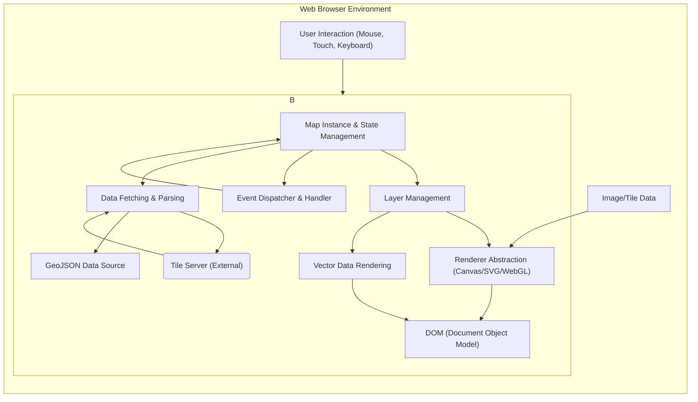

# Project Design Document: Leaflet - A JavaScript Library for Interactive Maps

**Version:** 1.1
**Date:** October 26, 2023
**Author:** AI Software Architect

## 1. Introduction

This document provides a detailed design overview of Leaflet, an open-source JavaScript library for mobile-friendly interactive maps. This document is specifically created to serve as a foundation for subsequent threat modeling activities. It meticulously outlines the key architectural components, data flows, and external interactions of the Leaflet library, with a focus on security-relevant aspects.

## 2. Goals and Scope

The primary goal of this document is to provide a comprehensive and precise description of Leaflet's architecture and functionality, with a strong emphasis on aspects pertinent to security vulnerabilities and potential threats. The scope includes:

*   A detailed overview of the library's architecture, including sub-components.
*   In-depth identification of key components and their interactions, highlighting trust boundaries.
*   Detailed description of data flow within the library and with external systems, specifying data types and potential risks.
*   Thorough identification of external dependencies and integrations, with a focus on their security implications.

This document does not cover:

*   Fine-grained internal implementation details of specific Leaflet functions beyond what is necessary for understanding data flow and component interaction.
*   Direct code-level vulnerability analysis (this will be informed by the threat modeling process).
*   The design of specific applications built *using* Leaflet, unless those designs directly impact the security of the Leaflet library itself.

## 3. Architectural Overview

Leaflet is a client-side JavaScript library executing within a web browser's environment. It relies on browser APIs to render map tiles, process user interactions, and display various map features. The core architecture centers around managing map state, handling events, rendering map elements, and interacting with external data sources, primarily tile providers.

## 4. Key Components

*   **Leaflet Core:** The central module encompassing the fundamental functionalities of the library.
    *   **Map Instance & State Management:** Manages the map's central properties like center coordinates, zoom level, projection, and coordinate systems. This component is crucial for maintaining the integrity of the map's representation.
    *   **Layer Management:** Responsible for handling different types of map layers (tile layers, vector layers, etc.), their order, visibility, and interaction. This is a key area for considering potential layering vulnerabilities or unintended data exposure.
    *   **Renderer Abstraction (Canvas/SVG/WebGL):** Provides an abstraction layer for rendering map elements, utilizing different browser technologies. This component needs to handle potentially malicious or malformed data from external sources safely.
    *   **Event Dispatcher & Handler:** Manages the dispatch and handling of user-generated events and internal library events. This is a critical area for considering event injection or manipulation attacks.
    *   **Data Fetching & Parsing:** Handles fetching data from external sources (like tile servers and GeoJSON endpoints) and parsing it into usable formats. This component needs robust input validation and sanitization to prevent injection attacks.
*   **Tile Layers:** Components responsible for fetching and displaying raster map tiles from external tile servers. These components rely on URLs and need to handle potential redirection or content injection.
*   **Vector Layers:** Components for rendering vector data (points, lines, polygons) sourced from GeoJSON or created programmatically. This involves parsing and rendering potentially user-supplied or external data, requiring careful handling to prevent XSS or other injection vulnerabilities.
*   **Markers, Popups, and Other UI Elements:** Components for displaying interactive elements on the map. These often involve displaying text or HTML content, making them potential targets for XSS if not handled carefully.
*   **Controls (Zoom, Attribution, Scale):** User interface elements for interacting with the map. While seemingly benign, vulnerabilities in control implementations could potentially be exploited.
*   **Plugins:**  An extension mechanism allowing developers to add custom functionality. Plugins represent a significant area for potential security risks if not developed or vetted properly.

## 5. Data Flow

The following outlines the typical flow of data within Leaflet, highlighting potential security considerations at each stage:

1. **Initialization:** The developer instantiates an `L.map` object, configuring initial map parameters. *Security Consideration:* Incorrect or malicious initial configuration could lead to unexpected behavior.
2. **Layer Addition:** Developers add various layers to the map, specifying data sources (e.g., tile server URLs, GeoJSON data). *Security Consideration:*  Untrusted or compromised data sources pose a significant risk. Malicious tile servers could serve harmful images or scripts. Untrusted GeoJSON could contain malicious scripts or excessively large geometries leading to DoS.
3. **User Interaction:** Users interact with the map (panning, zooming, clicking). *Security Consideration:* User input, especially if used to construct dynamic queries or update map elements, needs careful sanitization to prevent injection attacks.
4. **Event Handling:** Leaflet captures browser events and dispatches corresponding internal events. *Security Consideration:*  Potential for event spoofing or manipulation could lead to unintended actions.
5. **Map State Update:**  Based on user interaction or programmatic changes, the map's state (center, zoom) is updated.
6. **Tile Request (for Tile Layers):**
    *   The `Data Fetching & Parsing` component determines necessary tiles based on the current map view.
    *   It constructs tile URLs using the provided template and current view parameters. *Security Consideration:*  Vulnerabilities in URL construction could lead to unintended requests or access to unauthorized resources.
    *   HTTP requests are made to the specified tile server(s). *Security Consideration:* Lack of HTTPS exposes communication to MITM attacks. The tile server's security is paramount.
    *   The tile server responds with image data. *Security Consideration:* Malicious tile servers could serve images containing exploits or tracking mechanisms.
    *   The `Renderer Abstraction` receives the tile data.
7. **Vector Data Processing (for Vector Layers):**
    *   GeoJSON data is fetched from the specified source or provided directly. *Security Consideration:*  Fetching over insecure protocols exposes data to interception. Untrusted GeoJSON could contain malicious scripts within properties or excessively complex geometries.
    *   The `Data Fetching & Parsing` component parses the GeoJSON. *Security Consideration:*  Vulnerabilities in the parsing logic could be exploited with crafted GeoJSON.
    *   The `Vector Data Rendering` component renders the features. *Security Consideration:*  Rendering vulnerabilities could allow malicious data to execute scripts or cause browser crashes.
8. **Rendering:** The `Renderer Abstraction` draws all visible layers onto the DOM. *Security Consideration:*  Vulnerabilities in the rendering process could lead to XSS if user-controlled data is incorporated without sanitization.
9. **Display:** The browser renders the updated DOM, displaying the interactive map.

## 6. External Dependencies and Integrations

Leaflet's functionality relies on interaction with several external components and services, each with its own security implications:

*   **Web Browser:** The execution environment for Leaflet. *Security Consideration:* Leaflet's security is inherently tied to the security of the browser. Browser vulnerabilities can directly impact Leaflet.
*   **Map Tile Providers:** External servers providing raster map tiles. *Security Considerations:*
    *   **Availability:** Reliance on external services makes the map vulnerable to outages.
    *   **Data Integrity:**  Compromised tile servers could serve incorrect or malicious tiles.
    *   **Data Privacy:**  Tile requests can reveal user location and browsing habits to the provider.
    *   **Content Injection:** Malicious providers could inject scripts or other harmful content into tiles.
*   **GeoJSON Data Sources:** External sources providing vector data. *Security Considerations:*
    *   **Data Integrity:**  Compromised sources could provide manipulated or malicious data.
    *   **Data Privacy:** GeoJSON data might contain sensitive information.
    *   **Injection Attacks:**  Untrusted GeoJSON could contain malicious scripts.
    *   **Availability:** Reliance on external sources can lead to failures if the source is unavailable.
*   **Browser APIs:**  Core browser functionalities used by Leaflet. *Security Considerations:*
    *   **API Vulnerabilities:**  Bugs in browser APIs could be exploited through Leaflet.
    *   **Permission Management:**  APIs like Geolocation require careful permission handling.
*   **Plugins:** Third-party extensions to Leaflet. *Security Considerations:*
    *   **Malicious Code:** Plugins could contain malicious code that compromises the user's browser or data.
    *   **Vulnerabilities:** Poorly written plugins can introduce security vulnerabilities.
    *   **Supply Chain Risks:**  Compromised plugin repositories or developer accounts can lead to the distribution of malicious plugins.

## 7. Security Considerations (Detailed)

This section elaborates on potential security concerns relevant to Leaflet:

*   **Cross-Site Scripting (XSS):**  A primary concern, especially when rendering data from external sources or user input within popups, markers, or vector layer properties. If Leaflet doesn't properly sanitize this data, attackers could inject malicious scripts that execute in the user's browser.
*   **Content Security Policy (CSP) Bypasses:**  While CSP can mitigate XSS, vulnerabilities in Leaflet's rendering or event handling could potentially be exploited to bypass CSP restrictions.
*   **Man-in-the-Middle (MITM) Attacks:**  If communication with tile servers or GeoJSON data sources is not secured with HTTPS, attackers could intercept and manipulate data, potentially serving malicious tiles or data.
*   **Denial of Service (DoS):**
    *   **Client-Side DoS:**  Rendering excessively complex vector data could potentially overload the user's browser, causing a DoS.
    *   **Server-Side DoS (Indirect):**  Leaflet could be used to generate a large number of requests to tile servers, potentially contributing to a DoS attack on those servers.
*   **Data Injection:**  Vulnerabilities in how Leaflet handles external data (e.g., GeoJSON parsing) could allow attackers to inject malicious data that could lead to unexpected behavior or even code execution.
*   **Clickjacking:**  Attackers might try to overlay malicious elements on top of Leaflet controls, tricking users into performing unintended actions.
*   **Geolocation Privacy:**  If Leaflet uses the Geolocation API, improper handling of user permissions or insecure transmission of location data could compromise user privacy.
*   **Plugin Security:**  The use of untrusted or vulnerable plugins significantly expands the attack surface of applications using Leaflet.
*   **Prototype Pollution:**  While less common in client-side libraries, vulnerabilities could theoretically exist where attackers could manipulate JavaScript object prototypes, potentially leading to unexpected behavior or security issues.

## 8. Assumptions and Constraints

*   It is assumed that developers integrating Leaflet have a basic understanding of web security principles and will implement appropriate security measures in their applications.
*   The security of the underlying web browser environment is considered a foundational dependency, and vulnerabilities within the browser are largely outside the scope of Leaflet's direct control.
*   It is assumed that external services (tile providers, GeoJSON sources) will be accessed over HTTPS whenever possible.
*   This design document focuses on the security of the core Leaflet library and its interactions. The security of specific applications built using Leaflet is the responsibility of the application developers.

## 9. Future Considerations

*   The ongoing development of Leaflet and its plugin ecosystem requires continuous monitoring for newly introduced vulnerabilities.
*   The increasing adoption of WebGL rendering may introduce new security considerations related to GPU-level vulnerabilities.
*   Efforts to enhance the security of the plugin ecosystem through mechanisms like sandboxing or formal verification could be beneficial.
*   Regular security audits and penetration testing are crucial to identify and address potential vulnerabilities in Leaflet.

This document provides a comprehensive foundation for threat modeling Leaflet. By meticulously detailing the architecture, data flows, and external interactions, security professionals can effectively identify potential threats and develop appropriate mitigation strategies.