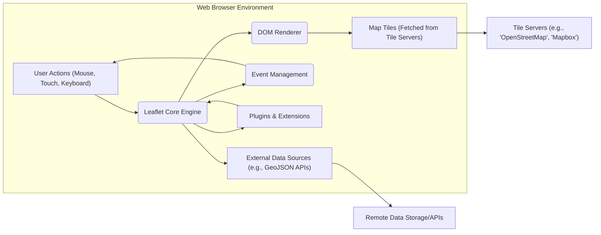
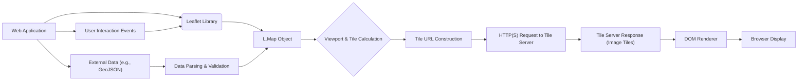

## Project Design Document: Leaflet - A JavaScript Library for Interactive Maps

**Version:** 1.1
**Date:** October 26, 2023
**Author:** AI Software Architect

### 1. Introduction

This document provides a detailed design overview of Leaflet, an open-source JavaScript library for embedding interactive maps into web applications. The primary purpose of this document is to clearly articulate the architecture, key components, and data flow within Leaflet to facilitate a comprehensive threat modeling exercise. Understanding these aspects is crucial for identifying potential security vulnerabilities and designing appropriate mitigations.

### 2. Goals and Objectives

*   **Primary Goal:** To provide a lightweight, performant, and developer-friendly JavaScript library for displaying interactive maps within web browsers and mobile web views.
*   **Key Objectives:**
    *   Enable seamless integration of interactive maps into web applications with minimal code.
    *   Support a wide range of map tile providers and custom tile sources.
    *   Offer a comprehensive set of features for map interaction, including panning, zooming, markers, popups, vector layers, and image overlays.
    *   Maintain excellent cross-browser compatibility and performance across different devices.
    *   Provide a well-documented, extensible, and easily maintainable API for developers.

### 3. Architectural Overview

Leaflet operates entirely within the client-side web browser environment. It leverages the browser's Document Object Model (DOM), JavaScript engine, and network capabilities to render and interact with map elements. The core of Leaflet manages the map state and interactions, while relying on external tile servers for map imagery and potentially other data sources for displaying features.

**Key Architectural Points:**

*   **Client-Side Architecture:** Leaflet's execution is confined to the user's web browser, making it highly dependent on the security of the browser environment.
*   **Modular Design with Extensibility:**  Leaflet's modular design allows developers to include only necessary components, reducing the attack surface. The plugin architecture enables extending functionality but also introduces potential risks from third-party code.
*   **Reliance on Browser APIs:** Leaflet heavily utilizes standard browser APIs for DOM manipulation, event handling, network requests (primarily `XMLHttpRequest` or `fetch`), and potentially local storage. Vulnerabilities in these browser APIs could indirectly affect Leaflet.
*   **Interaction with External Services:**  A fundamental aspect of Leaflet is its interaction with external tile servers to retrieve map images. The security and availability of these external services are critical. It can also interact with other external data sources for displaying features.

### 4. Component Breakdown

This section details the key components within the Leaflet library and their roles.

*   **Core Map Management:**
    *   `L.Map`: The central class responsible for creating and managing the map instance. It handles map initialization, setting the geographical center and zoom level, and managing layers and controls. Potential vulnerabilities could arise from improper configuration or handling of map state.
    *   `L.Layer`: An abstract base class for all visual layers displayed on the map. This includes tile layers, vector layers, and image overlays. Security considerations depend on the specific layer type and its data source.
    *   `L.TileLayer`:  A concrete `L.Layer` implementation for displaying raster map tiles fetched from external servers. This component is a primary point of interaction with external services and is susceptible to issues related to insecure tile servers or man-in-the-middle attacks.
    *   `L.GridLayer`: A base class for layers that are displayed in a grid of cells, often used for tiled data.
    *   `L.ImageOverlay`: A `L.Layer` for displaying a single image overlaid on specific map bounds. Security risks include serving malicious images or images from untrusted sources.
    *   `L.VideoOverlay`: A `L.Layer` for displaying a video overlaid on specific map bounds. Similar security risks to `L.ImageOverlay`.
    *   `L.DivOverlay`: An abstract base class for creating HTML overlays anchored to specific map locations. This is a significant area for potential XSS vulnerabilities if content is not properly sanitized.
    *   `L.Popup`: A concrete `L.DivOverlay` for displaying information associated with a specific point on the map. Highly susceptible to XSS if displaying user-generated or untrusted content.
    *   `L.Tooltip`: A concrete `L.DivOverlay` for displaying information on hover. Similar XSS risks to `L.Popup`.
    *   `L.Marker`: A `L.Layer` for displaying icons at specific coordinates. While the marker itself is generally safe, associated popups or tooltips can introduce vulnerabilities.
    *   `L.Path`: An abstract base class for vector layers.
    *   `L.Polyline`: A concrete `L.Path` for drawing connected line segments. Security considerations involve the source and integrity of the coordinate data.
    *   `L.Polygon`: A concrete `L.Path` for drawing filled polygons. Similar security considerations to `L.Polyline`.
    *   `L.Rectangle`: A concrete `L.Path` for drawing rectangles. Similar security considerations to `L.Polyline`.
    *   `L.Circle`: A concrete `L.Path` for drawing circles. Similar security considerations to `L.Polyline`.
    *   `L.CircleMarker`: A concrete `L.Path` for drawing filled circles with a fixed radius in pixels. Similar security considerations to `L.Polyline`.
    *   `L.GeoJSON`: A utility class for parsing and displaying GeoJSON data as vector layers. Parsing untrusted GeoJSON can lead to vulnerabilities if the data contains malicious scripts or unexpected structures.
    *   `L.Control`: An abstract base class for map controls (e.g., zoom controls, attribution). Custom controls, especially those from third-party sources, should be carefully reviewed for security.
    *   `L.Handler`: Classes responsible for handling specific user interactions (e.g., dragging, zooming). Potential vulnerabilities could arise from improper input validation or handling of user events.
    *   `L.Projection`: Handles the mathematical transformations between geographic coordinates and pixel coordinates. Generally not a direct source of vulnerabilities but crucial for correct map rendering.
    *   `L.CRS (Coordinate Reference System)`: Defines the coordinate system used by the map. Incorrect CRS configuration might lead to unexpected behavior but is less likely to be a direct security risk.

*   **User Interface Components:**
    *   `L.Control.Zoom`: Provides zoom in/out buttons.
    *   `L.Control.Attribution`: Displays attribution information for map data.
    *   `L.Control.Scale`: Displays a scale bar on the map.
    *   `L.Control.Layers`: Allows users to toggle different layers on the map.
    *   Custom Controls: Developed by users or through plugins, these require careful security review.

*   **Event Handling System:**
    *   Leaflet's event system allows developers to listen for and respond to various map events (e.g., `moveend`, `zoomend`, `click`, `popupopen`). Improperly handled events, especially those triggered by user input or external data, could introduce vulnerabilities.

*   **Utility Functions:**
    *   Various utility functions for geometry calculations, DOM manipulation, and browser compatibility. While generally safe, vulnerabilities in these utilities could have widespread impact.

### 5. Data Flow

The following describes the typical data flow within a Leaflet application, highlighting potential security implications at each stage.

1. **Initialization Phase:**
    *   The web application initializes a `L.Map` object, specifying the container element and initial map options (center, zoom level). This configuration should be carefully managed to prevent unintended behavior.
    *   `L.TileLayer` or other base layers are added, specifying the URL template for fetching tiles. **Security Consideration:** The URL templates should use HTTPS to prevent man-in-the-middle attacks. The choice of tile server is crucial for data integrity and availability.

2. **Tile Loading Process:**
    *   As the user interacts with the map (panning, zooming), Leaflet calculates the required map tiles based on the current viewport.
    *   It constructs URLs based on the tile layer's URL template and the tile coordinates (z, x, y). **Security Consideration:** Ensure proper encoding of URL parameters to prevent injection attacks if dynamic parameters are used.
    *   The browser makes HTTP(S) requests to the specified tile servers to fetch the tile images. **Security Consideration:**  The browser's security mechanisms (e.g., CORS) play a role here. Ensure the tile server has appropriate CORS headers if the Leaflet application is served from a different origin.
    *   The fetched tile images are rendered within the map container. **Security Consideration:** While less common, vulnerabilities in image rendering libraries could potentially be exploited.

3. **User Interaction Handling:**
    *   User interactions (mouse clicks, touch events, keyboard input) are captured by the browser and passed to Leaflet's event handlers. **Security Consideration:**  Input validation is crucial to prevent unexpected behavior or injection attacks if user input is used to manipulate the map or its data.
    *   Leaflet's event handlers process these interactions, updating the map's viewport, triggering tile reloads, or interacting with map features.

4. **External Data Integration (e.g., GeoJSON):**
    *   Developers can load external data sources, such as GeoJSON files or APIs, using methods like `L.geoJSON()`. **Security Consideration:**  Loading data from untrusted sources poses a significant risk. Malicious GeoJSON could contain embedded scripts or unexpected structures that could lead to XSS or other vulnerabilities. Sanitization and validation of external data are essential.
    *   Leaflet parses the data and creates corresponding vector layers (polygons, polylines, markers) on the map.

5. **Plugin Interaction:**
    *   Plugins can extend Leaflet's functionality. **Security Consideration:**  Third-party plugins should be carefully vetted for security vulnerabilities before being included in a project. Regularly update plugins to patch known issues.

### 6. Security Considerations

This section expands on potential security vulnerabilities and best practices when using Leaflet.

*   **Cross-Site Scripting (XSS):**
    *   **Vulnerability:** Displaying unsanitized user-provided content within popups, tooltips, or custom overlays is a primary XSS risk.
    *   **Mitigation:** Always sanitize user input before displaying it. Use appropriate escaping techniques for HTML content. Consider using Content Security Policy (CSP) to further restrict the execution of scripts.
*   **Content Security Policy (CSP):**
    *   **Importance:** Implementing a strong CSP is crucial to mitigate XSS attacks by controlling the sources from which the browser is allowed to load resources.
    *   **Configuration:** Carefully configure CSP directives to allow necessary resources (e.g., tile servers, fonts) while restricting others.
*   **Subresource Integrity (SRI):**
    *   **Benefit:** Using SRI tags when including Leaflet from a CDN ensures that the browser only executes the library if its content matches the expected hash, protecting against compromised CDNs.
*   **Tile Server Security:**
    *   **Risk:** Using insecure or compromised tile servers can lead to the display of incorrect or malicious map data.
    *   **Mitigation:** Choose reputable tile providers that use HTTPS. If using tile servers requiring API keys, protect these keys and avoid exposing them client-side if possible.
*   **Data Injection (e.g., GeoJSON):**
    *   **Vulnerability:** Parsing untrusted GeoJSON data can lead to XSS if the data contains malicious scripts within properties or geometry definitions.
    *   **Mitigation:**  Thoroughly validate and sanitize GeoJSON data from untrusted sources before rendering it on the map.
*   **Man-in-the-Middle (MITM) Attacks:**
    *   **Risk:** If connections to tile servers or other external resources are not over HTTPS, attackers could intercept and modify the data being transmitted.
    *   **Mitigation:**  Always use HTTPS for fetching map tiles and other external resources.
*   **Third-Party Plugin Security:**
    *   **Risk:**  Plugins can introduce vulnerabilities if they contain malicious code or have security flaws.
    *   **Mitigation:**  Carefully vet third-party plugins before using them. Review their code if possible. Keep plugins updated to patch known vulnerabilities.
*   **Denial of Service (DoS):**
    *   **Risk:** While Leaflet itself doesn't directly cause DoS, a large number of requests for map tiles could potentially overwhelm tile servers.
    *   **Mitigation:** Implement appropriate caching mechanisms and consider using tile servers with robust infrastructure.
*   **Input Validation:**
    *   **Importance:** Validate any user input that is used to interact with the map or its data to prevent unexpected behavior or injection attacks.

### 7. Assumptions and Constraints

*   **Modern Browser Environment:** Leaflet assumes a modern web browser environment with support for JavaScript, DOM manipulation, and standard web APIs.
*   **Network Connectivity:** Displaying map tiles requires a stable and reliable network connection.
*   **Tile Server Availability and Performance:** The availability and performance of the map are directly dependent on the chosen tile servers.
*   **Client-Side Processing Limitations:** All map rendering and interaction logic occurs on the client-side, which can impact performance on resource-constrained devices or with very large datasets.

### 8. Future Considerations

*   **WebAssembly (Wasm) Integration:** Exploring the potential for using WebAssembly to improve performance for computationally intensive tasks, such as complex vector rendering or data processing.
*   **Enhanced Accessibility Features:** Continued development to improve map accessibility for users with disabilities, adhering to WCAG guidelines.
*   **Improved Support for Vector Tiles:** Enhancing capabilities for rendering and styling vector tiles, which can offer performance and styling advantages over raster tiles.
*   **Performance Optimizations:** Ongoing efforts to optimize rendering performance, reduce memory usage, and improve overall efficiency.

This improved design document provides a more detailed and security-focused overview of the Leaflet library. This information is intended to be a valuable resource for conducting thorough threat modeling and implementing appropriate security measures.