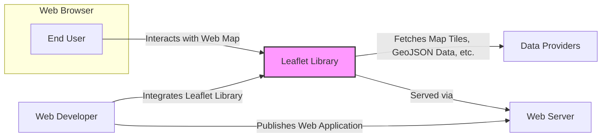
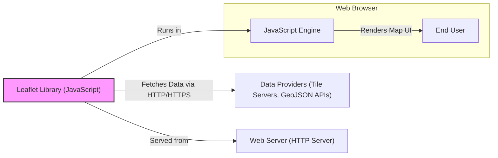
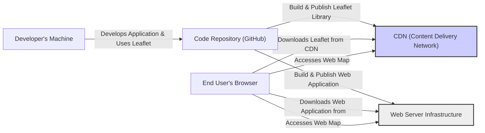
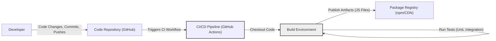

# BUSINESS POSTURE

- Business Priorities and Goals:
  - Provide a lightweight, flexible, and user-friendly open-source JavaScript library for interactive maps.
  - Enable web developers to easily integrate maps into their web applications and services.
  - Foster a strong and active community around the library for continuous improvement and support.
  - Maintain the library's reputation as a reliable and high-quality mapping solution.
- Business Risks:
  - Security vulnerabilities in the library could lead to exploitation in applications using Leaflet, damaging the library's reputation and user trust.
  - Lack of consistent maintenance and community support could result in the library becoming outdated or insecure.
  - Performance issues or bugs could negatively impact user experience and adoption.
  - Compatibility issues with new web browsers or technologies could limit the library's usability.

# SECURITY POSTURE

- Existing Security Controls:
  - security control: Open Source Code Review - The library is open source, allowing for community review and identification of potential vulnerabilities. Implemented through GitHub repository and public code access.
  - security control: Issue Tracking - GitHub issue tracker is used for reporting and managing bugs and potential security issues. Implemented through GitHub repository issue system.
  - security control: Community Contributions - Security patches and improvements can be contributed by the community. Implemented through GitHub pull request process.
- Accepted Risks:
  - accepted risk: Reliance on Community Security - Security depends heavily on the active participation of the open-source community for vulnerability discovery and patching.
  - accepted risk: Third-party Integrations - Leaflet often integrates with external data sources and services, the security of which is outside of Leaflet's direct control.
  - accepted risk: Client-Side Execution - As a client-side JavaScript library, Leaflet's security relies on the security of the user's web browser and environment.
- Recommended Security Controls:
  - security control: Automated Security Scanning - Implement automated static analysis security testing (SAST) and dependency scanning in the CI/CD pipeline to proactively identify vulnerabilities.
  - security control: Vulnerability Disclosure Policy - Establish a clear vulnerability disclosure policy to guide security researchers on how to report vulnerabilities responsibly.
  - security control: Security Focused Code Reviews - Encourage security-focused code reviews for all contributions, especially those related to input handling and data processing.
- Security Requirements:
  - Authentication: Not directly applicable to the Leaflet library itself, as it is a client-side rendering library. Authentication concerns would reside in the applications using Leaflet to secure access to data or features.
  - Authorization: Similar to authentication, authorization is not a core requirement for Leaflet. Applications using Leaflet would need to implement their own authorization mechanisms to control access to data and functionalities displayed on the map.
  - Input Validation: Input validation is crucial for Leaflet to prevent vulnerabilities such as Cross-Site Scripting (XSS). Leaflet needs to properly handle and sanitize user-provided data used in map configurations, markers, popups, and other elements. This should be implemented within the Leaflet library code, especially in functions that process user inputs.
  - Cryptography: Cryptography is not a primary requirement for the core Leaflet library. However, if applications using Leaflet handle sensitive location data or require secure communication with data providers, cryptographic measures should be implemented at the application level, potentially utilizing browser-based crypto APIs if needed.

# DESIGN

## C4 CONTEXT

- Context Diagram Elements:
  - - Name: End User
    - Type: Person
    - Description: Users who interact with web maps built using Leaflet in their web browsers.
    - Responsibilities: View and interact with maps, provide input through map interactions.
    - Security controls: Web browser security controls, user device security.
  - - Name: Web Developer
    - Type: Person
    - Description: Developers who use Leaflet library to build web mapping applications.
    - Responsibilities: Integrate Leaflet into web projects, configure maps, handle data, deploy web applications.
    - Security controls: Secure development practices, code review, dependency management.
  - - Name: Leaflet Library
    - Type: Software System
    - Description: Open-source JavaScript library for interactive maps. Provides core mapping functionalities, UI components, and API for web developers.
    - Responsibilities: Rendering maps in web browsers, handling user interactions, fetching and displaying map data.
    - Security controls: Input validation, secure coding practices, community security reviews, automated security scanning (recommended).
  - - Name: Data Providers
    - Type: External System
    - Description: External services and servers that provide map tiles, GeoJSON data, and other geospatial data used by Leaflet.
    - Responsibilities: Serve map data to Leaflet library upon request.
    - Security controls: Data provider's security controls, access control, data integrity measures.
  - - Name: Web Server
    - Type: Software System
    - Description: Web server that hosts and serves web applications that incorporate Leaflet library.
    - Responsibilities: Serve web application code, including Leaflet library and application-specific code, to end users' browsers.
    - Security controls: Web server security configuration, access control, HTTPS, web application firewall (WAF).

## C4 CONTAINER

- Container Diagram Elements:
  - - Name: Leaflet Library (JavaScript)
    - Type: Container - JavaScript Library
    - Description: The core Leaflet JavaScript library, containing all the logic for map rendering, user interaction handling, and data fetching.
    - Responsibilities: Implement map functionalities, process user interactions, fetch map data from data providers, render map UI in the browser.
    - Security controls: Input validation within JavaScript code, secure coding practices, automated security scanning (recommended during build process).
  - - Name: JavaScript Engine
    - Type: Container - Execution Environment
    - Description: The JavaScript engine within the web browser that executes the Leaflet library code.
    - Responsibilities: Execute JavaScript code, provide browser APIs for Leaflet to interact with the DOM, network, and other browser features.
    - Security controls: Browser security features (e.g., sandboxing, Content Security Policy), browser updates.
  - - Name: Data Providers (Tile Servers, GeoJSON APIs)
    - Type: Container - External Data Source
    - Description: External servers providing map tiles (e.g., raster or vector tiles) and APIs serving geospatial data (e.g., GeoJSON).
    - Responsibilities: Serve map data to Leaflet library upon request, handle data requests over HTTP/HTTPS.
    - Security controls: Data provider's security controls, API security (authentication, authorization if applicable), HTTPS for data transmission.
  - - Name: Web Server (HTTP Server)
    - Type: Container - Web Server
    - Description: Web server that hosts and serves the web application files, including HTML, CSS, JavaScript files (including Leaflet library).
    - Responsibilities: Serve web application assets to end users' browsers, handle HTTP/HTTPS requests.
    - Security controls: Web server security configuration, HTTPS, access control, potentially a Web Application Firewall (WAF).

## DEPLOYMENT

- Deployment Architecture Options:
  - CDN (Content Delivery Network) for distributing Leaflet library files.
  - npm/yarn registry for package management and distribution.
  - Direct hosting on web servers alongside web applications.
- Detailed Deployment Architecture (CDN & Web Server):

- Deployment Diagram Elements:
  - - Name: CDN (Content Delivery Network)
    - Type: Infrastructure - CDN
    - Description: Content Delivery Network used to host and distribute Leaflet library files globally for efficient delivery to end users.
    - Responsibilities: Host and serve Leaflet JavaScript files, optimize delivery speed and availability.
    - Security controls: CDN provider's security controls, HTTPS for content delivery, DDoS protection.
  - - Name: Web Server Infrastructure
    - Type: Infrastructure - Web Server
    - Description: Infrastructure hosting the web application that uses Leaflet. This could be cloud-based infrastructure, virtual machines, or physical servers.
    - Responsibilities: Host and serve the web application files, handle user requests, interact with backend services if any.
    - Security controls: Server hardening, operating system security, web server configuration, network security (firewalls, intrusion detection), HTTPS, access control.
  - - Name: Code Repository (GitHub)
    - Type: Infrastructure - Code Repository
    - Description: GitHub repository used for version control, collaboration, and source code management of Leaflet library and potentially web applications using it.
    - Responsibilities: Store source code, manage versions, track changes, facilitate collaboration.
    - Security controls: Access control (authentication, authorization), audit logging, secure code storage, branch protection.
  - - Name: Developer's Machine
    - Type: Infrastructure - Development Environment
    - Description: Developer's local machine used for developing and testing web applications using Leaflet.
    - Responsibilities: Code development, local testing, integration with Leaflet library.
    - Security controls: Developer workstation security, secure development practices, code review before commit.
  - - Name: End User's Browser
    - Type: Infrastructure - Client Environment
    - Description: End user's web browser used to access and interact with web applications using Leaflet.
    - Responsibilities: Render web application, execute JavaScript code (Leaflet), display map UI, handle user interactions.
    - Security controls: Web browser security features, user device security, browser updates.

## BUILD

- Build Process Description:
  - Developer commits code changes to the GitHub repository.
  - Code push to the repository triggers a CI/CD pipeline, likely using GitHub Actions.
  - CI/CD pipeline checks out the code into a build environment.
  - Static analysis security testing (SAST) scanners and linters are executed to identify potential code quality and security issues.
  - The Leaflet library is built, typically involving JavaScript bundling and minification.
  - Automated tests (unit tests, integration tests) are executed to ensure code functionality and quality.
  - If all checks and tests pass, the build artifacts (JavaScript files) are published to package registries like npm and potentially to a CDN for distribution.
- Build Process Security Controls:
  - security control: Automated Build Pipeline - Use of a CI/CD pipeline ensures a consistent and repeatable build process, reducing manual errors. Implemented via GitHub Actions or similar CI/CD tools.
  - security control: Static Analysis Security Testing (SAST) - Integrate SAST tools into the CI/CD pipeline to automatically scan code for potential security vulnerabilities during the build process. Implemented within CI/CD pipeline steps.
  - security control: Linters and Code Quality Checks - Use linters and code quality tools to enforce coding standards and identify potential code defects. Implemented within CI/CD pipeline steps.
  - security control: Automated Testing - Implement comprehensive automated tests (unit, integration) to verify code functionality and prevent regressions. Implemented within CI/CD pipeline steps.
  - security control: Dependency Scanning - Scan project dependencies for known vulnerabilities using dependency scanning tools. Implemented within CI/CD pipeline steps.
  - security control: Secure Build Environment - Ensure the build environment is secure and isolated to prevent tampering or unauthorized access. Implemented by CI/CD platform security features.
  - security control: Artifact Signing (Optional) - Consider signing build artifacts to ensure integrity and authenticity. Could be implemented as part of the publishing process.

# RISK ASSESSMENT

- Critical Business Processes:
  - Providing a secure and reliable Leaflet library to web developers.
  - Maintaining the reputation and trust of the Leaflet project.
  - Ensuring the continuous availability and usability of the library.
- Data to Protect:
  - Leaflet library source code: Sensitivity - High (Confidentiality, Integrity, Availability). Compromise could lead to malicious modifications or loss of intellectual property.
  - User data in applications using Leaflet: Sensitivity - Varies depending on the application. Could range from low (public map data) to high (sensitive location data). Security of this data is primarily the responsibility of the application developers, but Leaflet should avoid introducing vulnerabilities that could expose this data.
  - Build and release infrastructure: Sensitivity - Medium to High (Integrity, Availability). Compromise could lead to supply chain attacks or disruption of library distribution.

# QUESTIONS & ASSUMPTIONS

- Questions:
  - What are the specific security concerns or priorities for the Leaflet project beyond general web security best practices?
  - Are there any specific compliance requirements or industry standards that Leaflet needs to adhere to?
  - What is the process for handling and responding to reported security vulnerabilities in Leaflet?
  - Are there any plans to implement more formal security testing or audits for Leaflet?
- Assumptions:
  - The Leaflet project aims to provide a secure and reliable library for its users.
  - Security is considered an important aspect of the Leaflet project, although it is primarily community-driven.
  - The primary distribution methods for Leaflet are through CDN and npm package registry.
  - Web developers using Leaflet are responsible for implementing application-level security controls and protecting user data within their applications.