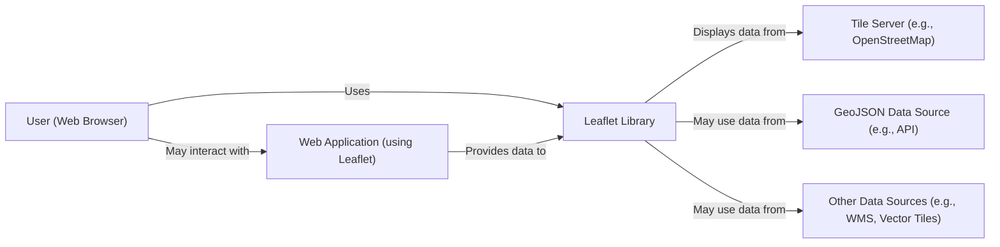
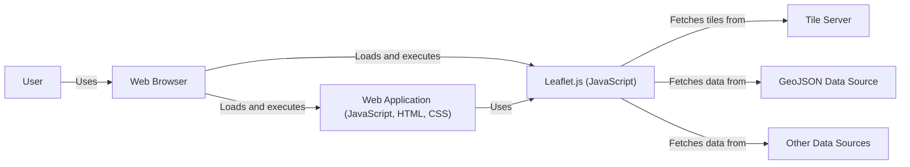
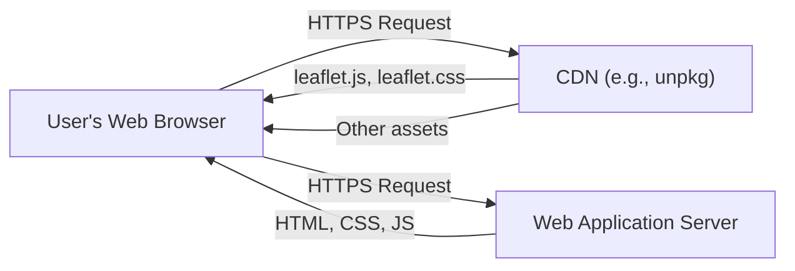
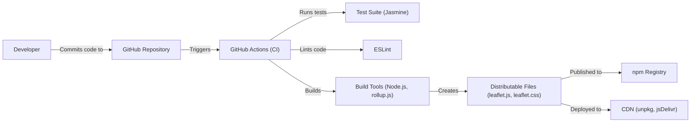

Okay, let's create a design document for the Leaflet project, focusing on aspects relevant for threat modeling.

# BUSINESS POSTURE

Leaflet is a popular open-source JavaScript library for interactive maps. It's designed to be lightweight, easy to use, and extensible.  It's used by a wide variety of organizations, from small startups to large enterprises and government agencies, for everything from simple map displays to complex geospatial applications.

Priorities:

*   Maintainability:  The project must be easy to maintain and update, given its open-source nature and reliance on community contributions.
*   Performance:  The library must be fast and efficient, especially on mobile devices and low-bandwidth connections.  This is a core selling point of Leaflet.
*   Usability:  The API should be easy to use and understand, encouraging adoption and contribution.
*   Extensibility:  The plugin architecture must be robust and allow for a wide range of extensions without compromising core functionality or stability.
*   Accessibility: The library should be accessible to users with disabilities, adhering to web accessibility standards.
*   Compatibility: Support a wide range of browsers and devices, including older versions where feasible.

Goals:

*   Provide a stable and reliable platform for building interactive maps.
*   Foster a vibrant community of users and contributors.
*   Remain a leading choice for web mapping, staying competitive with other libraries.

Business Risks:

*   Security vulnerabilities in the core library or popular plugins could expose users to attacks, damaging Leaflet's reputation and potentially impacting the organizations using it. Cross-site scripting (XSS) is a particular concern.
*   Performance degradation or bugs introduced in new releases could lead to user frustration and abandonment.
*   Lack of maintenance or community engagement could lead to the project becoming obsolete.
*   Failure to keep up with evolving web standards and browser technologies could limit Leaflet's compatibility and usefulness.
*   Legal issues related to licensing or intellectual property could arise, particularly concerning contributions and plugins.

# SECURITY POSTURE

Existing Security Controls:

*   security control: Code Reviews: All contributions to the Leaflet core are subject to code review by maintainers. (Described in contribution guidelines on GitHub).
*   security control: Input Sanitization: Leaflet sanitizes user-provided HTML in some areas, such as popups and markers, to mitigate XSS risks. (Implemented in the `L.Util.template` function and related areas).
*   security control: Dependency Management: The project uses a limited number of external dependencies, reducing the attack surface. (Visible in `package.json`).
*   security control: Content Security Policy (CSP) Recommendations: Leaflet's documentation provides guidance on using CSP to enhance security. (Mentioned in Leaflet's documentation).
*   security control: Regular Updates: The maintainers release updates to address bug fixes and security vulnerabilities. (Visible in the release history on GitHub).

Accepted Risks:

*   accepted risk: Plugin Ecosystem: The vast plugin ecosystem is largely outside the direct control of the Leaflet core maintainers. While this provides extensibility, it also introduces a risk of vulnerabilities in third-party plugins. Users are responsible for vetting the plugins they use.
*   accepted risk: Legacy Browser Support: Supporting older browsers may limit the ability to implement some modern security features.
*   accepted risk: Limited Security Expertise: While the maintainers are experienced developers, they may not be dedicated security experts.

Recommended Security Controls:

*   Implement a formal vulnerability disclosure program.
*   Integrate static analysis security testing (SAST) tools into the build process.
*   Perform regular security audits of the core library and, where feasible, popular plugins.
*   Provide more comprehensive security documentation and best practices for developers using Leaflet.
*   Consider implementing Subresource Integrity (SRI) for externally hosted resources.

Security Requirements:

*   Authentication: Not directly applicable to the Leaflet library itself, as it's a client-side library. Authentication is the responsibility of the application using Leaflet.
*   Authorization: Not directly applicable to the Leaflet library itself. Authorization is the responsibility of the application using Leaflet.
*   Input Validation:
    *   All user-provided input, especially HTML content used in popups, markers, and other UI elements, must be properly sanitized to prevent XSS attacks.
    *   GeoJSON data should be validated to ensure it conforms to the specification and does not contain malicious payloads.
    *   URL parameters and options passed to Leaflet functions should be validated to prevent unexpected behavior or vulnerabilities.
*   Cryptography:
    *   Leaflet itself does not handle sensitive data requiring encryption. However, if applications using Leaflet transmit sensitive data (e.g., user locations), they should use HTTPS and appropriate cryptographic protocols.
    *   If Leaflet integrates with APIs that require API keys or other credentials, these should be handled securely by the application, not stored directly within Leaflet code.

# DESIGN

## C4 CONTEXT

Element Descriptions:

*   Element:
    *   Name: User
    *   Type: Person
    *   Description: A person interacting with a web map powered by Leaflet.
    *   Responsibilities: Viewing the map, interacting with map controls (zooming, panning), interacting with map features (markers, popups).
    *   Security Controls: Browser security features (e.g., same-origin policy, CSP), user authentication and authorization managed by the web application.

*   Element:
    *   Name: Leaflet Library
    *   Type: Software System
    *   Description: The core Leaflet JavaScript library.
    *   Responsibilities: Rendering the map, handling user interactions, managing map layers, providing an API for developers.
    *   Security Controls: Input sanitization, code reviews, dependency management.

*   Element:
    *   Name: Tile Server
    *   Type: Software System
    *   Description: A server that provides map tiles (images) to Leaflet.
    *   Responsibilities: Serving map tiles at different zoom levels.
    *   Security Controls: Access controls, rate limiting, HTTPS.

*   Element:
    *   Name: GeoJSON Data Source
    *   Type: Software System
    *   Description: A source of GeoJSON data, often an API.
    *   Responsibilities: Providing structured geospatial data.
    *   Security Controls: API authentication, authorization, input validation, HTTPS.

*   Element:
    *   Name: Other Data Sources
    *   Type: Software System
    *   Description: Other potential data sources, such as WMS servers or vector tile servers.
    *   Responsibilities: Providing geospatial data in various formats.
    *   Security Controls: Dependent on the specific data source (e.g., WMS security, HTTPS).

*   Element:
    *   Name: Web Application
    *   Type: Software System
    *   Description: The web application that embeds and uses the Leaflet library.
    *   Responsibilities: Providing the overall application context, managing user authentication and authorization, potentially providing data to Leaflet.
    *   Security Controls: All standard web application security controls (e.g., authentication, authorization, input validation, output encoding, session management, etc.).

## C4 CONTAINER

Since Leaflet is a client-side JavaScript library, the container diagram is essentially an extension of the context diagram. The "container" in this case is the web browser.

Element Descriptions:

*   Element:
    *   Name: User
    *   Type: Person
    *   Description: A person interacting with a web map powered by Leaflet.
    *   Responsibilities: Viewing the map, interacting with map controls, interacting with map features.
    *   Security Controls: Browser security features, user authentication and authorization managed by the web application.

*   Element:
    *   Name: Web Browser
    *   Type: Container (Software)
    *   Description: The user's web browser (e.g., Chrome, Firefox, Safari).
    *   Responsibilities: Rendering HTML, executing JavaScript, managing network requests, enforcing security policies.
    *   Security Controls: Same-origin policy, CSP, XSS protection, cookie security, HTTPS enforcement.

*   Element:
    *   Name: Leaflet.js (JavaScript)
    *   Type: Component (JavaScript Library)
    *   Description: The core Leaflet JavaScript code.
    *   Responsibilities: Rendering the map, handling user interactions, managing map layers, providing an API.
    *   Security Controls: Input sanitization, code reviews, dependency management.

*   Element:
    *   Name: Tile Server
    *   Type: Software System
    *   Description: A server that provides map tiles.
    *   Responsibilities: Serving map tiles.
    *   Security Controls: Access controls, rate limiting, HTTPS.

*   Element:
    *   Name: GeoJSON Data Source
    *   Type: Software System
    *   Description: A source of GeoJSON data.
    *   Responsibilities: Providing structured geospatial data.
    *   Security Controls: API authentication, authorization, input validation, HTTPS.

*   Element:
    *   Name: Other Data Sources
    *   Type: Software System
    *   Description: Other potential data sources.
    *   Responsibilities: Providing geospatial data.
    *   Security Controls: Dependent on the specific data source.
*   Element:
    *   Name: Web Application (JavaScript, HTML, CSS)
    *   Type: Component
    *   Description: Code of web application that is using Leaflet library.
    *   Responsibilities: Providing the overall application context, managing user authentication and authorization, potentially providing data to Leaflet.
    *   Security Controls: All standard web application security controls (e.g., authentication, authorization, input validation, output encoding, session management, etc.).

## DEPLOYMENT

Leaflet, as a JavaScript library, is typically deployed in one of the following ways:

1.  **Direct Inclusion:** The `leaflet.js` and `leaflet.css` files are downloaded and included directly in the HTML of the web application.
2.  **Content Delivery Network (CDN):** Leaflet is loaded from a CDN, such as unpkg or jsDelivr. This is the recommended approach for most users, as it provides performance benefits and simplifies updates.
3.  **Package Manager:** Leaflet can be installed using a package manager like npm or yarn and bundled with the application's other JavaScript code using a build tool like Webpack or Parcel.

We'll describe the CDN deployment in detail, as it's the most common and recommended method.

Element Descriptions:

*   Element:
    *   Name: User's Web Browser
    *   Type: Software (Browser)
    *   Description: The user's web browser.
    *   Responsibilities: Making requests, rendering HTML, executing JavaScript.
    *   Security Controls: Browser security features.

*   Element:
    *   Name: CDN (e.g., unpkg)
    *   Type: Infrastructure (Server)
    *   Description: A content delivery network that hosts Leaflet files.
    *   Responsibilities: Serving Leaflet files quickly and reliably.
    *   Security Controls: HTTPS, access controls, DDoS protection.

*   Element:
    *   Name: Web Application Server
    *   Type: Infrastructure (Server)
    *   Description: The server hosting the web application that uses Leaflet.
    *   Responsibilities: Serving the web application's HTML, CSS, and JavaScript files.
    *   Security Controls: Standard web server security controls (e.g., HTTPS, access controls, firewalls).

## BUILD

Leaflet's build process involves several steps, from development to the creation of distributable files. The process is automated using Node.js and various build tools.

Security Controls in Build Process:

*   security control: Code Review: All code changes are reviewed before being merged into the main branch.
*   security control: Automated Testing: The test suite (Jasmine) helps ensure code quality and prevent regressions.
*   security control: Linting: ESLint enforces code style and helps identify potential errors.
*   security control: Dependency Management: Dependencies are managed through `package.json` and `package-lock.json`, allowing for auditing and vulnerability scanning.
*   security control: Build Automation: GitHub Actions automates the build process, ensuring consistency and reducing the risk of manual errors.

# RISK ASSESSMENT

Critical Business Processes:

*   Providing a reliable and performant mapping library: This is the core function of Leaflet. Any disruption to this process (e.g., a major vulnerability or performance issue) would significantly impact users and Leaflet's reputation.
*   Maintaining the open-source project: The health of the Leaflet community and the ongoing maintenance of the codebase are crucial for its long-term viability.

Data to Protect:

*   Leaflet itself does not directly handle sensitive user data. However, applications *using* Leaflet may handle various types of data, with varying sensitivity levels:
    *   Geolocation Data: User location data is often highly sensitive and subject to privacy regulations (e.g., GDPR, CCPA). Applications using Leaflet to track user locations must handle this data with extreme care.
    *   Map Data: The map data itself (e.g., OpenStreetMap data) is generally considered public, but some map data may be proprietary or sensitive.
    *   User-Generated Content: If users can add content to the map (e.g., markers, comments), this content may contain personal information or other sensitive data.
    *   API Keys: Applications using Leaflet may interact with APIs that require API keys. These keys should be treated as sensitive data.

# QUESTIONS & ASSUMPTIONS

Questions:

*   Are there any specific compliance requirements (e.g., GDPR, CCPA) that apply to applications commonly built with Leaflet?  (Assumption: Applications using Leaflet are responsible for their own compliance.)
*   What is the process for handling security vulnerabilities reported in Leaflet or its plugins? (Assumption: There is an informal process, but a formal vulnerability disclosure program would be beneficial.)
*   Are there any plans to integrate more advanced security features, such as SRI or CSP, directly into Leaflet? (Assumption: These are currently recommendations, but not built-in features.)
*   What level of support is provided for older browsers, and what are the security implications of this support? (Assumption: Leaflet aims for broad compatibility, which may limit the use of some modern security features.)

Assumptions:

*   Business Posture: Leaflet prioritizes ease of use, performance, and extensibility. Security is a concern, but not the *primary* driver.
*   Security Posture: The Leaflet maintainers are committed to security best practices, but they may not have dedicated security expertise. The plugin ecosystem is a significant area of accepted risk.
*   Design: The primary deployment method is via CDN. The build process is automated and includes some security checks, but could be further enhanced.