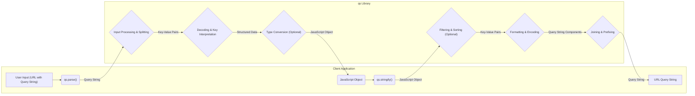

# Project Design Document: qs Library

**Version:** 1.1
**Date:** October 26, 2023
**Author:** AI Software Architect

## 1. Introduction

This document provides a detailed design overview of the `qs` library, a widely used JavaScript library for parsing and stringifying URL query strings. This document aims to provide a comprehensive understanding of the library's architecture, functionality, and data flow, which will serve as the foundation for subsequent threat modeling activities. This revision includes more detail on specific functionalities and potential security implications.

## 2. Goals and Non-Goals

### 2.1. Goals

*   Clearly define the functionality of the `qs` library, including specific configuration options and their impact.
*   Illustrate the data flow within the library during both parsing and stringification operations, highlighting key transformation steps.
*   Identify key components and their interactions with a focus on data handling and potential vulnerabilities.
*   Provide sufficient detail and context to facilitate effective and targeted threat modeling.

### 2.2. Non-Goals

*   Provide a detailed, line-by-line code-level implementation guide.
*   Document every single possible combination of configuration options.
*   Include performance benchmarks or detailed optimization strategies.
*   Provide instructions on how to use the `qs` library in application code.

## 3. Functional Description

The `qs` library offers two core functionalities with a rich set of configuration options to tailor its behavior:

*   **Parsing:**  Converting a URL query string into a JavaScript object. This involves decoding and structuring the key-value pairs.
*   **Stringifying:** Converting a JavaScript object into a URL query string. This involves encoding and formatting the object's properties into a query string format.

The library's flexibility comes from its numerous configuration options, which significantly impact how data is processed:

*   **Delimiter:**  Specifies the character used to separate key-value pairs in the query string (default: `&`). For example, using `;` instead of `&`.
*   **Equals Sign:** Specifies the character used to separate keys and values within a pair (default: `=`). For example, using `:` instead of `=`.
*   **Array Format:** Controls how arrays in the JavaScript object are represented in the query string:
    *   `indices`:  `arr[0]=a&arr[1]=b`
    *   `brackets`: `arr[]=a&arr[]=b`
    *   `repeat`:   `arr=a&arr=b`
    *   `comma`:    `arr=a,b`
*   **Allow Dots:** Enables or disables the interpretation of dots (`.`) in keys as nested object properties. For example, `user.name=value` becomes `{ user: { name: 'value' } }` if enabled.
*   **Allow Sparse:** Allows or disallows the creation of sparse arrays during parsing.
*   **Encoding:** Specifies the encoding method for the query string (default: `utf-8`). This affects how special characters are handled.
*   **Decoding:** Specifies the decoding method for the query string.
*   **Parameter Limit:** Sets a limit on the number of parameters that can be parsed. This can help prevent denial-of-service attacks.
*   **Depth:** Sets the maximum depth for parsing nested objects. This also helps prevent denial-of-service attacks by limiting recursion.
*   **Ignore Query Prefix:** Ignores the leading `?` in the query string during parsing.
*   **Comma:** Specifies the character used to separate array values when using the `comma` array format.
*   **Allow Prototypes:** Allows or disallows properties on the object prototype to be included during stringification. Enabling this can have security implications.
*   **Sort:** A function to sort the parameters when stringifying, allowing for predictable output.
*   **Filter:** A function to filter the parameters when stringifying, allowing for selective inclusion of data.
*   **Encoder:** A custom function to encode parameter values during stringification, providing control over encoding logic.
*   **Decoder:** A custom function to decode parameter values during parsing, providing control over decoding logic.
*   **Parse Null:** Specifies whether to parse values like `null` and empty strings as actual `null` values.
*   **Parse Booleans:** Specifies whether to parse string representations of booleans (`'true'`, `'false'`) as actual boolean values.
*   **Max Keys:** Sets a maximum number of keys to parse, providing another mechanism to prevent resource exhaustion.

### 3.1. Parsing Process

The parsing process transforms a query string into a JavaScript object. Key steps include:

1. **Input Acquisition:** The `qs.parse()` function receives a string representing the URL query.
2. **Prefix Removal (Optional):** If configured, the leading `?` is removed.
3. **Splitting into Pairs:** The query string is split into individual key-value pairs based on the `delimiter` option (default: `&`).
4. **Iterating and Splitting:** Each key-value pair is iterated over and split into its key and value components based on the `equals sign` option (default: `=`).
5. **Decoding:**  URL-encoded characters in both the key and value are decoded using the specified `decoder` or the default decoding mechanism.
6. **Key Interpretation:** Keys are analyzed for array (`[]`) and object (`.`) notations based on the `arrayFormat` and `allowDots` options. This determines how the resulting JavaScript object will be structured. For example, `a[0]=b` creates an array, while `a.b=c` creates a nested object.
7. **Type Conversion (Optional):** Based on the `parseNull` and `parseBooleans` options, string values might be converted to `null` or boolean types.
8. **Object Construction:** The parsed key-value pairs are assembled into a JavaScript object. Careful handling is required to avoid prototype pollution if `allowPrototypes` is not properly managed in consuming code.
9. **Output:** The resulting JavaScript object is returned.

### 3.2. Stringification Process

The stringification process transforms a JavaScript object into a URL query string. Key steps include:

1. **Input Acquisition:** The `qs.stringify()` function receives a JavaScript object.
2. **Filtering (Optional):** If a `filter` function is provided, it's applied to selectively include properties.
3. **Sorting (Optional):** If a `sort` function is provided, the order of parameters is determined by this function.
4. **Iterating through Properties:** The properties of the input object are traversed. The `allowPrototypes` option influences whether prototype properties are included.
5. **Formatting Key-Value Pairs:** Each key-value pair is formatted into a string. Arrays and nested objects are handled according to the `arrayFormat` and `allowDots` options.
6. **Encoding:** Keys and values are URL-encoded using the specified `encoder` or the default encoding mechanism.
7. **Joining Pairs:** The formatted key-value pairs are joined together using the specified `delimiter` option.
8. **Prefix Addition (Optional):** A leading `?` can be added to the beginning of the resulting string.
9. **Output:** The resulting URL query string is returned.

## 4. Data Flow Diagram

**Nodes:**

*   "User Input (URL with Query String)"
*   "qs.parse()"
*   "JavaScript Object"
*   "qs.stringify()"
*   "URL Query String"
*   "Input Processing & Splitting"
*   "Decoding & Key Interpretation"
*   "Structured Data"
*   "Type Conversion (Optional)"
*   "Filtering & Sorting (Optional)"
*   "Formatting & Encoding"
*   "Joining & Prefixing"

**Edges:** Represent the flow of data and transformations.

## 5. Security Considerations (Detailed)

This section elaborates on potential security considerations, providing more specific examples and context.

*   **Denial of Service (DoS):**
    *   **Large Parameter Count:** A malicious query string with an extremely large number of unique parameters (exceeding the `parameterLimit`) can cause excessive processing time and memory consumption during parsing, potentially crashing the application or making it unresponsive. Example: `?a=1&b=2&c=3...&z1000=1000`.
    *   **Deeply Nested Objects:** Query strings designed to create deeply nested JavaScript objects (exceeding the `depth` limit or even within the limit if very large) can lead to stack overflow errors or excessive memory allocation. Example: `?a[b][c][d][e][f][g][h][i][j][k]=value`.
    *   **Long Parameter Names/Values:**  Extremely long parameter names or values can also contribute to resource exhaustion.
*   **Prototype Pollution:**
    *   If the `qs` library is used with default settings or without careful consideration in consuming code, attackers can manipulate the query string to inject properties into the `Object.prototype`. Example: `?__proto__.isAdmin=true`. This can have severe consequences, potentially allowing attackers to bypass security checks or execute arbitrary code.
    *   Even with `allowPrototypes` set to `false` in `qs`, vulnerabilities can arise if the parsed object is later merged or used in a way that doesn't prevent prototype pollution.
*   **Cross-Site Scripting (XSS):**
    *   If the parsed query parameters contain malicious JavaScript code and are directly inserted into the HTML of a web page without proper sanitization, it can lead to XSS vulnerabilities. Example: `?name=`.
    *   This is primarily a concern in the context of how the application *uses* the output of `qs.parse()`, but understanding the potential for carrying malicious payloads is crucial.
*   **Server-Side Request Forgery (SSRF):**
    *   If parsed query parameters are used to construct URLs for server-side requests without proper validation, an attacker could manipulate these parameters to make the server send requests to internal or external resources that it shouldn't access. Example: `?redirect=http://internal-server/sensitive-data`.
*   **Injection Attacks:**
    *   Improper handling of special characters during parsing or stringification could lead to injection vulnerabilities in downstream systems if the resulting data is used in SQL queries or other sensitive contexts. For instance, if single quotes are not properly escaped and the output is used in a SQL query.
*   **Resource Exhaustion:**  Parsing extremely complex or large query strings, even within configured limits, can still lead to noticeable performance degradation or temporary resource exhaustion.
*   **Security Misconfiguration:** Incorrectly configuring the `qs` library (e.g., setting very high limits for parameters or depth, enabling `allowPrototypes` without understanding the risks) can increase the attack surface.

## 6. Deployment Considerations

The deployment environment significantly impacts the potential attack vectors and the severity of vulnerabilities related to the `qs` library.

*   **Browser:**
    *   Vulnerabilities like XSS are directly exploitable.
    *   Prototype pollution can affect the entire page's JavaScript environment.
    *   DoS attacks might primarily impact the user's browser experience.
*   **Node.js (Server-Side):**
    *   Prototype pollution can have broader implications, potentially affecting other requests or even the entire application if not handled carefully.
    *   DoS attacks can impact the availability of the server for all users.
    *   SSRF vulnerabilities become a concern if the server makes outbound requests based on parsed query parameters.
*   **Middleware/API Gateways:** When `qs` is used within middleware or API gateways, vulnerabilities can have a cascading effect, potentially impacting multiple backend services.
*   **Third-Party Libraries:**  The security of the application also depends on how other libraries interact with the output of `qs`. If other libraries are vulnerable to prototype pollution or XSS, the parsed data could become an attack vector.

Understanding the specific deployment context is crucial for prioritizing and mitigating threats identified during threat modeling.

## 7. Technologies Used

*   **JavaScript:** The core language of the library.
*   **npm (or yarn, pnpm):** Package managers for distribution and installation.

## 8. Future Considerations

Potential future enhancements or changes to the `qs` library that could impact its design and security include:

*   **Performance optimizations:**  Changes to parsing or stringification algorithms might introduce new attack vectors or change the performance characteristics related to DoS.
*   **New configuration options:**  Adding more customization options could introduce new security considerations if not designed carefully.
*   **Support for new query string formats:**  Adapting to evolving web standards might require changes to parsing logic, potentially introducing new vulnerabilities.
*   **Refactoring or code modernization:**  Significant changes to the internal architecture could introduce unforeseen security implications. Careful review and testing would be necessary.
*   **Adoption of stricter parsing modes:**  Introducing options for more secure parsing modes with stricter validation could help mitigate some risks.

This improved document provides a more detailed and nuanced understanding of the `qs` library, enhancing its value for subsequent threat modeling activities. The added specifics regarding configuration options, data flow steps, and security considerations will enable a more targeted and effective threat analysis.
