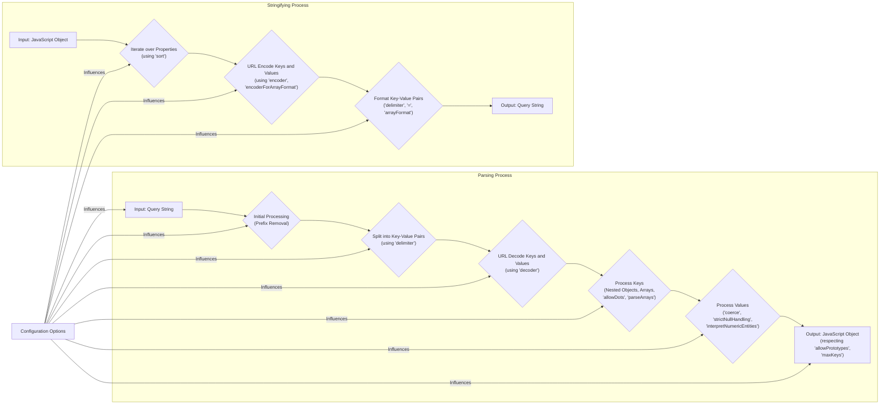

# Project Design Document: qs - Query String Parser and Stringifier

**Version:** 1.1
**Date:** October 26, 2023
**Author:** AI Software Architect

## 1. Introduction

This document provides an enhanced design overview of the `qs` library, a widely adopted JavaScript library for parsing and stringifying URL query strings. This detailed design aims to facilitate a comprehensive understanding of the library's architecture, functionalities, and internal mechanisms, specifically for the purpose of subsequent threat modeling activities.

## 2. Goals

*   Provide a clear, concise, and detailed description of the `qs` library's functionalities, including the impact of configuration options.
*   Outline the key components and their interactions with greater specificity.
*   Illustrate the data flow within the library during both parsing and stringifying operations, emphasizing the role of configuration.
*   Identify potential areas of security concern with concrete examples and attack vectors to inform future threat modeling efforts.

## 3. Overview

The `qs` library offers core functionalities to manipulate URL query strings:

*   **Parsing:**  Transforms a URL query string into a structured JavaScript object, accommodating various formats for nested objects and arrays (e.g., converting `a=b&c[d]=e` to `{ a: 'b', c: { d: 'e' } }`).
*   **Stringifying:** Performs the reverse operation, converting a JavaScript object into a URL query string, allowing for customization of the output format.
*   **Format Handling:** Supports diverse query string structures, including different delimiters, array representations (e.g., indexed, bracketed), and conventions for nesting objects.
*   **Customization via Configuration:** Enables users to tailor the parsing and stringifying processes through a rich set of configuration options, influencing how different query string formats are interpreted and generated.

This library is a fundamental utility in web development, particularly within Node.js backend applications, for managing data transmitted via URL parameters. Its widespread use makes understanding its potential vulnerabilities crucial.

## 4. Functional Description

The `qs` library's core operations are parsing and stringifying, both highly configurable.

### 4.1. Parsing

The parsing process transforms a query string into a JavaScript object. Key stages include:

*   **Input:** Accepts a string representing query parameters (e.g., `?a=b&c=d` or `a=b&c=d`). The leading `?` can be optionally ignored based on configuration.
*   **Initial Processing:**
    *   **Prefix Removal:** Optionally removes the leading `?` based on the `ignoreQueryPrefix` option.
    *   **Splitting:** Divides the query string into key-value pairs using the configured `delimiter` (default: `&`).
*   **Decoding and Key Processing:**
    *   **Decoding:** URL-decodes both keys and values. Custom `decoder` functions can be provided.
    *   **Key Interpretation:** Processes each key to determine the structure of the resulting JavaScript object. This involves:
        *   **Nested Object Handling:** Keys like `a[b][c]` create nested objects. The `allowDots` option dictates whether dot notation (`a.b.c`) is also supported.
        *   **Array Handling:** Keys like `arr[]=1&arr[]=2` or `arr[0]=1&arr[1]=2` create arrays, influenced by the `parseArrays` option which controls the depth of array parsing. The `arrayFormat` option (e.g., `'indices'`, `'brackets'`, `'repeat'`) is relevant during stringification but influences how parsing interprets different array notations. The `commas` option dictates handling of comma-separated values within a single parameter.
*   **Value Processing:**
    *   **Type Coercion:**  The `coerce` option allows for custom functions to modify parsed values (e.g., converting strings to numbers).
    *   **Null Handling:** The `strictNullHandling` option determines if null values are treated as empty strings or omitted.
    *   **HTML Entity Decoding:** The `interpretNumericEntities` option enables decoding of HTML entities in values.
*   **Output:** Generates a JavaScript object representing the parsed query string. The `allowPrototypes` option influences whether properties are assigned directly or via prototype chain manipulation, a critical security consideration. The `maxKeys` option limits the number of parsed parameters.

### 4.2. Stringifying

The stringifying process converts a JavaScript object back into a URL query string. Key stages include:

*   **Input:** Accepts a JavaScript object.
*   **Iteration and Encoding:**
    *   **Property Iteration:** Iterates over the object's properties. The `sort` option allows for custom sorting of parameters.
    *   **Encoding:** URL-encodes keys and values using the configured `encoder` function. Encoding behavior can be customized for specific array formats using `encoderForArrayFormat`.
*   **Formatting:**
    *   **Delimiter Application:** Joins key-value pairs using the specified `delimiter` (default: `&`).
    *   **Equals Sign:** Separates keys and values using the `=` character (configurable).
    *   **Array Formatting:** Formats arrays according to the `arrayFormat` option:
        *   `'indices'`: `arr[0]=1&arr[1]=2`
        *   `'brackets'`: `arr[]=1&arr[]=2`
        *   `'repeat'`: `arr=1&arr=2`
        *   `'comma'`: `arr=1,2` (requires the `commas` option to be enabled during parsing for correct interpretation).
    *   **Nested Object Formatting:** Represents nested objects based on the configured format (typically bracket notation).
*   **Output:** Produces a string representing the URL query parameters.

### 4.3. Configuration Options (Detailed)

The extensive configuration options provide granular control:

*   `delimiter`:  *(String)* The substring used to delimit key and value pairs (default: `&`). Example: `;` would result in `a=b;c=d`.
*   `allowDots`: *(Boolean)* Enables dot notation within parameter names for nested objects. If `true`, `a.b.c=value` is parsed as `{ a: { b: { c: 'value' } } }`.
*   `allowPrototypes`: *(Boolean)* Determines whether to include properties from the object prototype in the output during stringification. Setting this to `true` can have security implications during parsing if not handled carefully.
*   `arrayFormat`: *(String)* Specifies the format for outputting arrays: `'indices'`, `'brackets'`, `'repeat'`, or `'comma'`.
*   `encode`: *(Boolean)*  Whether to perform URI encoding of keys and values.
*   `encoder`: *(Function)* A custom encoder function for URI encoding, allowing for specialized encoding logic.
*   `decoder`: *(Function)* A custom decoder function for URI decoding during parsing.
*   `ignoreQueryPrefix`: *(Boolean)*  When `true`, ignores the leading `?` character in the input query string during parsing.
*   `parameterLimit`: *(Number)* Limits the maximum number of parameters to parse, preventing potential denial-of-service attacks with excessively long query strings.
*   `parseArrays`:  *(Number)* Specifies the depth to which array parsing should occur. Setting it to `1` would only parse the first level of arrays.
*   `strictNullHandling`: *(Boolean)* If `true`, null values are stringified as if the key has no value (e.g., `a`). If `false`, null values are stringified as `a=`.
*   `encoderForArrayFormat`: *(Function)* A custom encoder function specifically for encoding array values based on the `arrayFormat`.
*   `decoderForArrayFormat`: *(Function)* A custom decoder function specifically for decoding array values based on the `arrayFormat` during parsing.
*   `coerce`: *(Function)* A function to modify parsed values after decoding (e.g., `(value) => /^[0-9]+$/.test(value) ? parseInt(value, 10) : value`).
*   `interpretNumericEntities`: *(Boolean)*  If `true`, decodes HTML entities in the values.
*   `sort`: *(Function)* A compare function used to sort the query parameters during stringification, allowing for predictable output.
*   `commas`:  *(Boolean)* When `true`, treats comma-separated values within a parameter as an array during parsing.
*   `maxKeys`: *(Number)* Limits the number of key-value pairs to parse, providing a safeguard against excessively large input.

## 5. Data Flow Diagram

## 6. Key Components

The `qs` library's functionality is encapsulated within these key components:

*   **Parser Module:**  The core logic for transforming a query string into a JavaScript object. This module handles splitting the string, decoding components, and constructing the object based on the defined syntax and configuration options. It's heavily influenced by options like `delimiter`, `allowDots`, `parseArrays`, `coerce`, `allowPrototypes`, and `maxKeys`.
*   **Stringifier Module:** The counterpart to the parser, responsible for converting a JavaScript object back into a query string. This module iterates over the object's properties, encodes keys and values, and formats the output according to options like `delimiter`, `arrayFormat`, `encode`, and `sort`.
*   **Configuration Management:**  While not a distinct code module, the handling of configuration options is a crucial aspect. This involves validating and applying the provided options to guide the behavior of both the parser and stringifier modules. Incorrect configuration can lead to unexpected behavior or security vulnerabilities.
*   **Utility Functions:** Internal helper functions for tasks such as URL encoding and decoding, object property manipulation, and type checking. These utilities are used by both the parser and stringifier modules.

## 7. Security Considerations (For Threat Modeling)

Potential security vulnerabilities to consider during threat modeling:

*   **Denial of Service (DoS) via Complex Input Structures:**
    *   **Deeply Nested Objects:**  Crafted query strings with excessive nesting (e.g., `a[b][c]...[z]=value`) can consume significant server resources during parsing, potentially leading to a DoS. The `parseArrays` and `maxKeys` options offer some mitigation but might not be sufficient against carefully crafted attacks.
    *   **Large Arrays:**  Similar to nested objects, very large arrays (e.g., `arr[0]...arr[100000]=value`) can strain resources.
    *   **Parameter Bomb:** Sending a large number of unique parameters can overwhelm the server, even if the nesting is not deep. The `parameterLimit` and `maxKeys` options are crucial here.
*   **Prototype Pollution:**
    *   **Exploiting `allowPrototypes`:** If `allowPrototypes` is enabled (or if vulnerabilities exist even when disabled), attackers can inject properties into the `Object.prototype` by crafting malicious keys (e.g., `__proto__[isAdmin]=true`). This can have far-reaching consequences, potentially allowing attackers to bypass security checks or execute arbitrary code.
    *   **Bypassing Sanitization:**  Even with input sanitization, vulnerabilities in the parsing logic might allow attackers to inject prototype properties indirectly.
*   **Regular Expression Denial of Service (ReDoS):**
    *   **Vulnerable Regex Patterns:** If the parsing logic relies on inefficient regular expressions, specially crafted input strings can cause them to take an exponential amount of time to process, leading to a DoS. Analyzing the library's regular expressions is crucial.
*   **Input Validation and Sanitization Failures:**
    *   **Unescaped Characters:** Failure to properly handle or escape special characters in keys or values could lead to unexpected behavior or vulnerabilities in downstream applications that process the parsed data (e.g., SQL injection if the parsed values are used in database queries without sanitization).
    *   **Encoding Issues:**  Mismatched encoding or decoding can lead to vulnerabilities like cross-site scripting (XSS) if parsed values are used in web pages without proper output encoding.
*   **Bypassing Parameter Limits:**
    *   **Exploiting Parsing Logic:**  Vulnerabilities in how `parameterLimit` or `maxKeys` are enforced could allow attackers to bypass these limits and send more parameters than intended.
*   **Type Coercion Exploits:**
    *   **Unintended Type Conversions:** If the `coerce` option is used without careful validation, attackers might be able to manipulate the types of parsed values in ways that lead to security vulnerabilities in the application's logic.
*   **Comma Separated Values Vulnerabilities:** If the `commas` option is enabled, and the application logic doesn't anticipate array inputs where it expects single values, it could lead to unexpected behavior or security issues.

## 8. Assumptions and Constraints

*   This design document is based on the current understanding of the `qs` library's functionality as documented and observed in its public API and behavior.
*   The focus is primarily on the core parsing and stringifying functionalities and their configuration options.
*   Detailed analysis of the internal implementation code is beyond the scope of this document but recommended for deeper threat modeling.

## 9. Future Considerations

For a more comprehensive threat model, the following steps are recommended:

*   **Detailed Code Review:** Conduct a thorough review of the `qs` library's source code, paying close attention to the parsing and stringifying logic, regular expressions, and input validation routines.
*   **Dynamic Analysis and Fuzzing:** Employ fuzzing techniques to generate a wide range of potentially malicious input strings and observe the library's behavior, identifying potential crash points or unexpected outputs.
*   **Dependency Analysis:** Analyze the library's dependencies for any known vulnerabilities that could indirectly affect the security of `qs`.
*   **Historical Vulnerability Analysis:** Review past security vulnerabilities reported against `qs` to understand common attack vectors and areas of weakness.
*   **Benchmarking and Performance Testing:**  Conduct performance tests with various input sizes and complexities to understand the library's resource consumption and identify potential DoS vulnerabilities.
*   **Security Audits:** Engage security experts to perform independent security audits of the `qs` library.

This enhanced design document provides a more detailed and security-focused understanding of the `qs` library, serving as a robust foundation for effective threat modeling and security analysis.
