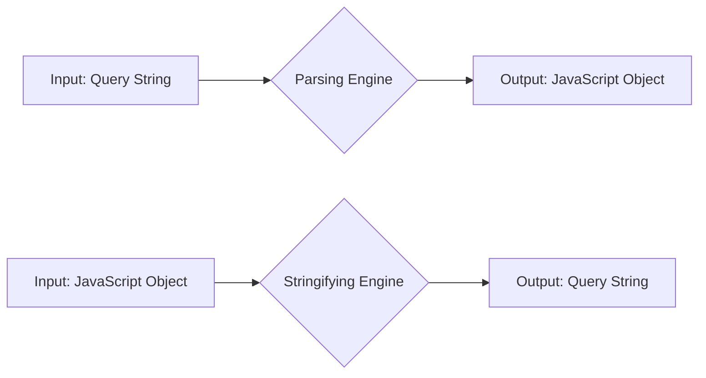
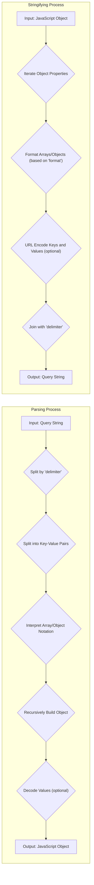

## Project Design Document: qs - Query String Parser and Stringifier

**Version:** 1.1
**Date:** October 26, 2023
**Author:** AI Software Architect

### 1. Project Overview

The `qs` library is a widely used JavaScript library designed for parsing and stringifying URL query strings. It offers robust and configurable handling of various query string formats, including those with nested objects, arrays (with different notations), and custom delimiters. This document details the design of the `qs` library to facilitate comprehensive threat modeling.

### 2. Goals

*   Provide a reliable and efficient mechanism for parsing URL query strings into JavaScript objects, supporting formats like:
    *   Simple key-value pairs (`a=b&c=d`).
    *   Nested objects using bracket (`a[b]=c`) and dot (`a.b=c`) notation.
    *   Arrays with index-based (`arr[0]=a&arr[1]=b`), bracket (`arr[]=a&arr[]=b`), and repeated key (`arr=a&arr=b`) notations.
    *   Comma-separated array values within a single parameter (`arr=a,b,c`).
*   Offer flexible configuration options for parsing, including specifying delimiters, allowing or disallowing dot notation, setting limits on array sizes and nesting depth, and custom decoding functions.
*   Provide a function to stringify JavaScript objects back into URL query strings, adhering to configurable formats for arrays, delimiters, encoding, and handling of null values.
*   Maintain compatibility with both Node.js and browser environments.
*   Offer a well-documented and easy-to-use API that is consistent and predictable.

### 3. Non-Goals

*   Performing comprehensive URL validation beyond the structural parsing of the query string. The library does not aim to verify if the URL is well-formed or if the values are semantically correct.
*   Providing advanced URL manipulation functionalities such as route matching or URL construction beyond the query string portion.
*   Implementing custom error handling mechanisms beyond basic checks for invalid input types or exceeding configured limits. The library primarily relies on throwing standard JavaScript errors.
*   Acting as a general-purpose data serialization library. Its focus is specifically on URL query string formats.

### 4. Architecture Overview

The `qs` library's architecture centers around two primary, yet distinct, processes: parsing and stringifying. Each process has its own internal logic and configuration options.

### 5. Detailed Design

#### 5.1. Parsing Process

The parsing process transforms a URL query string into a JavaScript object.

*   **Input:** A string representing the query portion of a URL (e.g., `?a=b&c[d]=e`). The leading `?` is typically handled by the calling application or can be ignored by `qs`.
*   **Initial Splitting:** The input string is split into individual key-value parameter strings based on the configured `delimiter` option (defaulting to `&`).
*   **Key-Value Decomposition:** Each parameter string is then split into its key and value components using the `=` character as the separator.
*   **Handling Array and Object Notation:** The library interprets bracket (`[]`) and dot (`.`) notation within keys to represent arrays and nested objects.
    *   Keys ending with `[]` indicate array elements. The `parseArrays` option controls how bracket-less suffixes are handled.
    *   Keys containing dots (if `allowDots` is enabled) or brackets without a trailing `[]` represent nested objects.
*   **Recursive Object Construction:** The parsing logic recursively processes nested keys, creating the corresponding object structure. For example, `a[b][c]=d` will create an object `{ a: { b: { c: 'd' } } }`.
*   **Type Conversion and Decoding:** Values are initially treated as strings. The `decoder` option allows for a custom function to decode URL-encoded values. Basic type coercion might occur implicitly in JavaScript.
*   **Handling Empty Values and Flags:** Parameters without an explicit value (e.g., `flag`) are typically assigned an empty string or `null` depending on the configuration.
*   **Configuration Options:** The parsing behavior is heavily influenced by the provided options:
    *   `delimiter`:  Specifies the separator between key-value pairs.
    *   `allowDots`: Enables parsing of dot-separated keys for nested objects.
    *   `allowPrototypes`: Controls whether to parse keys that could potentially overwrite properties on `Object.prototype`. This is a critical security consideration.
    *   `arrayLimit`: Sets the maximum number of array elements allowed.
    *   `depth`: Sets the maximum depth for parsing nested objects, preventing potential stack overflow errors with excessively deep structures.
    *   `ignoreQueryPrefix`:  Determines whether to ignore the leading `?` in the query string.
    *   `parameterLimit`: Sets the maximum number of parameters to parse.
    *   `parseArrays`:  Determines whether bracket-less suffixes should be parsed as arrays (e.g., `arr=a&arr=b`).
    *   `comma`: Specifies the character used to delimit array values within a single parameter string.
    *   `decoder`: A custom function to decode URL-encoded values.

#### 5.2. Stringifying Process

The stringifying process converts a JavaScript object into a URL query string.

*   **Input:** A JavaScript object to be converted into a query string.
*   **Iteration and Formatting:** The library iterates through the properties of the input object and formats them into key-value pairs according to the configured options.
*   **Handling Arrays and Objects:** Arrays and nested objects are stringified based on the specified format:
    *   `format` (or `arrayFormat`): Controls how arrays are stringified (`indices`, `brackets`, `repeat`, or `comma`).
        *   `indices`: `arr[0]=a&arr[1]=b`
        *   `brackets`: `arr[]=a&arr[]=b`
        *   `repeat`: `arr=a&arr=b`
        *   `comma`: `arr=a,b`
    *   Nested objects are stringified using bracket or dot notation depending on the `allowDots` option.
*   **URL Encoding:** Key and value components are URL-encoded to ensure they are valid within a URL. The `encode` and `encoder` options control this process.
*   **Delimiter Joining:** The generated key-value pairs are joined together using the configured `delimiter`.
*   **Handling Null and Undefined Values:** The `strictNullHandling` option determines whether null values are included in the output.
*   **Configuration Options:** The stringifying process is configurable through these options:
    *   `delimiter`: Specifies the separator between key-value pairs.
    *   `allowDots`: Enables the use of dot notation for nested objects.
    *   `encode`:  A boolean indicating whether to perform URL encoding.
    *   `encoder`: A custom function to encode values.
    *   `encodeValuesOnly`:  Encodes only the values, not the keys.
    *   `format` (`arrayFormat`): Specifies the format for stringifying arrays.
    *   `indices`: (Deprecated, use `format`) A boolean indicating whether to include array indices.
    *   `sort`: A function to sort the parameters in the output string.
    *   `strictNullHandling`: Determines whether null values should be included in the output.
    *   `addQueryPrefix`: Adds a leading `?` to the output string.
    *   `serializeDate`: A function to serialize `Date` objects.
    *   `filter`: Allows filtering of properties to be included in the stringified output (can be an array of allowed keys or a function).
    *   `parameterLimit`: Sets a limit on the number of parameters to stringify.

### 6. Data Flow Diagram

### 7. Key Components

*   **`parse(str, [options])`:** The primary function for parsing a query string into a JavaScript object.
*   **`stringify(obj, [options])`:** The primary function for stringifying a JavaScript object into a query string.
*   **Internal Helper Functions:**  Various internal functions handle specific tasks within the parsing and stringifying processes, including:
    *   String splitting and joining based on delimiters.
    *   Decoding and encoding URL components.
    *   Recursively building and traversing object structures.
    *   Applying configuration options and defaults.
    *   Handling different array and object formatting rules.

### 8. Security Considerations (For Threat Modeling)

This section highlights potential security vulnerabilities and attack vectors to consider during threat modeling.

*   **Denial of Service (DoS) through Complex Query Strings:**
    *   **Deeply Nested Objects:**  A query string with excessive nesting (e.g., `a[b][c][d]...[z]=value`) can consume significant CPU time and memory during parsing, potentially leading to a DoS. The `depth` option helps mitigate this.
    *   **Large Arrays:**  A query string with a very large number of array elements (e.g., `arr[0]=a&arr[1]=b&...&arr[99999]=z`) can also exhaust resources. The `arrayLimit` option addresses this.
    *   **High Parameter Count:**  A query string with an extremely large number of distinct parameters can similarly lead to resource exhaustion. The `parameterLimit` option is relevant here.
*   **Prototype Pollution:**
    *   If the `allowPrototypes` option is enabled (or if the library has vulnerabilities related to its handling), a malicious query string like `__proto__[isAdmin]=true` could inject properties into the `Object.prototype`, potentially affecting the behavior of the entire application. This is a critical vulnerability.
*   **Regular Expression Denial of Service (ReDoS):**
    *   If the internal parsing logic relies on regular expressions, carefully crafted input strings could cause catastrophic backtracking, leading to excessive CPU consumption and a DoS. This requires scrutiny of the library's regular expression usage.
*   **Integer Overflow (Less Likely in JavaScript):**
    *   While less common in JavaScript due to its dynamic typing, potential integer overflows in internal calculations related to limits (`arrayLimit`, `depth`, `parameterLimit`) should be considered, especially if the library interacts with native code or performs bitwise operations.
*   **Cross-Site Scripting (XSS) via Stringification (Indirect):**
    *   While `qs` itself performs URL encoding, if the *output* of the `stringify` function is directly inserted into an HTML context without proper sanitization by the consuming application, and the input object contains malicious strings, it could lead to XSS vulnerabilities. This is a responsibility of the application using `qs`.
*   **Bypass of Security Measures in Consuming Applications:**
    *   Different parsing options and format variations could potentially be used to bypass input validation or security checks in the application that uses `qs`. For example, an application might expect arrays in one format but receive them in another, leading to unexpected behavior.
*   **Resource Exhaustion due to Configuration:**
    *   Setting very high values for `parameterLimit` or `arrayLimit` in the configuration can make the application vulnerable to resource exhaustion attacks if an attacker can control the input query string.
*   **Abuse of Custom Decoders/Encoders:**
    *   If the application provides custom `decoder` or `encoder` functions, vulnerabilities within these custom functions could be exploited.

### 9. Dependencies

The `qs` library has no external runtime dependencies.

### 10. Deployment Considerations

The `qs` library is typically deployed as a dependency within Node.js applications using package managers like npm or yarn. It can also be included directly in browser-based JavaScript code. Developers should be mindful of the configuration options and their security implications when integrating `qs` into their projects. Specifically, carefully consider the use of `allowPrototypes` and set appropriate limits for `depth`, `arrayLimit`, and `parameterLimit` based on the application's requirements and security posture.

This improved design document provides a more detailed and security-focused overview of the `qs` library, making it more suitable for thorough threat modeling activities. The specific examples of potential threats and the detailed explanations of the parsing and stringifying processes will aid in identifying and mitigating potential vulnerabilities.