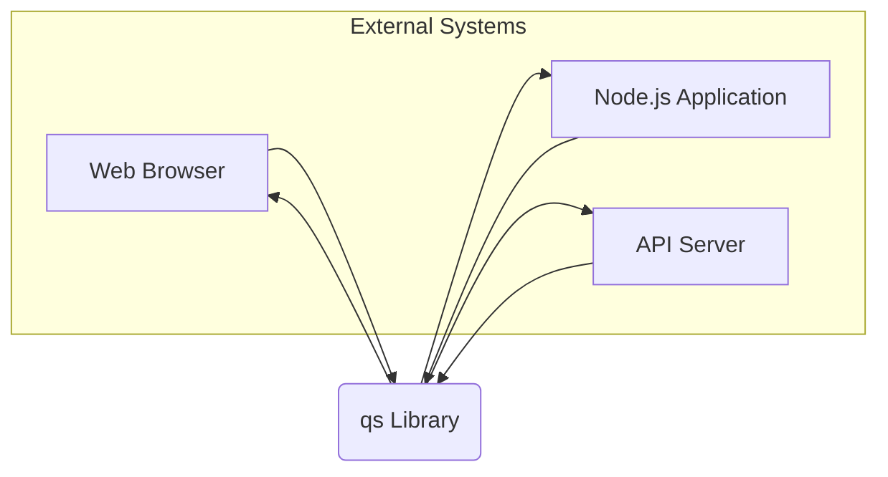
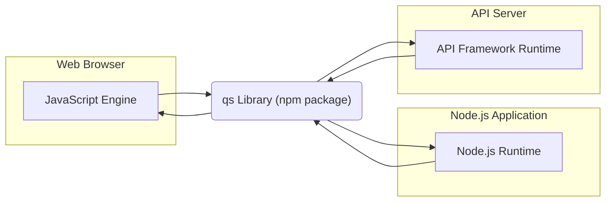
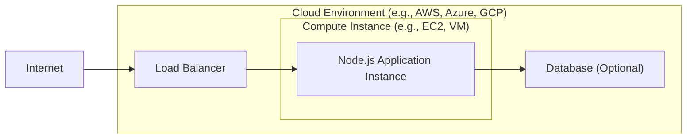
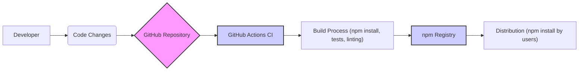

# BUSINESS POSTURE

The `qs` library is a widely used JavaScript library for parsing and stringifying URL query strings. Its primary business purpose is to simplify the handling of query parameters in web applications and APIs.

- Business Priorities and Goals:
  - Efficiency in web development: The library aims to save developers time and effort by providing a robust and well-tested solution for query string manipulation.
  - Compatibility and Interoperability:  It ensures consistent query string parsing and stringification across different JavaScript environments (Node.js and browsers) and conforms to common standards.
  - Reliability: As a dependency in many projects, the library needs to be reliable and performant to avoid impacting the applications that use it.

- Business Risks:
  - Security vulnerabilities: Bugs in the library could lead to security issues in applications that rely on it, such as denial-of-service attacks, parameter pollution, or other injection vulnerabilities if not handled correctly by the consuming application.
  - Performance issues: Inefficient parsing or stringification could lead to performance bottlenecks in web applications, especially under heavy load.
  - Compatibility breaks: Changes to the library that are not backward-compatible could break existing applications that depend on it.
  - Supply chain risks: Compromise of the library's source code or build process could introduce malicious code into a vast number of applications.

# SECURITY POSTURE

- Security Controls:
  - security control: Code review - The project is open source and hosted on GitHub, allowing for community code review. (Implemented: GitHub repository)
  - security control: Unit testing - The repository includes a comprehensive suite of unit tests to ensure the correctness of the parsing and stringification logic. (Implemented: `test/` directory in the repository)
  - security control: Static analysis -  Likely used by developers during development, although not explicitly mentioned in the repository. (Likely Implemented: Developer's local environment)
  - security control: Dependency scanning - Developers using the library in their projects might use dependency scanning tools to identify known vulnerabilities in `qs` and its dependencies. (Implemented: User's responsibility in their projects)

- Accepted Risks:
  - accepted risk: Vulnerabilities in dependencies - The library depends on other packages in the npm ecosystem, which might have their own vulnerabilities.
  - accepted risk:  Complex input handling - Parsing query strings, especially with nested objects and arrays, can be complex and might lead to unexpected behavior or vulnerabilities if not handled with extreme care.
  - accepted risk:  Open source nature - While open source allows for community review, it also means that vulnerabilities can be publicly disclosed before a fix is available.

- Recommended Security Controls:
  - security control: Automated security scanning - Implement automated security scanning (SAST and dependency scanning) in the CI/CD pipeline for the `qs` library itself to proactively identify potential vulnerabilities.
  - security control: Fuzz testing - Perform fuzz testing to identify edge cases and potential vulnerabilities when parsing maliciously crafted query strings.
  - security control: Security audits - Conduct periodic security audits by external security experts to review the codebase and identify potential security weaknesses.
  - security control: Signed releases - Sign npm package releases to ensure authenticity and prevent tampering.
  - security control: SBOM generation - Generate Software Bill of Materials (SBOM) to provide transparency into the library's dependencies.

- Security Requirements:
  - Authentication: Not applicable to a query string parsing library itself. Authentication is handled by the applications that use this library.
  - Authorization: Not applicable to a query string parsing library itself. Authorization is handled by the applications that use this library based on the parsed query parameters.
  - Input Validation: The library must perform robust input validation to handle various query string formats, including edge cases, and prevent unexpected behavior or vulnerabilities. This is the core function of the library, and security depends on the correctness of this validation.
  - Cryptography: Not directly applicable to a query string parsing library. Cryptography is used by applications using this library for secure communication (HTTPS) and potentially for encrypting data within query parameters, but `qs` itself does not handle cryptographic operations.

# DESIGN

## C4 CONTEXT

- Context Diagram Elements:
  - - Name: qs Library
    - Type: Software Library
    - Description: A JavaScript library for parsing and stringifying URL query strings. It is designed to be used in both web browsers and Node.js environments.
    - Responsibilities:
      - Parse URL query strings into JavaScript objects.
      - Stringify JavaScript objects into URL query strings.
      - Handle various query string formats, including nested objects and arrays.
      - Encode and decode URL components.
    - Security controls:
      - security control: Input validation - Implemented within the library to correctly parse and handle potentially malicious or malformed query strings.

  - - Name: Web Browser
    - Type: User Application
    - Description: A web browser used by end-users to access web applications. The browser sends HTTP requests with query strings to web servers and receives responses.
    - Responsibilities:
      - Send HTTP requests to web servers, including query parameters in the URL.
      - Receive and process HTTP responses.
      - Execute JavaScript code that may use the `qs` library to manipulate query strings.
    - Security controls:
      - security control: Browser security features - Browsers implement various security features like Content Security Policy (CSP), Same-Origin Policy, and HTTPS enforcement to protect users from web-based attacks.

  - - Name: Node.js Application
    - Type: Backend Application
    - Description: A server-side application built using Node.js. It might use the `qs` library to parse query strings from incoming HTTP requests or to construct query strings for outgoing requests.
    - Responsibilities:
      - Handle HTTP requests from web browsers or other clients.
      - Use the `qs` library to process query parameters from requests.
      - Generate HTTP responses.
      - Make requests to other services, potentially using `qs` to build query strings.
    - Security controls:
      - security control: Web application firewall (WAF) - May be used to filter malicious requests before they reach the application.
      - security control: Input validation - Application-level input validation to further sanitize and validate data parsed by the `qs` library.
      - security control: Secure coding practices - Developers should follow secure coding practices to prevent vulnerabilities when using query parameters.

  - - Name: API Server
    - Type: Backend Service
    - Description: A server providing an API that is accessed by web browsers or other applications. It might use the `qs` library to handle query parameters in API requests.
    - Responsibilities:
      - Provide API endpoints.
      - Handle API requests, including parsing query parameters using `qs`.
      - Process requests and return API responses.
      - Potentially make requests to other services, using `qs` to construct query strings.
    - Security controls:
      - security control: API Gateway - May be used to manage and secure API access, including rate limiting, authentication, and authorization.
      - security control: Input validation - API-level input validation to validate and sanitize data parsed by the `qs` library.
      - security control: Authentication and Authorization - API server implements authentication and authorization mechanisms to control access to API endpoints.

## C4 CONTAINER

- Container Diagram Elements:
  - - Name: qs Library (npm package)
    - Type: Software Library (npm package)
    - Description:  The `qs` library distributed as an npm package. It contains the JavaScript code for parsing and stringifying query strings.
    - Responsibilities:
      - Provide reusable query string parsing and stringification functionality.
      - Be easily installable and integrable into JavaScript projects via npm.
    - Security controls:
      - security control: Package integrity - npm package registry ensures the integrity of packages through checksums.
      - security control: Version control - npm allows specifying version ranges to manage dependencies and mitigate risks from updates.

  - - Name: JavaScript Engine
    - Type: Runtime Environment
    - Description: The JavaScript engine within a web browser (e.g., V8 in Chrome, SpiderMonkey in Firefox). It executes JavaScript code, including the `qs` library when used in a browser context.
    - Responsibilities:
      - Execute JavaScript code.
      - Provide browser APIs that JavaScript code can interact with.
      - Enforce browser security policies.
    - Security controls:
      - security control: Sandboxing - Browsers use sandboxing to isolate JavaScript code and prevent it from accessing system resources or other websites' data without permission.
      - security control: Same-Origin Policy - Prevents scripts from one origin from accessing resources from a different origin.

  - - Name: Node.js Runtime
    - Type: Runtime Environment
    - Description: The Node.js runtime environment. It executes JavaScript code on the server-side, including applications that use the `qs` library.
    - Responsibilities:
      - Execute JavaScript code.
      - Provide server-side APIs (e.g., file system access, network access).
      - Manage dependencies installed via npm.
    - Security controls:
      - security control: Operating system security - Node.js applications run within the security context of the operating system.
      - security control: Process isolation - Node.js applications typically run in separate processes, providing some level of isolation.

  - - Name: API Framework Runtime
    - Type: Runtime Environment
    - Description: The runtime environment of the API framework used to build the API server (e.g., Express.js, Koa.js). It hosts and executes the API server code, which may use the `qs` library.
    - Responsibilities:
      - Provide a framework for building APIs.
      - Handle routing, middleware, and other API-related functionalities.
      - Integrate with the Node.js runtime.
    - Security controls:
      - security control: Framework security features - API frameworks often provide built-in security features like middleware for authentication, authorization, and input validation.
      - security control: Configuration management - Secure configuration of the API framework and its components is crucial for security.

## DEPLOYMENT

For a library like `qs`, deployment is primarily about publishing the npm package to the npm registry. Applications then depend on this package and include it in their own deployment.  Let's consider the deployment of an application that *uses* the `qs` library. A typical deployment scenario for a Node.js application using `qs` might be to a cloud platform.

- Deployment Diagram Elements:
  - - Name: Node.js Application Instance
    - Type: Compute Instance
    - Description: An instance of the Node.js application running in a cloud environment. This instance uses the `qs` library as a dependency.
    - Responsibilities:
      - Run the application code.
      - Handle HTTP requests.
      - Utilize the `qs` library for query string parsing and stringification.
    - Security controls:
      - security control: Instance hardening - Operating system and application-level hardening of the compute instance.
      - security control: Security groups/Firewall - Network security rules to control inbound and outbound traffic to the instance.
      - security control: Intrusion detection/prevention system (IDS/IPS) - Monitoring for malicious activity on the instance.

  - - Name: Load Balancer
    - Type: Network Component
    - Description: A load balancer distributing incoming traffic across multiple instances of the Node.js application for scalability and availability.
    - Responsibilities:
      - Distribute traffic to application instances.
      - Provide SSL/TLS termination.
      - Health checks for application instances.
    - Security controls:
      - security control: SSL/TLS encryption - Encrypting traffic between clients and the load balancer.
      - security control: DDoS protection - Protection against distributed denial-of-service attacks.
      - security control: Access control lists (ACLs) - Controlling access to the load balancer.

  - - Name: Database (Optional)
    - Type: Data Storage
    - Description: An optional database used by the Node.js application to store and retrieve data.
    - Responsibilities:
      - Persist application data.
      - Provide data access to the application.
    - Security controls:
      - security control: Database access control - Restricting access to the database to authorized application instances.
      - security control: Data encryption at rest and in transit - Encrypting sensitive data stored in the database and during communication.
      - security control: Database auditing - Logging database access and modifications.

  - - Name: Internet
    - Type: Network
    - Description: The public internet, representing users accessing the application from various locations.
    - Responsibilities:
      - Provide connectivity for users to access the application.
    - Security controls:
      - security control: None directly controlled by the application, but users are expected to use secure networks and devices.

## BUILD

- Build Process Elements:
  - - Name: Developer
    - Type: Human Role
    - Description: A software developer who writes and modifies the code for the `qs` library.
    - Responsibilities:
      - Write code.
      - Run local tests and linters.
      - Commit and push code changes to the GitHub repository.
    - Security controls:
      - security control: Developer workstation security - Securely configured developer machines to prevent malware and unauthorized access.
      - security control: Code review - Peer review of code changes before merging to the main branch.

  - - Name: Code Changes
    - Type: Software Artifact
    - Description: Modifications to the source code of the `qs` library.
    - Responsibilities:
      - Represent new features, bug fixes, or security patches.
    - Security controls:
      - security control: Version control - Tracking changes using Git to maintain history and allow for rollbacks.

  - - Name: GitHub Repository
    - Type: Code Repository
    - Description: The GitHub repository hosting the source code of the `qs` library.
    - Responsibilities:
      - Store and manage the source code.
      - Trigger CI/CD pipelines on code changes.
      - Provide a platform for collaboration and code review.
    - Security controls:
      - security control: Access control - GitHub access controls to manage who can contribute to the repository.
      - security control: Branch protection - Enforcing code review and other checks before merging to protected branches.
      - security control: Audit logs - GitHub audit logs to track repository activities.

  - - Name: GitHub Actions CI
    - Type: CI/CD System
    - Description: GitHub Actions is used for continuous integration and continuous delivery. It automates the build, test, and release process for the `qs` library.
    - Responsibilities:
      - Automate the build process.
      - Run unit tests and linters.
      - Publish the package to the npm registry.
    - Security controls:
      - security control: Secure CI/CD configuration - Following security best practices for configuring CI/CD pipelines to prevent tampering and unauthorized access.
      - security control: Secret management - Securely managing API keys and credentials used in the CI/CD pipeline.
      - security control: Build environment security - Ensuring the security of the build environment to prevent supply chain attacks.

  - - Name: Build Process (npm install, tests, linting)
    - Type: Automated Script
    - Description: The automated build script executed by GitHub Actions. It typically includes installing dependencies (`npm install`), running unit tests, and performing code linting.
    - Responsibilities:
      - Compile code (if necessary, though `qs` is JavaScript).
      - Run unit tests to ensure code correctness.
      - Perform static analysis (linting) to identify code quality issues.
    - Security controls:
      - security control: Dependency scanning - CI process can include scanning dependencies for known vulnerabilities.
      - security control: SAST - Static Application Security Testing tools can be integrated into the build process to identify potential security flaws in the code.

  - - Name: npm Registry
    - Type: Package Registry
    - Description: The npm registry is a public repository for JavaScript packages. The `qs` library is published to npm for distribution.
    - Responsibilities:
      - Host and distribute npm packages.
      - Ensure package integrity.
      - Provide package download services.
    - Security controls:
      - security control: Package signing (optional, but recommended) - Signing packages to ensure authenticity.
      - security control: Vulnerability scanning - npm registry scans packages for known vulnerabilities.

  - - Name: Distribution (npm install by users)
    - Type: Package Distribution
    - Description: Developers and applications download the `qs` library from the npm registry using `npm install`.
    - Responsibilities:
      - Make the library available to users.
      - Users are responsible for securely incorporating the library into their projects.
    - Security controls:
      - security control: User dependency management - Developers should use dependency management tools and practices to track and update dependencies, including security updates for `qs`.

# RISK ASSESSMENT

- Critical Business Processes:
  - Web application functionality: The `qs` library is essential for web applications that rely on parsing and generating URL query strings. Malfunctioning or vulnerable `qs` library can disrupt core application functionality.
  - API communication: APIs heavily use query parameters for data exchange. The `qs` library facilitates this communication in JavaScript environments. Issues with `qs` can impact API integrations.

- Data to Protect and Sensitivity:
  - Query string data: The library processes query string data, which can contain various types of information, including:
    - User inputs: Search terms, form data, API parameters. Sensitivity depends on the application context. Some user inputs might be considered personally identifiable information (PII) or sensitive data.
    - Application state: Query parameters can be used to maintain application state, which might include session identifiers or temporary data.
    - Configuration data: In some cases, query parameters might carry configuration data.
  - Sensitivity level: The sensitivity of query string data is highly context-dependent. While the `qs` library itself doesn't handle sensitive data directly, it processes data that applications use, and this data can be sensitive. The primary risk is not data confidentiality within the library itself, but rather vulnerabilities in parsing that could lead to application-level security issues (e.g., injection, DoS).

# QUESTIONS & ASSUMPTIONS

- Questions:
  - What is the intended use case and business criticality of applications that will use this design document for threat modeling? (Assuming general web application and API usage for now).
  - Are there any specific compliance requirements (e.g., GDPR, HIPAA, PCI DSS) that applications using `qs` need to adhere to? (Assuming general best practices for web security for now).
  - What is the risk appetite of the organization using applications that depend on `qs`? (Assuming a moderate risk appetite, requiring standard security controls).

- Assumptions:
  - BUSINESS POSTURE: The primary business goal is to provide a reliable and efficient query string parsing library for general web development purposes. Security is a significant concern due to the library's widespread use.
  - SECURITY POSTURE:  Existing security controls are primarily focused on basic software development best practices (code review, unit testing). There is room for improvement in automated security testing and supply chain security. Applications using `qs` are responsible for handling authentication, authorization, and application-level input validation.
  - DESIGN: The `qs` library is a standalone JavaScript library distributed via npm. Deployment context is considered from the perspective of applications that *use* the library, typically in cloud environments. The build process is assumed to be standard for npm packages using GitHub Actions.