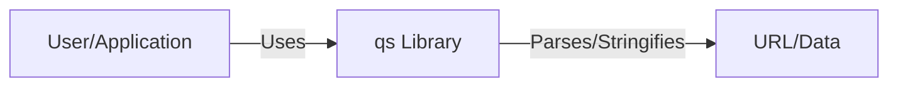

Okay, let's create a design document for the `qs` project, a query string parsing library.

# BUSINESS POSTURE

Business Priorities and Goals:

*   Provide a robust and reliable library for parsing and stringifying URL query strings.
*   Maintain wide compatibility across different JavaScript environments (browsers, Node.js, etc.).
*   Ensure ease of use and adoption for developers.
*   Minimize external dependencies to reduce potential conflicts and security vulnerabilities.
*   Provide good performance.
*   Provide good test coverage.

Most Important Business Risks:

*   **Incorrect Parsing/Stringifying:** Leads to application malfunctions, data corruption, or security vulnerabilities (e.g., prototype pollution, injection attacks) if the library's output is used in security-sensitive contexts without proper validation.
*   **Compatibility Issues:** Breaking changes or lack of support for specific environments could disrupt existing applications relying on the library.
*   **Security Vulnerabilities:** Undiscovered vulnerabilities in the library could be exploited by attackers, especially if the library is used in server-side applications handling user input.
*   **Performance Bottlenecks:** Inefficient parsing or stringifying could impact the performance of applications using the library, especially those handling large or complex query strings.
*   **Maintenance Overhead:** Lack of maintainability could lead to difficulties in fixing bugs, adding features, or addressing security vulnerabilities.

# SECURITY POSTURE

Existing Security Controls:

*   security control: Input Validation: The library implicitly performs some input validation by its nature of parsing, but it doesn't explicitly enforce strict schema validation. (Implemented in parsing logic).
*   security control: Regular Expression Usage: The library uses regular expressions for parsing, which, if not carefully crafted, can be a source of ReDoS vulnerabilities. (Implemented in parsing logic).
*   security control: Test Suite: The project has a comprehensive test suite, which helps to identify and prevent regressions, including potential security issues. (Described in `/test` directory).
*   security control: Dependency Management: The project has few dependencies, reducing the attack surface. (Described in `package.json`).
*   security control: Code Style and Linting: The project uses a linter (ESLint) to enforce code style and identify potential issues. (Described in `.eslintrc.js`).

Accepted Risks:

*   accepted risk: Limited Input Sanitization: The library primarily focuses on parsing and doesn't perform extensive input sanitization or escaping. It's the responsibility of the user to ensure the output is properly handled in security-sensitive contexts.
*   accepted risk: Potential ReDoS: While efforts are likely made to mitigate ReDoS, the inherent complexity of regular expressions means there's always a residual risk.

Recommended Security Controls:

*   security control: Fuzz Testing: Implement fuzz testing to discover edge cases and potential vulnerabilities that might be missed by traditional unit tests.
*   security control: Regular Expression Review: Conduct a thorough review of all regular expressions used in the library to identify and mitigate potential ReDoS vulnerabilities.
*   security control: Security Audits: Perform periodic security audits, either internally or by a third party, to identify potential vulnerabilities.

Security Requirements:

*   Authentication: Not applicable, as this is a library, not a service.
*   Authorization: Not applicable, as this is a library, not a service.
*   Input Validation:
    *   The library should handle various input types gracefully (strings, numbers, booleans, arrays, objects).
    *   The library should handle edge cases and invalid input without crashing or throwing unexpected errors.
    *   Consider adding options for stricter input validation or schema validation, potentially as a separate module or configuration option.
*   Cryptography: Not directly applicable, but if the library is used to handle sensitive data in query strings (which is generally discouraged), users should be advised to use HTTPS and appropriate encryption mechanisms.
*   Output Encoding: The library should properly encode special characters in the query string to prevent injection attacks.

# DESIGN

## C4 CONTEXT



Element Description:

*   Element:
    *   Name: User/Application
    *   Type: External Entity (User or another software system)
    *   Description: The entity (user or application) that utilizes the `qs` library to parse or stringify query strings.
    *   Responsibilities:
        *   Provides input to the `qs` library.
        *   Consumes the output of the `qs` library.
        *   Handles any necessary security measures (e.g., input validation, output encoding) when using the library's output in security-sensitive contexts.
    *   Security controls:
        *   Input validation before passing data to `qs`.
        *   Output encoding/sanitization after receiving data from `qs`.
        *   Using HTTPS for transport security.

*   Element:
    *   Name: qs Library
    *   Type: Software System
    *   Description: The `qs` library itself, responsible for parsing and stringifying query strings.
    *   Responsibilities:
        *   Parses query strings into JavaScript objects.
        *   Stringifies JavaScript objects into query strings.
        *   Handles various input formats and edge cases.
    *   Security controls:
        *   Input validation during parsing.
        *   Regular expression usage (with ReDoS mitigation).
        *   Comprehensive test suite.
        *   Minimal dependencies.

*   Element:
    *   Name: URL/Data
    *   Type: Data
    *   Description: The URL or data containing the query string that needs to be parsed or the data that needs to be stringified.
    *   Responsibilities:
        *   Represents the input or output of the `qs` library.
    *   Security controls:
        *   None directly within the `qs` library's scope. The security of the URL/Data depends on how it's handled by the User/Application.

## C4 CONTAINER

Since `qs` is a library, the container diagram is essentially the same as the context diagram. It doesn't have separate deployable units.


Element Description:

*   The elements and their descriptions are identical to the C4 Context diagram. The library itself acts as a single "container."

## DEPLOYMENT

Deployment Solutions:

1.  **npm Package:** The primary deployment method is via npm. Developers install the library using `npm install qs`.
2.  **CDN:** The library may be available via CDNs, allowing developers to include it directly in web pages without hosting it themselves.
3.  **Bundled with Applications:** Developers may bundle the library directly with their applications using tools like Webpack or Browserify.

Chosen Solution (npm Package):

```mermaid
graph LR
    A[Developer Machine] --> B[npm install qs];
    B --> C[node_modules];
    C --> D[Application Code];
    D --> E[Bundler (e.g., Webpack)];
    E --> F[Bundled Application];
```

Element Description:

*   Element:
    *   Name: Developer Machine
    *   Type: Development Environment
    *   Description: The developer's local machine where they write and build their application.
    *   Responsibilities:
        *   Running `npm install qs`.
        *   Writing application code that uses the `qs` library.
        *   Building and bundling the application.
    *   Security controls:
        *   Standard development environment security practices.

*   Element:
    *   Name: npm install qs
    *   Type: Command
    *   Description: The npm command used to install the `qs` library.
    *   Responsibilities:
        *   Downloads the `qs` package from the npm registry.
        *   Installs the package and its dependencies in the `node_modules` directory.
    *   Security controls:
        *   Using a trusted npm registry.
        *   Verifying package integrity (npm does this automatically).

*   Element:
    *   Name: node_modules
    *   Type: Directory
    *   Description: The directory where npm installs project dependencies.
    *   Responsibilities:
        *   Contains the `qs` library and its dependencies.
    *   Security controls:
        *   Regularly updating dependencies to patch vulnerabilities.

*   Element:
    *   Name: Application Code
    *   Type: Code
    *   Description: The developer's application code that uses the `qs` library.
    *   Responsibilities:
        *   Imports and uses the `qs` library.
        *   Handles input and output appropriately.
    *   Security controls:
        *   Input validation and output encoding/sanitization.

*   Element:
    *   Name: Bundler (e.g., Webpack)
    *   Type: Tool
    *   Description: A module bundler that packages the application code and its dependencies into a single file or set of files.
    *   Responsibilities:
        *   Bundles the `qs` library with the application code.
    *   Security controls:
        *   Using secure bundler configurations.

*   Element:
    *   Name: Bundled Application
    *   Type: Artifact
    *   Description: The final bundled application, ready for deployment.
    *   Responsibilities:
        *   Contains the `qs` library as part of the application code.
    *   Security controls:
        *   Standard application security practices.

## BUILD

```mermaid
graph LR
    A[Developer] -- Commits code --> B[GitHub Repository];
    B -- Triggers --> C[GitHub Actions (CI)];
    C -- Runs --> D[Linting (ESLint)];
    C -- Runs --> E[Tests];
    C -- Runs --> F[Code Coverage (nyc)];
    D -- Reports --> G[Build Status];
    E -- Reports --> G;
    F -- Reports --> G;
    G -- Success --> H[npm Publish (Manual/Automated)];
    H --> I[npm Registry];

```

Build Process Description:

1.  **Developer Commits Code:** A developer commits changes to the `qs` repository on GitHub.
2.  **GitHub Actions (CI):** The commit triggers a GitHub Actions workflow, which automates the build and testing process.
3.  **Linting (ESLint):** The workflow runs ESLint to check for code style and potential errors.
4.  **Tests:** The workflow runs the test suite using a test runner (likely `mocha` or `jest`, based on common practices).
5.  **Code Coverage (nyc):** The workflow uses `nyc` (Istanbul) to measure code coverage and ensure that the tests adequately cover the codebase.
6.  **Build Status:** The results of linting, tests, and code coverage are reported as the build status.
7.  **npm Publish (Manual/Automated):** If the build is successful, a new version of the library can be published to the npm registry. This step might be manual or automated, depending on the project's release process.
8.  **npm Registry:** The published package is stored in the npm registry, making it available for others to install.

Security Controls in Build Process:

*   security control: Linting: ESLint helps to identify potential code quality and security issues early in the development process.
*   security control: Automated Tests: The test suite helps to prevent regressions and ensure that the library functions as expected.
*   security control: Code Coverage: Code coverage analysis helps to identify untested code paths, which could potentially harbor vulnerabilities.
*   security control: CI/CD: GitHub Actions provides a secure and automated environment for building and testing the library.
*   security control: Dependency Management: Regularly updating dependencies helps to mitigate vulnerabilities in third-party libraries.
*   security control: npm Audit: Running `npm audit` during the build process can identify known vulnerabilities in the project's dependencies.

# RISK ASSESSMENT

Critical Business Processes:

*   **Accurate Query String Parsing:** Ensuring that the library correctly parses query strings is critical for the proper functioning of applications that rely on it. Incorrect parsing can lead to data corruption, application errors, and potential security vulnerabilities.
*   **Reliable Query String Stringifying:**  Ensuring that the library correctly stringifies JavaScript objects into query strings is equally important. Incorrect stringifying can lead to data loss or misinterpretation by the receiving application.
*   **Maintaining Compatibility:**  Ensuring compatibility with various JavaScript environments and versions is crucial for widespread adoption and preventing disruptions to existing applications.

Data Protection:

*   The `qs` library itself doesn't handle sensitive data directly. However, it's often used to process URLs and data that *might* contain sensitive information.  The sensitivity of the data depends entirely on how the library is used within a larger application.
*   Data Sensitivity Levels:
    *   **Low:**  Non-sensitive data, such as search queries or filter parameters.
    *   **Medium:**  Potentially sensitive data, such as user IDs or session tokens, if included in query strings (which is generally discouraged).
    *   **High:**  Highly sensitive data, such as passwords or personal information, should *never* be included in query strings.

# QUESTIONS & ASSUMPTIONS

Questions:

*   Are there any specific performance benchmarks or targets that the library should meet?
*   Are there any plans to add support for schema validation or stricter input validation?
*   What is the current process for handling security vulnerability reports?
*   What is the release process and versioning strategy?
*   Are there any specific browser or Node.js versions that need to be supported?

Assumptions:

*   BUSINESS POSTURE: The primary goal is to provide a reliable and widely used library, prioritizing correctness and compatibility over advanced features.
*   SECURITY POSTURE: The library's maintainers are aware of common security vulnerabilities and take steps to mitigate them, but there's always a residual risk. Users are responsible for handling the library's output securely.
*   DESIGN: The library is designed to be simple and efficient, with minimal dependencies. The deployment process relies primarily on npm. The build process is automated using GitHub Actions.