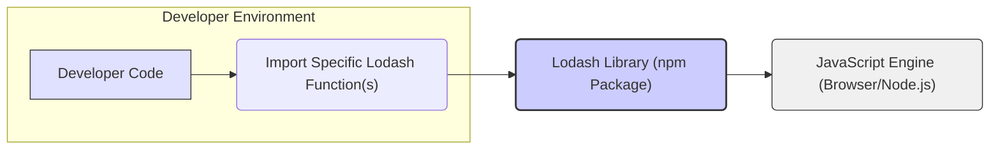
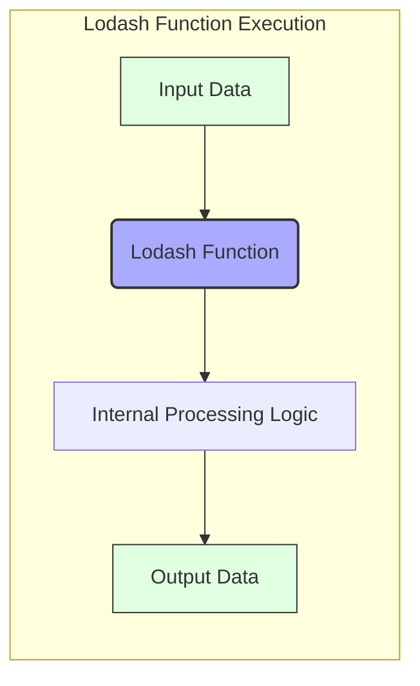

## Project Design Document: Lodash Library (Improved for Threat Modeling)

**1. Introduction**

This document provides an enhanced design overview of the Lodash JavaScript library, specifically tailored for threat modeling purposes. Lodash is a widely adopted utility library offering modular, performant, and extended functionalities beyond standard JavaScript. This revised document aims to provide a more granular understanding of Lodash's architecture, components, and data flow to facilitate a comprehensive security analysis and identification of potential threats.

**2. Goals and Objectives**

* **Primary Goal:**  To equip developers with a robust and efficient set of utility functions for common programming tasks, thereby increasing productivity and code clarity.
* **Key Objectives:**
    * Deliver consistent and dependable implementations of utility functions.
    * Offer performance-optimized alternatives to native JavaScript methods where applicable.
    * Maintain a modular design, enabling developers to include only the necessary functionalities, thus minimizing bundle sizes.
    * Ensure broad compatibility across diverse JavaScript environments, including browsers and Node.js.
    * Uphold a well-documented, thoroughly tested, and secure codebase.

**3. Architecture Overview**

Lodash is primarily a client-side JavaScript library, also usable in Node.js environments. Its architecture emphasizes:

* **Modular Design:** Functions are meticulously organized into distinct modules, allowing developers to import specific functions or the entire library. This granular approach is crucial for optimizing application bundle sizes and reducing potential attack surfaces.
* **Functional Programming Principles:**  A significant portion of Lodash functions adhere to the principles of pure functions, guaranteeing the same output for identical inputs and eliminating side effects. This enhances predictability, testability, and security by reducing unintended state changes.
* **Sophisticated Build Pipeline:** Lodash employs a robust build process to generate various optimized versions of the library (e.g., full build, per-method modules, ES modules). This pipeline involves code transformation, optimization techniques, and automated documentation generation.
* **Distribution via npm Registry:** Lodash is predominantly distributed through the npm package manager, ensuring easy accessibility and integration for JavaScript developers. The integrity of this distribution channel is a key security consideration.

**4. Key Components**

Lodash's functionality can be categorized into the following key components, each presenting different security considerations:

* **Core Utility Function Modules:** These modules contain the fundamental utility functions, categorized by their purpose:
    * **Array Manipulation:** Functions for transforming, filtering, and iterating over arrays (e.g., `_.map`, `_.filter`, `_.reduce`, `_.chunk`). These functions handle potentially untrusted data from various sources.
    * **Object Manipulation:** Functions for working with objects, including merging, picking properties, and inspecting (e.g., `_.keys`, `_.values`, `_.merge`, `_.cloneDeep`). These functions can be targets for prototype pollution attacks.
    * **Function Manipulation:** Higher-order functions for controlling function execution (e.g., `_.debounce`, `_.throttle`, `_.bind`). Improper use could lead to unexpected behavior or resource exhaustion.
    * **String Manipulation:** Functions for processing and transforming strings (e.g., `_.trim`, `_.capitalize`, `_.escape`). These are crucial for preventing XSS vulnerabilities when handling user input.
    * **Collection Manipulation:** Functions that operate on both arrays and objects, providing a unified interface (e.g., `_.forEach`, `_.find`).
    * **Lang (Language) Utilities:** Functions for type checking and comparisons (e.g., `_.isObject`, `_.isArray`, `_.isEqual`).
    * **Math Utilities:** Functions for performing mathematical operations (e.g., `_.add`, `_.subtract`).
    * **Util (Internal Utilities):** Internal helper functions used within Lodash's implementation. While not directly exposed, understanding their purpose can be relevant for deep security analysis.
* **Module Loading System:** The mechanism by which individual Lodash functions are accessed and imported. This includes:
    * **Individual Function Imports:** Importing specific functions directly (e.g., `import map from 'lodash/map';`).
    * **Main Lodash Import:** Importing the entire library (e.g., `import _ from 'lodash';`).
* **Build and Release Pipeline:** The scripts, configurations, and tools involved in building, testing, and publishing Lodash. This includes:
    * **Code Transpilation (e.g., Babel):** Transforming modern JavaScript code for compatibility with older environments.
    * **Bundling (e.g., Rollup, Webpack):** Combining modules into optimized bundles.
    * **Minification (e.g., Terser):** Reducing the size of the codebase.
    * **Testing (e.g., Mocha, Chai):** Ensuring the correctness and reliability of the functions.
    * **Documentation Generation:** Creating the API documentation.
    * **npm Package Publishing:** The process of releasing new versions to the npm registry.
* **Documentation Resources:** Comprehensive documentation detailing the purpose, usage, and parameters of each function. Accurate and up-to-date documentation is crucial for developers to use Lodash securely.
* **Testing Infrastructure:** The suite of unit tests, integration tests, and potentially security-focused tests used to validate the library's functionality and resilience against potential attacks.

**5. Data Flow**

The fundamental data flow within Lodash involves invoking its utility functions with input data and receiving processed output. Understanding this flow is critical for identifying potential points of vulnerability.

* **Input Stage:** Lodash functions accept various JavaScript data types as input, including primitive types (strings, numbers, booleans), objects, arrays, and functions. The source and nature of this input data are key security considerations. Is it user-provided, derived from external APIs, or internal application data?
* **Processing Stage:** The core logic of each Lodash function manipulates the input data according to its defined purpose. This may involve:
    * **Iteration:** Looping through arrays or object properties.
    * **Transformation:** Modifying data structures or values.
    * **Filtering:** Selecting specific data based on criteria.
    * **Comparison:** Comparing data values.
    * **Aggregation:** Combining data into a single value.
    * **Type Checking:** Verifying the data type.
    The internal implementation of these processing steps needs careful scrutiny for potential vulnerabilities.
* **Output Stage:** Lodash functions return the processed data. The output type varies depending on the function's purpose. It's important to consider how this output is used by the calling application and whether it could introduce security risks if not handled properly (e.g., displaying unescaped output, using it in security-sensitive operations).

**Detailed Data Flow Example (using `_.map` for threat modeling):**

1. **Input:** An array (potentially containing user-provided data) and an iteratee function (which could be defined by the developer and might contain vulnerabilities) are passed to `_.map`.
2. **Processing:** `_.map` iterates over each element in the input array. For each element, it invokes the provided iteratee function, passing the element as an argument. If the iteratee function is not carefully written, it could introduce vulnerabilities (e.g., executing arbitrary code if the element is a string and used with `eval`).
3. **Output:** `_.map` returns a new array containing the results of calling the iteratee function on each element. If the iteratee function returns malicious content, this output could be exploited in subsequent operations.

**6. Dependencies**

Lodash relies on various development dependencies during its build and testing phases. These dependencies, while not directly part of the runtime library, introduce potential supply chain risks:

* **Build Tool Dependencies:**  Tools like Babel, Rollup, and Terser are crucial for the build process. Vulnerabilities in these tools could lead to compromised builds.
* **Testing Framework Dependencies:** Mocha and Chai are used for testing. While less direct, vulnerabilities here could affect the reliability of the testing process.
* **Documentation Generation Dependencies:** Tools used for generating documentation.
* **Linting and Formatting Dependencies:** Tools like ESLint and Prettier help maintain code quality and consistency.
* **Development Utility Dependencies:** Various helper libraries used during development.

The security of these dependencies and the processes for managing them (e.g., dependency scanning, security audits) are important considerations.

**7. Deployment Model**

Lodash is primarily deployed as a client-side JavaScript library, with several common deployment methods, each presenting different security contexts:

* **Direct Inclusion via `<script>` Tag:** Downloading a Lodash build and including it directly in an HTML file. This method relies on the integrity of the downloaded file and the server hosting it.
* **Installation via npm and Module Bundlers:** Installing Lodash as a dependency in a Node.js project and using a module bundler (like Webpack, Parcel, or esbuild) to include it in the final application bundle. This method introduces dependencies on the build process and the security of the development environment.
* **Content Delivery Networks (CDNs):** Referencing Lodash from a CDN. While potentially improving loading times, this introduces trust in the CDN provider's security. Subresource Integrity (SRI) should be used to verify the integrity of the loaded file.

**8. Security Considerations (Detailed)**

This section expands on potential security concerns, providing more specific examples relevant to Lodash:

* **Supply Chain Vulnerabilities:**
    * **Compromised Dependencies:** Vulnerabilities in Lodash's development dependencies could be exploited to inject malicious code during the build process, leading to a compromised Lodash library. Regular dependency scanning and updates are crucial.
    * **npm Package Compromise:** The risk of the Lodash npm package itself being compromised and malicious code being injected by attackers. Verifying package integrity using checksums and using reputable package managers helps mitigate this.
* **Client-Side Vulnerabilities:**
    * **Prototype Pollution:** Lodash functions that manipulate objects (e.g., `_.merge`, `_.assign`) could be susceptible to prototype pollution attacks if not used carefully with untrusted input. Attackers could modify the prototypes of built-in JavaScript objects, leading to unexpected behavior or security breaches.
    * **Cross-Site Scripting (XSS):** While Lodash doesn't directly render user input, improper use of its string manipulation functions (e.g., failing to escape output properly after using `_.escape`) in other parts of an application can lead to XSS vulnerabilities.
    * **Denial of Service (DoS):** Certain Lodash functions, especially those dealing with complex data structures or regular expressions, could be vulnerable to DoS attacks if provided with maliciously crafted input that causes excessive processing time or resource consumption (e.g., deeply nested objects, complex regular expressions in `_.filter` or `_.find`).
    * **Regular Expression Denial of Service (ReDoS):**  If Lodash internally uses regular expressions that are vulnerable to ReDoS, providing specific input strings could lead to significant performance degradation or even crashes.
* **Build Process Security:**
    * **Compromised Build Environment:** If the environment where Lodash is built is compromised, attackers could inject malicious code into the distributed library. Secure build pipelines and infrastructure are essential.
* **Misuse of Functionality:** Developers might misuse Lodash functions in ways that introduce security vulnerabilities in their applications. For example, using `_.template` with unsanitized user input could lead to code injection.

**9. Future Considerations (Security Focused)**

* **Security Audits:** Regular independent security audits of the Lodash codebase are crucial for identifying and addressing potential vulnerabilities.
* **Static Analysis Security Testing (SAST):** Integrating SAST tools into the development pipeline can help automatically detect potential security flaws in the code.
* **Dependency Management and Security Scanning:** Implementing robust dependency management practices and using tools to scan dependencies for known vulnerabilities.
* **Security Hardening of Build Pipeline:** Implementing security best practices for the build and release pipeline to prevent supply chain attacks.
* **Clear Communication of Security Best Practices:** Providing clear guidance and examples in the documentation on how to use Lodash functions securely and avoid common pitfalls.

This improved design document provides a more detailed and security-focused overview of the Lodash library, intended to be a valuable resource for conducting thorough threat modeling activities.