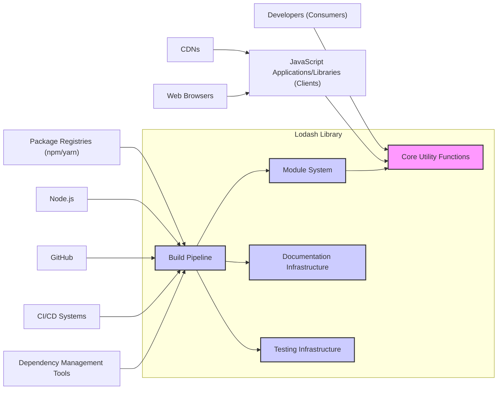

## Project Design Document: Lodash Library (Improved)

**1. Introduction**

This document provides an enhanced architectural overview of the Lodash JavaScript utility library, specifically tailored for threat modeling. It aims to detail the key components, data flow, and external interactions to facilitate the identification of potential security vulnerabilities and attack surfaces.

**Project Repository:** https://github.com/lodash/lodash

**2. Goals of this Document**

*   Provide a detailed and security-focused architectural description of the Lodash library.
*   Clearly identify key components, their functionalities, and potential security implications.
*   Describe the flow of data through the library, highlighting potential points of manipulation or vulnerability.
*   Outline all external dependencies and interactions, assessing their potential security risks.
*   Serve as a robust foundation for conducting a thorough and effective threat model of the Lodash project.

**3. Project Overview**

Lodash is a widely used JavaScript utility library that provides modular, performant, and feature-rich helper functions. It promotes functional programming paradigms and simplifies common tasks involving arrays, numbers, objects, strings, and more. Lodash is primarily integrated into other JavaScript applications and libraries as a dependency. Its widespread adoption makes its security posture critical.

**4. Architectural Design**

Lodash's architecture is structured around several key components, each with specific functionalities and potential security considerations:

*   **Core Utility Functions:** This encompasses the vast collection of individual utility functions that perform specific tasks (e.g., `map`, `filter`, `debounce`, `cloneDeep`). These functions are the primary units of execution and data manipulation within Lodash.
*   **Module System:** Lodash employs a modular design, allowing developers to import specific functions or categories of functions. This modularity is achieved through:
    *   **Individual Function Modules:** Each function is often available as a separate module (e.g., `lodash/map`).
    *   **Category Modules:** Groups of related functions are bundled into category modules (e.g., `lodash/array`, `lodash/object`).
    *   **Bundled Versions:**  Complete or partially bundled versions of the library are also available for convenience.
*   **Build Pipeline:** The Lodash build process is crucial for generating the distributable versions of the library. Key steps include:
    *   **Code Transpilation:** Using tools like Babel to ensure compatibility across different JavaScript environments.
    *   **Module Aggregation and Bundling:**  Utilizing tools like Rollup or Webpack to create different module formats (CommonJS, ES Modules, UMD).
    *   **Minification and Optimization:**  Employing tools like Terser to reduce the size of the codebase and improve performance.
    *   **Documentation Generation:**  Creating API documentation from code comments and potentially external documentation files.
    *   **Testing:** Executing unit tests to verify the correctness and reliability of the code.
*   **Documentation Infrastructure:** The documentation is a critical resource for developers using Lodash. It typically includes:
    *   **API Reference:** Detailed descriptions of each function, its parameters, and return values.
    *   **Usage Guides:**  Examples and explanations of how to use Lodash effectively.
    *   **Website and Hosting:** The platform where the documentation is published and maintained.
*   **Testing Infrastructure:**  A comprehensive suite of unit tests ensures the quality and stability of Lodash. This includes:
    *   **Test Files:**  Individual files containing test cases for specific functions or modules.
    *   **Test Runner:**  A tool like Mocha or Jest that executes the test suite.
    *   **Continuous Integration (CI):** Automated execution of tests on code changes.
*   **Community and Maintenance Infrastructure:** This encompasses the processes and platforms used for community interaction and project maintenance:
    *   **GitHub Repository:**  Hosting the source code, issue tracker, and pull requests.
    *   **npm Package:**  The published package on the npm registry for distribution.
    *   **Communication Channels:**  Forums, mailing lists, or other platforms for community discussion.

**5. Data Flow**

The primary data flow within Lodash involves the manipulation of JavaScript data by its utility functions. Understanding this flow is crucial for identifying potential points of vulnerability.

*   **Input Data:** Lodash functions receive various JavaScript data types as input, typically provided by the calling application. Examples include:
    *   **Arrays:**  Collections of ordered elements.
    *   **Objects:**  Collections of key-value pairs.
    *   **Strings:**  Sequences of characters.
    *   **Numbers:**  Numerical values.
    *   **Functions:**  Executable blocks of code.
    *   **Primitive Values:**  Booleans, null, undefined, symbols.
*   **Processing Logic:**  The core of Lodash involves its functions applying specific logic to the input data. This can include:
    *   **Iteration:** Looping through arrays or object properties.
    *   **Transformation:** Modifying data structures or values. Examples include mapping, reducing, and filtering.
    *   **Comparison:**  Comparing data values for equality or other relationships.
    *   **Creation:**  Generating new data structures based on input.
    *   **Manipulation:**  Modifying existing data structures in place (less common in functional paradigms but possible).
*   **Output Data:** Lodash functions return processed data to the calling application. The type of output depends on the function's purpose and the input. Examples include:
    *   **New Arrays or Objects:**  Transformed or filtered versions of the input.
    *   **Primitive Values:**  Results of comparisons, calculations, or data extraction.
    *   **Modified Input (Potentially):** Some functions might modify the input data directly, although this is generally discouraged in functional programming.
*   **Configuration (Optional):** Some Lodash functions accept configuration options that influence their processing logic. This configuration data also flows into the functions.

**6. External Interactions**

Lodash interacts with several external entities, each presenting potential security considerations:

*   **Developers (Consumers):** Developers integrate Lodash into their projects. Their coding practices and understanding of Lodash's API can impact security. Misuse of Lodash functions could introduce vulnerabilities.
*   **JavaScript Applications and Libraries (Clients):** These are the applications that depend on and execute Lodash code. Vulnerabilities in these clients could be exploited through Lodash if it's not used securely.
*   **Package Registries (npm, yarn):** Lodash is distributed through these registries. Compromise of these registries could lead to the distribution of malicious versions of Lodash.
*   **Content Delivery Networks (CDNs):**  CDNs host and serve Lodash files. Compromise of a CDN could lead to the serving of malicious Lodash code to end-users.
*   **Web Browsers (Client-Side Execution Environment):** When used in web applications, Lodash executes within the user's browser. Browser security features and vulnerabilities are relevant.
*   **Node.js (Server-Side and Build Environment):** Lodash can be used in Node.js environments, and its build process relies on Node.js and its ecosystem (npm). Vulnerabilities in Node.js or its dependencies could impact Lodash.
*   **GitHub (Source Code Repository):**  The source code is hosted on GitHub. Compromise of the GitHub repository could allow attackers to inject malicious code.
*   **Continuous Integration/Continuous Deployment (CI/CD) Systems:**  These systems automate the build, test, and deployment processes. Compromise of the CI/CD pipeline could lead to the deployment of malicious versions of Lodash.
*   **Dependency Management Tools (e.g., Dependabot):**  These tools help manage dependencies and identify vulnerabilities. Their effectiveness influences Lodash's security posture.

**7. Security Considerations (Detailed for Threat Modeling)**

This section outlines potential threats and vulnerabilities associated with Lodash, categorized for clarity during threat modeling.

*   **Supply Chain Attacks:**
    *   **Dependency Vulnerabilities:** Lodash might depend on other libraries. Vulnerabilities in these dependencies could be exploited.
    *   **Compromised Package Registry:** An attacker could compromise the npm registry and publish a malicious version of Lodash.
    *   **Build Pipeline Compromise:**  An attacker could gain access to the Lodash build pipeline and inject malicious code into the distributed artifacts.
    *   **CDN Compromise:**  An attacker could compromise a CDN serving Lodash and replace it with a malicious version.
*   **Input Validation and Data Sanitization Issues:**
    *   **Prototype Pollution:**  Certain Lodash functions that manipulate objects (e.g., `merge`, `assign`) could be exploited to inject properties into the `Object.prototype`, potentially affecting other parts of the application.
    *   **Cross-Site Scripting (XSS) via Misuse:** While Lodash itself doesn't directly render user-controlled data, developers might misuse Lodash functions in ways that lead to XSS vulnerabilities in their applications (e.g., improper escaping of data before rendering).
    *   **Regular Expression Denial of Service (ReDoS):** If Lodash functions utilize complex regular expressions, crafted input could cause excessive processing time, leading to denial of service.
    *   **Integer Overflow/Underflow:**  In functions performing numerical operations, carefully crafted inputs could potentially lead to integer overflow or underflow vulnerabilities, although this is less common in JavaScript.
*   **Code Injection (Indirect):**
    *   **`_.template` Vulnerabilities:** The `_.template` function, if used with user-controlled input without proper sanitization, can lead to arbitrary code execution.
    *   **Deserialization Issues (if applicable):** If Lodash is used in contexts involving deserialization of untrusted data, vulnerabilities in deserialization libraries could be indirectly exploitable.
*   **Denial of Service (Resource Exhaustion):**
    *   **Memory Exhaustion:**  Specific Lodash functions, when processing very large or deeply nested data structures, could potentially consume excessive memory, leading to application crashes.
    *   **CPU Exhaustion:**  Certain computationally intensive Lodash functions, when provided with specific inputs, could consume excessive CPU resources, leading to performance degradation or denial of service.
*   **Information Disclosure:**
    *   **Error Handling:**  Verbose error messages from Lodash functions could potentially leak sensitive information about the application's internal state.
*   **Security Misconfiguration:**
    *   **Using Outdated Versions:**  Developers might use outdated versions of Lodash with known security vulnerabilities.
    *   **Including Unnecessary Modules:**  Including the entire Lodash library when only a few functions are needed increases the attack surface.

**8. Diagram**

**9. Conclusion**

This improved design document provides a more detailed and security-focused overview of the Lodash library. It highlights key components, data flows, and external interactions, and elaborates on potential security threats. This document serves as a comprehensive foundation for conducting a thorough threat modeling exercise, enabling the identification and mitigation of potential vulnerabilities within the Lodash project and in applications that utilize it.