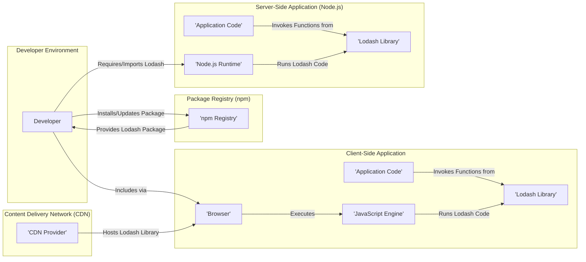

# Project Design Document: Lodash

**Version:** 1.1
**Date:** October 26, 2023
**Author:** AI Software Architect

## 1. Introduction

This document provides an enhanced and detailed design overview of the Lodash project, a widely adopted JavaScript utility library. It is specifically crafted to serve as a foundational resource for subsequent threat modeling activities. The document outlines the project's architecture, dissects its key components with greater granularity, clarifies data flow patterns, and details the underlying technologies.

## 2. Project Overview

Lodash is a modern JavaScript utility library renowned for its modularity, performance optimizations, and extensive collection of helper functions. It empowers developers with tools for common programming tasks, including sophisticated array manipulations, object transformations, string operations, functional programming utilities, and more. Designed as a successor to Underscore.js, Lodash often delivers significant performance gains. Its widespread adoption spans both front-end and back-end JavaScript development ecosystems.

## 3. System Architecture

The following diagram illustrates the high-level architecture of how Lodash is typically integrated and utilized within a JavaScript project.

## 4. Component Breakdown

This section provides a more granular breakdown of the key components of the Lodash project from a usage perspective, which is crucial for detailed threat modeling.

*   **Core Utility Modules (Categorized):**
    *   **Array Functions:** Modules dealing with array manipulation (e.g., `chunk`, `compact`, `concat`, `difference`).
    *   **Collection Functions:** Modules operating on collections (arrays and objects) (e.g., `forEach`, `map`, `filter`, `reduce`).
    *   **Object Functions:** Modules for object manipulation (e.g., `assign`, `keys`, `values`, `omit`).
    *   **String Functions:** Modules for string operations (e.g., `camelCase`, `trim`, `escape`).
    *   **Function Functions:** Modules for working with functions (e.g., `bind`, `debounce`, `throttle`).
    *   **Lang Functions:** Modules for language-level operations (e.g., `isObject`, `isArray`, `isEqual`).
    *   **Math Functions:** Modules providing mathematical utilities (e.g., `add`, `subtract`, `mean`).
    *   **Util Functions:**  Internal utility functions used by other Lodash modules.
*   **Build Process & Tooling:**
    *   Employs Node.js and npm/yarn for dependency management and task execution.
    *   Utilizes build scripts (likely defined in `package.json`) to automate tasks like code bundling, minification (using tools like Terser or UglifyJS), and generating different build targets (e.g., CommonJS, ES modules, browser-ready bundles).
    *   May involve module bundlers like Webpack or Rollup for creating optimized bundles.
*   **Documentation Infrastructure:**
    *   Comprehensive API documentation generated from source code comments, often using tools like JSDoc.
    *   Documentation is typically hosted on the official Lodash website and potentially within the GitHub repository.
*   **Testing Framework & Test Suites:**
    *   Relies on a robust JavaScript testing framework (e.g., Mocha, Jest) for unit and integration testing.
    *   A comprehensive suite of test cases covers individual functions and their various edge cases, ensuring code correctness and preventing regressions.
*   **Package Management & Distribution (npm):**
    *   The primary distribution channel is the npm registry, allowing developers to easily integrate Lodash into their projects using package managers.
    *   Semantic versioning is employed for managing releases and updates.
*   **Content Delivery Network (CDN) Infrastructure:**
    *   Availability through popular CDNs enables developers to include Lodash in web pages without managing local copies, leveraging caching and global distribution networks.

## 5. Data Flow

The data flow within the Lodash project centers around the input and output of data to its diverse set of utility functions. Data consistently flows *into* Lodash functions for processing and *out* as the result of those operations.

*   **Data Input to Lodash Functions:**
    *   Developers provide various data types as arguments when invoking Lodash functions. This includes primitive types (numbers, strings, booleans, null, undefined), and complex types (arrays, plain objects, functions, dates, etc.).
    *   The source of this input data is the application's internal logic, state management systems, or data received from external sources.
*   **Internal Processing within Lodash Functions:**
    *   Upon invocation, Lodash functions execute their specific logic on the input data. This involves internal data manipulation, transformations, comparisons, and algorithmic operations tailored to the function's purpose.
*   **Data Output from Lodash Functions:**
    *   Lodash functions return processed data back to the calling application code. The nature of the returned data depends entirely on the specific function used. Examples include:
        *   Modified versions of input arrays or objects.
        *   Newly created arrays or objects.
        *   Primitive values representing the result of an operation (e.g., a boolean indicating whether an element exists, a number representing a count).
        *   Functions (in the case of higher-order functions).

**Illustrative Data Flow:**

1. Application code holds an array of product objects fetched from an API.
2. The application calls `_.filter()` from Lodash, passing the product array and a predicate function to select products within a specific price range.
3. The `_.filter()` function iterates through the product array, applying the predicate function to each product object.
4. Products that satisfy the predicate are included in a new array.
5. The `_.filter()` function returns this new array containing only the filtered product objects back to the application code.

## 6. Technology Stack

*   **Core Language:** JavaScript (ECMAScript standard)
*   **Build System:** Node.js, npm or yarn package managers, potentially build tools like Webpack, Rollup, or Parcel.
*   **Testing Infrastructure:**  A JavaScript testing framework such as Mocha, Jest, Jasmine, or similar. Assertion libraries like Chai or expect.js are likely used.
*   **Documentation Generation Tools:**  Likely JSDoc or a similar tool for generating API documentation from code comments.
*   **Version Control System:** Git (hosted on platforms like GitHub).
*   **Package Registry:** npm (the primary distribution platform).
*   **CDN Providers:**  Various CDN services like cdnjs, jsDelivr, Unpkg host Lodash for public access.

## 7. Security Considerations (In-Depth)

While Lodash is a client-side library and doesn't directly manage user authentication or sensitive data persistence, security considerations are paramount for applications utilizing it.

*   **Supply Chain Vulnerabilities:**
    *   **Compromised npm Package:**  A significant risk is the potential compromise of the Lodash package on npm. Malicious actors could inject harmful code into the package, which would then be unknowingly included in projects that depend on it. This could lead to various attacks, including data exfiltration, code injection, and denial of service. Mitigation involves using tools for dependency scanning and verifying package integrity.
    *   **Dependency Vulnerabilities:**  While Lodash has minimal direct dependencies, any vulnerabilities in those dependencies could indirectly affect Lodash and its users. Regular dependency updates and security audits are crucial.
*   **Indirect Code Injection Risks:**
    *   Although Lodash itself doesn't execute arbitrary code provided by the user, improper usage within the consuming application can create vulnerabilities. For instance, using Lodash functions to dynamically construct code based on unsanitized user input (e.g., using `_.template` with untrusted data) can lead to script injection attacks.
*   **Denial of Service (DoS) Potential:**
    *   Carefully crafted, excessively large, or deeply nested input data passed to certain Lodash functions could potentially cause performance bottlenecks, excessive memory consumption, or even crashes in the consuming application's JavaScript engine, leading to a denial of service. Functions dealing with deep object cloning or complex array manipulations are potential areas of concern.
*   **Prototype Pollution Concerns:**
    *   Certain Lodash functions, particularly those involved in object merging or manipulation, if not carefully implemented or used, could potentially contribute to prototype pollution vulnerabilities. This occurs when attackers can modify the prototype of built-in JavaScript objects (like `Object.prototype`), affecting the behavior of all objects in the application.
*   **CDN Security Risks:**
    *   If Lodash is included via a CDN, the security of the CDN provider becomes a factor. A compromised CDN could serve malicious versions of the Lodash library to website visitors. Utilizing Subresource Integrity (SRI) hashes can mitigate this risk by ensuring the integrity of the fetched file.
*   **Regular Expression Denial of Service (ReDoS):**
    *   Some Lodash functions might internally use regular expressions. If these regular expressions are not carefully designed, they could be susceptible to ReDoS attacks, where specially crafted input strings can cause the regex engine to take an excessively long time to process, leading to performance issues or denial of service.

## 8. Target Audience

This document is primarily intended for:

*   Security engineers and architects responsible for threat modeling and security assessments.
*   Software developers seeking a deeper understanding of Lodash's architecture and potential security implications.
*   DevOps engineers involved in managing dependencies and ensuring the security of the software supply chain.
*   Anyone involved in the security review or audit of projects that utilize the Lodash library.

## 9. Purpose of this Document

The primary objective of this document is to provide a comprehensive and detailed design overview of the Lodash project, specifically tailored to facilitate effective and thorough threat modeling. This document serves as a crucial resource for identifying potential security vulnerabilities, understanding associated risks, and informing mitigation strategies related to the use of Lodash in software applications. It acts as a foundational artifact for analyzing the project's attack surface and identifying potential threat vectors.

## 10. Out of Scope

This document focuses on the design and architecture of the Lodash library itself and its integration into consuming applications. It does not cover:

*   The internal implementation details of individual Lodash functions beyond a high-level understanding.
*   Specific security vulnerabilities within particular versions of Lodash (this would be addressed through security advisories and vulnerability databases).
*   The security practices of the Lodash development team (although these are implicitly important).
*   Detailed code-level analysis of the Lodash source code.