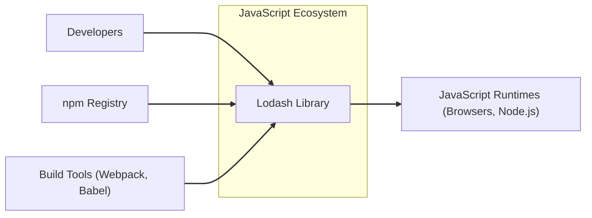
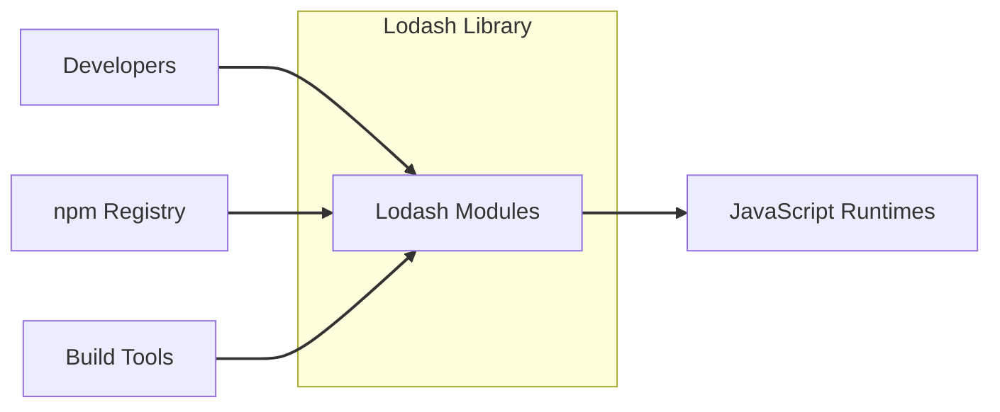
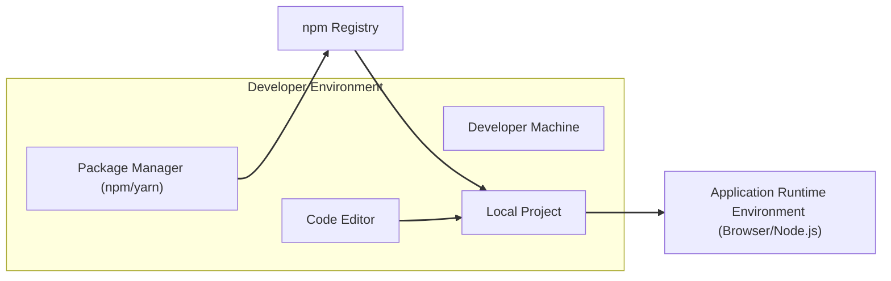
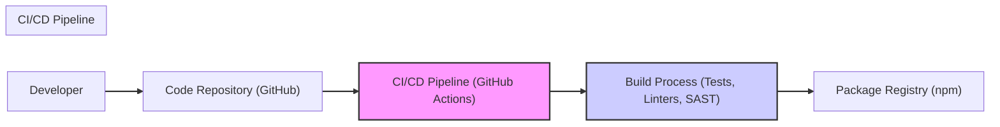

# BUSINESS POSTURE

This project, represented by the lodash GitHub repository, provides a widely used JavaScript utility library.

- Business Priorities:
  - Stability and reliability of utility functions.
  - Performance and efficiency of the library.
  - Broad compatibility across JavaScript environments (browsers, Node.js).
  - Ease of use and developer experience.
  - Community support and active maintenance.
  - Wide adoption and trust within the JavaScript development community.

- Business Goals:
  - To be the leading JavaScript utility library.
  - To simplify JavaScript development by providing robust and performant utility functions.
  - To maintain a high level of quality and reliability.
  - To foster a strong and active community around the library.

- Business Risks:
  - Supply chain attacks compromising the library distribution channels (e.g., npm).
  - Vulnerabilities within the lodash library code leading to security issues in dependent projects.
  - Performance regressions impacting applications using lodash.
  - Breaking changes introduced in new versions causing compatibility issues.
  - Reputational damage due to security incidents or lack of maintenance.
  - Legal liabilities arising from vulnerabilities or licensing issues.

# SECURITY POSTURE

- Existing Security Controls:
  - security control: Code reviews are likely performed by maintainers and contributors as part of the pull request process. (Location: GitHub Pull Request process)
  - security control: Unit and integration tests are implemented to ensure code correctness and prevent regressions. (Location: Test suite within the repository)
  - security control: Static analysis tools and linters are likely used to enforce code quality and identify potential issues. (Location: CI/CD pipeline, developer tooling)
  - security control: Dependency scanning might be used to identify vulnerabilities in dependencies. (Location: CI/CD pipeline, dependency management tools)
  - security control: Public vulnerability reporting process via GitHub issues or security channels. (Location: GitHub repository, project documentation)
  - accepted risk: Reliance on open-source contributions, which may introduce vulnerabilities if not properly vetted.
  - accepted risk: Potential for vulnerabilities to exist in the code due to the complexity of utility functions and wide range of use cases.
  - accepted risk: Security of the npm registry and other distribution channels is partially outside of the project's direct control.

- Recommended Security Controls:
  - security control: Implement automated security scanning (SAST/DAST) in the CI/CD pipeline to proactively identify vulnerabilities.
  - security control: Formalize a security vulnerability disclosure and response process with dedicated security contacts.
  - security control: Conduct regular security audits or penetration testing, especially for critical components.
  - security control: Implement dependency vulnerability scanning and automated updates for dependencies.
  - security control: Enforce branch protection rules and code review requirements for all changes.
  - security control: Secure the build and release pipeline to prevent tampering and ensure integrity of published packages.
  - security control: Consider using code signing for published packages to enhance integrity verification.

- Security Requirements:
  - Authentication: Not directly applicable to a utility library. Lodash itself does not handle authentication. However, applications using lodash will need to implement their own authentication mechanisms.
  - Authorization: Not directly applicable to a utility library. Lodash functions operate based on the input data provided by the calling application. Authorization logic resides in the application using lodash.
  - Input Validation: Lodash functions should handle various input types gracefully and avoid unexpected behavior or vulnerabilities due to invalid input. Input validation is primarily the responsibility of the application using lodash, but lodash should strive for robustness.
  - Cryptography: Lodash does not directly implement cryptographic functions. If cryptographic operations are needed, applications should use dedicated cryptography libraries. Lodash should avoid implementing custom cryptography.

# DESIGN

## C4 CONTEXT

- Context Diagram Elements:
  - - Name: Lodash Library
    - Type: Software System
    - Description: A JavaScript utility library providing functions for common programming tasks.
    - Responsibilities: Provides a comprehensive suite of utility functions for JavaScript developers.
    - Security controls: Input validation within functions to prevent unexpected behavior, security scanning during development.
  - - Name: Developers
    - Type: Person
    - Description: Software developers who use lodash in their projects.
    - Responsibilities: Integrate lodash into their applications, utilize lodash functions to simplify development.
    - Security controls: Secure development practices, input validation in their applications using lodash.
  - - Name: npm Registry
    - Type: Software System
    - Description: Public package registry for Node.js packages, used to distribute lodash.
    - Responsibilities: Hosts and distributes lodash packages, manages package versions and dependencies.
    - Security controls: Package signing, vulnerability scanning of packages, access controls for publishing.
  - - Name: JavaScript Runtimes (Browsers, Node.js)
    - Type: Software System
    - Description: Environments where JavaScript code, including lodash, is executed.
    - Responsibilities: Execute JavaScript code, provide runtime environment for lodash to function.
    - Security controls: Browser security features (CSP, Same-Origin Policy), Node.js security best practices, runtime environment security updates.
  - - Name: Build Tools (Webpack, Babel)
    - Type: Software System
    - Description: Tools used by developers to bundle and transpile JavaScript code, potentially including lodash.
    - Responsibilities: Bundle and optimize JavaScript code for deployment, transpile code for different JavaScript environments.
    - Security controls: Dependency scanning, secure configuration of build tools, input validation during build process.

## C4 CONTAINER

- Container Diagram Elements:
  - - Name: Lodash Modules
    - Type: Library Container
    - Description: Collection of JavaScript modules within the lodash library, each providing specific utility functions (e.g., array, collection, function modules).
    - Responsibilities: Implement individual utility functions, organize functions into logical modules.
    - Security controls: Input validation within each module's functions, unit testing for each module, security scanning of module code.
  - - Name: Developers
    - Type: Person
    - Description: Software developers who import and use specific lodash modules in their projects.
    - Responsibilities: Select and import relevant lodash modules, utilize module functions in their applications.
    - Security controls: Secure coding practices when using lodash modules, input validation in their applications.
  - - Name: npm Registry
    - Type: Software System
    - Description: Package registry distributing lodash modules as a single package or as individual modules.
    - Responsibilities: Distribute lodash modules, manage module versions and dependencies.
    - Security controls: Package signing, vulnerability scanning of packages, access controls for publishing.
  - - Name: JavaScript Runtimes
    - Type: Software System
    - Description: Environments where lodash modules are executed within applications.
    - Responsibilities: Execute JavaScript code including lodash modules, provide runtime environment.
    - Security controls: Runtime environment security features, security updates for runtime environments.
  - - Name: Build Tools
    - Type: Software System
    - Description: Tools used to bundle and process JavaScript code, including lodash modules, for application deployment.
    - Responsibilities: Bundle and optimize application code with lodash modules, transpile code.
    - Security controls: Dependency scanning, secure configuration of build tools, input validation during build process.

## DEPLOYMENT

Lodash is not deployed as a standalone application but is distributed as a library and integrated into other JavaScript projects. The "deployment" context here refers to how lodash is made available to and used by developers and their applications.

Deployment Architecture: Library Distribution and Integration

- Deployment Diagram Elements:
  - - Name: Developer Machine
    - Type: Infrastructure
    - Description: Developer's local computer used for development.
    - Responsibilities: Running code editor, package manager, and local development environment.
    - Security controls: Operating system security, endpoint security software, developer security awareness.
  - - Name: Code Editor
    - Type: Software
    - Description: Integrated Development Environment (IDE) or code editor used by developers.
    - Responsibilities: Code editing, project management, integration with package managers and build tools.
    - Security controls: Code editor security features, plugin security, secure configuration.
  - - Name: Package Manager (npm/yarn)
    - Type: Software
    - Description: Tool used to manage project dependencies, including downloading and installing lodash from npm registry.
    - Responsibilities: Package installation, dependency management, vulnerability scanning of dependencies.
    - Security controls: Package integrity checks, vulnerability scanning, secure configuration of package manager.
  - - Name: Local Project
    - Type: Software
    - Description: Developer's local project directory containing application code and project dependencies, including lodash.
    - Responsibilities: Stores application code, manages project dependencies, integrates lodash library.
    - Security controls: Version control, code reviews, local security practices.
  - - Name: npm Registry
    - Type: Infrastructure
    - Description: Public package registry hosting lodash packages.
    - Responsibilities: Hosting and distributing lodash packages, managing package versions.
    - Security controls: Package signing, vulnerability scanning, access controls, infrastructure security.
  - - Name: Application Runtime Environment (Browser/Node.js)
    - Type: Infrastructure
    - Description: Environment where the application using lodash is executed.
    - Responsibilities: Running application code, executing lodash functions, providing runtime environment.
    - Security controls: Runtime environment security features (browser security, Node.js security), security updates, secure configuration of runtime environment.

## BUILD

- Build Process Elements:
  - - Name: Developer
    - Type: Person
    - Description: Software developer contributing code to the lodash project.
    - Responsibilities: Writing code, submitting pull requests, participating in code reviews.
    - Security controls: Secure coding practices, code review participation, developer training.
  - - Name: Code Repository (GitHub)
    - Type: Software System
    - Description: GitHub repository hosting the lodash source code.
    - Responsibilities: Version control, code storage, pull request management, access control.
    - Security controls: Access controls, branch protection rules, audit logging, vulnerability scanning of repository infrastructure.
  - - Name: CI/CD Pipeline (GitHub Actions)
    - Type: Software System
    - Description: Automated CI/CD pipeline using GitHub Actions for building, testing, and publishing lodash.
    - Responsibilities: Automated build process, running tests, performing static analysis, publishing packages.
    - Security controls: Secure pipeline configuration, access controls for pipeline, secret management, build environment security, vulnerability scanning of pipeline components.
  - - Name: Build Process (Tests, Linters, SAST)
    - Type: Process
    - Description: Steps within the CI/CD pipeline including running unit tests, code linters, and static application security testing (SAST).
    - Responsibilities: Ensuring code quality, identifying potential bugs and vulnerabilities, enforcing coding standards.
    - Security controls: Comprehensive test suite, strict linting rules, SAST tools integration, vulnerability reporting.
  - - Name: Package Registry (npm)
    - Type: Software System
    - Description: npm registry where lodash packages are published.
    - Responsibilities: Hosting and distributing lodash packages, making packages available for download.
    - Security controls: Package signing, vulnerability scanning, access controls for publishing, infrastructure security.

# RISK ASSESSMENT

- Critical Business Processes:
  - Providing reliable and performant JavaScript utility functions to the developer community.
  - Maintaining the integrity and availability of the lodash library on package registries.
  - Ensuring the security and stability of applications that depend on lodash.

- Data to Protect:
  - Integrity of the lodash library code: Ensuring that the code is not tampered with and remains trustworthy. Sensitivity: High, as compromised code can affect millions of projects.
  - Availability of the lodash library: Ensuring that the library is accessible on package registries for developers to download and use. Sensitivity: Medium, as unavailability can disrupt development workflows.
  - Confidentiality of vulnerability information: Handling vulnerability reports responsibly and disclosing them in a coordinated manner. Sensitivity: Medium, as premature disclosure can be exploited.

# QUESTIONS & ASSUMPTIONS

- Questions:
  - What specific SAST/DAST tools are currently used in the CI/CD pipeline?
  - Is there a formal security vulnerability disclosure and response process documented?
  - Are regular security audits or penetration testing conducted for the lodash project?
  - Are dependencies scanned for vulnerabilities and automatically updated?
  - Is code signing used for published npm packages?
  - What branch protection rules are in place for the main branches of the repository?
  - How are secrets managed within the CI/CD pipeline?

- Assumptions:
  - The lodash project values code quality and security.
  - Code reviews are a standard practice for all code changes.
  - Unit and integration tests are comprehensive and regularly executed.
  - The project relies on GitHub and npm for its infrastructure and distribution.
  - The target audience for lodash is primarily JavaScript developers across various environments.
  - The project aims for wide adoption and strives to maintain a high level of trust within the JavaScript community.