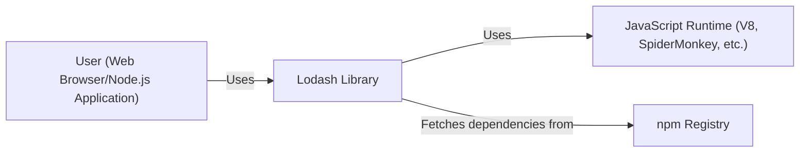
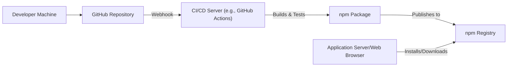
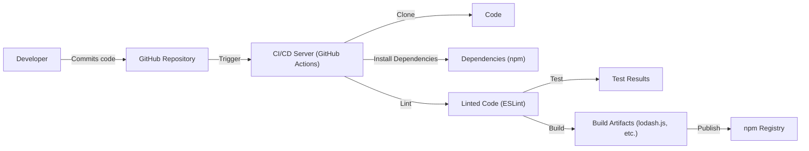

# BUSINESS POSTURE

Lodash is a widely-used JavaScript utility library. It's a foundational component for many web applications, both on the client-side (browsers) and server-side (Node.js).

Priorities and Goals:

*   Provide a comprehensive suite of utility functions for common programming tasks, enhancing developer productivity.
*   Ensure high performance and efficiency of the utility functions.
*   Maintain broad compatibility across different JavaScript environments and versions.
*   Offer a consistent and well-documented API.
*   Minimize the library's footprint to reduce impact on application load times.

Business Risks:

*   Vulnerabilities in Lodash could be exploited in a large number of applications, leading to widespread security issues. Supply chain attacks are a significant concern.
*   Performance regressions in Lodash could negatively impact the performance of applications that depend on it.
*   Compatibility issues with new JavaScript versions or environments could break existing applications.
*   Lack of maintenance or updates could lead to security vulnerabilities and compatibility problems over time.
*   Bugs in widely used utility functions could introduce subtle but critical errors in applications.

# SECURITY POSTURE

Existing Security Controls:

*   security control: Code Reviews: The GitHub repository shows evidence of code reviews, although the specific process and rigor are not fully detailed in the repository itself. Pull requests are used, suggesting a review process.
*   security control: Testing: Lodash has an extensive test suite, which helps to ensure the correctness and reliability of the code. This is visible in the `test/` directory.
*   security control: Static Analysis: There's some evidence of linting (using ESLint, as indicated by `.eslintrc.js`), which can help identify potential code quality and security issues.
*   security control: Dependency Management: Dependencies are managed via npm, and the `package.json` file lists these dependencies. However, the security practices around dependency updates and vulnerability scanning are not explicitly documented in the repository.
*   security control: Issue Tracking: Security vulnerabilities can be reported and tracked via GitHub Issues.

Accepted Risks:

*   accepted risk: Prototype Pollution: Lodash has had historical vulnerabilities related to prototype pollution. While efforts have been made to mitigate these, the nature of JavaScript and the library's functionality means this risk may not be entirely eliminated.
*   accepted risk: Regular Expression Denial of Service (ReDoS): Some utility functions might be vulnerable to ReDoS attacks if used with untrusted regular expressions. This is a common risk with libraries that handle regular expressions.
*   accepted risk: Dependency Vulnerabilities: While dependencies are managed, there's an inherent risk of vulnerabilities in those dependencies. The project relies on the security practices of its upstream dependencies.

Recommended Security Controls:

*   security control: Security Policy: Implement and publish a clear security policy (`SECURITY.md`) outlining vulnerability reporting procedures, support timelines, and security considerations for contributors.
*   security control: Software Composition Analysis (SCA): Integrate SCA tooling (e.g., Snyk, Dependabot, npm audit) into the build process to automatically scan for known vulnerabilities in dependencies.
*   security control: Fuzzing: Introduce fuzz testing to identify unexpected behavior and potential vulnerabilities by providing random or invalid inputs to the utility functions.
*   security control: Content Security Policy (CSP) Guidance: Provide guidance to users on how to configure CSP headers in their applications to mitigate the impact of potential XSS vulnerabilities if Lodash were to be compromised.
*   security control: Subresource Integrity (SRI) Hashes: Publish SRI hashes for the distributed files (e.g., on CDNs) so that users can verify the integrity of the library when loaded from external sources.
*   security control: Signed Commits: Enforce commit signing to ensure the integrity and authenticity of the codebase.
*   security control: Regular Security Audits: Conduct regular, independent security audits of the codebase.

Security Requirements:

*   Authentication: Not directly applicable to Lodash, as it's a utility library, not an application with user authentication.
*   Authorization: Not directly applicable, as Lodash doesn't manage access control.
*   Input Validation:
    *   Lodash functions should handle various input types gracefully, including unexpected or malicious inputs.
    *   Functions that accept regular expressions should be carefully reviewed for ReDoS vulnerabilities.
    *   Functions that manipulate objects should be resistant to prototype pollution attacks.
*   Cryptography:
    *   If Lodash were to include cryptographic functions (it currently does not), they should use well-vetted, industry-standard algorithms and libraries.
    *   Cryptographic key management is not applicable in the current context of Lodash.

# DESIGN

## C4 CONTEXT

Element Descriptions:

*   Element:
    *   Name: User
    *   Type: User/System
    *   Description: A web browser or a Node.js application that utilizes the Lodash library.
    *   Responsibilities: Executes JavaScript code that includes calls to Lodash functions.
    *   Security controls: Implements application-level security controls (e.g., input validation, output encoding, CSP).

*   Element:
    *   Name: Lodash
    *   Type: Library
    *   Description: The Lodash utility library.
    *   Responsibilities: Provides utility functions for common JavaScript programming tasks.
    *   Security controls: Internal input validation, code reviews, testing, static analysis.

*   Element:
    *   Name: JS
    *   Type: Runtime Environment
    *   Description: The JavaScript runtime environment (e.g., V8 in Chrome and Node.js, SpiderMonkey in Firefox).
    *   Responsibilities: Executes JavaScript code, including Lodash functions.
    *   Security controls: Built-in security features of the JavaScript engine (e.g., sandboxing, memory management).

*   Element:
    *   Name: NPM
    *   Type: External System
    *   Description: The npm package registry.
    *   Responsibilities: Provides a repository for JavaScript packages, including Lodash and its dependencies.
    *   Security controls: npm's security features (e.g., two-factor authentication, package signing – although not directly controlled by the Lodash project).

## C4 CONTAINER

Since Lodash is a library, the container diagram is essentially the same as the context diagram. It doesn't have separate deployable units in the traditional sense.

Element Descriptions:

*   Element:
    *   Name: User
    *   Type: User/System
    *   Description: A web browser or a Node.js application that utilizes the Lodash library.
    *   Responsibilities: Executes JavaScript code that includes calls to Lodash functions.
    *   Security controls: Implements application-level security controls (e.g., input validation, output encoding, CSP).

*   Element:
    *   Name: Lodash
    *   Type: Library
    *   Description: The Lodash utility library.
    *   Responsibilities: Provides utility functions for common JavaScript programming tasks.
    *   Security controls: Internal input validation, code reviews, testing, static analysis.

*   Element:
    *   Name: JS
    *   Type: Runtime Environment
    *   Description: The JavaScript runtime environment (e.g., V8 in Chrome and Node.js, SpiderMonkey in Firefox).
    *   Responsibilities: Executes JavaScript code, including Lodash functions.
    *   Security controls: Built-in security features of the JavaScript engine (e.g., sandboxing, memory management).

*   Element:
    *   Name: NPM
    *   Type: External System
    *   Description: The npm package registry.
    *   Responsibilities: Provides a repository for JavaScript packages, including Lodash and its dependencies.
    *   Security controls: npm's security features (e.g., two-factor authentication, package signing – although not directly controlled by the Lodash project).

## DEPLOYMENT

Lodash is typically deployed in one of two ways:

1.  **npm Package:** For Node.js applications and web applications using bundlers (e.g., Webpack, Browserify), Lodash is installed as an npm package.
2.  **CDN:** For direct inclusion in web pages, Lodash can be loaded from a Content Delivery Network (CDN) like jsDelivr or cdnjs.

We'll describe the npm package deployment, as it's the more common and manageable approach.

Element Descriptions:

*   Element:
    *   Name: DevMachine
    *   Type: Developer Workstation
    *   Description: The developer's local machine where code is written and committed.
    *   Responsibilities: Code development, local testing.
    *   Security controls: Local security measures (e.g., antivirus, firewall).

*   Element:
    *   Name: GitHub
    *   Type: Source Code Repository
    *   Description: The GitHub repository hosting the Lodash source code.
    *   Responsibilities: Version control, code review, issue tracking.
    *   Security controls: Access controls, branch protection rules, code review requirements.

*   Element:
    *   Name: CI
    *   Type: Continuous Integration Server
    *   Description: A CI/CD server (e.g., GitHub Actions, Travis CI, Jenkins) that automates the build and testing process.
    *   Responsibilities: Running tests, building the package, potentially publishing to npm.
    *   Security controls: Secure configuration of the CI/CD environment, secrets management.

*   Element:
    *   Name: Artifact
    *   Type: Build Artifact
    *   Description: The built npm package.
    *   Responsibilities: Contains the compiled and minified Lodash code.
    *   Security controls: None directly, but the build process should ensure integrity.

*   Element:
    *   Name: NPM
    *   Type: Package Registry
    *   Description: The npm package registry.
    *   Responsibilities: Hosting the Lodash package and its dependencies.
    *   Security controls: npm's security features.

*   Element:
    *   Name: AppServer
    *   Type: Application Server/Web Browser
    *   Description: The server or browser where the application using Lodash is running.
    *   Responsibilities: Installing or downloading Lodash from npm.
    *   Security controls: Application-level security controls.

## BUILD

The Lodash build process, as seen in the repository, involves several steps, primarily orchestrated through npm scripts and tools like Babel and ESLint.

Element Descriptions and Security Controls:

1.  **Developer**: Writes code and commits to the GitHub repository.
    *   security control: Use of secure coding practices (though not explicitly enforced).
2.  **GitHub**: Triggers the CI/CD pipeline (GitHub Actions) on code commits or pull requests.
    *   security control: Branch protection rules can enforce code reviews and status checks before merging.
3.  **CI/CD Server (GitHub Actions)**: Executes the build and test steps.
    *   security control: Secure environment for running build scripts.
4.  **Clone Code**: The CI server clones the repository.
5.  **Install Dependencies**: npm installs project dependencies.
    *   security control: `npm ci` should be used for reproducible builds and to prevent unexpected dependency updates.
    *   security control: SCA tooling should be integrated here to scan for vulnerabilities in dependencies.
6.  **Lint (ESLint)**: The code is linted using ESLint to enforce code style and identify potential issues.
    *   security control: Static analysis helps catch potential errors and security vulnerabilities.
7.  **Test**: The test suite is executed.
    *   security control: Extensive testing helps ensure code correctness and prevent regressions.
8.  **Build**: Babel transpiles the code for compatibility with different environments, and the final `lodash.js` files are generated.
9.  **Publish**: The built artifacts are published to the npm registry.
    *   security control: Publishing should require authentication and potentially two-factor authentication.

# RISK ASSESSMENT

Critical Business Processes:

*   **Software Development:** Lodash is a critical component in the software development lifecycle of many applications. Its reliability and security directly impact the development process.
*   **Application Runtime:** Lodash is often executed as part of the application runtime. Vulnerabilities or performance issues in Lodash can directly affect the running applications.

Data Sensitivity:

*   Lodash itself does not handle sensitive data directly. It's a utility library that operates on data provided to it by the applications that use it.
*   The primary risk is that vulnerabilities in Lodash could be exploited to *access* or *manipulate* sensitive data handled by the *application* using Lodash. For example, a prototype pollution vulnerability could potentially be used to modify application behavior and exfiltrate data.
*   Therefore, while Lodash doesn't handle sensitive data *itself*, its security is critical because it operates within the context of applications that *do* handle sensitive data. The sensitivity of the data at risk is determined by the applications using Lodash, not by Lodash itself.

# QUESTIONS & ASSUMPTIONS

Questions:

*   What is the specific process for handling security vulnerability reports? Is there a dedicated security contact or email address?
*   What are the criteria for accepting or rejecting contributions to the codebase? Are there specific coding guidelines or security requirements?
*   What is the long-term support plan for different versions of Lodash?
*   Are there any plans to integrate more advanced security testing techniques, such as fuzzing or static application security testing (SAST)?
*   How frequently are dependencies reviewed and updated? Is there a specific policy for addressing vulnerabilities in dependencies?
*   Is there a documented incident response plan in case of a major security vulnerability?

Assumptions:

*   BUSINESS POSTURE: The Lodash project prioritizes maintaining backward compatibility and stability, even if it means slower adoption of new security features.
*   SECURITY POSTURE: The project relies heavily on community contributions and open-source development practices for security.
*   DESIGN: The current design of Lodash, with its focus on utility functions, is unlikely to change significantly. Any major architectural changes would likely be introduced in a new major version.
*   The primary users of Lodash are developers building web applications or Node.js applications.
*   The Lodash project has limited resources for dedicated security personnel.
*   The project follows semantic versioning, and breaking changes are only introduced in major version updates.